> 

> 转载自 [https://juejin.cn/post/7146133960865611806](https://juejin.cn/post/7146133960865611806#heading-8)

摘要：本文主要介绍了 Kafka 的一些基本知识，包含 Topic、Partition、消费者、生产者、副本等基本概念，同时也介绍了 Kafka 的版本变迁以及应用实战所必备的知识点，最后以“消息可靠性分析”这个主体结尾，加深对 Kafka 的理解。

> Franz Kafka，他是奥匈帝国作家，代表作《审判》、《城堡》、《变形记》。Apache Kafka 取名的来源也正是来源于这位作家的名字。Kafka 的作者之一 Jay Kreps 在大学期间很喜欢这位作家，而 Kafka 的写性能很强，找个作家的名字来命名正好“对应”。
>
> Kafka 最初是由 LinkedIn 公司开发的，后来三位原作者 Jun Rao、Jay Kreps、Neha Narkhede 出走成立了 Confluent。Neha Narkhede 是 Confluent CTO，也是《Kafka 权威指南》的作者之一。在大数据领域，Jay Kreps 针对 Lambda 架构的缺点提出了 Kappa 架构。
>
> 如无特殊说明，本文中以 Kafka 2.0 版本为基准。

## 一、什么是Kafka?

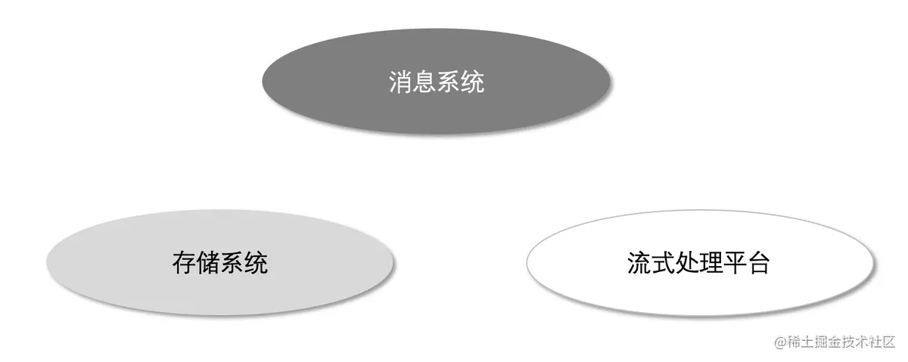

**消息系统**

Kafka 和传统的消息系统(也称作消息中间件)都具备系统解耦、冗余存储、流量削峰、缓冲、异步通信、扩展性、可恢复性等功能。与此同时，Kafka 还提供了大多数消息系统难以实现的消息顺序性保障及回溯消费的功能。

**存储系统**

Kafka 把消息持久化到磁盘，相比于其他基于内存存储的系统而言，有效地降低了数据丢失的风险。也正是得益于 Kafka 的消息持久化功能和多副本机制，我们可以把 Kafka 作为长期的数据存储系统来使用，只需要把对应的数据保留策略设置 为“永久”或启用主题的日志压缩功能即可。参考：可行性分析：[www.confluent.io/blog/okay-s…](http://www.confluent.io/blog/okay-s…) 和案例：[www.confluent.io/blog/publis…](http://www.confluent.io/blog/publis…)

**流式处理平台**

Kafka 不仅为每个流行的流式处理框架提供了可靠的数据来源，还提供了一个完整的流式处理类库，比如窗口、连接、变换和聚合等各类操作。

## 二、Kafka基础概念

### 1.Kafka整体架构

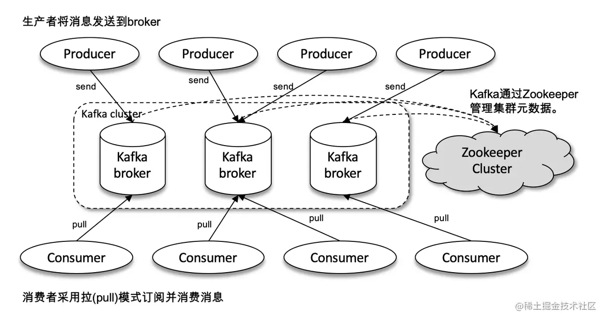

一个典型的 Kafka 体系架构包括若干 Producer、若干 Broker、若干 Consumer，以及一个 ZooKeeper 集群，如图所示。其中 ZooKeeper 是 Kafka 用来负责集群元数据的管理、控制器 的选举等操作的。Producer 将消息发送到 Broker，Broker 负责将收到的消息存储到磁盘中，而 Consumer 负责从 Broker 订阅并消费消息。

整个 Kafka 体系结构中引入了以下 3 个术语。

- Producer：生产者，也就是发送消息的一方。生产者负责创建消息，然后将其投递到 Kafka 中。

- Consumer：消费者，也就是接收消息的一方。消费者连接到 Kafka 上并接收消息，进 而进行相应的业务逻辑处理。

- Broker：服务代理节点。对于 Kafka 而言，Broker 可以简单地看作一个独立的 Kafka 服务节点或 Kafka 服务实例。大多数情况下也可以将 Broker 看作一台 Kafka 服务器，前提是这台服务器上只部署了一个 Kafka 实例。一个或多个 Broker 组成了一个 Kafka 集群。一般而言， 我们更习惯使用首字母小写的 broker 来表示服务代理节点。

### 2.Kafka基础概念

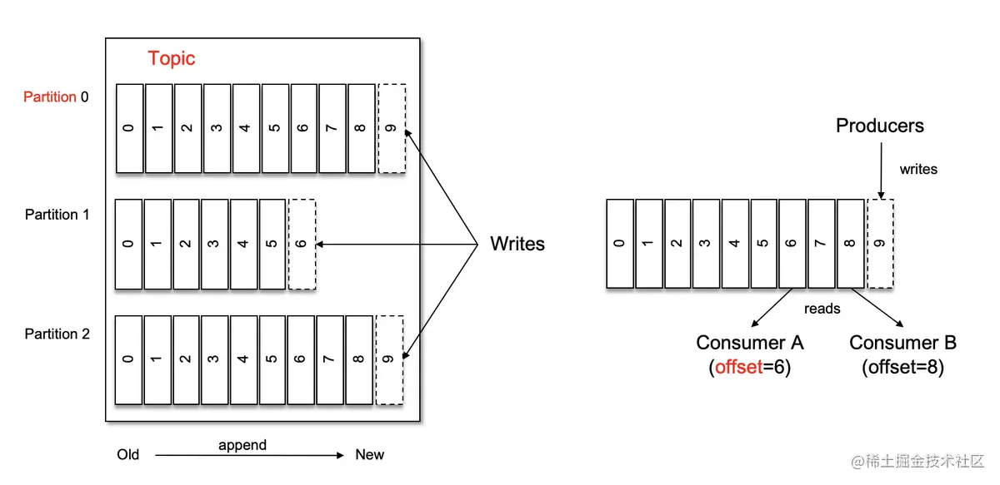

在 Kafka 中还有两个特别重要的概念——主题（Topic）与分区（Partition）。Kafka 中的消息以 topic 题为单位进行归类，生产者负责将消息发送到特定的 topic (发送到 Kafka 集群中的每一条消息都要指定一个主题)，而消费者负责订阅主题并进行消费。

主题是一个逻辑上的概念，它还可以细分为多个分区，一个分区只属于单个主题，很多时候也会把分区称为主题分区（Topic-Partition）。同一主题下的不同分区包含的消息是不同的，分区在存储层面可以看作一个可追加的日志（Log）文件，消息在被追加到分区日志文件的时候都会分配一个特定的偏移量（offset）。offset 是消息在分区中的唯一标识，Kafka 通过它来保证消息在分区内的顺序性，不过 offset 并不跨越分区，也就是说，Kafka 保证的是分区有序而不是主题有序。

如上图（左）所示，主题中有 3 个分区，消息被顺序追加到每个分区日志文件的尾部。Kafka 中的分区可以分布在不同的服务器（broker）上，也就是说，一个主题可以横跨多个 broker，以此来提供比单个 broker 更强大的性能。

每一条消息被发送到 broker 之前，会根据分区规则选择被存储到哪个具体的分区。如果分区规则设定得合理，所有的消息都可以均匀地分配在不同的分区中。如果一个主题只对应一个文件，那么这个文件所在的机器 I/O 将会成为这个主题的性能瓶颈，而分区解决了这个问题。 在创建主题的时候可以通过指定的参数来设置分区的个数，当然也可以在主题创建完成之后去修改分区的数量，通过增加分区的数量可以实现水平扩展。

### 3.消费者与消费组

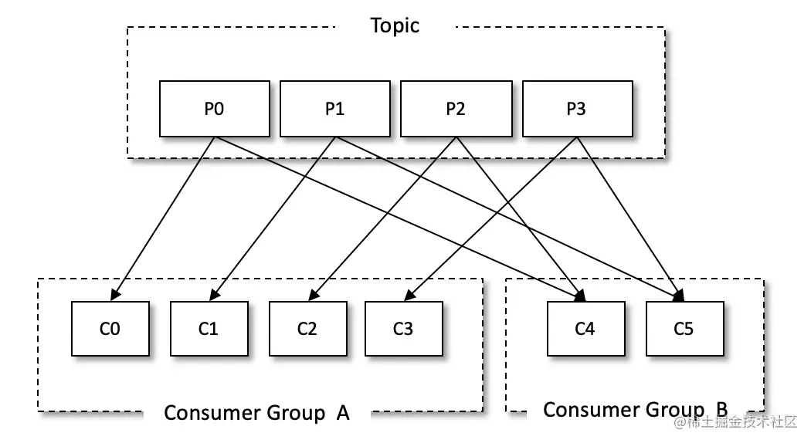

在 Kafka 的消费理念中还有一层消费组（Consumer Group)）的概念，每个消费者都有一个对应的消费组。当消息发布到主题后，只会被投递给订阅它的每个消费组中的一个消费者。

如上图所示，某个主题中共有 4 个分区（Partition）: P0、P1、P2、P3。有两个消费组 A 和 B 都订阅了这个主题，消费组 A 中有 4 个消费者（C0、C1、C2 和 C3），消费组 B 中有 2 个消费者（C4 和 C5）。按照 Kafka 默认的规则，最后的分配结果是消费组 A 中的每一个消费者分配到 1 个分区，消费组 B 中的每一个消费者分配到 2 个分区，两个消费组之间互不影响。 每个消费者只能消费所分配到的分区中的消息。换言之，每一个分区只能被一个消费组中的一 个消费者所消费。

我们再来看一下消费组内的消费者个数变化时所对应的分区分配的演变。假设目前某消费组内只有一个消费者 C0，订阅了一个主题，这个主题包含 7 个分区：P0、P1、P2、P3、P4、 P5、P6。也就是说，这个消费者 C0 订阅了 7 个分区，具体分配情形参考下图（左上）。

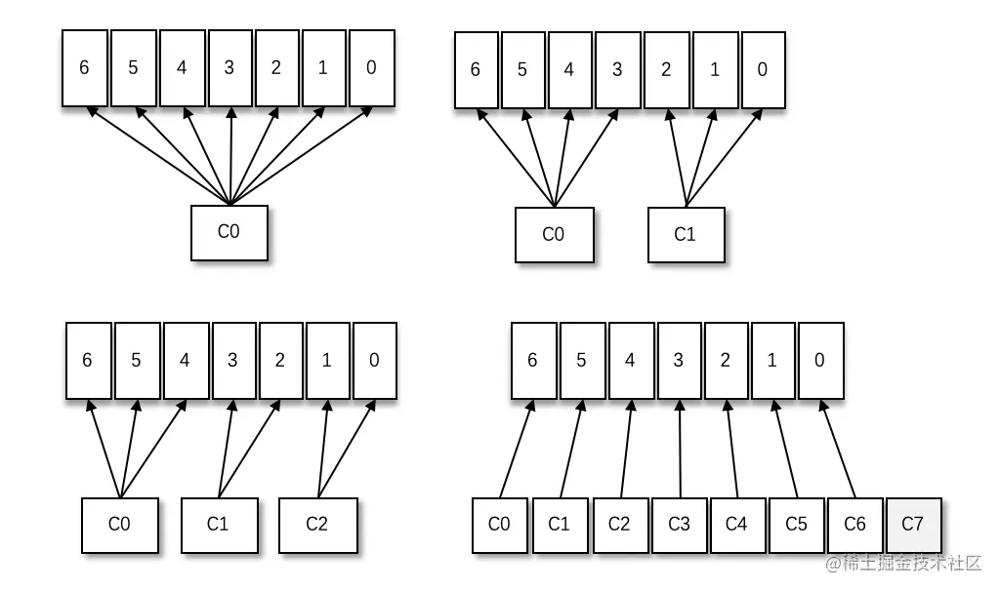

此时消费组内又加入了一个新的消费者 C1，按照既定的逻辑，需要将原来消费者 C0 的部 分分区分配给消费者 C1 消费，如上图（右上） 所示。消费者 C0 和 C1 各自负责消费所分配到的分区， 彼此之间并无逻辑上的干扰。

紧接着消费组内又加入了一个新的消费者 C2，消费者 C0、C1 和 C2 按照上图（左下）中的方式 各自负责消费所分配到的分区。

消费者与消费组这种模型可以让整体的消费能力具备横向伸缩性，我们可以增加(或减少) 消费者的个数来提高(或降低)整体的消费能力。对于分区数固定的情况，一味地增加消费者 并不会让消费能力一直得到提升，如果消费者过多，出现了消费者的个数大于分区个数的情况， 就会有消费者分配不到任何分区。参考上图（右下），一共有 8 个消费者，7 个分区，那么最后的消费 者 C7 由于分配不到任何分区而无法消费任何消息。

> 消费者分区分配策略：RangeAssignor、RoundRobinAssignor、StickyAssignor（0.11）。

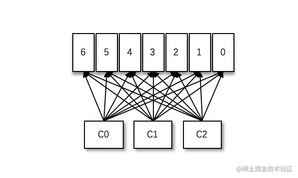

消费者分区分配策略可以自定义实现，比如自定义实现上图的“组内广播”。

### 4.存储视图

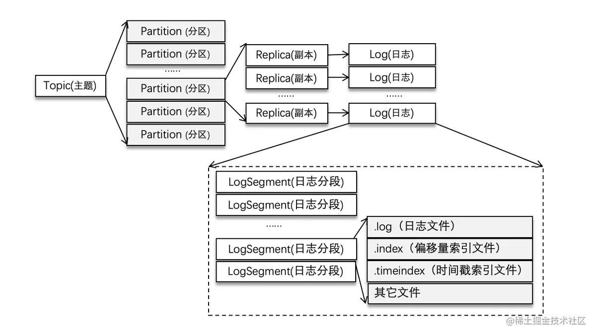

主题和分区都是提供给上层用户的抽象，而在副本层面或更加确切地说是 Log 层面才有实际物理上的存在。同一个分区中的多个副本必须分布在不同的 broker 中，这样才能提供有效的数据冗余。

为了防止 Log 过大， Kafka 又引入了日志分段（LogSegment）的概念，将 Log 切分为多个 LogSegment，相当于一个巨型文件被平均分配为多个相对较小的文件，这样也便于消息的维护和清理。事实上，Log 和 LogSegment 也不是纯粹物理意义上的概念，Log 在物理上只以文件夹的形式存储，而每个 LogSegment 对应于磁盘上的一个日志文件和两个索引文件，以及可能的其他文件(比如以 “.txnindex”为后缀的事务索引文件) 。

举例，查看主题“topic-log”（副本数为 1，分区数为 4）:

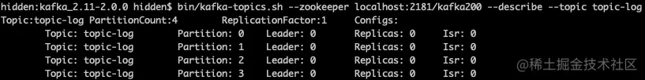

分区数为 4 的 topic-log 在 Kafka 存储目录中对应了 4 个文件夹：topic-log-1、topic-log-2、topic-log-3、topic-log-4。这些文件夹的命名形式为 -，对应了某个分区在当前 broker 的一个副本所对应的 Log 文件夹。

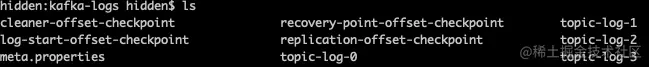

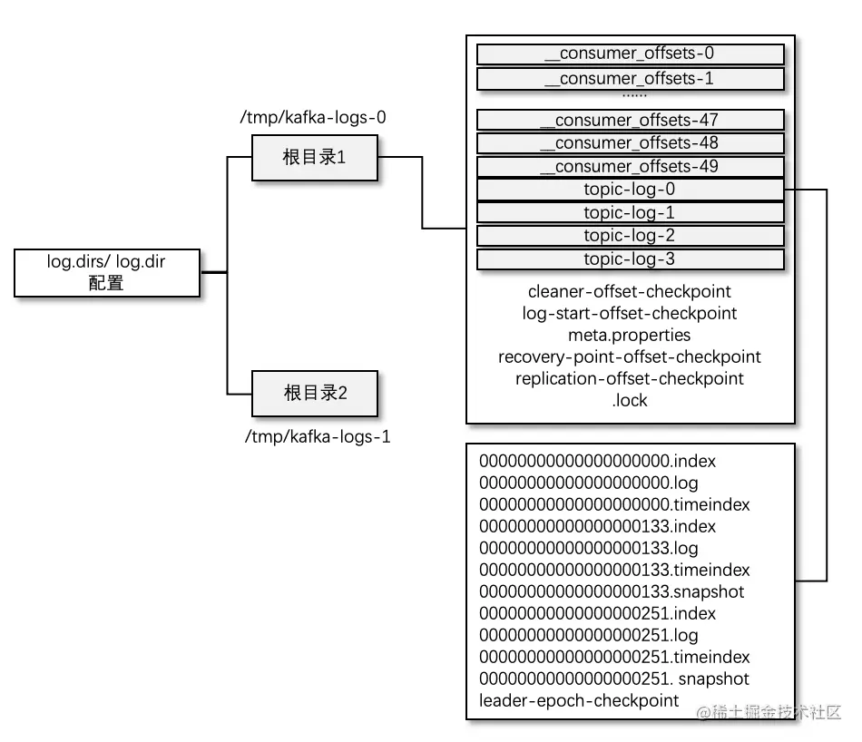

向 Log 中追加消息时是顺序写入的，只有最后一个 LogSegment （activeSegment）才能执行写入操作，在此 之前所有的 LogSegment 都不能写入数据。

为了便于消息的检索，每个 LogSegment 中的日志文件（以“.log”为文件后缀）都有对应的两个索引文件：偏移量索引文件（以“.index”为文件后缀）和时间戳索引文件（以“.timeindex” 为文件后缀）。每个 LogSegment 都有一个基准偏移量 baseOffset，用来表示当前 LogSegment 中第一条消息的 offset。偏移量是一个 64 位的长整型数，日志文件和两个索引文件都是根据基 准偏移量（baseOffset）命名的，名称固定为 20 位数字，没有达到的位数则用 0 填充。比如第一个 LogSegment 的基准偏移量为 0，对应的日志文件为 00000000000000000000.log。

> 注意每个 LogSegment 中不只包含“.log”“.index”“.timeindex”这 3 种文件，还可能包 含“.deleted”、“.cleaned”、“.swap”等临时文件，以及可能的“.snapshot”、“.txnindex”、 “leader-epoch-checkpoint”等文件。从更加宏观的视角上看，Kafka 中的文件不只上面提及的这些文件，比如还有一些检查点文件。

### 5.多副本

Kafka 为分区引入了多副本（Replica）机制，通过增加副本数量可以提升容灾能力。同一分区的不同副本中保存的是相同的消息（在同一时刻，副本之间并非完全一样），副本之间是一主多从的关系，其中 leader 副本负责处理读写请求，follower 副本只负责与 leader 副本的消息同步。副本处于不同的 broker 中，当 leader 副本出现故障时，从 follower 副本中重新选举新的 leader 副本对外提供服务。Kafka 通过多副本机制实现了故障的自动转移，当 Kafka 集群中某个 broker 失效时仍然能保证服务可用。

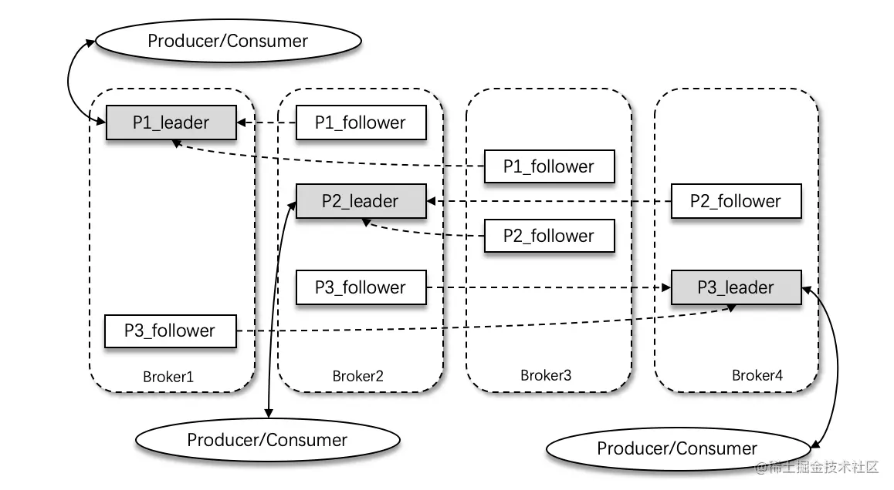

如上图所示，Kafka 集群中有 4 个 broker，某个主题中有 3 个分区，且副本因子（即副本个数）也为 3，如此每个分区便有 1 个 leader 副本和 2 个 follower 副本。生产者和消费者只与 leader 副本进行交互，而 follower 副本只负责消息的同步，很多时候 follower 副本中的消息相对 leader 副本而言会有一定的滞后。

分区中的所有副本统称为 **AR** **(Assigned Replicas)** 。所有与 leader 副本保持一定程度同步的副本(包括 leader 副本在内)组成 **ISR (In-Sync Replicas)** ，ISR 集合是 AR 集合中的一个子 集。消息会先发送到 leader 副本，然后 follower 副本才能从 leader 副本中拉取消息进行同步， 同步期间内 follower 副本相对于 leader 副本而言会有一定程度的滞后。

前面所说的“一定程度的同步”是指可忍受的滞后范围，这个范围可以通过参数进行配置。与 leader 副本同步滞后过多的副本(不包括 leader 副本)组成 **OSR (Out-of-Sync Replicas)** ，由此可见，**AR** **=ISR+OSR**。 在正常情况下，所有的 follower 副本都应该与 leader 副本保持一定程度的同步，即 AR=ISR， OSR 集合为空。

leader 副本负责维护和跟踪 ISR 集合中所有 follower 副本的滞后状态，当 follower 副本落后太多或失效时，leader 副本会把它从 ISR 集合中剔除。如果 OSR 集合中有 follower 副本“追上” 了 leader 副本，那么 leader 副本会把它从 OSR 集合转移至 ISR 集合。默认情况下，当 leader 副 本发生故障时，只有在 ISR 集合中的副本才有资格被选举为新的 leader，而在 OSR 集合中的副 本则没有任何机会(不过这个原则也可以通过修改相应的参数配置来改变)。

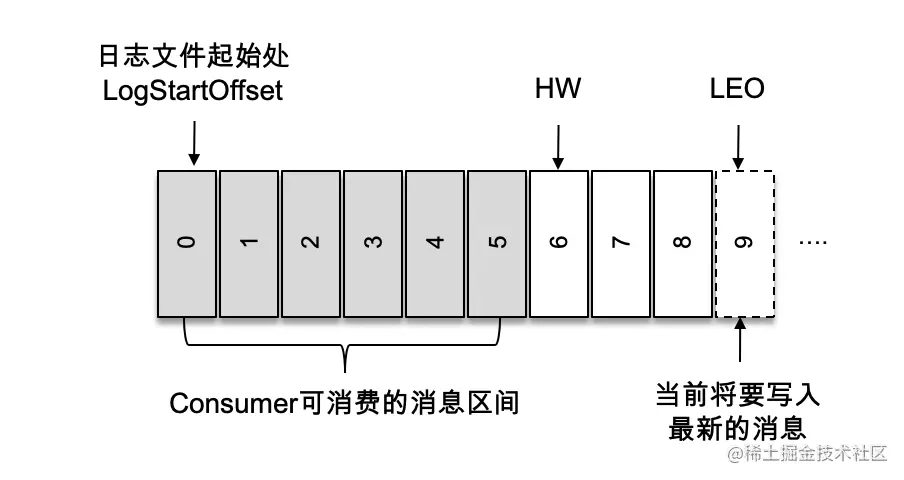

ISR 与 HW 和 LEO 也有紧密的关系。HW 是 High Watermark 的缩写，俗称高水位，它标识 了一个特定的消息偏移量(offset)，消费者只能拉取到这个 offset 之前的消息。

如上图所示，它代表一个日志文件，这个日志文件中有 9 条消息，第一条消息的offset

（LogStartOffset）为 0，最后一条消息的 offset 为 8，offset 为 9 的消息用虚线框表示，代表下一条待写入的消息。日志文件的 HW 为 6，表示消费者只能拉取到 offset 在 0 至 5 之间的消息， 而 offset 为 6 的消息对消费者而言是不可见的。

LEO 是 Log End Offset 的缩写，它标识当前日志文件中下一条待写入消息的 offset，上图中 offset 为 9 的位置即为当前日志文件的 LEO，LEO 的大小相当于当前日志分区中最后一条消息的 offset 值加 1。分区 ISR 集合中的每个副本都会维护自身的 LEO，而 ISR 集合中最小的 LEO 即为分区的 HW，对消费者而言只能消费 HW 之前的消息。

> 注意要点:很多资料中会将上图中的 offset 为 5 的位置看作 HW，而把 offset 为 8 的位置 看作 LEO，这显然是不对的。


为了更好的理解ISR、HW、LEO，下面通过一个简单的示例来进行相关的说明。如上图（左上）所示，假设某个分区的 ISR 集合中有 3 个副本，即一个 leader 副本和 2 个 follower 副本，此时分区的 LEO 和 HW 都为 3。

消息 3 和消息 4 从生产者发出之后 会被先存入 leader 副本，如上图（右上）所示。 在消息写入 leader 副本之后，follower 副本会发送拉取请求来拉取消息 3 和消息 4 以进行消息同步。

在同步过程中，不同的 follower 副本的同步效率也不尽相同。如上图（左下） 所示，在某一时刻 follower1 完全跟上了 leader 副本而 follower2 只同步了消息 3，如此 leader 副本的 LEO 为 5， follower1 的 LEO 为 5，follower2 的 LEO 为 4，那么当前分区的 HW 取最小值 4，此时消费者可 以消费到 offset 为 0 至 3 之间的消息。

写入消息如上图（右下）所示，所有的副本都成功写入了消息 3 和消息 4，整个分区的 HW 和 LEO 都变为 5，因此消费者可以消费到 offset 为 4 的消息了。

由此可见，Kafka 的复制机制既不是完全的同步复制，也不是单纯的异步复制。事实上， 同步复制要求所有能工作的 follower 副本都复制完，这条消息才会被确认为已成功提交，这种 复制方式极大地影响了性能。而在异步复制方式下，follower 副本异步地从 leader 副本中复制数据，数据只要被 leader 副本写入就被认为已经成功提交。在这种情况下，如果 follower 副本都 还没有复制完而落后于 leader 副本，突然 leader 副本宕机，则会造成数据丢失。Kafka 使用的这 种 ISR 的方式则有效地权衡了数据可靠性和性能之间的关系。

## 三、Kafka版本及日志变迁

从 0.7 版本开始，Kafka 目前总共经历了如下一些版本，目前最新的版本是 3.2。

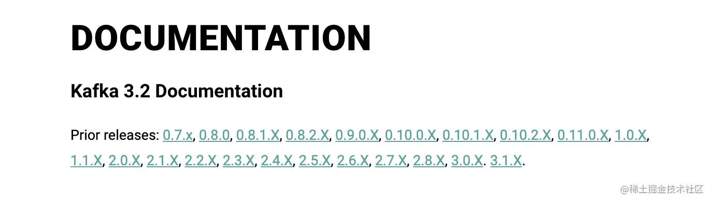

0.8 版本开始，Kafka 正式引入了多副本机制。里程碑：分布式消息中间件。

0.9 增加了基础的安全认证和权限功能。

0.10 版本引入了 Kafka Streams 。里程碑：分布式流式处理。

0.11 版本引入了幂等和事务。对 Kafka 的底层日志格式做了重构，并一直延用至今。

对一个成熟的消息中间件而言，消息格式（或者称为“日志格式”）不仅关系功能维度 的扩展，还牵涉性能维度的优化。随着 Kafka 的迅猛发展，其消息格式也在不断升级改进， 从 0.8.x 版本（0.7 也有一个专用的数据格式，不过这个不需要了解）开始到现在，Kafka 的消息格式也经历了 3 个版本: v0 版本、v1 版本和 v2 版本。

### 1.v0

下面先来看一下 v0 版本的消息格式，在 Kafka 0.10.0.0 版本之前都采用这个格式，对应于下图中左边的RECORD 部分。

大多数人会把下图左边的整体（即包括 offset 和 message size 字段）都看作消息，因为每个 RECORD (v0 和 v1 版)必定对应一个 offset 和 message size。每条消息都有一个 offset 用来标志它在分区中的偏移量，这个 offset 是逻辑值，而非实际物理偏移值，message size 表示消息的大 小，这两者在一起被称为日志头部（LOG_OVERHEAD），固定为 12B。

与消息对应的还有消息集的概念，消息集中包含一条或多 条消息，消息集不仅是存储于磁盘及在网络上传输（Produce & Fetch）的基本形式，而且是 Kafka 中压缩的基本单元，详细结构参考图中的右边部分。

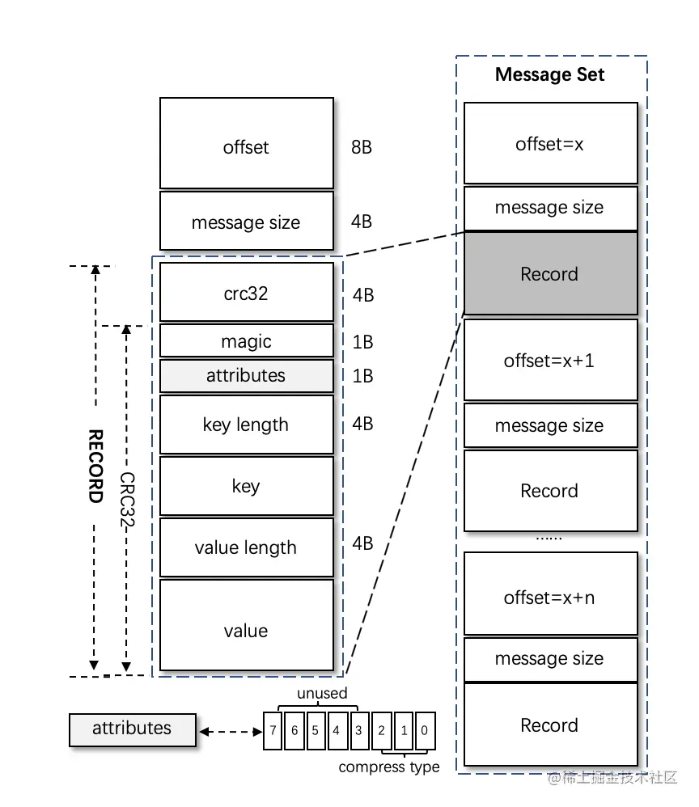

下面具体陈述一下消息格式中的各个字段，从 crc32 开始算起，各个字段的解释如下。

- crc32(4B)：crc32 校验值。校验范围为 magic 至 value 之间。
- magic(1B)：消息格式版本号，此版本的 magic 值为 0。
- attributes(1B)：消息的属性。总共占 1 个字节，低 3 位表示压缩类型:0 表示 NONE、1 表示 GZIP、2表示 SNAPPY、3 表示 LZ4（LZ4自 Kafka 0.9.x 引入），其余位保留。
- keylength(4B)：表示消息的 key 的长度。如果为 -1，则表示没有设置 key，即 key = null。
- key：可选，如果没有 key 则无此字段。
- value length(4B)：实际消息体的长度。如果为 -1，则表示消息为空。
- value：消息体。可以为空，比如墓碑（tombstone）消息。

### 2.v1

Kafka 从 0.10.0 版本开始到 0.11.0 版本之前所使用的消息格式版本为 v1，比 v0 版本就多了 一个 timestamp 字段，表示消息的时间戳。v1 版本的消息结构如图所示。

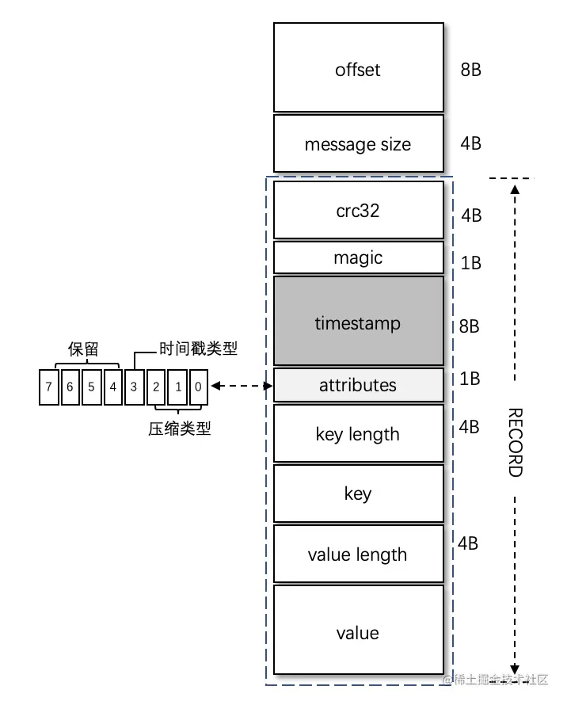

v1 版本的 magic 字段的值为 1。v1 版本的 attributes 字段中的低 3 位和 v0 版本的一 样，还是表示压缩类型，而第 4 个位（bit）也被利用了起来：0 表示 timestamp 类型为 CreateTime， 而 1 表示 timestamp 类型为 LogAppendTime，其他位保留。timestamp 类型由 broker 端参数 log.message.timestamp.type 来配置，默认值为 CreateTime，即采用生产者创建消息时的时间戳。

每个分区由内部的每一条消息组成，如果消息格式设计得不够精炼，那么其功能和性能都会大打折扣。比如有冗余字段，势必会不必要地增加分区的占用空间，进而不仅使存储的开销变大、网络传输的开销变大，也会使 Kafka 的性能下降。反观如果缺少字段，比如在最初的 Kafka 消息版本中没有 timestamp 字段，对内部而言，其影响了日志保存、切分策略，对外部而言， 其影响了消息审计、端到端延迟、大数据应用等功能的扩展。虽然可以在消息体内部添加一个时间戳，但解析变长的消息体会带来额外的开销，而存储在消息体 (参考 value 字段) 前面可以通过指针偏移量获取其值而容易解析，进而减少了开销(可以查看 v1 版本)，虽然相比于没有 timestamp 字段的开销会大一点。由此可见，仅在一个字段的一增一减之间就有这么多门道。

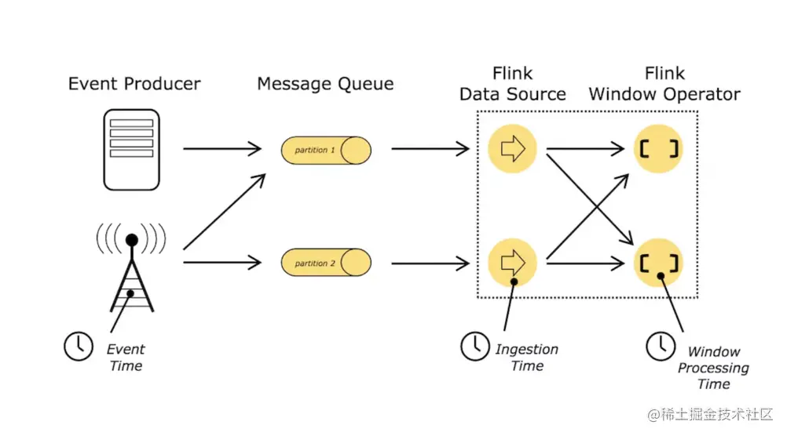

### 3.Compression

以上都是针对消息未压缩的情况，而当消息压缩时是将整个消息集进行压缩作为内层消息 (inner message)，内层消息整体作为外层(wrapper message)的 value，其结构如图所示。

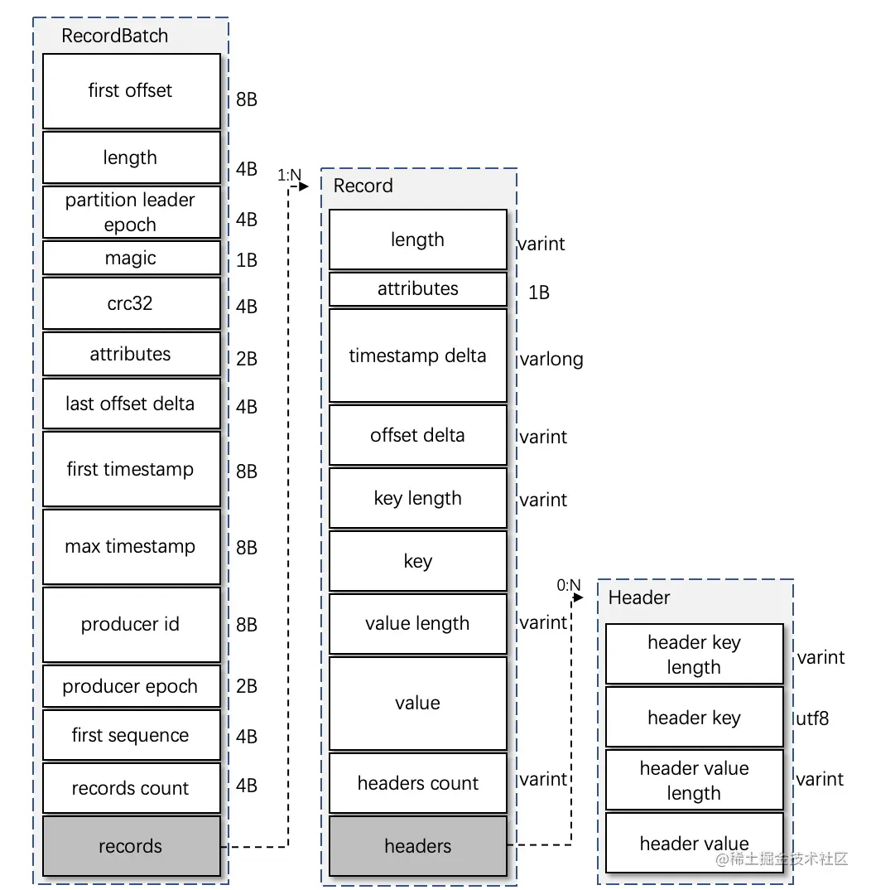

压缩后的外层消息(wrapper message)中的 key 为 null，所以图左半部分没有画出 key 字段，value 字段中保存的是多条压缩消息(inner message，内层消息)，其中 Record 表示的 是从 crc32 到 value 的消息格式。当生产者创建压缩消息的时候，对内部压缩消息设置的 offset 从 0 开始为每个内部消息分配 offset，详细可以参考上图右半部分。

### 4.v2

v2 版本中消息集称为 Record Batch，而不是先前的 Message Set，其内部也包含了一条或多条消息，消息的格式参见下图的中部和右部。在消息压缩的情形下，Record Batch Header部分 (参见图左部，从 first offset 到 records count 字段) 是不被压缩的，而被压缩的是 records 字段中的所有内容。生产者客户端中的 ProducerBatch 对应这里的 RecordBatch，而 ProducerRecord 对应这里的 Record。


先讲述消息格式 Record 的关键字段，可以看到内部字段大量采用了 Varints，这样 Kafka 可 以根据具体的值来确定需要几个字节来保存。v2 版本的消息格式去掉了 crc 字段，另外增加了 length（消息总长度）、timestamp delta（时间戳增量）、offset delta(位移增量) 和 headers 信息，并且 attributes 字段被弃用了，对此做如下分析（key、key length、 value、value length 字段同 v0 和 v1 版本的一样，这里不再赘述）。

- length：消息总长度。
- attributes：弃用，但还是在消息格式中占据1B的大小，以备未来的格式扩展。
- timestampdelta：时间戳增量。通常一个timestamp需要占用8个字节，如果像这里一样保存与RecordBatch 的起始时间戳的差值，则可以进一步节省占用的字节数。
- offset delta：位移增量。保存与 RecordBatch 起始位移的差值，可以节省占用的字节数。
- headers：这个字段用来支持应用级别的扩展，而不需要像v0和v1版本一样不得不将一些应用级别的属性值嵌入消息体 （如TTL）。Header 的格式如图最右部分所示，包含 key 和 value，一个 Record 里面可以包含 0 至多个 Header。

对于 v1 版本的消息，如果用户指定的 timestamp 类型是 LogAppendTime 而不是 CreateTime，那么消息从生产者进入 broker 后，timestamp 字段会被更新，此时消息的 crc 值将被重新计算，而此值在生产者中已经被计算过一次。再者，broker 端在进行消息格式转换时(比如 v1 版转成 v0 版的消息格式)也会重新计算 crc 的值。在这些类似的情况下，消息从 生产者到消费者之间流动时，crc 的值是变动的，需要计算两次 crc 的值，所以这个字段的设 计在 v0 和 v1 版本中显得比较“鸡肋”。在 v2 版本中将 crc 的字段从 Record 中转移到了 RecordBatch 中。

v2 版本对消息集(RecordBatch)做了彻底的修改，参考图最左部分，除了刚刚提及的 crc 字段，还多了如下字段:

- first offset：表示当前 RecordBatch 的起始位移。
- length：计算从 partition leader epoch 字段开始到末尾的长度。
- partition leader epoch：分区 leader 纪元，可以看作分区 leader 的版本号或更新次数。
- magic：消息格式的版本号，对 v2 版本而言，magic 等于2。
- attributes：消息属性，注意这里占用了两个字节。低3位表示压缩格式，可以参 考 v0 和 v1；第 4 位表示时间戳类型；第 5 位表示此 RecordBatch 是否处于事务中，0 表示非事务，1 表示事务。第 6 位表示是否是控制消息(ControlBatch)，0 表示非控制消息，而 1 表示是控制消息，控制消息用来支持事务功能。
- last offset delta：RecordBatch 中最后一个 Record 的 offset 与 first offset 的差值。 主要被 broker 用来确保 RecordBatch 中 Record 组装的正确性。
- first timestamp：RecordBatch 中第一条 Record 的时间戳。
- max timestamp：RecordBatch 中最大的时间戳，一般情况下是指最后一个 Record 的时间戳，和 last offset delta 的作用一样，用来确保消息组装的正确性。
- producerid：PID，用来支持幂等和事务。
- producer epoch：和 producer id 一样，用来支持幂等和事务。
- first sequence：和 producer id、producer epoch 一样，用来支持幂等和事务。
- records count：RecordBatch 中 Record 的个数。

> Kafka 改变了以往传统消息中间件单条消息发送的模式，而改为了批量发送，v2 版本的日志格式更利于此。如果消息量非常小，那么 v0 或者 v1 所占用的空间较小，反之其实 v2 版本的会更利于节省空间，于此同时 v2 版本的消息还附加了一些功能型字段，这样更利于上层应用的扩展。

## 四、Kafka 应用实战

### 1.分区数怎么设定？

生产者在发送消息之前，必须要指定 topic 和 value，还有一些其他的字段也可以指定：

```java
public class ProducerRecord<K, V> 
{ 
	private final String topic; 
	private final Integer partition; 
	private final Headers headers; 
	private final K key; 
	private final V value; 
	private final Long timestamp; 
	(省略…) 
}
```

partition 表示 topic 的分区号，如果在消息（ProducerRecord）中指定了这个属性，就会将这条发送到topic 的指定分区。如果消息中未指定 key，那么会以轮训的方式分发。如果指定了 key，那么会对 key进行哈希（MurmurHash2 算法）来计算分区号。

我们在创建 topic 的时候需要指定分区的个数。如何选择合适的分区数? 这是很多 Kafka 的使用者经常面临的问题，不过对这个问题而言，似乎并没有非常权威的答案。而且这个问题显然也没有固定的答案，只能从某些角度来做具体的分析，最终还是要根据实际的业务场景、软件条件、硬件条件、负载情况等来做具体的考量。

分区是 Kafka 中最小的并行操作单元，对生产者而言，每一个分区的数据写入是完全可以并行化的；对消费者而言，Kafka 只允许单个分区中的消息被一个消费者线程消费，一个消费组的消费并行度完全依赖于所消费的分区数。如此看来，如果一个主题中的分区数越多，理论 上所能达到的吞吐量就越大，那么事实真的如预想的一样吗?

我们使用 Kafka 自带的性能测试工具来实际测试一下。图中x轴分别代表分区数为 1、20、 50、100、200、500、1000 的主题。左图为生产者性能测试结果，右图为消费者性能测试结果。

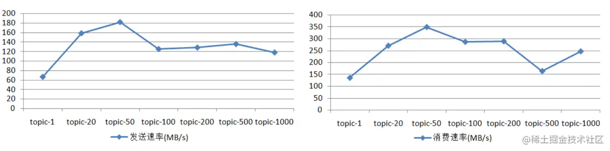

分区数的增加会带来性能上的提升，但是一旦分区数超过了某个阈值之后，整体的吞吐也是不升反降的。

在创建主题之后，虽然我们还能够增加分区的个数，但**基于 key 计算的主题需要严谨对待**。

当生产者向 Kafka 中写入基于 key 的消息时，Kafka 通过消息的 key 来计算出消息将要写入哪个具体的分区，这样具有相同 key 的数据可以写入同一个分区。Kafka 的这一功能对于一部分应用是极为重要的，比如日志压缩(Log Compaction)。

再比如对于同一个 key 的所有消息，消费者需要按消息的顺序进行有序的消费，如果分区的数量发生变化，那么 有序性就得不到保证。在创建主题时，最好能确定好分区数，这样也可以省去后期增加分区所 带来的多余操作。尤其对于与 key 高关联的应用，在创建主题时可以适当地多创建一些分区， 以满足未来的需求。通常情况下，可以根据未来 2 年内的目标吞吐量来设定分区数。

当然**如果应用与 key 弱关联**，并且具备便捷的增加分区数的操作接口，那么也可以不用考虑那么长远的 目标。

有些应用场景会要求主题中的消息都能保证**顺序性**，这种情况下在创建主题时可以设定分区数为 1，通过分区有序性的这一特性来达到主题有序性的目的。

当然**分区数也不能一味地增加**，分区数会占用文件描述符，而一个进 程所能支配的文件描述符是有限的，这也是通常所说的文件句柄的开销。虽然我们可以通过修 改配置来增加可用文件描述符的个数，但凡事总有一个上限，在选择合适的分区数之前，最好再考量一下当前 Kafka 进程中已经使用的文件描述符的个数。

分区数的多少还会**影响系统的可用性**。我们了解到 Kafka 通过多副本机制 来实现集群的高可用和高可靠，每个分区都会有一至多个副本，每个副本分别存在于不同的 broker 节点上，并且只有 leader 副本对外提供服务。在 Kafka 集群的内部，所有的副本都采用 自动化的方式进行管理，并确保所有副本中的数据都能保持一定程度上的同步。当 broker 发生 故障时，leader 副本所属宿主的 broker 节点上的所有分区将暂时处于不可用的状态，此时 Kafka 会自动在其他的 follower 副本中选举出新的 leader 用于接收外部客户端的请求，整个过程由 Kafka 控制器负责完成。分区在进行 leader 角色切换的过程中会变得不可用，不过对于单个分区来说这个过程非常短暂，对用户而言可以忽略不计。如 果集群中的某个 broker 节点宕机，那么就会有大量的分区需要同时进行 leader 角色切换，这个 切换的过程会耗费一笔可观的时间，并且在这个时间窗口内这些分区也会变得不可用。

**分区数越多也会让** **Kafka** **的正常启动和关闭的耗时变得越长**，与此同时，主题的分区数越 多不仅会增加日志清理的耗时，而且在被删除时也会耗费更多的时间。

如何选择合适的分区数?从某种意思来说，考验的是决策者的实战经验，更透彻地说，是对 Kafka 本身、业务应用、硬件资源、环境配置等多方面的考量而做出的选择。在设定完分区数，或者更确切地说是创建主题之后，还要对其追踪、监控、调优以求更好地利用它。

一般情况下，根据预估的吞吐量及是否与 key 相关的规则来设定分区 数即可，后期可以通过增加分区数、增加 broker 或分区重分配等手段来进行改进。

### 2.为什么分区数只能增加不能减少？

当一个主题被创建之后，依然允许我们对其做一定的修改，比如修改分区个数、修改配置等，这个修改的功能就是由 [kafka-topics.sh](http://kafka-topics.sh) 脚本中的 alter 指令提供的。

按照 Kafka 现有的代码逻辑，此功能完全可以实现，不过也会使代码的复杂度急剧增大。 实现此功能需要考虑的因素很多，比如删除的分区中的消息该如何处理? 如果随着分区一起消失则消息的可靠性得不到保障;如果需要保留则又需要考虑如何保留。直接存储到现有分区的尾部，消息的时间戳就不会递增，如此对于 Spark、Flink 这类需要消息时间戳(事件时间)的组件将会受到影响; 如果分散插入现有的分区，那么在消息量很大的时候，内部的数据复制会占用很大的资源，而且在复制期间，此主题的可用性又如何得到保障?与此同时，顺序性问题、 事务性问题，以及分区和副本的状态机切换问题都是不得不面对的。

反观这个功能的收益点却 是很低的，如果真的需要实现此类功能，则完全可以重新创建一个分区数较小的主题，然后将 现有主题中的消息按照既定的逻辑复制过去即可。

### 3.追求极致的性能

**①批量处理**

传统消息中间件的消息发送和消费整体上是针对单条的。对于生产者而言，它先发一条消息，然后broker 返回 ACK 表示已接收，这里产生 2 次 rpc；对于消费者而言，它先请求接受消息，然后 broker 返回消息，最后发送 ACK 表示已消费，这里产生了 3 次 rpc（有些消息中间件会优化一下，broker 返回的时候返回多条消息）。

而 Kafka 采用了批量处理：生产者聚合了一批消息，然后再做 2 次 rpc 将消息存入 broker，这原本是需要很多次的 rpc 才能完成的操作。假设需要发送 1000 条消息，每条消息大小 1KB，那么传统的消息中间件需要 2000 次 rpc，而 Kafka 可能会把这 1000 条消息包装成 1 个 1MB 的消息，采用 2 次 rpc 就完成了任务。这一改进举措一度被认为是一种“作弊”的行为，然而在微批次理念盛行的今日，其它消息中间件也开始纷纷效仿。

**②日志格式改进+编码改进**

Kafka 从 0.8 版本开始日志格式历经了三次变革：v0、v1、v2。Kafka 的日志格式越来越利于批量消息的处理。Kafka 最新的版本中采用了变成字段 Varints 和 ZigZag 编码，有效地降低了这些附加字段的占用大小。日志（消息）尽可能变小了，那么网络传输的效率也会变高，日志存盘的效率也会提升，从而整理的性能也会有所提升。

**③消息压缩**

Kafka 支持多种消息压缩方式（gzip、snappy、lz4）。对消息进行压缩可以极大地减少网络传输量、降低网络 I/O，从而提高整体的性能。消息压缩是一种使用时间换空间的优化方式，如果对 时延有一定的要求，则不推荐对消息进行压缩。

**④建立索引，方便快速查询**

每个日志分段文件对应了两个索引文件，主要用来提高查找消息的效率，这也是提升性能的一种方式。

**⑤分区**

很多人会忽略掉这个因素，其实分区也是提升性能的一种非常有效的方式，这种方式所带来的效果会比前面所说的日志编码、消息压缩等更加的明显。

**⑥一致性**

绝大多数的资料在讲述 Kafka 性能优化的举措之时是不会提及一致性的东西的。我们所了解的通用的一致性协议如 Paxos、Raft、Gossip 等，而 Kafka 另辟蹊径采用类似 PacificA 的做法不是“拍大腿”拍出来的，采用这种模型会提升整理的效率。

**⑦顺序写盘**

操作系统可以针对线性读写做深层次的优化，比如预读（read-ahead，提前将一个比较大的磁盘块读入内存)）和后写（write-behind，将很多小的逻辑写操作合并起来组成一个大的物理写操作）技术。Kafka 在设计时采用了文件追加的方式来写入消息，即只能在日志文件的尾部追加新的消 息，并且也不允许修改已写入的消息，这种方式属于典型的顺序写盘的操作，所以就算 Kafka 使用磁盘作为存储介质，它所能承载的吞吐量也不容小觑。

**⑧页缓存**

为什么 Kafka 性能这么高？当遇到这个问题的时候很多人都会想到上面的顺序写盘这一点。其实在顺序写盘前面还有页缓存（PageCache）这一层的优化。

页缓存是操作系统实现的一种主要的磁盘缓存，以此用来减少对磁盘 I/O 的操作。具体 来说，就是把磁盘中的数据缓存到内存中，把对磁盘的访问变为对内存的访问。为了弥补性 能上的差异，现代操作系统越来越“激进地”将内存作为磁盘缓存，甚至会非常乐意将所有 可用的内存用作磁盘缓存，这样当内存回收时也几乎没有性能损失，所有对于磁盘的读写也 将经由统一的缓存。

当一个进程准备读取磁盘上的文件内容时，操作系统会先查看待读取的数据所在的页 （page）是否在页缓存（pagecache）中，如果存在（命中）则直接返回数据，从而避免了对物理磁盘的 I/O 操作；如果没有命中，则操作系统会向磁盘发起读取请求并将读取的数据页存入页缓存，之后再将数据返回给进程。同样，如果一个进程需要将数据写入磁盘，那么操作系统也会检测数据对应的页是否在页缓存中，如果不存在，则会先在页缓存中添加相应的页，最后将数据写入对应的页。被修改过后的页也就变成了脏页，操作系统会在合适的时间把脏页中的数据写入磁盘，以保持数据的一致性。

对一个进程而言，它会在进程内部缓存处理所需的数据，然而这些数据有可能还缓存在操 作系统的页缓存中，因此同一份数据有可能被缓存了两次。并且，除非使用 Direct I/O 的方式， 否则页缓存很难被禁止。此外，用过 Java 的人一般都知道两点事实:对象的内存开销非常大，通常会是真实数据大小的几倍甚至更多，空间使用率低下；Java 的垃圾回收会随着堆内数据的 增多而变得越来越慢。基于这些因素，使用文件系统并依赖于页缓存的做法明显要优于维护一 个进程内缓存或其他结构，至少我们可以省去了一份进程内部的缓存消耗，同时还可以通过结构紧凑的字节码来替代使用对象的方式以节省更多的空间。如此，我们可以在 32GB 的机器上使用 28GB 至 30GB 的内存而不用担心 GC 所带来的性能问题。此外，即使 Kafka 服务重启， 页缓存还是会保持有效，然而进程内的缓存却需要重建。这样也极大地简化了代码逻辑，因为 维护页缓存和文件之间的一致性交由操作系统来负责，这样会比进程内维护更加安全有效。

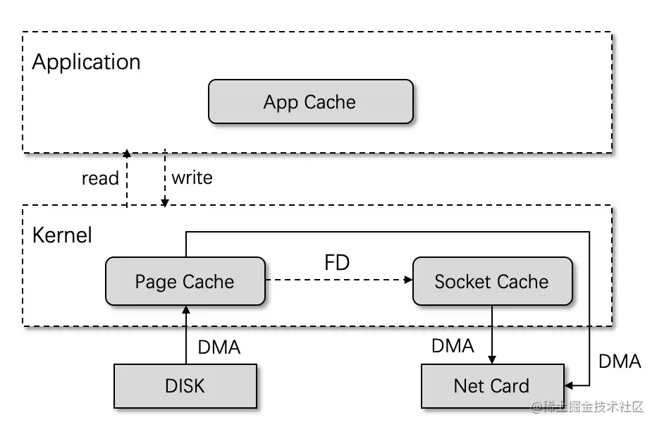

Kafka 中大量使用了页缓存，这是 Kafka 实现高吞吐的重要因素之一。虽然消息都是先被写入页缓存，然后由操作系统负责具体的刷盘任务的。

**⑨零拷贝**

Kafka使用了 Zero Copy 技术提升了消费的效率。（sendfile 系统调用在 Linux 内核版本 2.1 中被引入，目的是简化通过网络在两个通道之间进行的数据传输过程。sendfile 允许操作系统从 Page Cache 直接将文件发送至 socket 缓存区，节省了内核空间 & 用户空间的两次冗余的 cpu 拷贝操作，最后只需要通过 DMA 传输将数据复制到网卡。这样使得调用变得更加简洁：不仅减少了 CPU 拷贝的次数，由于文件传输拷贝仅发生在内核空间，还减少了上下文切换的次数。）


## 五、消息可靠性分析

很多人问过类似这样的一些问题：怎样可以确保 Kafka 完全可靠?如果这样做就可以确保消息不丢失了吗? 小可认为：就可靠性本身而言，它并不是一个可以用简单的“是”或“否” 来衡量的一个指标，而一般是采用几个 9 来衡量的。任何东西不可能做到完全的可靠，即使能 应付单机故障，也难以应付集群、数据中心等集体故障，即使躲得过天灾也未必躲得过人祸。 就可靠性而言，我们可以基于一定的假设前提来做分析。本节要讲述的是:在只考虑 Kafka 本 身使用方式的前提下如何最大程度地提高可靠性。

就 Kafka 而言，越多的副本数越能够保证数据的可靠性，副本数可以在创建主题时配置， 也可以在后期修改，不过副本数越多也会引起磁盘、网络带宽的浪费，同时会引起性能的下降。 一般而言，设置副本数为 3 即可满足绝大多数场景对可靠性的要求，而对可靠性要求更高的场 景下，可以适当增大这个数值，比如国内部分银行在使用 Kafka 时就会设置副本数为 5。与此 同时，如果能够在分配分区副本的时候引入基架信息(broker.rack 参数)，那么还要应对 机架整体宕机的风险。

仅依靠副本数来支撑可靠性是远远不够的，大多数人还会想到生产者客户端参数 acks。 对于这个参数而言: 相比于 0 和 1，acks = -1(客户端还可以配置为 all，它的含 义与-1 一样，以下只以-1 来进行陈述)可以最大程度地提高消息的可靠性。

对于 acks = 1 的配置，生产者将消息发送到 leader 副本，leader 副本在成功写入本地日志之 后会告知生产者已经成功提交，如图所示。如果此时 ISR 集合的 follower 副本还没来得及 拉取到 leader 中新写入的消息，leader 就宕机了，那么此次发送的消息就会丢失。

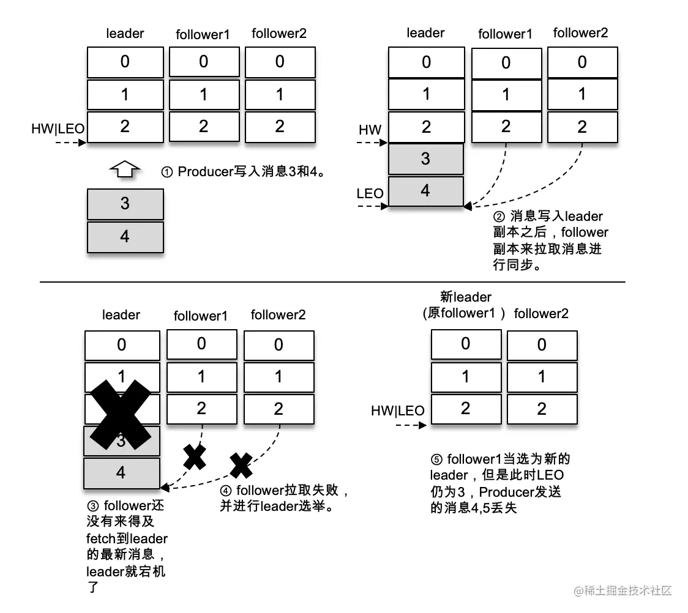

对于 ack = -1 的配置，生产者将消息发送到 leader 副本，leader 副本在成功写入本地日志之 后还要等待 ISR 中的 follower 副本全部同步完成才能够告知生产者已经成功提交，即使此时 leader 副本宕机，消息也不会丢失，如图所示。

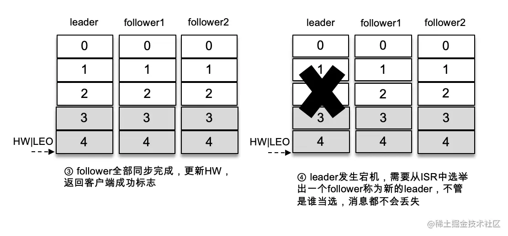

同样对于 acks = -1 的配置，如果在消息成功写入 leader 副本之后，并且在被 ISR 中的所有副本同步之前 leader 副本宕机了，那么生产者会收到异常以此告知此次发送失败，如图 所示。

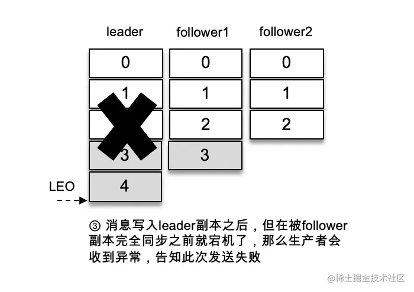

消息发送有 3 种模式，即发后即忘、同步和异步。对于发后即忘 的模式，不管消息有没有被成功写入，生产者都不会收到通知，那么即使消息写入失败也无从 得知，因此发后即忘的模式不适合高可靠性要求的场景。如果要提升可靠性，那么生产者可以 采用同步或异步的模式，在出现异常情况时可以及时获得通知，以便可以做相应的补救措施， 比如选择重试发送(可能会引起消息重复)。

有些发送异常属于可重试异常，比如 NetworkException，这个可能是由瞬时的网络故障而 导致的，一般通过重试就可以解决。对于这类异常，如果直接抛给客户端的使用方也未免过于 兴师动众，客户端内部本身提供了重试机制来应对这种类型的异常，通过 retries 参数即可 配置。默认情况下，retries 参数设置为 0，即不进行重试，对于高可靠性要求的场景，需要 将这个值设置为大于 0 的值，在 2.3 节中也谈到了与 retries 参数相关的还有一个 [retry.backoff.ms](http://retry.backoff.ms) 参数，它用来设定两次重试之间的时间间隔，以此避免无效的频繁重试。 在配置 retries 和 [retry.backoff.ms](http://retry.backoff.ms) 之前，最好先估算一下可能的异常恢复时间，这样 可以设定总的重试时间大于这个异常恢复时间，以此来避免生产者过早地放弃重试。如果不知 道 retries 参数应该配置为多少，则可以参考 KafkaAdminClient，在 KafkaAdminClient 中 retries 参数的默认值为 5。

注意如果配置的 retries 参数值大于 0，则可能会引起一些负面的影响。由于默认的 [max.in](http://max.in).flight.requests.per.connection 参数值为 5，这样 可能会影响消息的顺序性，对此要么放弃客户端内部的重试功能，要么将 [max.in](http://max.in).flight.requests.per.connection 参数设置为 1，这样也就放弃了吞吐。其次， 有些应用对于时延的要求很高，很多时候都是需要快速失败的，设置retries> 0会增加客户 端对于异常的反馈时延，如此可能会对应用造成不良的影响。

我们回头再来看一下 acks = -1 的情形，它要求 ISR 中所有的副本都收到相关的消息之后才能够告知生产者已经成功提交。试想一下这样的情形，leader 副本的消息流入速度很快，而 follower 副本的同步速度很慢，在某个临界点时所有的 follower 副本都被剔除出了 ISR 集合，那 么 ISR 中只有一个 leader 副本，最终 acks = -1 演变为 acks = 1 的情形，如此也就加大了消息丢 失的风险。Kafka 也考虑到了这种情况，并为此提供了 min.insync.replicas 参数(默认值 为 1)来作为辅助(配合 acks = -1 来使用)，这个参数指定了 ISR 集合中最小的副本数，如果 不满足条件就会抛出 NotEnoughReplicasException 或 NotEnoughReplicasAfterAppendException。 在正常的配置下，需要满足副本数 > min.insync.replicas 参数的值。一个典型的配置方 案为:副本数配置为 3，min.insync.replicas 参数值配置为 2。注意 min.insync. replicas 参数在提升可靠性的时候会从侧面影响可用性。试想如果 ISR 中只有一个 leader 副 本，那么最起码还可以使用，而此时如果配置 min.insync.replicas>1，则会使消息无法 写入。

与可靠性和 ISR 集合有关的还有一个参数— unclean.leader.election.enable。 这个参数的默认值为 false，如果设置为 true 就意味着当 leader 下线时候可以从非 ISR 集合中选 举出新的 leader，这样有可能造成数据的丢失。如果这个参数设置为 false，那么也会影响可用 性，非 ISR 集合中的副本虽然没能及时同步所有的消息，但最起码还是存活的可用副本。随着 Kafka 版本的变更，有的参数被淘汰，也有新的参数加入进来，而传承下来的参数一般都很少 会修改既定的默认值，而 unclean.leader.election.enable 就是这样一个反例，从 0.11.0.0 版本开始，unclean.leader.election.enable 的默认值由原来的 true 改为了 false，可以看出 Kafka 的设计者愈发地偏向于可靠性的提升。

在 broker 端还有两个参数 log.flush.interval.messages 和 [log.flush.interval.ms](http://log.flush.interval.ms)， 用来调整同步刷盘的策略，默认是不做控制而交由操作系统本身来进行处理。同步刷盘是增强 一个组件可靠性的有效方式，Kafka 也不例外，但笔者对同步刷盘有一定的疑问— 绝大多数 情景下，一个组件(尤其是大数据量的组件)的可靠性不应该由同步刷盘这种极其损耗性能的 操作来保障，而应该采用多副本的机制来保障。

对于消息的可靠性，很多人都会忽视消费端的重要性，如果一条消息成功地写入 Kafka， 并且也被 Kafka 完好地保存，而在消费时由于某些疏忽造成没有消费到这条消息，那么对于应 用来说，这条消息也是丢失的。

[enable.auto](http://enable.auto).commit 参数的默认值为 true，即开启自动位移提交的功能，虽然这种方 式非常简便，但它会带来重复消费和消息丢失的问题，对于高可靠性要求的应用来说显然不可 取，所以需要将 [enable.auto](http://enable.auto).commit 参数设置为 false 来执行手动位移提交。在执行手动 位移提交的时候也要遵循一个原则:如果消息没有被成功消费，那么就不能提交所对应的消费 位移。对于高可靠要求的应用来说，宁愿重复消费也不应该因为消费异常而导致消息丢失。有 时候，由于应用解析消息的异常，可能导致部分消息一直不能够成功被消费，那么这个时候为了不影响整体消费的进度，可以将这类消息暂存到死信队列中，以便后续的故障排除。

对于消费端，Kafka 还提供了一个可以兜底的功能，即回溯消费，通过这个功能可以让我们能够有机会对漏掉的消息相应地进行回补，进而可以进一步提高可靠性。