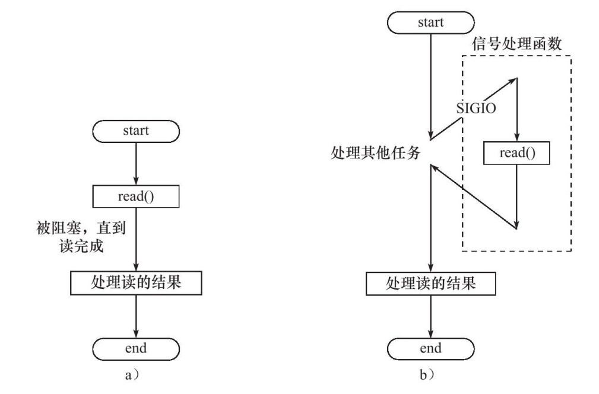
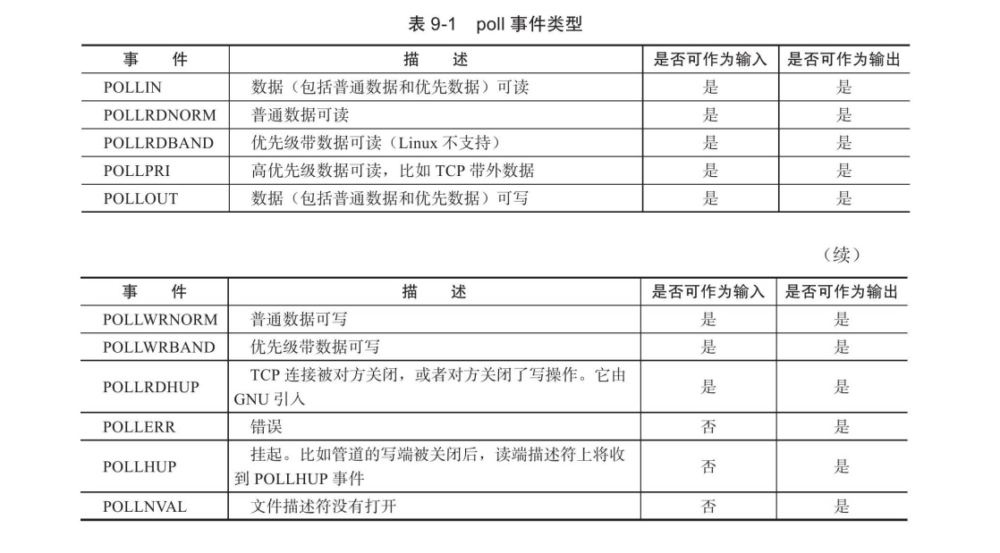
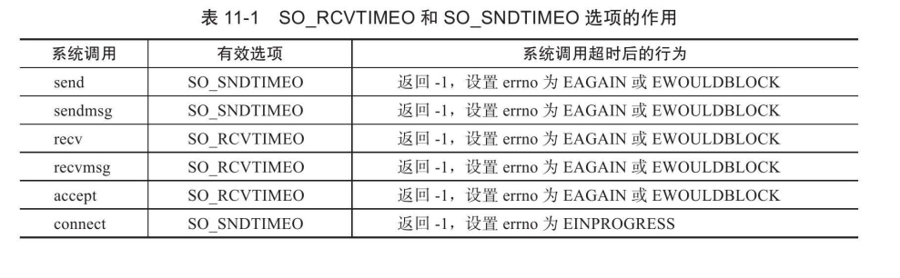

> 
>
> from 《Linux高性能服务器编程》游双

# Linux网络编程基础API

### 主机字节序和网络字节序的转换

host to network long .... 主机序转网络字节序

```c++
#include＜netinet/in.h＞
unsigned long int htonl(unsigned long int hostlong);
unsigned short int htons(unsigned short int hostshort);
unsigned long int ntohl(unsigned long int netlong);
unsigned short int ntohs(unsigned short int netshort);
```

### IP地址转换函数

```c
#include＜arpa/inet.h＞
in_addr_t inet_addr(const char*strptr);
int inet_aton(const char*cp,struct in_addr*inp);
char*inet_ntoa(struct in_addr in);
```

inet_addr函数将用**点分十进制字符串**表示的IPv4地址转化为用**网络字节序整数**表示的IPv4地址。它失败时返回INADDR_NONE。

inet_aton函数完成和inet_addr同样的功能，但是将**转化结果存储于参数inp指向的地址结构**中。它成功时返回1，失败则返回0。

inet_ntoa函数将用**网络字节序整数表示的IPv4地址**转化为**用点分十进制字符串表示的IPv4地址**。但需要注意的是，该函数内部用一个静态变量存储转化结果，函数的返回值指向该静态内存，因此inet_ntoa是**不可重入(多次调用只会保存最后一个结果)**的。

### 创建socket

```c
#include＜sys/types.h＞
#include＜sys/socket.h＞
int socket(int domain,int type,int protocol)
```

**domain参数告诉系统使用哪个底层协议族**。对TCP/IP协议族而言，该参数应该设置为**PF_INET**（Protocol Family of Internet，用于IPv4）或PF_INET6（用于IPv6）  

**type参数指定服务类型**。服务类型主要有**SOCK_STREAM**服务（流服务）和**SOCK_UGRAM**（数据报）服务。对TCP/IP协议族而言，**其值取SOCK_STREAM表示传输层使用TCP协议，取SOCK_DGRAM表示传输层使用UDP协议**  

创建成功返回一个`file descripter FD`，失败返回-1

### 命名socket

```c
#include＜sys/types.h＞
#include＜sys/socket.h＞
int bind(int sockfd,const struct sockaddr*my_addr,socklen_t
addrlen);
```

bind将**my_addr所指的socket地址分配给未命名的sockfd文件描述符**，addrlen参数指出该**socket地址的长度**。  

命名成功返回0，失败返回-1并设置errno

### 监听socket

```c
#include＜sys/socket.h＞
int listen(int sockfd,int backlog);
```

listen成功时返回0，失败则返回-1并设置errno。  

### 接受连接

```c
#include＜sys/types.h＞
#include＜sys/socket.h＞
int accept(int sockfd,struct sockaddr*addr,socklen_t*addrlen);
```

sockfd参数是**执行过listen系统调用的监听socket**。

addr参数**用来获取被接受连接的远端socket地址**，该socket地址的长度由addrlen参数指出。

accept成功时返回一个新的连接socket，**该socket唯一地标识了被接受的这个连接**，服务器可通过读写该socket来与被接受连接对应的客户端通信。

accept失败时返回-1并设置errno  

### 发起连接

```c
#include＜sys/types.h＞
#include＜sys/socket.h＞
int connect(int sockfd,const struct sockaddr*serv_addr,socklen_t
addrlen);
```

sockfd参数由socket系统调用返回一个socket。

serv_addr参数是**服务器监听的socket地址，addrlen参数则指定这个地址的长度**。

**connect成功时返回0**。一旦成功建立连接，sockfd就唯一地标识了这个连接，客户端就可以通过读写sockfd来与服务器通信。**connect失败则返回-1并设置errno**。其中两种常见的errno是ECONNREFUSED和ETIMEDOUT

### 关闭连接

```c
#include＜unistd.h＞
int close(int fd);
```

fd参数是**待关闭的socket**。

不过，close系统调用**并非总是立即关闭一个连接**，而是将**fd的引用计数减1**。只有当fd的**引用计数为0时，才真正关闭连接**。

多进程程序中，**一次fork系统调用默认将使父进程中打开的socket的引用计数加1**，因此我们必须在**父进程和子进程中都对该socket执行close调用才能将连接关闭**  

```c
#include＜sys/socket.h＞
int shutdown(int sockfd,int howto);
```


shutdown成功时返回0，失败则返回-1并设置errno  

### 数据读写

#### TCP读写

```c
#include＜sys/types.h＞
#include＜sys/socket.h＞
ssize_t recv(int sockfd,void*buf,size_t len,int flags);
ssize_t send(int sockfd,const void*buf,size_t len,int flags);
```

recv成功时**返回实际读取到的数据的长度**，它可能小于我们期望的长度len。**recv可能返回0，**这意味着通信对方已经关闭连接了。**recv出错时返回-1并设置errno。**  

send**成功时返回实际写入的数据的长度**，**失败则返回-1并设置errno**  

> send将数据立即从缓冲区发送


#### UDP读写

```c
#include＜sys/types.h＞
#include＜sys/socket.h＞
ssize_t recvfrom(int sockfd,void*buf,size_t len,int flags,struct sockaddr*src_addr,socklen_t*addrlen);

ssize_t sendto(int sockfd,const void*buf,size_t len,int
flags,const struct sockaddr*dest_addr,socklen_t addrlen)
```

`recvfrom`读取sockfd上的数据，**buf和len参数分别指定读缓冲区的位置和大小。**因为UDP通信没有连接的概念，所以我们**每次读取数据都需要获取发送端的socket地址**，即参数src_addr所指的内容，addrlen参数则指定该地址的长度。  

sendto往sockfd上写入数据，**buf和len参数分别指定写缓冲区的位置和大小**。dest_addr参数指定接收端的socket地址，addrlen参数则指定该地址的长度。  

这两个系统调用的flags参数以及返回值的含义均与**send/recv系统调用的flags参数及返回值相同**。  

#### 通用读写

```c
#include＜sys/socket.h＞
ssize_t recvmsg(int sockfd,struct msghdr*msg,int flags);
ssize_t sendmsg(int sockfd,struct msghdr*msg,int flags);
```

懒得写

### 带外标记

```c
#include＜sys/socket.h＞
int sockatmark(int sockfd);
```

sockatmark**判断sockfd是否处于带外标记**，即下一个被读取到的数据是否是带外数据。**如果是，sockatmark返回1**，此时我们就可以利用带MSG_OOB标志的recv调用来接收带外数据。**如果不是，则sockatmark返回0。**  

### 地址信息函数

```c
#include＜sys/socket.h＞
int getsockname(int sockfd,struct
sockaddr*address,socklen_t*address_len);
int getpeername(int sockfd,struct
sockaddr*address,socklen_t*address_len);
```

将本socket或远端socket的地址信息存入对应内存中,**若实际socket地址长度大于指定的长度，将会被截断**

成功返回0，失败返回-1并设置errno

### socket选项

```c
#include＜sys/socket.h＞
int getsockopt(int sockfd,int level,int
option_name,void*option_value,socklen_t*restrict option_len);
int setsockopt(int sockfd,int level,int option_name,const
void*option_value,socklen_t option_len);
```

sockfd参数指定被操作的目标socket。

level参数指定要操作**哪个协议的选项**（即属性），比如IPv4、IPv6、TCP等。option_name参数则指定**选项的名字**。

option_value和option_len参数分别是**被操作选项的值和长度**。  

成功返回0，失败返回-1并设置errno


> 值得指出的是，对服务器而言，有部分socket选项只能在调用**listen系统调用前**针对监听socket设置才有效。

> 而对客户端而言，这些socket选项则应该在**调用connect函数之前设置**，因为connect调用成功返回之后，**TCP三次握手已完成**    

#### SO_REUSEADDR

设置之后，即使socket处于`TIME_WAIT`状态，也能立刻重用，在`bind()`之前设置

> close后的socket都会进入，可以修改内核参数设置不进入，使用设置这个socket选项后在socket刚关闭时快速重用，不用等待完全退出

#### SO_REUSEPORT

重用端口,配合`REUSEADDR`可以使**同一用户**的同一程序的多个实例(socket)绑定到同一地址上

> 网上说可以内核调度负载均衡，可能是我没有fork,我是直接运行了两次，两个不同的进程，一个进程结束之后才由另一个进程的socket接收


> 将其值改为1则为开启

#### SO_RECVBUF和_SO_SNDBUF

SO_RCVBUF和SO_SNDBUF选项分别表示TCP接收缓冲区和发送缓冲区的大小。

当我们用setsockopt来设置TCP的接收缓冲区和发送缓冲区的大小时，**系统都会将其值加倍**，**并且不得小于某个最小值**。**TCP接收缓冲区的最小值是256字节，而发送缓冲区的最小值是2048字节**  

> 大于最低值就加倍，设置2000，实际4000，小于最低值就不变

#### SO_RCVLOWAT和SO_SNDLOWAT  

分别代表TCP发送缓冲区和接收缓冲区的**低水位标记**，一般被IO复用系统判断该socket是否可读或可写

当接收缓冲区中**可读数据大于低水位标记**时，I/O复用系统就会通知应用程序**从对应socket上读取数据**

当发送缓冲区的**空闲空间大于低水位标记**时，I/O复用系统则会通知应用程序可以**往对应socket写入数据**

> 默认情况下，发送和接收缓冲区的低水位标记都为1字节

#### SO_LINGER

控制在close系统调用在关闭TCP连接时的行为

默认情况下close关闭一个socket之后，close立即返回，TCP模块负责将对应发送缓冲区中的数据发送给对方

```c
#include＜sys/socket.h＞
struct linger
{
int l_onoff;/*开启（非0）还是关闭（0）该选项*/
int l_linger;/*滞留时间*/
};
```

根据linger结构体中两个成员变量的不同值，close系统调用可能产生如下3种行为之一：

❑l_onoff等于0。此时SO_LINGER选项不起作用，close用默认行为来关闭socket。


❑l_onoff不为0，l_linger等于0。此时close系统调用立即返回，TCP模块将丢弃被关闭的socket对应的TCP发送缓冲区中残留的数据，同时给对方发送一个复位报文段（见3.5.2小节）。因此，这种情况给服务器提供了异常终止一个连接的方法。❑l_onoff不为0，l_linger大于0。此时close的行为取决于两个条件：一是被关闭的socket对应的TCP发送缓冲区中是否还有残留的数据；二是该socket是阻塞的，还是非阻塞的。对于阻塞的socket，close将等待一段长为l_linger的时间，直到TCP模块发送完所有残留数据并得到对方的确认。如果这段时间内TCP模块没有发送完残留数据并得到对方的确认，那么close系统调用将返回-1并设置errno为EWOULDBLOCK。如果socket是非阻塞的，close将立即返回，此时我们需要根据其返回值和errno来判断残留数据是否已经发送完毕。关于阻塞和非阻塞，我们将在第8章讨论


### 网络信息API

> 给的端口或ip等都是网络字节序，需要输出的时候记得转换为主机字节序

#### gethostbyname 和 gethostbyaddr

```c
#include＜netdb.h＞
struct hostent* gethostbyname(const char*name);
struct hostent* gethostbyaddr(const void*addr,size_t len,int
type);
```


`gethostbyname`函数根据**主机名称**获取主机的完整信息

`gethostbyaddr`函数根据**IP地址**获取主机的完整信息  

- name参数指定**目标主机的主机名**

- addr参数指定**目标主机的IP地址**

- len参数指定addr所指**IP地址的长度**

- type参数指定**addr所指IP地址的类型**，其合法取值包括AF_INET（用于IPv4地址）和AF_INET6（用于IPv6地址）  

两个函数都返回一个结构体指针`hostent`

```c
#include＜netdb.h＞
struct hostent
{
char*h_name;/*主机名*/
char**h_aliases;/*主机别名列表，可能有多个*/
int h_addrtype;/*地址类型（地址族）*/
int h_length;/*地址长度*/
char**h_addr_list/*按网络字节序列出的主机IP地址列表*/
};
```

#### getservbyname和getservbyport  

`getservbyname`函数根据**名称**获取某个服务的完整信息

`getservbyport`函数根据**端口号**获取某个服务的完整信息  

```c
#include＜netdb.h＞
struct servent*getservbyname(const char*name,const char*proto);
struct servent*getservbyport(int port,const char*proto);
```

- name参数指定目标服务的名字
- port参数指定目标服务对应的端口号
- proto参数指定**服务类型**，**给它传递“tcp”表示获取流服务，给它传递“udp”表示获取数据报服务，给它传递NULL则表示获取所有类型的服务。**  

这两个函数返回的都是servent结构体类型的指针，结构体servent的定义如下：

```c
#include＜netdb.h＞
struct servent
{
char*s_name;/*服务名称*/
char**s_aliases;/*服务的别名列表，可能有多个*/
int s_port;/*端口号*/
char*s_proto;/*服务类型,通常是tcp或者udp*/
};
```

#### getaddrinfo  

getaddrinfo函数既能**通过主机名获得IP地址**（内部使用的是gethostbyname函数），也能通过**服务名获得端口号** (内部使用的是getservbyname函数  )

调用结束后需要使用`freeaddrinfo`来**清除result的内存**。因为我们传递的是并未分配内存的指针

```c
#include＜netdb.h＞
void freeaddrinfo(struct addrinfo*res);
```


```c
#include＜netdb.h＞
int getaddrinfo(const char*hostname,const char*service,const
struct addrinfo*hints,struct addrinfo**result);
```

hostname**参数可以接收主机名**，也可以**接收字符串表示的IP地址**（IPv4采用点分十进制字符串，IPv6则采用十六进制字符串）

 service参数可以**接收服务名**，也可以**接收字符串表示的十进制端口号**。

hints参数是**应用程序给getaddrinfo的一个提示，以对getaddrinfo的输出进行更精确的控制**。**hints参数可以被设置为NULL**，表示允许getaddrinfo反馈任何可用的结果。

> 当我们使用hints参数的时候，可以设置其**ai_flags，ai_family， ai_socktype和ai_protocol**四个字段，其他字段则必须被设置为NULL。  

result参数指向一个链表，**该链表用于存储getaddrinfo反馈的结果**。  

```c
struct addrinfo
{
int ai_flags;/*见后文*/
int ai_family;/*地址族*/
int ai_socktype;/*服务类型，SOCK_STREAM或SOCK_DGRAM*/
int ai_protocol;/*见后文*/
socklen_t ai_addrlen;/*socket地址ai_addr的长度*/
主机的别名char*ai_canonname;/*主机的别名*/
struct sockaddr*ai_addr;/*指向socket地址*/
struct addrinfo*ai_next;/*指向下一个sockinfo结构的对象*/
};
```

`ai_protocol`成员是指具体的网络协议，其含义和socket系统调用的第三个参数相同，**它通常被设置为0**。`ai_flags`成员可以取表5-6中的标志的**按位或**。  


#### getnameinfo  

getnameinfo函数能**通过socket地址同时获得以字符串表示的主机名**（内部使用的是gethostbyaddr函数）和**服务名**（内部使用的是getservbyport函数）  

```c
#include＜netdb.h＞
int getnameinfo(
    const struct sockaddr*sockaddr,
                socklen_t addrlen,
                char*host,
                socklen_t hostlen,
                char*serv,
                socklen_t servlen,
                int flags
);
```

getnameinfo**将返回的主机名存储在host参数指向的缓存中**，**将服务名存储在serv参数指向的缓存中**，hostlen和servlen参数分别指定这**两块**

> 也就是说host和serv需要预分配内存


**缓存的长度**。

flags参数**控制getnameinfo的行为**，它可以接收表5-7中的选项


成功返回0，失败返回错误码，可以使用如下函数将错误码转为字符串

```c
#include＜netdb.h＞
const char*gai_strerror(int error);
```


## 高级IO函数

### pipe()

实现一个管道，用于进程间通信

```c
#include<unistd.h>
int pipe(int fd[2])
```

pipe函数的**参数是一个包含两个int型整数的数组指针**。

该函数成功时返回0，并将一对打开的文件描述符值填入其参数指向的数组。如果失败，则返回-1并设置errno。  

通过pipe函数创建的这两个文件描述符fd[0]和fd[1]分别构成管道的两端，**往fd[1]写入的数据可以从fd[0]读出**。并且，f**d[0]只能用于从管道读出数据，fd[1]则只能用于往管道写入数据**  

> 管道本身拥有一个容量限制，它规定如果应用程序不将数据从管道读走的话，该管道最多能被写入多少字节的数据。自Linux 2.6.11内核起，**管道容量的大小默认是65536字节**。我们可以使用fcntl函数来修改管道容量  

#### 双向管道

```c
#include＜sys/types.h＞
#include＜sys/socket.h＞
int socketpair(int domain,int type,int protocol,int fd[2]);
```

`socketpair`前三个参数的含义与**socket系统调用的三个参数完全相同**，但**domain只能使用UNIX本地域协议族AF_UNIX**，因为我们仅能在本地使用这个双向管道。

最后一个参数则和pipe系统调用的参数一样，只不过socketpair创建的这对文件描述符都是**既可读又可写的**。socketpair成功时返回0，失败时返回-1并设置errno。  

### dup和dup2

文件描述符在内核中的数据结构


```c
#include＜unistd.h＞
int dup(int file_descriptor);
int dup2(int file_descriptor_one,int file_descriptor_two);
```

`dup`复制传入的fd,返回一个新的fd，和传入的fd指向同一个文件,默认返回**值最小**的fd

> 从shell中运行一个进程，默认会有3个文件描述符存在(0、1、2)，0与进程的**标准输入**相关联，1与进程的**标准输出**相关联，2与进程的**标准错误**输出相关联

> cgi原理就是，首先关闭标准输出fd,然后将客户端的fd复制一份，这时值最小的空闲fd就是标准输出,让标准输出（1）也指向客户端,从而使用printf()就可以将数据发送给客户端了

dup2可以**指定复制fd**,让传入的fd2参数和fd1一个指向，若fd2没有关闭就先关闭

#### CGI例子

服务端

```c
#include<unistd.h>
#include<stdio.h>
#include<stdlib.h>
#include<arpa/inet.h>
#include<netinet/in.h>
#include<sys/socket.h>
#include<netdb.h>
#include<assert.h>
#include<string.h>

int main() {
	const char* ip = "127.0.0.1";
	int port = 8080;

	int sock = socket(PF_INET, SOCK_STREAM, 0);
	assert(sock >= 0);

	sockaddr_in server_addr = { AF_INET,htons(port),inet_addr(ip) };

	int ret = bind(sock, (sockaddr*)&server_addr, sizeof(server_addr));
	assert(ret != -1);
	ret = listen(sock, 5);
	assert(ret != -1);

	int client;
	sockaddr_in client_addr;
	socklen_t client_socklen = sizeof(client_addr);
	if ((client = accept(sock, (sockaddr*)&client_addr, &client_socklen)) >= 0) {
	/*	close(STDOUT_FILENO);
		dup(client);*/
		dup2(client, STDOUT_FILENO);
		printf("Access Successfully Baby!");
        fflush(stdout); //刷新缓冲区，发送数据
		close(client);
	}
	close(sock);
}
```

接收端

```c
int sock = socket(PF_INET, SOCK_STREAM, 0);
	assert(sock >= 0);
	sockaddr_in addr = { AF_INET, htons(port), inet_addr(ip)};
	printf("addr_ip: %s, port: %d\n", inet_ntoa(addr.sin_addr),ntohs(addr.sin_port));
	int rv = connect(sock, (sockaddr*)&addr, sizeof(addr));
	if (rv < 0) {
		printf("connection failed: %d\n",errno);
	}
	else {
		char buf[1024];
		memset(buf, '\0', 1024);
		recv(sock, buf, 1023, 0);
		printf("%s", buf);
	}
	close(sock);
```

### readv和writev

readv函数**将数据从文件描述符读到分散的内存块**中，即分散读；

 writev函数则**将多块分散的内存数据一并写入文件描述符**中，即集中写  

```c
#include＜sys/uio.h＞
ssize_t readv(int fd,const struct iovec*vector,int count)；
ssize_t writev(int fd,const struct iovec*vector,int count);
```

iovec该结构体描述一块内存区,vector是一个**结构体数组,由多个iovec结构体组成**

count参数是**vector数组的长度**  

> HTTP响应，响应头和响应体(有的话)放在不同的内存中，比如文件就要单独读取,而响应头是有格式的字符串，通过集中写的方式返回给客户端

#### 使用writev通过HTTP返回文件

```c
#include<unistd.h>
#include<stdio.h>
#include<stdlib.h>
#include<arpa/inet.h>
#include<netinet/in.h>
#include<sys/socket.h>
#include<assert.h>
#include<string.h>
#include<sys/stat.h>
#include<fcntl.h>

#define BUF_SIZE 1024
#define FILENAME "/prac/serv/ConsoleApplication1/src/index.html"

int main() {
	const char* ip = "192.168.15.100";
	int port = 8080;

	int sock = socket(PF_INET, SOCK_STREAM, 0);
	assert(sock >= 0);

	sockaddr_in server_addr = { AF_INET,htons(port),inet_addr(ip) };

	int reuse = 1;
	setsockopt(sock, SOL_SOCKET, SO_REUSEADDR, &reuse, sizeof(reuse));

	int ret = bind(sock, (sockaddr*)&server_addr, sizeof(server_addr));
	assert(ret != -1);
	ret = listen(sock, 5);
	assert(ret != -1);
	
	int client;
	sockaddr_in client_addr;
	socklen_t client_socklen = sizeof(client_addr);
	while ((client = accept(sock, (sockaddr*)&client_addr, &client_socklen)) >= 0) {
		char header_buf[BUF_SIZE];  //存放响应头
		recv(client, header_buf, BUF_SIZE, 0); //清除接收缓冲区
		char* file_buf; //存放文件数据
		bool valid = true; 

		memset(header_buf, '\0', BUF_SIZE);
		struct stat file_stat;
		if (stat(FILENAME, &file_stat) < 0) {
			valid = false;
		}
		else {
			int fd = open(FILENAME, O_RDONLY);  //读取文件
			file_buf = (char*)malloc(sizeof(char) * file_stat.st_size+1);
			memset(file_buf, '\0', file_stat.st_size + 1);
			if (read(fd, file_buf, file_stat.st_size) < 0) {
				valid = false;
			}	
		}
		if (valid) {
			snprintf(header_buf, BUF_SIZE - 1, "HTTP/1.1 200 OK\r\nContent-Type: text/html\r\nContent-Length: %d\r\n\r\n",file_stat.st_size);
			iovec iv[2];
			iv[0].iov_base = header_buf;
			iv[0].iov_len = strlen(header_buf);
			iv[1].iov_base = file_buf;
			iv[1].iov_len = file_stat.st_size;
			writev(client, iv, 2);  //使用writev集中写
			close(client);
		}
		else{
			snprintf(header_buf, BUF_SIZE - 1, "HTTP/1.1 500 Server Internal Error\r\n\r\n");
			send(client, header_buf, strlen(header_buf), 0);
			close(client);
		}
     }
    close(sock);

}
```

### sendfile

```c
#include＜sys/sendfile.h＞
ssize_t sendfile(int out_fd,int in_fd,off_t*offset,size_t
count);
```

在两个文件描述符中直接传输数据，避免了从用户缓冲区拷贝到内核缓冲区的过程，**零拷贝**

in_fd是**待读出内容**的文件描述符，必须是一个支持类似mmap()的fd,**即必须指向真实的文件，不能是socket和管道**

out_fd**必须是一个socket**

> 几乎是专门为在网络上传输文件设计的

offset指定从多少字节开始读取，空则默认起始位置

count即两边传输的字节大小

#### 传输文件

关键代码

```c
while ((client = accept(sock, (sockaddr*)&client_addr, &client_socklen)) >= 0) {
		struct stat fs;
		const char* fn = "/prac/serv/ConsoleApplication1/src/index.html";
		stat(fn, &fs);
		int fd = open(fn, O_RDONLY);
		sendfile(client, fd, NULL, fs.st_size);
		close(client);
    }
```

### mmap,munmap

mmap函数用于**申请一段内存空间。我们可以将这段内存作为进程间通信的共享内存，也可以将文件直接映射到其中**。

munmap函数则**释放由mmap创建的这段内存空间**  

```c
#include＜sys/mman.h＞
void*mmap(void*start,size_t length,int prot,int flags,int fd,off_t offset);
int munmap(void*start,size_t length);
```

start参数**允许用户使用某个特定的地址作为这段内存的起始地址**。如果它被设置成**NULL**，则系统**自动分配一个地址**。

length参数指定**内存段的长度**。

prot参数用来设置**内存段的访问权限**。它可以取以下几个值的按位或  


flags参数**控制内存段内容被修改后程序的行为**。它可以被设置为某些值的按位或（其中

MAP_SHARED和MAP_PRIVATE是互斥的，不能同时指定）


fd参数是被**映射文件对应的文件描述符**

offset参数设置**从文件的何处开始映射**  

mmap函数成功时返回指向目标内存区域的指针，失败则返回MAP_FAILED（(void*)-1）并设置errno。munmap函数成功时返回0，失败则返回-1并设置errno  

### splice

splice函数用于在两个文件描述符之间移动数据，也是**零拷贝操作**  

```c
#include＜fcntl.h＞
ssize_t splice(int fd_in,loff_t*off_in,int fd_out,loff_t*off_out,size_t len,unsigned int flags);
```

fd_in参数是**待输入数据的文件描述符**。fd_out是**接收数据的**

如果**fd_in是一个管道文件描述符**，那么**off_in参数必须被设置为NULL**。如果**fd_in不是一个管道文件描述符**（比如socket），那么off_in**表示从输入数据流的何处**开始读取数据。此时，**若off_in被设置为NULL**，则表示从**输入数据流的当前偏移位置读入**

fd_out/off_out参数的含义与fd_in/off_in相同，不过用于输出数据流。

len参数指定**移动数据的长度**  


使用splice函数时，**fd_in和fd_out必须至少有一个是管道文件描述符**。

splice函数调用成功时**返回移动字节的数量**。它可能返回0，表示没有数据需要移动，这发生在从管道中读取数据（fd_in是管道文件描述符）而该管道没有被写入任何数据时。

splice函数失败时返回-1并设置errno

#### 零拷贝的回射服务器

```c
while ((client = accept(sock, (sockaddr*)&client_addr, &client_socklen)) >= 0) {
		int fd[2];
		pipe(fd);  //开启管道
		splice(client, NULL, fd[1], NULL, 1024, SPLICE_F_MORE | SPLICE_F_MOVE); //从客户端移动数据给管道
		splice(fd[0], NULL, client, NULL, 1024, SPLICE_F_MORE | SPLICE_F_MOVE); //从管道转移数据给客户端
		close(client);
    }
```

### tee

tee函数在**两个管道文件描述符之间复制数据**，也是**零拷贝操作**。它**不消耗数据**，因此源文件描述符上的数据仍然可以用于后续的读操作  

```c
#include＜fcntl.h＞
ssize_t tee(int fd_in,int fd_out,size_t len,unsigned int flags);
```

**fd_in和fd_out必须都是管道文件描述符  **

tee函数成功时**返回在两个文件描述符之间复制的数据数量**（字节数）。返回0表示没有复制任何数据。tee失败时返回-1并设置errno。  

#### 实现tee指令

```c
int file_pipe[2];
    int std_pipe[2];
    int fd = open("/root/code/serv/text.txt", O_WRONLY | O_CREAT | O_TRUNC, 0666);
    assert(fd >= 0);
    pipe(file_pipe);
    pipe(std_pipe);

    ssize_t ret = splice(STDIN_FILENO, nullptr, std_pipe[1], nullptr, 1024, SPLICE_F_MORE); //读取输入
    assert(ret != -1);
    ret = tee(std_pipe[0], file_pipe[1], 1024, SPLICE_F_NONBLOCK);  //将输入数据复制到文件管道
    assert(ret != -1);
    ret = splice(std_pipe[0], nullptr, STDOUT_FILENO, nullptr, 1024, SPLICE_F_MORE); //将输入管道的数据传递给输出
    assert(ret != -1); 
    ret = splice(file_pipe[0], nullptr, fd, nullptr, 1024, SPLICE_F_MORE); //将文件管道的数据转递给文件
    assert(ret != -1);

    close(file_pipe[0]);
    close(file_pipe[1]);
    close(std_pipe[0]);
    close(std_pipe[1]);
```

### fcntl

file control 操作文件描述符

```c
#include＜fcntl.h＞
int fcntl(int fd,int cmd,…)
```

fd参数是被**操作的文件描述符**

cmd参数指定执行**何种类型的操作**

根据操作类型的不同，该函数可能还需要第三个**可选参数arg**  


成功返回上图所示，失败-1

#### 设置fd非阻塞

```c
    int fd = open("xxxx", O_WRONLY | O_CREAT | O_TRUNC, 0666);
    int old_opt = fcntl(fd,F_GETFL);
    fcntl(fd,F_SETFL,old_opt | O_NONBLOCK);
```

# 服务器规范

❑**Linux服务器程序一般以后台进程形式运行**。后台进程又称守护进程（daemon）。它没有控制终端，因而也不会意外接收到用户输入。守护进程的父进程通常是init进程（PID为1的进程）。

❑**Linux服务器程序通常有一套日志系统**，它至少能输出日志到文件，有的高级服务器还能输出日志到专门的UDP服务器。大部分后台进程都在/var/log目录下拥有自己的日志目录。

❑**Linux服务器程序一般以某个专门的非root身份运行**。比如mysqld、httpd、syslogd等后台进程，分别拥有自己的运行账户mysql、apache和syslog。

❑**Linux服务器程序通常是可配置的**。服务器程序通常能处理很多命令行选项，如果一次运行的选项太多，则可以用配置文件来管理。绝大多数服务器程序都有配置文件，并存放在/etc目录下。比如第4章讨论的squid服务器的配置文件是/etc/squid3/squid.conf。

❑**Linux服务器进程通常会在启动的时候生成一个PID文件并存入/var/run目录中，以记录该后台进程的PID**。比如syslogd的PID文件是/var/run/syslogd.pid。

❑**Linux服务器程序通常需要考虑系统资源和限制，以预测自身能承受多大负荷**，比如进程可用文件描述符总数和内存总量等。

## 日志


### syslog

应用程序使用syslog函数与rsyslogd守护进程通信 

```c
#include＜syslog.h＞
void syslog(int priority,const char*message,...);
```

该函数采用可变参数（第二个参数message和第三个参数…）来结构化输出  

**priority参数是所谓的设施值与日志级别的按位或**。**设施值的默认值是LOG_USER**，我们下面的讨论也只限于这一种设施值。日志级别有如下几个：  

```c
#include＜syslog.h＞
#define LOG_EMERG 0/*系统不可用*/
#define LOG_ALERT 1/*报警，需要立即采取动作*/
#define LOG_CRIT 2/*非常严重的情况*/
#define LOG_ERR 3/*错误*/
#define LOG_WARNING 4/*警告*/
#define LOG_NOTICE 5/*通知*/
#define LOG_INFO 6/*信息*/
#define LOG_DEBUG 7/*调试*/
```

### openlog

```c
#include＜syslog.h＞
void openlog(const char*ident,int logopt,int facility);
```

对日志打印进一步的结构化（配置日志）

ident参数指定的字符串将被添加到日志消息的日期和时间之后，**它通常被设置为程序的名字**。

logopt参数对**后续syslog调用的行为进行配置**，它可取下列值的按位或  :

```c
#define LOG_PID 0x01/*在日志消息中包含程序PID*/
#define LOG_CONS 0x02/*如果消息不能记录到日志文件，则打印至终端*/
#define LOG_ODELAY 0x04/*延迟打开日志功能直到第一次调用syslog*/
#define LOG_NDELAY 0x08/*不延迟打开日志功能*/
```

acility参数**可用来修改syslog函数中的默认设施值**  

### setlogmask

设置日志掩码，使大于此掩码的日志被忽略，过滤日志

```c
#include＜syslog.h＞
int setlogmask(int maskpri);
```

maskpri参数指定日志掩码值。

该函数始终会成功，它返回调用进程先前的日志掩码值。  

### closelog

```c
#include＜syslog.h＞
void closelog();
```

关闭日志

#### 实例

```c
	openlog("ZJAMSS",LOG_PID | LOG_CONS,0);
    syslog(LOG_INFO,"euid: %d, uid: %d",getuid(),geteuid());
    closelog();

	//Oct  2 23:12:40 localhost ZJAMSS[73712]: euid: 0, uid: 0
```


## 用户信息

```c
#include＜sys/types.h＞
#include＜unistd.h＞
uid_t getuid();/*获取当前程序真实用户ID*/
uid_t geteuid();/*获取当前程序有效用户ID*/
gid_t getgid();/*获取当前程序真实组ID*/
gid_t getegid();/*获取当前程序有效组ID*/
int setuid(uid_t uid);/*设置当前程序真实用户ID*/
int seteuid(uid_t uid);/*设置当前程序有效用户ID*/
int setgid(gid_t gid);/*设置当前程序真实组ID*/
int setegid(gid_t gid);/*设置当前程序有效组ID*/
```

一个进程拥有两个用户ID：UID和EUID。EUID存在的目的是方便资源访问：**它使得运行程序的用户拥有该程序的有效用户的权限**。

> 比如su程序，任何用户都可以使用它来修改自己的账户信息，但修改账户时su程序不得不访问/etc/passwd文件，而访问该文件是需要root权限的。那么以普通用户身份启动的su程序如何能访问/etc/passwd文件呢？窍门就在EUID。  su程序的所有者是root，并且它被设置了set-user-id标志。这个标志表示，任何普通用户运行su程序时，其有效用户就是该程序的所有者root

## 进程间关系

### 进程组

**Linux下每个进程都隶属于一个进程组**，因此它们除了PID信息外，还有进程组ID（PGID）。我们可以用如下函数来获取指定进程的PGID：

```c
#include＜unistd.h＞ 
pid_t getpgid(pid_t pid);
```

函数成功时返回进程pid所属进程组的PGID，失败则返回-1并设置errno。  

**每个进程组都有一个首领进程，其PGID和PID相同**。**进程组将一直存在，直到其中所有进程都退出**，或者加入到其他进程组。下面的函数用于设置PGID：

```c
#include＜unistd.h＞ 
int setpgid(pid_t pid,pid_t pgid);
```

如果pid为0，则表示设置当前进程的PGID为pid

如果pgid为0，则使用pid作为目标PGID。

函数成功时返回0，失败则返回-1并设置errno

> **一个进程只能设置自己或者其子进程的PGID**。并且，当子进程调用exec系列函数后，我们也不能再在父进程中对它设置PGID  

### 会话

一些有关联的进程组将形成一个会话（session）。下面的函数用于创建一个会话 :

```c
#include＜unistd.h＞
pid_t setsid(void);
```

**该函数不能由进程组的首领进程调用，否则将产生一个错误**。对于非组首领的进程，调用该函数不仅创建新会话，而且有如下额外效果：❑调用进程成为会话的首领，此时该进程是新会话的唯一成员。❑新建一个进程组，其PGID就是调用进程的PID，调用进程成为该组的首领。

❑调用进程将甩开终端（如果有的话）

**该函数成功时返回新的进程组的PGID**，失败则返回-1并设置errno。

>  Linux进程并未提供所谓会话ID（SID）的概念，但Linux系统认为它**等于会话首领所在的进程组的PGID**，并提供了如下函数来读取SID：#include＜unistd.h＞ pid_t getsid(pid_t pid);

## 系统资源限制

读取和设置系统资源限制

```c
#include＜sys/resource.h＞
int getrlimit(int resource,struct rlimit*rlim);
int setrlimit(int resource,const struct rlimit*rlim);
```

```c
struct rlimit
{
rlim_t rlim_cur;
rlim_t rlim_max;
};
```

rlim_t是一个整数类型，它描述资源级别。

rlim_cur成员**指定资源的软限制**，rlim_max成员**指定资源的硬限制**。

>  软限制是一个建议性的、最好不要超越的限制，如果超越的话，系统可能向进程发送信号以终止其运行。  
>
> **普通程序可以减小硬限制，而只有以root身份运行的程序才能增加硬限制  **  


setrlimit和getrlimit成功时返回0，失败则返回-1并设置errno。  

## 改变工作目录和根目录

获取进程当前工作目录和改变工作目录的函数

```c
#include＜unistd.h＞
char*getcwd(char*buf,size_t size);
int chdir(const char*path);
```

buf参数**指向的内存用于存储进程当前工作目录的绝对路径名**，其大小由size参数指定。

>  如果当前工作目录的绝对路径的长度（再加上一个空结束字符“\0”）超过了size，则getcwd将返回NULL，并设置errno为ERANGE。如果buf为NULL并且size非0，则getcwd可能在内部使用malloc动态分配内存，并将进程的当前工作目录存储在其中。如果是这种情况，则我们必须自己来释放getcwd在内部创建的这块内存

getcwd函数成功时返回一个指向目标存储区（buf指向的缓存区或是getcwd在内部动态创建的缓存区）的指针，失败则返回NULL并设置errno  

chdir函数的**path参数指定要切换到的目标目录**。它成功时返回0，失败时返回-1并设置errno  

**改变进程根目录的函数是chroot**，其定义如下：

```c
#include＜unistd.h＞ 
int chroot(const char*path);
```

chroot**并不改变进程的当前工作目录**，所以调用chroot之后，我们仍然需要使用chdir(“/”)来将工作目录切换至新的根目录。

>  改变进程的根目录之后，程序可能无法访问类似/dev的文件（和目录），因为这些文件（和目录）并非处于新的根目录之下。不过好在调用chroot之后，进程原先打开的文件描述符依然生效，所以我们可以利用这些早先打开的文件描述符来访问调用chroot之后不能直接访问的文件（和目录），尤其是一些日志文件。此外，只有特权进程才能改变根目录  

## 服务器程序后台化

```C
bool daemonize()
{
/*创建子进程，关闭父进程，这样可以使程序在后台运行*/
pid_t pid=fork();
if(pid＜0)
{
return false;
}
else if(pid＞0)
{
exit(0);
}
/*设置文件权限掩码。当进程创建新文件（使用open(const char*pathname,int
flags,mode_t mode)系统调用）时，文件的权限将是mode＆0777*/
umask(0);
/*创建新的会话，设置本进程为进程组的首领*/
pid_t sid=setsid();
if(sid＜0)
{
return false;
}
/*切换工作目录*/
if((chdir("/"))＜0)
{
return false;
}
/*关闭标准输入设备、标准输出设备和标准错误输出设备*/
close(STDIN_FILENO);
close(STDOUT_FILENO);close(STDERR_FILENO);
/*关闭其他已经打开的文件描述符，代码省略*/
/*将标准输入、标准输出和标准错误输出都定向到/dev/null文件*/
open("/dev/null",O_RDONLY);
open("/dev/null",O_RDWR);
open("/dev/null",O_RDWR);
return true;
}
```


实际上，Linux提供了完成同样功能的库函数：

```C
#include＜unistd.h＞
int daemon(int nochdir,int noclose);
```

nochdir参数**用于指定是否改变工作目录**，如果给它传递0，则工作目录将被设置为“/”（根目录），否则继续使用当前工作目录。

noclose**参数为0时**，标准输入、标准输出和标准错误输出都被重定向到/dev/null文件，**否则依然使用原来的设备**。

该函数成功时返回0，失败则返回-1并设置errno。  

# 高性能服务器框架

## 服务器编程框架


## IO模型


## Reactor和Proactor事件处理模式

同步I/O模型通常用于实现Reactor模式，异步I/O模型则用于实现Proactor模式。  

> 可以用同步I/O模型模拟出Proactor模式

### Reactor模式

Reactor是这样一种模式，它要求主线程（I/O处理单元，下同）**只负责监听文件描述上是否有事件发生**，有的话就立即将该事件通知工作线程（逻辑单元，下同）。除此之外，主线程不做任何其他实质性的工作。**读写数据，接受新的连接，以及处理客户请求均在工作线程中完成**。  

使用同步I/O模型（以epoll_wait为例）实现的Reactor模式的工作流程是：


1）主线程往epoll内核事件表中注册socket上的读就绪事件。

2）主线程调用epoll_wait等待socket上有数据可读。

3）当socket上有数据可读时，epoll_wait通知主线程。主线程则将socket可读事件放入请求队列。

4）睡眠在请求队列上的某个工作线程被唤醒，它从socket读取数据，并处理客户请求，然后往epoll内核事件表中注册该socket上的写就绪事件。

5）主线程调用epoll_wait等待socket可写。

6）当socket可写时，epoll_wait通知主线程。主线程将socket可写事件放入请求队列。7）睡眠在请求队列上的某个工作线程被唤醒，它往socket上写入服务器处理客户请求的结果


### Proactor模式

与Reactor模式不同，Proactor模式**将所有I/O操作都交给主线程和内核来处理**，**工作线程仅仅负责业务逻辑**  

1）主线程调用aio_read函数向内核注册socket上的读完成事件，并告诉内核用户读缓冲区的位置，以及读操作完成时如何通知应用程序（这里以信号为例，详情请参考sigevent的man手册）。

2）主线程继续处理其他逻辑。

3）当socket上的数据被读入用户缓冲区后，内核将向应用程序发送一个信号，以通知应用程序数据已经可用。

4）应用程序预先定义好的信号处理函数选择一个工作线程来处理客户请求。工作线程处理完客户请求之后，调用aio_write函数向内核注册socket上的写完成事件，并告诉内核用户写缓冲区的位置，以及写操作完成时如何通知应用程序（仍然以信号为例）。

5）主线程继续处理其他逻辑。

6）当用户缓冲区的数据被写入socket之后，内核将向应用程序发送一个信号，以通知应用程序数据已经发送完毕。

7）应用程序预先定义好的信号处理函数选择一个工作线程来做善后处理，比如决定是否关闭socket


### 模拟Proactor

其原理是：**主线程执行数据读写操**作，读写完成之后，**主线程向工作线程通知这一“完成事件”**。那么从工作线程的角度来看，它们就直接获得了数据读写的结果，接下来要做的只是对读写的结果进行逻辑处理  

1）主线程往epoll内核事件表中注册socket上的读就绪事件。

2）主线程调用epoll_wait等待socket上有数据可读。

3）当socket上有数据可读时，epoll_wait通知主线程。主线程从socket循环读取数据，直到没有更多数据可读，然后将读取到的数据封装成一个请求对象并插入请求队列。

4）睡眠在请求队列上的某个工作线程被唤醒，它获得请求对象并处理客户请求，然后往epoll内核事件表中注册socket上的写就绪事件。

5）主线程调用epoll_wait等待socket可写。

6）当socket可写时，epoll_wait通知主线程。主线程往socket上写入服务器处理客户请求的结果


## 并发模式

### 半同步/半异步模式

在并发模式中，“同步”指的是**程序完全按照代码序列的顺序执行**；“异步”指的是**程序的执行需要由系统事件来驱动**。常见的系统事件包括中断、信号等  




#### 半同步/半反应堆


**主线程插入请求队列中的任务是就绪的连接socket**。这说明该图所示的半同步/半反应堆模式采用的事件处理模式是**Reactor模式**：

它要求工作线程自己从socket上读取客户请求和往socket写入服务器应答。这就是该模式的名称中“half-reactive”的含义。

实际上，半同步/半反应堆模式也可以使用模拟的Proactor事件处理模式，即由主线程来完成数据的读写  

##### 高效版


**主线程只管理监听socket，连接socket由工作线程来管理**。

当有新的连接到来时，主线程就接受之并将新返回的连接socket派发给某个工作线程，此后该新socket上的任何I/O操作都由被选中的工作线程来处理，直到客户关闭连接。主线程向工作线程派发socket的最简单的方式，是往它和工作线程之间的管道里写数据。工作线程检测到管道上有数据可读时，就分析是否是一个新的客户连接请求到来。如果是，则把该新socket上的读写事件注册到自己的epoll内核事件表中。

### 领导者/追随者模式


**由于领导者线程自己监听I/O事件并处理客户请求**，因而领导者/追随者模式不需要在线程之间传递任何额外的数据，也无须像半同步/半反应堆模式那样在线程之间同步对请求队列的访问。但领导者/追随者的一个明显缺点是仅支持一个事件源集合，因此也无法像图8-11所示的那样，让每个工作线程独立地管理多个客户连接  

## 有限状态机

状态机分析HTTP请求

## 高性能服务器建议

### 池

连接池，线程池，进程池，内存池(缓冲区)

### 数据复制

尽量避免无意义的数据复制，不管是内核和用户之间还是进程之间等等

### 上下文切换和锁

避免频繁的上下文切换,尽量避免使用锁或者降低锁的粒度，如读写锁

# I/O复用

## select

在一段指定时间内，监听用户感兴趣FD上的可读，可写和异常等事件

```c
#include＜sys/select.h＞
int select(int nfds,fd_set* readfds,fd_set* writefds,fd_set* exceptfds,struct timeval* timeout);
```

1）nfds参数**指定被监听的文件描述符的总数**。它通常被设置为select监听的所有文件描述符中的最大值加1，因为文件描述符是从0开始计数的。

2）readfds、writefds和exceptfds参数**分别指向可读、可写和异常等事件对应的文件描述符集合**。应用程序调用select函数时，通过这3个参数传入自己感兴趣的文件描述符。**select调用返回时，内核将修改它们来通知应用程序哪些文件描述符已经就绪**。这3个参数是fd_set结构指针类型。fd_set结构体的定义如下

```c
#include＜typesizes.h＞
#define__FD_SETSIZE 1024
#include＜sys/select.h＞
#define FD_SETSIZE__FD_SETSIZE
typedef long int __fd_mask;
#undef__NFDBITS
#define__NFDBITS(8*(int)sizeof(__fd_mask))
typedef struct
{
#ifdef__USE_XOPEN
__fd_mask fds_bits[__FD_SETSIZE/__NFDBITS];
#define__FDS_BITS(set)((set)-＞fds_bits)
#else
__fd_mask __fds_bits[__FD_SETSIZE/__NFDBITS];
#define__FDS_BITS(set) ((set)-＞__fds_bits)
#endif
}fd_set;
```

fd_set结构体**仅包含一个整型数组**，**该数组的每个元素的每一位（bit）标记一个文件描述符**。fd_set能容纳的文件描述符数量由FD_SETSIZE指定，这就限制了select能同时处理的文件描述符的总量  

使用下列宏来访问fd_set中的位

```c
#include＜sys/select.h＞
FD_ZERO(fd_set*fdset);/*清除fdset的所有位*/
FD_SET(int fd,fd_set*fdset);/*设置fdset的位fd*/
FD_CLR(int fd,fd_set*fdset);/*清除fdset的位fd*/
int FD_ISSET(int fd,fd_set*fdset);/*测试fdset的位fd是否被设置*/
```

timeout参数**用来设置select函数的超时时间**  

```c
struct timeval
{
long tv_sec;/*秒数*/
long tv_usec;/*微秒数*/
};
```

如果给timeout变量的tv_sec成员和tv_usec成员都传递0，**则select将立即返回**。如果给timeout传递NULL，**则select将一直阻塞，直到某个文件描述符就绪**  

> 在网络编程中，**下列情况下socket可读**：
>
> ❑socket内核接收缓存区中的字节数大于或等于其低水位标记SO_RCVLOWAT。此时我们可以无阻塞地读该socket，并且读操作返回的字节数大于0。
>
> ❑socket通信的对方关闭连接。此时对该socket的读操作将返回0。
>
> ❑监听socket上有新的连接请求。
>
> ❑socket上有未处理的错误。此时我们可以使用getsockopt来读取和清除该错误。
>
> **下列情况下socket可写**：
>
> ❑socket内核发送缓存区中的可用字节数大于或等于其低水位标记SO_SNDLOWAT。此时我们可以无阻塞地写该socket，并且写操作返回的字节数大于0。
>
> ❑socket的写操作被关闭。对写操作被关闭的socket执行写操作将触发一个SIGPIPE信号。
>
> ❑socket使用非阻塞connect连接成功或者失败（超时）之后。
>
> ❑socket上有未处理的错误。此时我们可以使用getsockopt来读取和清除该错误。

select成功时**返回就绪（可读、可写和异常）文件描述符的总数**。如果在超时时间内没有任何文件描述符就绪，select将返回0。select失败时返回-1并设置errno。如果在select等待期间，程序接收到信号，则select立即返回-1，并设置errno为EINTR  

### 处理带外数据

```c
if ((client = accept(sock, NULL, NULL)) >= 0) {
        char buf[1024];
        fd_set read_fds;  //读事件
        fd_set exception_fds; //异常事件(带外数据)
        FD_ZERO(&read_fds);
        FD_ZERO(&exception_fds);
        while (1) {
            memset(buf, '\0', sizeof(buf));
            FD_SET(client, &read_fds); //每次select之后内核会重置fd set
            FD_SET(client, &exception_fds);
            int ret = select(client + 1, &read_fds, NULL, &exception_fds, NULL);
            assert(ret > 0);
            if (FD_ISSET(client, &read_fds)) {
                ret = recv(client, buf, 1024 - 1, 0);
                if(ret <= 0)
                    break;
                printf("got %d bytes data: %s", ret, buf);
            } else if (FD_ISSET(client, &exception_fds)) {
                ret = recv(client, buf, 1024 - 1, MSG_OOB);
                if(ret <= 0)
                    break;
                printf("got %d oob bytes data: %s", ret, buf);
            }
        }
    }
```

## poll

在一定时间内轮询一定数量的文件描述符

```c
#include＜poll.h＞
int poll(struct pollfd*fds,nfds_t nfds,int timeout);
```

fds参数是一个pollfd结构类型的数组，**它指定所有我们感兴趣的文件描述符上发生的可读、可写和异常等事件**  

```c
struct pollfd
{
int fd;/*文件描述符*/
short events;/*注册的事件*/
short revents;/*实际发生的事件，由内核填充*/
};
```



nfds参数指定被监听事件集合fds的大小 

```c
typedef unsigned long int nfds_t;
```

timeout参数指定poll的超时值，单位是毫秒。**当timeout为-1时，poll调用将永远阻塞，直到某个事件发生**；当timeout为0时，poll调用将立即返回  

poll系统调用的返回值的含义与select相同  


#### 处理多连接（无close版）

```c
    int sock = socket(PF_INET, SOCK_STREAM, 0);
    sockaddr_in sock_addr = {AF_INET, htons(8080), inet_addr("127.0.0.1")};
    sockaddr_in clt_addr;
    socklen_t clt_sock_len = sizeof(clt_addr);
    int reuse = 1;
    setsockopt(sock, SOL_SOCKET, SO_REUSEADDR, &reuse, sizeof(reuse));
    bind(sock, (sockaddr *) &sock_addr, sizeof(sock_addr));
    listen(sock, 5);

    int i = 1, j = 1;
    pollfd clt_poll_fd[MAX_CLT];
    for (; i < MAX_CLT; i++) {
        clt_poll_fd[i].fd = -1;
    }
    clt_poll_fd[0].fd = sock;
    clt_poll_fd[0].events = POLLIN;
    clt_poll_fd[0].revents = 0;
    int max_fd_n = 0;
    int cur_fd_n;
    while (true) {
        cur_fd_n = poll(clt_poll_fd, max_fd_n + 1, -1);
        assert(cur_fd_n != -1);
        for (i = 0; i <= max_fd_n; i++) {
            //event triggered
            if (clt_poll_fd[i].revents & POLLIN) {
                //new connection
                if (clt_poll_fd[i].fd == sock) {
                    int new_clt = accept(sock, (sockaddr *) &clt_addr, &clt_sock_len);
                    printf("new connection from %s:%d\n", inet_ntoa(clt_addr.sin_addr), ntohs(clt_addr.sin_port));
                    for (; j < MAX_CLT; j++) {
                        if (clt_poll_fd[j].fd == -1) {
                            clt_poll_fd[j].fd = new_clt;
                            clt_poll_fd[j].events = POLLIN;
                            clt_poll_fd[j].revents = 0;
                            max_fd_n++;
                            break;
                        }
                    }
                }
                //read event
                else {
                    for (i = 1; i <= max_fd_n; i++) {
                        pollfd clt = clt_poll_fd[i];
                        if (clt.fd == -1) {
                            continue;
                        }
                        if (clt.revents & POLLIN) {
                            int fd[2];
                            pipe(fd);
                            splice(clt.fd, NULL, fd[1], NULL, 1024, SPLICE_F_MORE);
                            splice(fd[0], NULL, clt.fd, NULL, 1024, SPLICE_F_MORE);
                        }
                    }
                }
                if(--cur_fd_n <= 0) break;
            }

        }
    }
```


## epoll

epoll**把用户关心的文件描述符上的事件放在内核里的一个事件表中**，epoll需要使用一个**额外的文件描述符**，来**唯一标识内核中的这个事件表**。这个文件描述符使用如下epoll_create函数来创建  

```c
#include＜sys/epoll.h＞
int epoll_create(int size)
```

该函数返回的**文件描述符**将用作其他所有epoll系统调用的第一个参数，**以指定要访问的内核事件表**  

### 操作内核事件表

```c
#include＜sys/epoll.h＞
int epoll_ctl(int epfd,int op,int fd,struct epoll_event* event)
```

fd参数是**要操作的文件描述符**，**op参数则指定操作类型**。操作类型有如下3种  

❑EPOLL_CTL_ADD，往事件表中注册fd上的事件。

❑EPOLL_CTL_MOD，修改fd上的注册事件。

❑EPOLL_CTL_DEL，删除fd上的注册事件。  

event参数指定事件，它是epoll_event结构指针类型。epoll_event的定义如下  

**表示epoll事件类型的宏是在poll对应的宏前加上“E”**，比如epoll的数据可读事件是EPOLLIN。但epoll有两个额外的事件类型—— EPOLLET和EPOLLONESHOT  

```c
struct epoll_event
{
__uint32_t events;/*epoll事件*/
epoll_data_t data;/*用户数据*/
};
```

```c
typedef union epoll_data
{
void*ptr;
int fd;
uint32_t u32;
uint64_t u64;
}epoll_data_t;
```

epoll_ctl成功时返回0，失败则返回-1并设置errno。  

### epoll_wait

它在一段超时时间内等待一组文件描述符上的事件  

```c
#include＜sys/epoll.h＞
int epoll_wait(int epfd,struct epoll_event* events,int maxevents,int timeout);
```

该函数成功时返回就绪的文件描述符的个数，失败时返回-1并设置errno。  

timeout参数的含义与poll接口的timeout参数相同。**maxevents参数指定最多监听多少个事件，它必须大于0**  

> epoll_wait函数如果检测到事件，就将所有就绪的事件从内核事件表（由epfd参数指定）中**复制到它的第二个参数events指向的数组中**。这个数组只用于输出epoll_wait检测到的就绪事件  

### LE和ET模式

LT（Level Trigger，电平触发）模式和ET（Edge Trigger，边沿触发）模式  

**LT模式是默认的工作模式**，这种模式下epoll相当于一个效率较高的poll。当往epoll内核事件表中**注册一个文件描述符上的EPOLLET事件**时，epoll将以ET模式来操作该文件描述符。ET模式是epoll的高效工作模式  

LT模式下`epoll_wait`检测到事件并通知应用程序，应用程序可以选择不处理，则下次调用`epoll_wait`时，还会再次告知应用程序，直到该事件被处理

ET模式下`epoll_wait`检测到事件并告知程序后，程序必须立刻处理，因为下次`epoll_wait`将不会再告知，无论是否处理也只会告知一次

#### LE和ET代码对比

```c
#include <unistd.h>
#include <sys/socket.h>
#include <netinet/in.h>
#include <arpa/inet.h>
#include <fcntl.h>
#include <sys/epoll.h>
#include <cstring>
#include <cstdio>
#include <cerrno>


#define MAX_EVENT_NUMBER 1024
#define BUF_SIZE 10

//ET模式fd必须为非阻塞
int set_nonblocking(int fd) {
    int old_option = fcntl(fd, F_GETFL);
    fcntl(fd, F_SETFL, old_option | O_NONBLOCK);
    return old_option;
}

void register_event(int epoll_fd, int fd, bool enable_et) {
    epoll_event event;
    event.events = EPOLLIN;
    if (enable_et) {
        event.events |= EPOLLET;
    }
    event.data.fd = fd;
    epoll_ctl(epoll_fd, EPOLL_CTL_ADD, fd, &event);
    set_nonblocking(fd);
}

//LT模式
void lt(epoll_event *events, int number, int epoll_fd, int listen_fd) {
    char buf[BUF_SIZE];
    for (int i = 0; i < number; i++) {
        if (events[i].data.fd == listen_fd) {
            int client_fd = accept(listen_fd, NULL, NULL);
            register_event(epoll_fd, client_fd, false);
        } else if (events[i].events & EPOLLIN) {
            printf("LT READ TRIGGER\n");
            memset(buf, '\0', BUF_SIZE);
            int ret = recv(events[i].data.fd, buf, BUF_SIZE - 1, 0);
            if (ret <= 0) {
                close(events[i].data.fd);
                continue;
            }
            printf("got %d bytes data: %s\n", ret, buf);
        } else {
            printf("Something else happened LT");
        }
    }
}

//ET模式
void et(epoll_event *events, int number, int epoll_fd, int listen_fd) {
    char buf[BUF_SIZE];
    for (int i = 0; i < number; i++) {
        if (events[i].data.fd == listen_fd) {
            int client_fd = accept(listen_fd, NULL, NULL);
            register_event(epoll_fd, client_fd, true);
        }
        else if(events[i].events & EPOLLIN){
            printf("ET READ TRIGGER\n");
            //ET模式事件只会出发一次，所以循环直到读写完成
            while (1){
                memset(buf,'\0',BUF_SIZE);
                int ret = recv(events[i].data.fd, buf, BUF_SIZE - 1, 0);
                if(ret < 0){
                    //非阻塞IO下面条件成立表示读取完毕,epoll就能再次触发fd上的EPOLLIN事件了
                    if(errno == EAGAIN || errno == EWOULDBLOCK){
                        printf("read later ET\n");
                        break;
                    }
                    close(events[i].data.fd);
                    break;
                }
                else if(ret == 0){
                    close(events[i].data.fd);
                    break;
                }else {
                    printf("got %d bytes data: %s\n", ret, buf);
                }
            }
        }
        else {
            printf("Something else happened ET\n");
        }
    }
}

int main() {
    int listen_fd = socket(PF_INET, SOCK_STREAM, 0);
    sockaddr_in listen_addr = {AF_INET, htons(8080), inet_addr("127.0.0.1")};
    int reuse = 1;
    setsockopt(listen_fd, SOL_SOCKET, SO_REUSEADDR, &reuse, sizeof(reuse));
    bind(listen_fd, (sockaddr *) &listen_addr, sizeof(listen_addr));
    listen(listen_fd, 5);

    epoll_event events[MAX_EVENT_NUMBER];
    int epoll_fd = epoll_create(5);
    register_event(epoll_fd,listen_fd, true);
    while (1){
        int ret = epoll_wait(epoll_fd,events,MAX_EVENT_NUMBER,-1);
        if(ret < 0){
            printf("epoll failure\n");
            break;
        }
//        lt(events,ret,epoll_fd,listen_fd); //LT模式
        et(events,ret,epoll_fd,listen_fd); //ET模式
    }
    close(listen_fd);
    return 0;

}
```

### EPOLLONESHOT

>  即使我们使用ET模式，一个socket上的某个事件还是可能被触发多次。这在并发程序中就会引起一个问题。比如一个线程（或进程，下同）在读取完某个socket上的数据后开始处理这些数据，而在数据的处理过程中该socket上又有新数据可读（EPOLLIN再次被触发），此时另外一个线程被唤醒来读取这些新的数据。于是就出现了两个线程同时操作一个socket的局面。这当然不是我们期望的。

我们期望的是**一个socket连接在任一时刻都只被一个线程处理**。这一点可以使用epoll的**EPOLLONESHOT**事件实现

对于注册了EPOLLONESHOT事件的文件描述符，**操作系统最多触发其上注册的一个可读、可写或者异常事件，且只触发一次**  

> 但反过来思考，**注册了EPOLLONESHOT事件的socket一旦被某个线程处理完毕，该线程就应该立即`epoll_ctl()`重置这个socket上的EPOLLONESHOT事件，以确保这个socket下一次可读时，其EPOLLIN事件能被触发，进而让其他工作线程有机会继续处理这个socket**  

#### 实例

```c
#include <unistd.h>
#include <sys/socket.h>
#include <netinet/in.h>
#include <arpa/inet.h>
#include <fcntl.h>
#include <sys/epoll.h>
#include <cstring>
#include <cstdio>
#include <cerrno>
#include <pthread.h>


#define MAX_EVENT_NUMBER 1024
#define BUF_SIZE 1024

typedef struct {
    int sock_fd;
    int epoll_fd;
} fds;

//ET模式fd必须为非阻塞
int set_nonblocking(int fd) {
    int old_option = fcntl(fd, F_GETFL);
    fcntl(fd, F_SETFL, old_option | O_NONBLOCK);
    return old_option;
}

void register_event(int epoll_fd, int fd, bool one_shot) {
    epoll_event event;
    event.events = EPOLLIN | EPOLLET;
    if (one_shot) {
        event.events |= EPOLLONESHOT;
    }
    event.data.fd = fd;
    epoll_ctl(epoll_fd, EPOLL_CTL_ADD, fd, &event);
    set_nonblocking(fd);
}

//重设EPOLLONESHOT事件，使fd可以接收到下次的EPOLLIN
void reset_event(int epoll_fd, int fd) {
    epoll_event event;
    event.events = EPOLLIN | EPOLLET | EPOLLONESHOT;
    event.data.fd = fd;
    epoll_ctl(epoll_fd, EPOLL_CTL_MOD, fd, &event);
}

void* work(void *arg) {
    int fd = ((fds*)arg)->sock_fd;
    int epoll_fd =  ((fds*)arg)->epoll_fd;
    printf("start new thread to receive data on fd:%d\n", fd);
    char buf[BUF_SIZE];
    memset(buf, '\0', BUF_SIZE);
    while (1) {
        int ret = recv(fd, buf, BUF_SIZE - 1, 0);
        if (ret < 0) {
            if (errno == EAGAIN) {
                printf("read over\n");
                reset_event(epoll_fd,fd);
                break;
            }
            close(fd);
            break;
        } else if (ret == 0) {
            close(fd);
            break;
        } else {
            printf("get content:%s\n", buf);
            sleep(5);
        }
    }
    printf("end thread receiving data on fd:%d\n", fd);
}


int main() {
    int listen_fd = socket(PF_INET, SOCK_STREAM, 0);
    sockaddr_in listen_addr = {AF_INET, htons(8080), inet_addr("127.0.0.1")};
    int reuse = 1;
    setsockopt(listen_fd, SOL_SOCKET, SO_REUSEADDR, &reuse, sizeof(reuse));
    bind(listen_fd, (sockaddr *) &listen_addr, sizeof(listen_addr));
    listen(listen_fd, 5);

    epoll_event events[MAX_EVENT_NUMBER];
    int epoll_fd = epoll_create(5);

    register_event(epoll_fd, listen_fd, false);
    while (1) {
        int ret = epoll_wait(epoll_fd, events, MAX_EVENT_NUMBER, -1);
        if (ret < 0) {
            printf("epoll failure\n");
            break;
        }
        for (int i = 0; i < ret; ++i) {
            int sock = events[i].data.fd;
            if (sock == listen_fd) {
                int client = accept(listen_fd, NULL, NULL);
                register_event(epoll_fd, client, true);
            } else if (events[i].events & EPOLLIN) {
                fds fds;
                fds.sock_fd = sock;
                fds.epoll_fd = epoll_fd;
                pthread_t pthread;
                pthread_create(&pthread, NULL, work, (void *) &fds);
            }
            else{
                printf("something else happened\n");
            }
        }
    }
    close(listen_fd);
    return 0;

}

```


## 三者区别


## 聊天室

### 服务端

```c
//
// Created by ZJAMSS on 2023/10/6.
//

#include <cstdio>
#include <cstdlib>
#include <sys/socket.h>
#include <netinet/in.h>
#include <arpa/inet.h>
#include <poll.h>
#include <fcntl.h>
#include <cassert>
#include <cstring>
#include <unistd.h>
#include <cerrno>

#define USER_LIMIT 5
#define BUF_SIZE 64
#define FD_LIMIT 65535

struct client_data {
    sockaddr_in address;
    char *write_buf;
    char buf[BUF_SIZE];
};

int set_nonblocking(int fd) {
    int old_option = fcntl(fd, F_GETFL);
    int new_option = old_option | O_NONBLOCK;
    fcntl(fd, F_SETFL, new_option);
    return old_option;
}

int main(int argc, char *argv[]) {
    if (argc <= 2) {
        printf("usage: ip-address and port\n");
        return 0;
    }

    char *ip = argv[1];
    int port = atoi(argv[2]);

    int listen_sock = socket(PF_INET, SOCK_STREAM, 0);
    sockaddr_in listen_addr = {AF_INET, htons(port), inet_addr(ip)};

    int reuse = 1;
    setsockopt(listen_sock, SOL_SOCKET, SO_REUSEADDR, &reuse, sizeof(reuse));

    int ret = bind(listen_sock, (sockaddr *) &listen_addr, sizeof(listen_addr));
    assert(ret != -1);
    ret = listen(listen_sock, 5);
    assert(ret != -1);

    //创建users数组
    client_data *users = new client_data[FD_LIMIT];
    //fds[0]是listen_sock,所以USER_LIMIT+1
    pollfd fds[USER_LIMIT + 1];
    int user_counter = 0;

    fds[0].fd = listen_sock;
    fds[0].events = POLLIN | POLLERR;
    fds[0].revents = 0;

    for (int i = 1; i <= USER_LIMIT; i++) {
        fds[i].fd = -1;
        fds[i].events = 0;
    }

    while (true) {
        ret = poll(fds, user_counter + 1, -1);
        if (ret < 0) {
            printf("poll failure\n");
            break;
        }
        for (int i = 0; i < user_counter + 1; i++) {
            //新连接
            if ((fds[i].fd == listen_sock) && (fds[i].revents & POLLIN)) {
                sockaddr_in client_addr;
                socklen_t client_sock_len = sizeof(client_addr);
                int conn_fd = accept(listen_sock, (sockaddr *) &client_addr, &client_sock_len);
                if (conn_fd < 0) {
                    printf("accept failure\n");
                    continue;
                }
                //用户数量过多
                if (user_counter >= USER_LIMIT) {
                    char *msg = "too many users, please try again later\n";
                    printf("%s", msg);
                    send(conn_fd, msg, strlen(msg), 0);
                    close(conn_fd);
                    continue;
                }
                user_counter++;
                users[conn_fd].address = client_addr;
                set_nonblocking(conn_fd);
                fds[user_counter].fd = conn_fd;
                fds[user_counter].events = POLLIN | POLLRDHUP | POLLERR;
                printf("user[%s:%d-%d] came\n",
                       inet_ntoa(client_addr.sin_addr),
                       ntohs(client_addr.sin_port),
                       conn_fd);
            }
            else if(fds[i].revents & POLLERR)
            {
                printf("get an error from%d\n",fds[i].fd);
                char errors[100];
                memset(errors,'\0',100);
                socklen_t length=sizeof(errors);
                if(getsockopt(fds[i].fd,SOL_SOCKET,SO_ERROR,&errors,&length) < 0)
                {
                    printf("get socket option failed\n");
                }
                continue;
            }
            //用户关闭连接
            else if (fds[i].revents & POLLRDHUP) {
                printf("user[%s:%d-%d] left\n",
                       inet_ntoa(users[fds[i].fd].address.sin_addr),
                       ntohs(users[fds[i].fd].address.sin_port),
                       fds[i].fd);
                users[fds[i].fd] = users[fds[user_counter].fd];
                close(fds[i].fd);
                fds[i] = fds[user_counter];
                i--;
                user_counter--;
            }
            //用户输入事件
            else if (fds[i].revents & POLLIN) {
                int conn_fd = fds[i].fd;
                memset(users[conn_fd].buf, '\0', BUF_SIZE);
                ret = recv(conn_fd, users[conn_fd].buf, BUF_SIZE - 1, 0);
                if (ret < 0) {
                    //如果不是EAGAIN则读取失败
                    if (errno != EAGAIN) {
                        close(conn_fd);
                        users[fds[i].fd] = users[fds[user_counter].fd];
                        fds[i] = fds[user_counter];
                        i--;
                        user_counter--;
                    }
                }
                else if (ret == 0) {}
                else {
                    printf("got %d bytes data from user[%s:%d-%d]: %s\n",
                           ret,
                           inet_ntoa(users[conn_fd].address.sin_addr),
                           ntohs(users[conn_fd].address.sin_port),
                           conn_fd,
                           users[conn_fd].buf);
                    //更改其他用户的事件，准备写数据
                    for (int j = 1; j <= user_counter; j++) {
                        if (fds[j].fd == conn_fd) {
                            continue;
                        }
                        fds[j].events |= ~POLLIN;
                        fds[j].events |= POLLOUT;
                        users[fds[j].fd].write_buf = users[conn_fd].buf;
                    }
                }
            }
            //写事件
            else if (fds[i].revents & POLLOUT) {
                int conn_fd = fds[i].fd;
                if (!users[conn_fd].write_buf) {
                    continue;
                }
                send(conn_fd, users[conn_fd].write_buf, strlen(users[conn_fd].write_buf), 0);
                users[conn_fd].write_buf = NULL;
                fds[i].events |= ~POLLOUT;
                fds[i].events |= POLLIN;
            }
            fflush(stdout);
        }
    }
    close(listen_sock);
    delete[] users;
    return 0;
}

```

### 客户端

```c
//
// Created by ZJAMSS on 2023/10/6.
//

#include <cstdio>
#include <cstdlib>
#include <sys/socket.h>
#include <netinet/in.h>
#include <arpa/inet.h>
#include <unistd.h>
#include <poll.h>
#include <fcntl.h>
#include <cstring>

#define BUF_SIZE 64

int main(int argc, char *argv[]) {
    if (argc <= 2) {
        printf("usage: ip-address and port\n");
        exit(0);
    }

    char *ip = argv[1];
    int port = atoi(argv[2]);

    int server_sock = socket(PF_INET, SOCK_STREAM, 0);
    sockaddr_in server_addr = {AF_INET, htons(port), inet_addr(ip)};

    int ret = connect(server_sock, (sockaddr *) &server_addr, sizeof(server_addr));
    if (ret < 0) {
        printf("connection failed\n");
        close(server_sock);
        exit(0);
    }

    pollfd poll_fds[2];
    poll_fds[0].fd = 0; //standard input
    poll_fds[0].events = POLLIN;
    poll_fds[0].revents = 0;
    poll_fds[1].fd = server_sock;
    poll_fds[1].events = POLLIN | POLLRDHUP;
    poll_fds[1].revents = 0;

    char buf[BUF_SIZE];
    int pipe_fds[2];
    ret = pipe(pipe_fds);
    if (ret < 0) {
        printf("pipe failed\n");
        exit(0);
    }

    while (1) {
        ret = poll(poll_fds, 2, -1);
        if (ret <= 0) {
            printf("poll failure\n");
            exit(0);
        }
        if (poll_fds[0].revents & POLLIN) {
            splice(STDIN_FILENO, NULL, pipe_fds[1], NULL, 32768, SPLICE_F_MORE);
            splice(pipe_fds[0], NULL, server_sock, NULL, 32768, SPLICE_F_MORE);
        }
        else if(poll_fds[1].revents & POLLIN){
            memset(buf,'\0',BUF_SIZE);
            ret = recv(server_sock,buf,BUF_SIZE-1,0);
            if(ret <= 0){
                close(server_sock);
                exit(1);
            }
            printf("new message: %s\n",buf);
        }
        else if(poll_fds[1].revents & POLLRDHUP){
            printf("server close the connection\n");
            break;
        }
    }
    close(server_sock);
    return 0;

}
```

# 信号

## 基本概念

### 发送信号

```c
#include＜sys/types.h＞
#include＜signal.h＞
int kill(pid_t pid,int sig);
```

该函数把信号sig发送给目标进程；**目标进程由pid参数指定**

Linux定义的信号值都大于0，**如果sig取值为0，则kill函数不发送任何信号**    

该函数成功时返回0，失败则返回-1并设置errno  


### 信号处理方式

定义如下函数来接收信号并处理

```c
#include＜signal.h＞
typedef void(*__sighandler_t)(int);
```

**信号处理函数只带有一个整型参数，该参数用来指示信号类型**。**信号处理函数应该是可重入的**，否则很容易引发一些竞态条件。所以在信号处理函数中严禁调用一些不安全的函数。  


bits/signum.h头文件中还定义了信号的**两种其他处理方式**——SIG_IGN和SIG_DEL：  

```c
#include＜bits/signum.h＞
#define SIG_DFL((__sighandler_t)0)
#define SIG_IGN((__sighandler_t)1)
```


**SIG_IGN表示忽略目标信号，SIG_DFL表示使用信号的默认处理方式**。信号的默认处理方式有如下几种：**结束进程（Term）、忽略信**

**号（Ign）、结束进程并生成核心转储文件（Core）、暂停进程（Stop），以及继续进程（Cont）**。

### Linux信号

`bits/signum.h  `


### 中断系统调用

如果程序在执行处于阻塞状态的系统调用时接收到信号，并且我们为该信号设置了信号处理函数，则默认情况下系统调用将被中断，**转而去执行信号处理函数？**并且errno被设置为EINTR。**我们可以使用sigaction函数为信号设置SA_RESTART标志以自动重启被该信号中断的系统调用**。

对于默认行为是暂停进程的信号（比如SIGSTOP、SIGTTIN），如果我们没有为它们设置信号处理函数，则它们也可以中断某些系统调用（比如connect、epoll_wait）。POSIX没有规定这种行为，这是Linux独有的

## 信号函数

### signal

为信号设置处理函数

```c
#include＜signal.h＞
_sighandler_t signal(int sig,_sighandler_t_handler)
```

**sig参数指出要捕获的信号类型**。**_handler参数是_sighandler_t类型的函数指针**，用于指定信号sig的处理函数。  

signal函数**成功时返回一个函数指针**，该函数指针的类型也是_sighandler_t。**这个返回值是前一次调用signal函数时传入的函数指针，或者是信号sig对应的默认处理函数指针SIG_DEF**（如果是第一次调用signal的话）。

signal系统调用出错时返回SIG_ERR，并设置errno

### sigaction

设置信号处理函数更健壮的接口

```c
#include＜signal.h＞
int sigaction(int sig,const struct sigaction*act,struct sigaction*oact);
```

sig参数指出要捕获的信号类型

act参数指定**新的信号处理方式**

oact参数则**输出信号先前的处理方式**（如果不为NULL的话）。

```c
struct sigaction
{
#ifdef__USE_POSIX199309
union
{
_sighandler_t sa_handler;
void(*sa_sigaction)(int,siginfo_t*,void*);
}
_sigaction_handler;
#define sa_handler__sigaction_handler.sa_handler
#define sa_sigaction__sigaction_handler.sa_sigaction
#else
_sighandl er_t sa_handler;
#endif
_sigset_t sa_mask;
int sa_flags;
void(*sa_restorer)(void);
};                                                              
```

sa_hander成员**指定信号处理函数**

sa_mask成员**设置进程的信号掩码**（确切地说是在进程原有信号掩码的基础上增加信号掩码），以**指定哪些信号不能发送给本进程**。

> sa_mask是信号集sigset_t（_sigset_t的同义词）类型，该类型指定一组信号

sa_flags成员用于**设置程序收到信号时的行为**  


sa_restorer成员已经过时，最好不要使用

sigaction成功时返回0，失败则返回-1并设置errno  

## 信号集

### 信号集函数

```c
#include＜bits/sigset.h＞
#define _SIGSET_NWORDS (1024/(8*sizeof(unsigned long int)))
typedef struct
{
unsigned long int__val[_SIGSET_NWORDS];
}__sigset_t;
```

sigset_t实际上是一个长整型数组，**数组的每个元素的每个位表示一个信号**  

Linux提供了如下一组函数来设置、修改、删除和查询信号集 :

```c
#include＜signal.h＞
int sigemptyset(sigset_t*_set)/*清空信号集*/
int sigfillset(sigset_t*_set)/*在信号集中设置所有信号*/
int sigaddset(sigset_t*_set,int_signo)/*将信号_signo添加至信号集中*/
int sigdelset(sigset_t*_set,int_signo)/*将信号_signo从信号集中删除*/
int sigismember(_const sigset_t*_set,int_signo)/*测试_signo是否在信号集中*/
```

### 进程信号掩码

如下函数可以用于设置或查看进程的信号掩码：  

```c
#include＜signal.h＞
int sigprocmask(int_how,_const sigset_t* _set,sigset_t* _oset);
```

`_set`参数**指定新的信号掩码**，`_oset`参数则**输出原来的信号掩码**（如果不为NULL的话）。如果_`set`参数不为NULL，则`_how`参数指定设置进程信号掩码的方式


sigprocmask成功时返回0，失败则返回-1并设置errno

### 被挂起的信号

设置进程信号掩码后，被屏蔽的信号将不能被进程接收。如果给进程发送一个被屏蔽的信号，则操作系统将该信号设置为进程的一个

被挂起的信号。**如果我们取消对被挂起信号的屏蔽，则它能立即被进程接收到**

获得进程被挂起的信号集

```c
#include＜signal.h＞
int sigpending(sigset_t*set);
```

sigpending成功时返回0，失败时返回-1并设置errno 


## 统一事件源

信号处理是异步事件，和程序主循环不是一条执行路线，如果信号来到并执行其对应的处理函数，将会阻塞当前主循环？为了保证信号不被屏蔽太久（**为了避免一些竞态条件，信号在处理期间，系统不会再次触发它**  ），一种典型的处理方案是只让信号处理函数通知主循环信号到来，在主循环中处理信号，所以信号就不会被屏蔽太久

做法是开一个管道，在信号处理函数中写入信号，在主循环中用I/O复用监听事件即可

```c
#include <unistd.h>
#include <sys/socket.h>
#include <netinet/in.h>
#include <arpa/inet.h>
#include <fcntl.h>
#include <sys/epoll.h>
#include <cstring>
#include <cstdio>
#include <cerrno>
#include <signal.h>
#include <cassert>


#define MAX_EVENT_NUMBER 1024
#define BUF_SIZE 1024

static int pipe_fd[2];

int set_nonblocking(int fd) {
    int old_option = fcntl(fd, F_GETFL);
    fcntl(fd, F_SETFL, old_option | O_NONBLOCK);
    return old_option;
}

void register_event(int epoll_fd, int fd) {
    epoll_event event;
    event.data.fd = fd;
    event.events = EPOLLIN | EPOLLET;
    epoll_ctl(epoll_fd, EPOLL_CTL_ADD, fd, &event);
    set_nonblocking(fd);
}

void sig_handler(int sig) {
    int save_errno = errno;
    int msg = sig;
    send(pipe_fd[1], (char *) msg, 1, 0);
    errno = save_errno;
}

void add_sig(int sig) {
    struct sigaction sa;
    memset(&sa, '\0', sizeof(sa));
    sa.sa_handler = sig_handler;
    sa.sa_flags |= SA_RESTART;
    sigfillset(&sa.sa_mask);
    assert(sigaction(sig, &sa, NULL) != -1);
}

int main() {
    int listen_fd = socket(PF_INET, SOCK_STREAM, 0);
    sockaddr_in listen_addr = {AF_INET, htons(8080), inet_addr("127.0.0.1")};
    int reuse = 1;
    setsockopt(listen_fd, SOL_SOCKET, SO_REUSEADDR, &reuse, sizeof(reuse));
    bind(listen_fd, (sockaddr * ) & listen_addr, sizeof(listen_addr));
    listen(listen_fd, 5);

    epoll_event events[MAX_EVENT_NUMBER];
    int epoll_fd = epoll_create(5);
    socketpair(PF_UNIX, SOCK_STREAM, 0, pipe_fd);

    set_nonblocking(pipe_fd[1]);
    register_event(epoll_fd, listen_fd);
    register_event(epoll_fd, pipe_fd[0]);

    add_sig(SIGHUP);
    add_sig(SIGINT);
    add_sig(SIGTERM);
    add_sig(SIGCHLD);

    bool server_stop = false;
    while (!server_stop) {
        int ret = epoll_wait(epoll_fd, events, MAX_EVENT_NUMBER, -1);
        if (ret < 0 && errno != EINTR) {
            printf("epoll failure\n");
            break;
        }
        for (int i = 0; i < ret; i++) {
            int fd = events[i].data.fd;
            if (fd == listen_fd) {
                int conn_fd = accept(listen_fd, NULL, NULL);
                register_event(epoll_fd, conn_fd);
            } else if (fd == pipe_fd[0] && events[i].events & EPOLLIN) {
                int sig;
                char signals[1024];
                ret = recv(pipe_fd[0], signals, sizeof(signals), 0);
                if (ret == -1) {
                    continue;
                } else if (ret == 0) {
                    continue;
                } else {
                    for (int j = 0; j < ret; j++) {
                        switch (signals[i]) {
                            case SIGCHLD:
                            case SIGHUP: {
                                continue;
                            }
                            case SIGTERM:
                            case SIGINT: {
                                server_stop = true;
                            }
                        }
                    }
                }
            }
        }
    }
    printf("close fd\n");
    close(listen_fd);
    close(pipe_fd[0]);
    close(pipe_fd[1]);
    return 0;

}

```

## 网络编程相关信号

### SIGHUP

一个会话/进程组？中的终端进程（拥有终端描述符的进程）被关闭后，将会发信号通知其他进程，默认行为是关闭进程

### SIGPIPE  

默认情况下，往一个读端关闭的管道或socket连接中写数据将引发SIGPIPE信号,默认行为是关闭进程

### SIGURG 

带外数据

# TODO 定时器

## SO_RCVTIMEO, SO_SNDTIMEO

 

分别用来设置socket**接收和发送数据的超时时间**



## SIGALRM信号

### 基于升序列表的定时器

不学了

# TODO I/O框架 Libevent

# 多进程编程

## fork系统调用

创建新进程

```c
#include＜sys/types.h＞
#include＜unistd.h＞
pid_t fork(void);
```

该函数的每次调用都返回两次，**在父进程中返回的是子进程的PID**，**在子进程中则返回0**。该返回值是后续代码判断当前进程是父进程还是子进程的依据

fork调用失败时返回-1，并设置errno  

> 子进程的PPID被设置成原进程的PID，信号位图被清除（原进程设置的信号处理函数不再对新进程起作用）  

> 创建子进程后，父进程中打开的文件描述符默认在子进程中也是打开的，且文件描述符的引用计数加1。不仅如此，父进程的用户根目录、当前工作目录等变量的引用计数均会加1  

## exec系统调用

在进程中执行其他程序，替换为一个新的进程

```c
#include＜unistd.h＞
extern char**environ;
int execl(const char*path,const char*arg,...);
int execlp(const char*file,const char*arg,...);
int execle(const char*path,const char*arg,...,char*const
envp[]);
int execv(const char*path,char*const argv[]);
int execvp(const char*file,char*const argv[]);
int execve(const char*path,char*const argv[],char*const envp[]);
```

path参数**指定可执行文件的完整路径**

file参数**可以接受文件名**，该文件的具体位置则在环境变量PATH中搜寻。

arg接受可变参数，argv则接受参数数组，**它们都会被传递给新程序（path或file指定的程序）的main函数**。

envp参数用于设置新程序的环境变量。如果未设置它，则新程序将使用由全局变量environ指定的环境变量  

一般情况下，exec函数是不返回的，除非出错。它出错时返回-1，并设置errno。

> 如果没出错，则原程序中exec调用之后的代码都不会执行，因为此时原程序已经被exec的参数指定的程序完全替换（包括代码和数据）  

## 处理僵尸进程

fork之后子进程退出后，并不是立即清理所有痕迹，而是会进入僵尸进程的状态，等待父进程处理其退出信息然后才真正被清理,若父进程陷入某种循环等，总之无法处理，僵尸进程就产生了

> 若父进程意外关闭，子进程的父进程会变为systemd，也能正常关闭

下面这对函数**在父进程中调用，以等待子进程的结束**，并获取子进程的返回信息，从而避免了僵尸进程的产生，或者使子进程的僵尸态立即结束  

```c
#include＜sys/types.h＞
#include＜sys/wait.h＞
pid_t wait(int*stat_loc);
pid_t waitpid(pid_t pid,int*stat_loc,int options);
```

`wait`函数将**阻塞进程，直到该进程的某个子进程结束运行为止**。

它返回结束运行的子进程的PID，并将该子进程的退出状态信息存储于

stat_loc参数指向的内存中

>  sys/wait.h头文件中定义了几个宏来帮助解释子进程的退出状态信息  
>
> 

`waitpid`只等待由**pid参数指定的子进程**

>  如果pid取值为-1，那么它就和wait函数相同，即等待任意一个子进程结束

stat_loc参数的含义和wait函数的stat_loc参数相同

options参数可以控制waitpid函数的行为。该参数最常用的取值是WNOHANG。当options的取值是WNOHANG时，**waitpid调用将是非阻塞的**：

- 如果pid指定的目标子进程还没有结束或意外终止，则waitpid立即返回0；
- 如果目标子进程确实正常退出了，则waitpid返回该子进程的PID。
- waitpid调用失败时返回-1并设置errno  

### SIGCHLD

有子进程结束就发

父进程处理`SIGCHLD`信号来调用·`waitpid`来彻底结束一个子进程

## 管道

除了创建两个管道，还可以使用`socketpair`创建双向管道在父子进程中通信

## 信号量

### semget

创建一个新的信号量集，或者获取一个已经存在的信号量集  

```c
#include＜sys/sem.h＞
int semget(key_t key,int num_sems,int sem_flags);
```

`key`参数标识全局唯一一个信号量值

`num_sems`参数指定要**创建/获取的信号量集中信号量的数目**。如果是创建信号量，则该值必须被指定；**如果是获取已经存在的信号量，则可以把它设置为0**  

`sem_flags`参数指定一组标志。它可以和`IPC_CREAT`标志做按位“或”运算以**创建新的信号量集**。此时即使信号量**已经存在**，semget也不会产生错误。我们还可以联合使用`IPC_CREAT`和`IPC_EXCL`标志来确保**创建一组新的、唯一的信号量集**。在这种情况下，如果信号量集已经存在，则semget返回错误并设置errno为`EEXIST  `

semget成功时返回一个正整数值，它是信号量集的标识符；semget失败时返回-1，并设置errno  

> 如果semget用于**创建信号量集**，则与之关联的**内核数据结构体semid_ds将被创建并初始化**  
>
> ```c
> #include＜sys/sem.h＞
> /*该结构体用于描述IPC对象（信号量、共享内存和消息队列）的权限*/
> struct ipc_perm
> {
> key_t key;/*键值*/
> uid_t uid;/*所有者的有效用户ID*/
> gid_t gid;/*所有者的有效组ID*/
> uid_t cuid;/*创建者的有效用户ID*/
> gid_t cgid;/*创建者的有效组ID*/
> mode_t mode;/*访问权限*/
> /*省略其他填充字段*/
> }
> struct semid_ds
> {
>     struct ipc_perm sem_perm;/*信号量的操作权限*/
>     unsigned long int sem_nsems;/*该信号量集中的信号量数目*/
>     time_t sem_otime;/*最后一次调用semop的时间*/
>     time_t sem_ctime;/*最后一次调用semctl的时间*/
> /*省略其他填充字段*/
> };
> ```

### semop

semop系统调用改变信号量的值，即执行P、V操作  

> 与信号量关联的一些内核变量
>
> ```c
> unsigned short semval;
> /*信号量的值*/
> unsigned short semzcnt;
> /*等待信号量值变为0的进程数量*/
> unsigned short semncnt;
> /*等待信号量值增加的进程数量*/
> pid_t sempid;
> /*最后一次执行semop操作的进程ID*/
> ```

```c
#include<sys/sem.h>
int semop(int sem_id,struct sembuf*sem_ops,size_t num_sem_ops);
```

`sem_id`是信号量集的标识符

`sem_ops`是指向一个sembuf结构体类型的数组，用于操作信号量

```c
struct sembuf{
    unsigned short int sem_num;
    short int sem_op;
    short int sem_flg;
}
```

- `sem_num`成员是信号量集中信号量的编号，0表示信号量集中的第一个信号量  
- `sem_op`有三种状态
  - **sem_op大于0**，则semop将被操作的信号量的值semval增加sem_op。意味释放资源
  - **sem_op等于0** 等待信号量值变为0，如果此时信号量的值是0，则调用立即成功返回。如果信号量的值不是0，则semop失败返回或者阻塞进程以等待信号量变为0。在这种情况下，**当IPC_NOWAIT标志被指定时**，semop立即返回一个错误，并设置errno为`EAGAIN`,**如果未指定IPC_NOWAIT标志**，**则信号量的semzcnt值加1**，进程被投入睡眠直到下列3个条件之一发生：
    - **信号量的值semval变为0**，此时系统将该信号量的semzcnt值减1；
    - 被操作信号量所在的信号量集被进程移除，此时semop调用失败返回，errno被设置为EIDRM；
    - 调用被信号中断，此时semop调用失败返回，errno被设置为EINTR，同时系统将该信号量的semzcnt值减1。
  - **sem_op小于0**，意味获取资源
    - **如果信号量的值semval大于或等于sem_op的绝对值**，则semop操作成功，调用进程立即获得信号量，并且系统将该信号量的semval值减去sem_op的绝对值  
    - **如果信号量的值semval小于sem_op的绝对值**，则semop失败返回或者阻塞进程以等待信号量可用。在这种情况下
      - **当IPC_NOWAIT标志被指定时**，semop立即返回一个错误，并设置errno为EAGAIN。
      - **如果未指定IPC_NOWAIT标志**，则信号量的semncnt值加1，进程被投入睡眠直到下列3个条件之一发生：
        - **信号量的值semval变得大于或等于sem_op的绝对值**，此时系统将该信号量的semncnt值减1，并将semval减去sem_op的绝对值，同时
        - 被操作信号量所在的信号量集被进程移除，此时semop调用失败返回，errno被设置为EIDRM
        - 调用被信号中断，此时semop调用失败返回，errno被设置为EINTR，同时系统将该信号量的semncnt值减1  

- `sem_flg`的可选值是`IPC_NOWAIT`和`SEM_UNDO  `

  - `IPC_NOWAIT`的含义是，无论信号量操作是否成功，semop调用都将立即返回，这类似于非阻塞I/O操作。

  - `SEM_UNDO`的含义是，在进程正常或异常退出后将原先的信号量的值返还

`num_sem_ops`指定**要执行的操作个数**，即sem_ops数组中元素的个数。

> semop对数组sem_ops中的每个成员按照数组顺序依次执行操作，**并且该过程是原子操作**，以避免别的进程在同一时刻按照不同的顺序对该信号集中的信号量执行semop操作导致的竞态条件

semop成功时返回0，失败则返回-1并设置errno。**失败的时候， sem_ops数组中指定的所有操作都不被执行**  

### semctl

调用者对信号量进行直接控制  

```c
#include＜sys/sem.h＞
int semctl(int sem_id,int sem_num,int command,...);
```

`sem_id`参数是由semget调用返回的信号量集标识符，用以指定被操作的信号量集

`sem_num`参数指定被操作的信号量在信号量集中的编号

`command`参数指定要执行的命令有的命令需要调用者传递第4个参数。第4个参数的类型由用户自己定义，但sys/sem.h头文件给出了它的推荐格式，具体如下  

```c
union semun
{
int val;/*用于SETVAL命令*/
struct semid_ds*buf;/*用于IPC_STAT和IPC_SET命令*/
unsigned short*array;/*用于GETALL和SETALL命令*/
struct seminfo*__buf;/*用于IPC_INFO命令*/
};


struct seminfo
{
int semmap;/*Linux内核没有使用*/
int semmni;/*系统最多可以拥有的信号量集数目*/
int semmns;/*系统最多可以拥有的信号量数目*/
int semmnu;/*Linux内核没有使用*/
int semmsl;/*一个信号量集最多允许包含的信号量数目*/
int semopm;/*semop一次最多能执行的sem_op操作数目*/
int semume;/*Linux内核没有使用*/
int semusz;/*sem_undo结构体的大小*/
int semvmx;/*最大允许的信号量值*/
/*最多允许的UNDO次数（带SEM_UNDO标志的semop操作的次数）*/
int semaem;
};
```

参数列表


> 这些操作中，GETNCNT、GETPID、GETVAL、GETZCNT和SETVAL**操作的是单个信号量**，它是由标识符sem_id指定的信号量集中的第sem_num个信号量；**而其他操作针对的是整个信号量集**，**此时semctl的参数sem_num被忽略**  

semctl成功时的返回值取决于command参数，如表13-2所示。semctl失败时返回-1，并设置errno。  

### 特殊键值IPC_PRIVATE

semget的调用者可以给其key参数传递一个特殊的键值IPC_PRIVATE（其值为0），**这样无论该信号量是否已经存在，semget都将创建一个新的信号量**  

案例：同步父子进程

```c
#include <sys/sem.h>
#include <unistd.h>
#include <cstdio>
#include <cstdlib>
#include <sys/wait.h>

union semun{
    int val;
    struct semid_ds* buf;
    unsigned short int* array;
    struct seminfo* _buf;
};

void pv(int sem_id,int op){
    sembuf buf;
    buf.sem_op = op;
    buf.sem_num = 0;
    buf.sem_flg = SEM_UNDO;
    semop(sem_id,&buf,1);
}

int main() {
    int sem_id = semget(IPC_PRIVATE,1,0666);
    union semun sem_un;
    sem_un.val = 1;
    semctl(sem_id,0,SETVAL,sem_un);

    pid_t id = fork();
    if(id < 0){
        return -1;
    }
    else if(id == 0){
        printf("child try to get binary sem\n");
        pv(sem_id,-1);
        printf("child get the sem and would release it after 5s\n");
        sleep(5);
        pv(sem_id,1);
        printf("child released\n");
        exit(0);
    }else {
        printf("parent try to get binary sem\n");
        pv(sem_id,-1);
        printf("parent get the sem and would release it after 5s\n");
        sleep(5);
        pv(sem_id,1);
        printf("parent released\n");
    }
    waitpid(id,NULL,0);
    semctl(sem_id,0,IPC_RMID,sem_un);
    return 0;

}
```

## 共享内存

### shmget

```c
#include＜sys/shm.h＞
int shmget(key_t key,size_t size,int shmflg);
```

`key`参数是一个键值，用来标识一段全局唯一的共享内存。

`size`参数**指定共享内存的大小**，单位是**字节**。**如果是创建新的共享内存，则size值必须被指定**。如果是获取已经存在的共享内存，则可以把size设置为0  

`shmflg`参数的使用和含义与**semget系统调用的sem_flags参数相同**。

❑SHM_HUGETLB，类似于mmap的MAP_HUGETLB标志，系统将使用“大页面”来为共享内存分配空间。

❑SHM_NORESERVE，类似于mmap的MAP_NORESERVE标志，不为共享内存保留交换分区（swap空间）。这样，当物理内存不足的时候，对该共享内存执行写操作将触发SIGSEGV信号。

shmget成功时返回一个正整数值，它是共享内存的标识符。shmget失败时返回-1，并设置errno。


> 如果shmget用于创建共享内存，则这段共享内存的所有字节都被初始化为0，与之关联的内核数据结构shmid_ds将被创建并初始化  
>
> ```c
> struct shmid_ds
> {
> struct ipc_perm shm_perm;/*共享内存的操作权限*/
> size_t shm_segsz;/*共享内存大小，单位是字节*/
> __time_t shm_atime;/*对这段内存最后一次调用shmat的时间*/
> __time_t shm_dtime;/*对这段内存最后一次调用shmdt的时间*/
> __time_t shm_ctime;/*对这段内存最后一次调用shmctl的时间*/
> __pid_t shm_cpid;/*创建者的PID*/
> __pid_t shm_lpid;/*最后一次执行shmat或shmdt操作的进程的PID*/
> shmatt_t shm_nattach;/*目前关联到此共享内存的进程数量*/
> /*省略一些填充字段*/
> };
> ```
>
> shmget对shmid_ds结构体的初始化包括：
>
> ❑将shm_perm.cuid和shm_perm.uid设置为调用进程的有效用户ID。
>
> ❑将shm_perm.cgid和shm_perm.gid设置为调用进程的有效组ID。
>
> ❑将shm_perm.mode的最低9位设置为shmflg参数的最低9位。
>
> ❑将shm_segsz设置为size。
>
> ❑将shm_lpid、shm_nattach、shm_atime、shm_dtime设置为0。
>
> ❑将shm_ctime设置为当前的时间

### shmat和shmdt

共享内存被创建/获取之后，我们不能立即访问它，而是需要先将它关联到进程的地址空间中。使用完共享内存之后，我们也需要将它从进程地址空间中分离。 

```c
#include＜sys/shm.h＞
void*shmat(int shm_id,const void*shm_addr,int shmflg);
int shmdt(const void*shm_addr);
```

`shm_id`参数是由shmget调用返回的共享内存标识符。

`shm_addr`参数指定将共享内存关联到进程的哪块地址空间，最终的效果还受到shmflg参数的可选标志SHM_RND的影响

**如果shm_addr为NULL，则被关联的地址由操作系统选择**。这是推荐的做法，以确保代码的可移植性。

❑如果shm_addr非空，并且SHM_RND标志未被设置，则共享内存被关联到addr指定的地址处。

❑如果shm_addr非空，并且设置了SHM_RND标志，则被关联的地址是[shm_addr-(shm_addr%SHMLBA)]。SHMLBA的含义是“段低端边界地址倍数”（Segment Low Boundary Address Multiple），它必须是内存页面大小（PAGE_SIZE）的整数倍。现在的Linux内核中，它等于一个内存页大小。SHM_RND的含义是圆整（round），即将共享内存被关联的地址向下圆整到离shm_addr最近的SHMLBA的整数倍地址处。

除了SHM_RND标志外，`shmflg`参数还支持如下标志：

❑SHM_RDONLY。进程仅能读取共享内存中的内容。若没有指定该标志，则进程可同时对共享内存进行读写操作（当然，这需要在创建共享内存的时候指定其读写权限）。

❑SHM_REMAP。如果地址shmaddr已经被关联到一段共享内存上，则重新关联。

❑SHM_EXEC。它指定对共享内存段的执行权限。对共享内存而言，执行权限实际上和读权限是一样的


`shmat`和`shmdt`成功时返回共享内存被关联到的地址或0，失败则返回(void*)-1并设置errno，同时设置对应的`shmid_ds`

### shmctl

控制共享内存的某些属性  

```c
#include＜sys/shm.h＞
int shmctl(int shm_id,int command,struct shmid_ds*buf);
```


shmctl失败时返回-1，并设置errno  

### 共享内存的POSIX方法

传统的mmap只能实现父子进程的内存共享，或者通过文件来实现无关进程之间的内存共享

Linux提供了另外一种利用mmap在无关进程之间共享内存的方式。**这种方式无须任何文件的支持**，但它需要先使用如下函数来创建或打开一个POSIX共享内存对象  

```c
#include＜sys/mman.h＞
#include＜sys/stat.h＞
#include＜fcntl.h＞
int shm_open(const char*name,int oflag,mode_t mode);
```

oflag参数指定创建方式。

它可以是下列标志中的一个或者多个的按位或：

❑O_RDONLY。以只读方式打开共享内存对象。

❑O_RDWR。以可读、可写方式打开共享内存对象。

❑O_CREAT。如果共享内存对象不存在，则创建之。此时mode参数的最低9位将指定该共享内存对象的访问权限。共享内存对象被创建的时候，其初始长度为0。

❑O_EXCL。和O_CREAT一起使用，如果由name指定的共享内存对象已经存在，则shm_open调用返回错误，否则就创建一个新的共享内存对象。

❑O_TRUNC。如果共享内存对象已经存在，则把它截断，使其长度为0。

shm_open调用成功时返回一个文件描述符。该文件描述符可用于后续的mmap调用，从而将共享内存关联到调用进程。shm_open失败时返回-1，并设置errno。  

```c
#include＜sys/mman.h＞
#include＜sys/stat.h＞
#include＜fcntl.h＞
int shm_unlink(const char*name);
```

该函数将name参数指定的**共享内存对象标记为等待删除**。当**所有使用该共享内存对象的进程都使用ummap将它从进程中分离**之后，系统将销毁这个共享内存对象所占据的资源。  

> 如果代码中使用了上述POSIX共享内存函数，则编译的时候需要指定链接选项-lrt。  

### 共享内存实例：聊天室

编译参数: `-lrt`

```c
#include <unistd.h>
#include <cstdio>
#include <cstdlib>
#include <sys/wait.h>
#include <sys/socket.h>
#include <netinet/in.h>
#include <arpa/inet.h>
#include <cassert>
#include <sys/epoll.h>
#include <fcntl.h>
#include <cerrno>
#include <cstring>
#include <sys/mman.h>
#include <sys/stat.h>
#include <fcntl.h>

#define BUF_SIZE 1024
#define USER_LIMIT 3
#define MAX_EVENT_NUMBER 1024
#define PROCESS_LIMIT 65535
#define FD_LIMIT 65535

struct client_data {
    sockaddr_in addr;
    int pipe[2];
    int conn_fd;
    pid_t pid;
};

struct msg_data {
    sockaddr_in addr;
    int idx;
};

static const char *shm_name = "/shm_temp";
int sig_pipe[2];
int epoll_fd;
int listen_fd;
int shm_fd;
char *shm = 0;
client_data *users = 0;
int *sub_process = 0;
int user_count = 0;
bool stop_child = false;

int set_nonblocking(int fd) {
    int old_opt = fcntl(fd, F_GETFL);
    fcntl(fd, F_SETFL, old_opt | O_NONBLOCK);
    return old_opt;
}

void register_event(int epoll_fd, int fd) {
    epoll_event event;
    event.events = EPOLLIN | EPOLLET;
    event.data.fd = fd;
    epoll_ctl(epoll_fd, EPOLL_CTL_ADD, fd, &event);
    set_nonblocking(fd);
}

void sig_handler(int sig) {
    int save_errno = errno;
    int msg = sig;
    send(sig_pipe[1], (char *) &msg, 1, 0);
    errno = save_errno;
}

void register_sig(int sig, void(*handler)(int), bool restart = true) {
    struct sigaction sa = {};
    memset(&sa, '\0', sizeof(sa));
    sa.sa_handler = handler;
    if (restart) {
        sa.sa_flags |= SA_RESTART;
    }
    sigfillset(&sa.sa_mask);
    assert(sigaction(sig, &sa, NULL) != -1);
}

void release_resource() {
    close(sig_pipe[0]);
    close(sig_pipe[1]);
    close(listen_fd);
    close(epoll_fd);
    delete[] users;
    delete[] sub_process;
}

void child_term_handler(int sig) {
    stop_child = true;
}

int run_child(int idx, client_data user, char *shm) {
    epoll_event events[MAX_EVENT_NUMBER];
    int child_epoll_fd = epoll_create(5);
    assert(child_epoll_fd != -1);
    int conn_fd = user.conn_fd;
    //负责的sock事件
    register_event(child_epoll_fd, conn_fd);
    int pipe_fd = user.pipe[1];
    //父进程通知
    register_event(child_epoll_fd, pipe_fd);
    register_sig(SIGTERM, child_term_handler);
    while (!stop_child) {
        int num = epoll_wait(child_epoll_fd, events, MAX_EVENT_NUMBER, -1);
        assert(num >= 0 || errno == EINTR);
        for (int i = 0; i < num; i++) {
            int sock_fd = events[i].data.fd;
            if (sock_fd == conn_fd && events[i].events & EPOLLIN) {
                memset(shm + idx * BUF_SIZE, '\0', BUF_SIZE);
                int ret = recv(conn_fd, shm + idx * BUF_SIZE, BUF_SIZE - 1, 0);
                if (ret < 0) {
                    if (errno != EAGAIN) {
                        stop_child = true;
                    }
                } else if (ret == 0) {
                    stop_child = true;
                } else {
                    //成功读取数据到共享内存,通知父进程
                    send(pipe_fd, (char *) &idx, sizeof(idx), 0);
                }
            } else if (sock_fd == pipe_fd && events[i].events & EPOLLIN) {
                //父进程通知本进程有数据可读
                struct msg_data msg;
                int ret = recv(sock_fd, (char *) &msg, sizeof(msg), 0);

                if (ret < 0) {
                    if (errno != EAGAIN) {
                        stop_child = true;
                    }
                } else if (ret == 0) {
                    stop_child = true;
                } else {
                    dup2(conn_fd, STDOUT_FILENO);
                    printf("user[%s:%d]: %s",
                           inet_ntoa(msg.addr.sin_addr),
                           ntohs(msg.addr.sin_port),
                           shm + msg.idx * BUF_SIZE
                    );
                }
            } else {
                continue;
            }
        }
    }
    close(conn_fd);
    close(pipe_fd);
    close(child_epoll_fd);
    return 0;
}


int main(int argc, char *argv[]) {
    listen_fd = socket(PF_INET, SOCK_STREAM, 0);
    sockaddr_in listen_addr = {AF_INET, htons(atoi(argv[2])), inet_addr(argv[1])};

    int reuse = 1;
    int ret = setsockopt(listen_fd, SOL_SOCKET, SO_REUSEADDR, &reuse, sizeof(reuse));
    assert(ret != -1);
    ret = bind(listen_fd, (sockaddr *) &listen_addr, sizeof(listen_addr));
    assert(ret != -1);
    ret = listen(listen_fd, 5);
    assert(ret != -1);

    user_count = 0;
    users = new client_data[USER_LIMIT + 1];
    sub_process = new int[PROCESS_LIMIT];

    for (int i = 0; i < PROCESS_LIMIT; ++i) {
        sub_process[i] = -1;
    }

    epoll_fd = epoll_create(5);
    assert(epoll_fd != -1);
    epoll_event events[MAX_EVENT_NUMBER];
    register_event(epoll_fd, listen_fd);
    ret = socketpair(PF_UNIX, SOCK_STREAM, 0, sig_pipe);
    assert(ret != -1);
    set_nonblocking(sig_pipe[1]);
    register_event(epoll_fd, sig_pipe[0]);
    register_sig(SIGCHLD, sig_handler);
    register_sig(SIGTERM, sig_handler);
    register_sig(SIGINT, sig_handler);
    register_sig(SIGPIPE, SIG_IGN);
    bool stop_server = false;
    bool terminate = false;

    shm_fd = shm_open(shm_name, O_CREAT | O_RDWR, 0666);
    assert(shm_fd != -1);
    ret = ftruncate(shm_fd, BUF_SIZE * USER_LIMIT);
    assert(ret != -1);
    shm = static_cast<char *>(mmap(NULL, USER_LIMIT * BUF_SIZE, PROT_READ | PROT_WRITE, MAP_SHARED, shm_fd, 0));
    assert(shm != MAP_FAILED);
    close(shm_fd);
    while (!stop_server) {
        int num = epoll_wait(epoll_fd, events, MAX_EVENT_NUMBER, -1);
        assert(num >= 0 || errno == EINTR);
        for (int i = 0; i < num; ++i) {
            int sock_fd = events[i].data.fd;
            //有新客户端连接到来
            if (sock_fd == listen_fd && events[i].events & EPOLLIN) {
                sockaddr_in client_addr;
                socklen_t client_socklen = sizeof(client_addr);
                int conn_fd = accept(sock_fd, (sockaddr *) &client_addr, &client_socklen);
                if (conn_fd < 0) {
                    printf("accept failure, errno is %d\n", errno);
                    continue;
                }
                if (user_count >= USER_LIMIT) {
                    const char *msg = "too many users\n";
                    printf("%s", msg);
                    send(conn_fd, msg, strlen(msg), 0);
                    close(conn_fd);
                    continue;
                }
                printf("user[%s:%d] came\n", inet_ntoa(client_addr.sin_addr), ntohs(client_addr.sin_port));
                users[user_count].conn_fd = conn_fd;
                users[user_count].addr = client_addr;
                ret = socketpair(PF_UNIX, SOCK_STREAM, 0, users[user_count].pipe);
                assert(ret != -1);
                pid_t pid = fork();
                if (pid < 0) {
                    close(conn_fd);
                    continue;
                } else if (pid == 0) {
                    close(epoll_fd);
                    close(listen_fd);
                    close(users[user_count].pipe[0]);
                    close(sig_pipe[0]);
                    close(sig_pipe[1]);
                    run_child(user_count, users[user_count], shm);
                    munmap((void *) shm, USER_LIMIT * BUF_SIZE);
                    exit(0);
                } else {
                    close(conn_fd);
                    close(users[user_count].pipe[1]);
                    register_event(epoll_fd, users[user_count].pipe[0]);
                    users[user_count].pid = pid;
                    sub_process[pid] = user_count;
                    user_count++;
                }
            }
                //处理信号事件
            else if (sock_fd == sig_pipe[0] && events[i].events & EPOLLIN) {
                char signals[1024];
                ret = recv(sock_fd, signals, sizeof(signals), 0);
                if (ret == -1) {
                    continue;
                } else if (ret == 0) {
                    continue;
                } else {
                    for (int j = 0; j < ret; j++) {
                        switch (signals[j]) {
                            case SIGCHLD: {
                                pid_t pid;
                                int stat;
                                while ((pid = waitpid(-1, &stat, WNOHANG)) > 0) {
                                    int idx = sub_process[pid];
                                    sub_process[pid] = -1;
                                    if (idx < 0 || idx > USER_LIMIT) {
                                        continue;
                                    }
                                    epoll_ctl(epoll_fd, EPOLL_CTL_DEL, users[idx].pipe[0], NULL);
                                    close(users[idx].pipe[0]);
                                    printf("user[%s:%d] left\n", inet_ntoa(users[idx].addr.sin_addr),
                                           ntohs(users[idx].addr.sin_port));
                                    users[idx] = users[--user_count];
                                    sub_process[users[idx].pid] = idx;
                                }
                                if (terminate && user_count == 0) {
                                    stop_server = true;
                                }
                                break;
                            }
                            case SIGTERM:
                            case SIGINT: {
                                printf("kill all the child now\n");
                                if (user_count == 0) {
                                    stop_server = true;
                                    break;
                                }
                                for (int z = 0; z < user_count; z++) {
                                    int pid = users[z].pid;
                                    kill(pid, SIGTERM);
                                }
                                terminate = true;
                                break;
                            }

                        }
                    }
                }
            }
                //子进程通知父进程有数据到达
            else if (events[i].events & EPOLLIN) {
                int idx = 0;
                ret = recv(sock_fd, (char *) &idx, sizeof(idx), 0);
                if (ret == -1 || ret == 0) {
                    continue;
                } else {
                    for (int j = 0; j < user_count; j++) {
                        if (users[j].pipe[0] != sock_fd) {
                            msg_data msg = {users[idx].addr, idx};
                            send(users[j].pipe[0], (char *) &msg, sizeof(msg), 0);
                        }
                    }
                }
            }
        }
    }
    release_resource();
    return 0;
}
```

## 消息队列

### msgget

创建或获得一个已有的消息队列

```c
#include＜sys/msg.h＞
int msgget(key_t key,int msgflg);
```

> 和semget系统调用一样，key参数是一个键值，用来标识一个全局唯一的消息队列。msgflg参数的使用和含义与semget系统调用的sem_flags参数相同。

msgget成功时返回一个正整数值，它是消息队列的标识符。msgget失败时返回-1，并设置errno。  

若`msgget`被使用来创建消息队，则相关联的数据结构`msqid_ds`将被初始化

```c
struct msqid_ds
{
struct ipc_perm msg_perm;/*消息队列的操作权限*/
time_t msg_stime;/*最后一次调用msgsnd的时间*/
time_t msg_rtime;/*最后一次调用msgrcv的时间*/
time_t msg_ctime;/*最后一次被修改的时间*/
unsigned long__msg_cbytes;/*消息队列中已有的字节数*/
msgqnum_t msg_qnum;/*消息队列中已有的消息数*/
msglen_t msg_qbytes;/*消息队列允许的最大字节数*/
pid_t msg_lspid;/*最后执行msgsnd的进程的PID*/
pid_t msg_lrpid;/*最后执行msgrcv的进程的PID*/
};
```

### msgsnd

把一条消息添加到消息队列中

```c
#include＜sys/msg.h＞
int msgsnd(int msqid,const void* msg_ptr,size_t msg_sz,int msgflg)
```

`msqid`参数是由msgget调用返回的消息队列标识符

`msg_ptr`参数指向一个准备发送的消息，消息必须被定义为如下类型：

```c
struct msgbuf
{
long mtype;/*消息类型*/
char mtext[512];/*消息数据*/
};
```

​	`mtype`成员指定消息的类型，它必须是一个正整数。`mtext`是消息数据。

`msg_sz`参数是**消息的数据部分（`mtext`）的长度。这个长度可以为0，表示没有消息数据**  

`msgflg`参数控制msgsnd的行为。它通常仅支持**IPC_NOWAIT**标志，即以非阻塞的方式发送消息。

>  默认情况下，**发送消息时如果消息队列满了，则msgsnd将阻塞**。若IPC_NOWAIT标志被指定，**则msgsnd将立即返回并设置errno为EAGAIN**  


处于阻塞状态的`msgsnd`调用可能被如下两种异常情况所中断：

❑**消息队列被移除**。此时msgsnd调用将立即返回并设置errno为EIDRM。

❑程序接收到信号。此时msgsnd调用将立即返回并设置errno为EINTR。


msgsnd成功时返回0，失败则返回-1并设置errno。

msgsnd成功时将**修改内核数据结构msqid_ds的部分字段**:

❑将msg_qnum加1

❑将msg_lspid设置为调用进程的PID

❑将msg_stime设置为当前的时间

### msgrcv

从消息队列中获取信息

```c
#include＜sys/msg·h＞
int msgrcv(int msqid,void* msg_ptr,size_t msg_sz,long int msgtype,int msgflg);
```

`msqid`参数是由**msgget调用返回的消息队列标识符**

`msg_ptr`参数用于**存储接收的消息**

`msg_sz`参数指的是**消息数据部分**的**长度**

`msgtype`参数**指定接收何种类型的消息**,我们可以使用如下几种方式来指定消息类型

❑msgtype等于0。读取消息队列中的**第一个消息**

❑msgtype大于0。读取消息队列中**第一个类型为msgtype的消息**（除非指定了标志MSG_EXCEPT，见后文）

❑msgtype小于0。读取消息队列中**第一个类型值比msgtype的绝对值小**的消息

`msgflg`控制msgrcv函数的行为。它可以是如下一些标志的按位或：

❑IPC_NOWAIT。如果消息队列中没有消息，则msgrcv调用立即返回并设置errno为**ENOMSG**

❑MSG_EXCEPT。如果msgtype大于0，则接收消息队列中**第一个非msgtype类型的消息**

❑MSG_NOERROR。如果消息数据部分的**长度超过了msg_sz，就将它截断。**


处于**阻塞状态**的msgrcv调用还可能被如下**两种异常情况所中断**：

❑消息队列被移除。此时msgrcv调用将立即返回并设置errno为EIDRM

❑程序接收到信号。此时msgrcv调用将立即返回并设置errno为EINTR


**msgrcv成功时返回0，失败则返回-1并设置errno。**

msgrcv成功时将修改内核数据结构msqid_ds的部分字段，如下所示：

❑将msg_qnum减1。❑将msg_lrpid设置为调用进程的PID。

❑将msg_rtie设置为当前的时间

### msgctl

控制消息队列的某些属性

```c
#include＜sys/msg.h＞
int msgctl(int msqid,int command,struct msqid_ds*buf);
```

`command`参数指定要执行的命令  


msgctl函数失败时返回-1并设置errno。  

### 父子进程通过消息队列通信

```c
//
// Created by ZJAMSS on 2023/10/17.
//

#include <cstdio>
#include <sys/msg.h>
#include <sys/sem.h>
#include <unistd.h>
#include <cstring>
#include <cerrno>
#include <sys/wait.h>

struct _msgbuf {
    int mtype;
    char mtext[64];
};

int main() {
    int msg_id = msgget(IPC_PRIVATE, IPC_CREAT | 0666);
    pid_t pid = fork();
    int ret;
    if (pid > 0) {
        int msg_type;
        char msg_text[64];
        printf("input type and text\n");
        scanf("%d %s", &msg_type, msg_text);
        _msgbuf msgbuf;
        memcpy(msgbuf.mtext, msg_text, strlen(msg_text));
        msgbuf.mtype = msg_type;
        //msgflag = 0为阻塞
        ret = msgsnd(msg_id, &msgbuf, strlen(msgbuf.mtext), 0);
        if (ret == -1) {
            printf("P-err: [%d:%s]\n", errno, strerror(errno));
        }
        waitpid(-1,NULL,0);
    } else if (pid == 0) {
        _msgbuf msgbuf;
        ret = msgrcv(msg_id, &msgbuf, sizeof(msgbuf.mtext), 0, 0);
        if (ret < 0) {
            printf("C-err: [%d:%s]\n", errno, strerror(errno));
        }
        printf("recv: %s\n", msgbuf.mtext);
        msgctl(msg_id, IPC_RMID, NULL);
    }
}
```


## IPC命令

Linux提供了`ipcs`命令，以观察当前系统上拥有哪些共享资源实例  

`ipcrm`可以删除遗留在系统中的共享资源  

## 在进程间传递文件描述符

TODO

# 多线程编程

LinuxThreads过时，接过任务的是NPTL

## 创建线程和结束线程

### pthread_create

```c
#include＜pthread.h＞
int pthread_create(pthread_t*thread,const
pthread_attr_t*attr,void*(*start_routine)(void*),void*arg);
```

`thread`参数是**新线程的标识符**，后续pthread_*函数通过它来引用新线程。其类型pthread_t的定义如下：

```c
#include＜bits/pthreadtypes.h＞ 
typedef unsigned long int pthread_t;
```

`attr`参数用于**设置新线程的属性**给它传递NULL表示使用默认线程属性,线程拥有众多属性，我们将在后面详细讨论之

`start_routine`和`arg`参数分别指定**新线程将运行的函数及其参数**  


pthread_create成功时返回0，失败时返回错误码。

>  一个用户可以打开的线程数量不能超过RLIMIT_NPROC软资源限制。此外，系统上所有用户能创建的线程总数也不得超过/proc/sys/kernel/threads-max内核参数所定义的值

### pthread_exit

线程函数在结束时最好调用如下函数，以确保安全、干净地退出  

```c
#include＜pthread.h＞
void pthread_exit(void*retval);
```

`thread_exit`函数通过`retval`参数向线程的回收者传递其退出信息。它执行完之后不会返回到调用者，而且永远不会失败 ,一般是`NULL`

### pthread_join

一个进程中的其他线程都可以调用其来回收其他线程，即**等待线程结束**，类似于`wait,waitpid`

```c
#include＜pthread.h＞
int pthread_join(pthread_t thread,void**retval);
```

函数会一直阻塞知道被回收的线程退出

成功返回0，失败返回错误码


### pthread_cancel

有时候我们希望异常终止一个线程，即取消线程  

```c
#include＜pthread.h＞
int pthread_cancel(pthread_t thread);
```

`thread`参数是目标线程的标识符。

该函数成功时返回0，失败则返回错误码。

不过，接收到取消请求的目标线程可以决定是否允许被取消以及如何取消，这分别由如下两个函数完成：

```c
#include＜pthread.h＞ 
int pthread_setcancelstate(int state,int*oldstate); 
int pthread_setcanceltype(int type,int*oldtype);
```

这两个函数的第一个参数分别用于设置线程的取消状态（是否允许取消）和取消类型（如何取消）

第二个参数则分别记录线程原来的取消状态和取消类型。

`state`参数有两个可选值：

❑PTHREAD_CANCEL_ENABLE，允许线程被取消。它是线程被创建时的默认取消状态。

❑PTHREAD_CANCEL_DISABLE，禁止线程被取消。这种情况下，如果一个线程收到取消请求，则它会将请求挂起，直到该线程允许被取消。

`type`参数也有两个可选值：

❑PTHREAD_CANCEL_ASYNCHRONOUS，线程随时都可以被取消。它将使得接收到取消请求的目标线程立即采取行动。❑PTHREAD_CANCEL_DEFERRED，允许目标线程推迟行动，直到它调用了下面几个所谓的取消点函数中的一个：pthread_join、pthread_testcancel、pthread_cond_wait、pthread_cond_timedwait、sem_wait和sigwait。根据POSIX标准，其他可能阻塞的系统调用，比如read、wait，也可以成为取消点。不过为了安全起见，我们最好在可能会被取消的代码中调用pthread_testcancel函数以设置取消点。

pthread_setcancelstate和pthread_setcanceltype成功时返回0，失败则返回错误码。

#### 试一下

```c
#include <pthread.h>
#include <cstdio>
#include <unistd.h>

void* routine(void* ){
    while (true){
        printf("thread...\n");
        sleep(1);
    }
}

int main() {
    pthread_t t;
    pthread_create(&t,NULL,routine,NULL);
    sleep(5);
    pthread_cancel(t);
}
```


## 线程属性

```c
#include＜bits/pthreadtypes.h＞
#define__SIZEOF_PTHREAD_ATTR_T 36
typedef union
{
char__size[__SIZEOF_PTHREAD_ATTR_T];
long int__align;
}pthread_attr_t;
```

可见，各种线程属性全部包含在一个字符数组中。线程库定义了一系列函数来操作`pthread_attr_t`类型的变量，以方便我们获取和设置线程属性  

```c
#include＜pthread.h＞
/*初始化线程属性对象*/
int pthread_attr_init(pthread_attr_t*attr);
/*销毁线程属性对象。被销毁的线程属性对象只有再次初始化之后才能继续使用*/
int pthread_attr_destroy(pthread_attr_t*attr);
/*下面这些函数用于获取和设置线程属性对象的某个属性*/
int pthread_attr_getdetachstate(const
pthread_attr_t*attr,int*detachstate);
int pthread_attr_setdetachstate(pthread_attr_t*attr,int
detachstate);
int pthread_attr_getstackaddr(const
pthread_attr_t*attr,void**stackaddr);
int
pthread_attr_setstackaddr(pthread_attr_t*attr,void*stackaddr);
int pthread_attr_getstacksize(const
pthread_attr_t*attr,size_t*stacksize);
int pthread_attr_setstacksize(pthread_attr_t*attr,size_t
stacksize);
int pthread_attr_getstack(const
pthread_attr_t*attr,void**stackaddr,size_t*stacksize);int
pthread_attr_setstack(pthread_attr_t*attr,void*stackaddr,size_t
stacksize);
int pthread_attr_getguardsize(const
pthread_attr_t*__attr,size_t*guardsize);
int pthread_attr_setguardsize(pthread_attr_t*attr,size_t
guardsize);
int pthread_attr_getschedparam(const pthread_attr_t*attr,struct
sched_param*param);
int pthread_attr_setschedparam(pthread_attr_t*attr,const struct
sched_param*param);
int pthread_attr_getschedpolicy(const
pthread_attr_t*attr,int*policy);
int pthread_attr_setschedpolicy(pthread_attr_t*attr,int policy);
int pthread_attr_getinheritsched(const
pthread_attr_t*attr,int*inherit);
int pthread_attr_setinheritsched(pthread_attr_t*attr,int
inherit);
int pthread_attr_getscope(const pthread_attr_t*attr,int*scope);
int pthread_attr_setscope(pthread_attr_t*attr,int scope);
```

❑detachstate，**线程的脱离状态**。它有PTHREAD_CREATE_JOINABLE和PTHREAD_CREATE_DETACH两个可选值。前者指定线程是可以被回收的，后者使调用线程脱离与进程中其他线程的同步。脱离了与其他线程同步的线程称为“脱离线程”。脱离线程在退出时将自行释放其占用的系统资源。线程创建时该属性的默认值是PTHREAD_CREATE_JOINABLE。此外，我们也可以使用pthread_detach函数直接将线程设置为脱离线程。

❑stackaddr和stacksize，**线程堆栈的起始地址和大小**。一般来说，我们不需要自己来管理线程堆栈，因为Linux默认为每个线程分配了足够的堆栈空间（一般是8 MB）。我们可以使用ulimt-s命令来查看或修改这个默认值。

❑guardsize，**保护区域大小**。如果guardsize大于0，则系统创建线程的时候会在其堆栈的尾部额外分配guardsize字节的空间，作为保护堆栈不被错误地覆盖的区域。如果guardsize等于0，则系统不为新创建的线程设置堆栈保护区。如果使用者通过pthread_attr_setstackaddr或pthread_attr_setstack函数手动设置线程的堆栈，则guardsize属性将被忽略。

❑schedparam，**线程调度参数**。其类型是sched_param结构体。该结构体目前还只有一个整型类型的成员——sched_priority，该成员表示线程的运行优先级。

❑schedpolicy，**线程调度策略**。该属性有SCHED_FIFO、SCHED_RR和SCHED_OTHER三个可选值，其中SCHED_OTHER是默认值。SCHED_RR表示采用轮转算法（round-robin）调度， SCHED_FIFO表示使用先进先出的方法调度，这两种调度方法都具备实时调度功能，但只能用于以超级用户身份运行的进程。

❑inheritsched，**是否继承调用线程的调度属性**。该属性有PTHREAD_INHERIT_SCHED和PTHREAD_EXPLICIT_SCHED两个可选值。前者表示新线程沿用其创建者的线程调度参数，这种情况下再设置新线程的调度参数属性将没有任何效果。后者表示调用者要明确地指定新线程的调度参数。

❑scope，**线程间竞争CPU的范围，即线程优先级的有效范围**。POSIX标准定义了该属性的PTHREAD_SCOPE_SYSTEM和PTHREAD_SCOPE_PROCESS两个可选值，前者表示目标线程与系统中所有线程一起竞争CPU的使用，后者表示目标线程仅与其他隶属于同一进程的线程竞争CPU的使用。目前Linux只支持PTHREAD_SCOPE_SYSTEM这一种取值

## POSIX信号量

```c
#include＜semaphore.h＞
int sem_init(sem_t*sem,int pshared,unsigned int value);
int sem_destroy(sem_t*sem);
int sem_wait(sem_t*sem);
int sem_trywait(sem_t*sem);
int sem_post(sem_t*sem);
```

`sem_init`函数用于**初始化一个未命名的信号量** 

- `pshared`参数**指定信号量的类型**。如果其值为0，*就表示这个信号量是当前进程的局部信号量，否则该信号量就可以在多个进程之间共享*。
- `value`参数**指定信号量的初始值**。此外，初始化一个已经被初始化的信号量将导致不可预期的结果  

`sem_destroy`函数**用于销毁信号量**，以释放其占用的内核资源。如果销毁一个正被其他线程等待的信号量，则将导致不可预期的结果。  

`sem_wait`函数以**原子操作的方式将信号量的值减1**。如果信号量的值为0，则sem_wait将被**阻塞**，直到这个信号量具有非0值。  

`sem_trywait`与`sem_wait`函数相似，不过它始终立即返回，而不论被操作的信号量是否具有非0值，**相当于sem_wait的非阻塞版本。当信号量的值非0时**，sem_trywait对信号量执行减1操作。**当信号量的值为0时**，它将返回-1并设置errno为EAGAIN  

`sem_post`函数**以原子操作的方式将信号量的值加1**。当信号量的值大于0时，其他正在调用sem_wait等待信号量的线程将被唤醒（**先睡先醒 maybe**）。  

### 试一下

```c
//
// Created by ZJAMSS on 2023/10/17.
//

#include <pthread.h>
#include <semaphore.h>
#include <unistd.h>
#include <cstdio>

sem_t sem;

void *routine(void *arg) {
    printf("%d wait\n", *(int *) arg);
    sem_wait(&sem);
    printf("%d wake\n", *(int *) arg);
    pthread_exit(NULL);
}

int main() {
    //阻塞俩线程，等待主线程唤醒，先睡先醒
    sem_init(&sem, 0, 0);
    pthread_t t;
    pthread_t t2;
    int a = 1;
    int a2 = 2;
    pthread_create(&t2, NULL, routine, (void *) &a2);
    pthread_create(&t, NULL, routine, (void *) &a);

    sleep(2);
    sem_post(&sem);
    sleep(2);
    sem_post(&sem);
    pthread_join(t,NULL);
    pthread_join(t2,NULL);
}
```

## 互斥锁

### 互斥锁基础API

```c
#include＜pthread.h＞
int pthread_mutex_init(pthread_mutex_t*mutex,const
pthread_mutexattr_t*mutexattr);
int pthread_mutex_destroy(pthread_mutex_t*mutex);
int pthread_mutex_lock(pthread_mutex_t*mutex);
int pthread_mutex_trylock(pthread_mutex_t*mutex);
int pthread_mutex_unlock(pthread_mutex_t*mutex);
```

`pthread_mutex_init`函数用于**初始化互斥锁**

- `mutexattr`参数指定互斥锁的属性。**如果将它设置为NULL，则表示使用默认属性**  

```c
pthread_mutex_t mutex=PTHREAD_MUTEX_INITIALIZER;
```

宏PTHREAD_MUTEX_INITIALIZER实际上只是**把互斥锁的各个字段都初始化为0**

`pthread_mutex_destroy`函数用于**销毁互斥锁**，以释放其占用的内核资源。销毁一个已经加锁的互斥锁将导致不可预期的后果  

`pthread_mutex_lock`函数**以原子操作的方式给一个互斥锁加锁**。如果目标互斥锁已经被锁上，则pthread_mutex_lock调用将**阻塞**，直到该互斥锁的占有者将其解锁  

`pthread_mutex_trylock`与`pthread_mutex_lock`函数类似，不过它始终立即返回，而不论被操作的互斥锁是否已经被加锁，相当于`pthread_mutex_lock`的**非阻塞版本** ,当互斥锁已经被加锁时，`pthread_mutex_trylock`将**返回错误码EBUSY**  

`pthread_mutex_unlock`函数**以原子操作的方式给一个互斥锁解锁**。如果此时有其他线程正在等待这个互斥锁，则这些线程中的某一个将获得它  


上面这些函数成功时返回0，失败则返回错误码  

### 互斥锁属性

```c
#include＜pthread.h＞
/*初始化互斥锁属性对象*/
int pthread_mutexattr_init(pthread_mutexattr_t*attr);
/*销毁互斥锁属性对象*/
int pthread_mutexattr_destroy(pthread_mutexattr_t*attr);
/*获取和设置互斥锁的pshared属性*/
int pthread_mutexattr_getpshared(const
pthread_mutexattr_t*attr,int*pshared);
int pthread_mutexattr_setpshared(pthread_mutexattr_t*attr,int
pshared);
/*获取和设置互斥锁的type属性*/
int pthread_mutexattr_gettype(const
pthread_mutexattr_t*attr,int*type);
int pthread_mutexattr_settype(pthread_mutexattr_t*attr,int
type);
```

互斥锁属性`pshared`指定**是否允许跨进程共享互斥锁**，其可选值有两个：

- ❑PTHREAD_PROCESS_SHARED。互斥锁可以被跨进程共享。

- ❑PTHREAD_PROCESS_PRIVATE。互斥锁只能被和锁的初始化线程隶属于同一个进程的线程共享

互斥锁属性`type`指定**互斥锁的类型**  

- ❑PTHREAD_MUTEX_NORMAL，**普通锁**。这是互斥锁默认的类型。当一个线程对一个普通锁加锁以后，其余请求该锁的线程将形成一个等待队列，并在该锁解锁后按优先级获得它。这种锁类型保证了资源分配的公平性。但这种锁也很容易引发问题：一个线程如果对一个已经加锁的普通锁再次加锁，将引发死锁；对一个已经被其他线程加锁的普通锁解锁，或者对一个已经解锁的普通锁再次解锁，将导致不可预期的后果。
- ❑PTHREAD_MUTEX_ERRORCHECK，**检错锁**。一个线程如果对一个已经加锁的检错锁再次加锁，则加锁操作返回EDEADLK。对一个已经被其他线程加锁的检错锁解锁，或者对一个已经解锁的检错锁再次解锁，则解锁操作返回EPERM。
- ❑PTHREAD_MUTEX_RECURSIVE，**嵌套锁**。这种锁允许一个线程在释放锁之前多次对它加锁而不发生死锁。不过其他线程如果要获得这个锁，则当前锁的拥有者必须执行相应次数的解锁操作。对一个已经被其他线程加锁的嵌套锁解锁，或者对一个已经解锁的嵌套锁再次解锁，则解锁操作返回EPERM。
- ❑PTHREAD_MUTEX_DEFAULT，**默认锁**。一个线程如果对一个已经加锁的默认锁再次加锁，或者对一个已经被其他线程加锁的默认锁解锁，或者对一个已经解锁的默认锁再次解锁，将导致不可预期的后果。这种锁在实现的时候可能被映射为上面三种锁之一。

## 条件变量

```c
#include＜pthread.h＞
int pthread_cond_init(pthread_cond_t*cond,const
pthread_condattr_t*cond_attr);
int pthread_cond_destroy(pthread_cond_t*cond);
int pthread_cond_broadcast(pthread_cond_t*cond);
int pthread_cond_signal(pthread_cond_t*cond);
int pthread_cond_wait(pthread_cond_t*cond,pthread_mutex_t*mutex);
```

`pthread_cond_init`和`pthread_mutext_init`一样，`cond_attr=NULL`为默认参数

```c
pthread_cond_t cond=PTHREAD_COND_INITIALIZER;
```

`pthread_cond_destroy`函数**用于销毁条件变**量，以释放其占用的内核资源。销毁一个正在被等待的条件变量将失败并返回EBUSY。`pthread_cond_broadcast`函数**以广播的方式唤醒所有等待目标条件变量的线程**。

`pthread_cond_signal`函数用于**唤醒一个等待目标条件变量的线程**。至于哪个线程将被唤醒，则取决于线程的优先级和调度策略

`pthread_cond_wait`函数用于**等待目标条件变量**,mutex参数是用于保护条件变量的互斥锁，以确保pthread_cond_wait操作的原子性  

*等待时释放锁，被唤醒时重新获取锁* 


上面这些函数成功时返回0，失败则返回错误码。  

## 多线程环境

### 可重入函数

大部分为可重入，部分不可重入函数也提供了可重入版本，即`函数名_r`

### 线程和进程

多线程环境下，某个线程执行`fork`调用，子进程只有一个执行线程，其为调用线程的完整复制，且会继承父进程的**互斥锁等状态**

> 若fork之前父进程中的互斥锁被锁住，子进程继承的互斥锁也是被锁状态，若对其进行加锁，则会造成死锁

#### **pthread_atfork**

```c
#include＜pthread.h＞
int pthread_atfork(void(*prepare(void),void(*parent(void),void(*child)(void));
```

> Install handlers to be called when a new process is created with FORK. The **PREPARE handler** is called **in the parent processjust before performing FORK**. The **PARENT handler** is called **in the parent process just after FORK.** The **CHILD handler** is called **in the child process.**  Each of the three handlers can be NULL, meaning that no handler needs to be called at that point. PTHREAD_ATFORK can be called several times, in which case the PREPARE handlers are called in LIFO order (last added with PTHREAD_ATFORK, first called before FORK), and the PARENT and CHILD handlers are called in FIFO (first added, first called).

每个函数执行节点不同，可以达到不同的效果，在以上背景中，只需要在`child`中调用解锁函数即可,这样就可以在子进程中再次加锁了

```c
//
// Created by ZJAMSS on 2023/10/17.
//

#include <pthread.h>
#include <semaphore.h>
#include <unistd.h>
#include <cstdio>
#include <cstdlib>
#include <sys/wait.h>

static pthread_mutex_t mutex;

void *routine(void *arg) {
    pthread_mutex_lock(&mutex);
    printf("cthread got the lock\n");
    sleep(5);
    pthread_mutex_unlock(&mutex);
    printf("cthread released the lock\n");
    pthread_exit(NULL);
}

void prepare(void) {
    pthread_mutex_lock(&mutex);
}

void parent_child(void) {
    pthread_mutex_unlock(&mutex);
}

int main() {
    pthread_mutex_init(&mutex, NULL);
    pthread_t pthread;
    pthread_create(&pthread, NULL, routine, NULL);
    sleep(1);
    //在子进程中解锁互斥锁
    pthread_atfork(NULL,NULL,parent_child);
    int ret = fork();
    if (ret < 0) {
        pthread_join(pthread, NULL);
        pthread_mutex_destroy(&mutex);
    } else if (ret == 0) {
        printf("child want to get the lock\n");
        pthread_mutex_lock(&mutex);
        pthread_mutex_unlock(&mutex);
        printf("child released, but can`t reach here\n");
        exit(0);
    } else {
        wait(NULL);
    }
    pthread_join(pthread, NULL);
    pthread_mutex_destroy(&mutex);
}
```


### 线程和信号

每个线程都可以独立设置信号掩码，不过不同线程中对同一信号设置的处理函数将被覆盖，所以建议**设置一个线程专门处理信号**

```c
#include＜pthread.h＞
#include＜signal.h＞
int pthread_sigmask(int how,const sigset_t*newmask,sigset_t*oldmask);
```

和`sigprocmask`参数相同,设置线程的信号掩码

`pthread_sigmask`成功时返回0，失败则返回错误码  

在线程中调用`sigwait`来等待信号，这样异步事件就变为同步事件

```c
#include＜signal.h＞
int sigwait(const sigset_t*set,int*sig);
```

`set`表示等待信号的信号集

`sig`用来存储到来的信号

## 进程池和线程池

### 半同步/半异步进程池

`process_pool.h`

```c
//
// Created by ZJAMSS on 2023/10/19.
//

#ifndef ROCESS_POOL_H
#define PROCESS_POOL_H

#include<pthread.h>
#include<fcntl.h>
#include<sys/epoll.h>
#include<unistd.h>
#include<errno.h>
#include<sys/socket.h>
#include<signal.h>
#include<string.h>
#include<assert.h>
#include<stdio.h>
#include<arpa/inet.h>
#include<sys/wait.h>


//处理信号的管道
static int sig_pipe_fd[2];

static int set_nonblocking(int fd) {
    int old_option = fcntl(fd, F_GETFL);
    fcntl(fd, old_option | O_NONBLOCK);
    return old_option;
}

//注册epoll事件
static void register_event(int epoll_fd, int fd) {
    epoll_event event;
    event.data.fd = fd;
    event.events = EPOLLIN | EPOLLET;
    epoll_ctl(epoll_fd, EPOLL_CTL_ADD, fd, &event);
    set_nonblocking(fd);
}

//移除epoll上的内核事件
static void remove_event(int epoll_fd, int fd) {
    epoll_ctl(epoll_fd, EPOLL_CTL_DEL, fd, 0);
    close(fd);
}

static void sig_handler(int sig) {
    int save_errno = errno;
    int msg = sig;
    send(sig_pipe_fd[1], (char *) &msg, 1, 0);
    errno = save_errno;
}

static void register_signal(int sig, void (*handler)(int), bool restart = true) {
    struct sigaction sa;
    memset(&sa, '\0', sizeof(sa));
    sa.sa_handler = handler;
    if (restart) {
        sa.sa_flags |= SA_RESTART;
    }
    sigfillset(&sa.sa_mask);
    assert(sigaction(sig, &sa, NULL) != -1);
}

class process {
public:
    process() : m_pid(-1) {}

    pid_t m_pid;
    int m_pipe_fd[2];
};

template<class T>
class process_pool {
private:
    process_pool(int listen_fd, int process_num = 8);

public:
    static process_pool<T> *create(int listen_fd, int process_num = 8) {
        if (!m_instance) {
            m_instance = new process_pool<T>(listen_fd, process_num);
        }
        return m_instance;
    }

    ~process_pool() {
        delete[] m_sub_process;
    }

    void run();

private:
    //统一事件源
    void setup_sig_pipe();

    void run_child();

    void run_parent();

private:
    static process_pool *m_instance;
    //最大子进程数
    static const int MAX_PROCESS_NUM = 16;
    //每个子进程最多能处理的客户数量
    static const int USER_PER_PROCESS = 65535;
    //epoll最多能处理的事件数
    static const int MAX_EVENT_NUM = 1024;
    //进程池中的进程总数
    int m_process_num;
    //子进程在池中的序号，0开始
    int m_idx;
    //每个进程都有一个epoll内核事件表
    int m_epoll_fd;
    //监听socket
    int m_listen_fd;
    //决定子进程是否停止运行
    int m_stop;
    //保存子进程所有描述信息
    process *m_sub_process;
};

template<class T>
process_pool<T> *process_pool<T>::m_instance = NULL;

template<class T>
process_pool<T>::process_pool(int listen_fd, int process_num):m_listen_fd(listen_fd), m_process_num(process_num),
                                                              m_idx(-1), m_stop(false) {

    assert(process_num <= MAX_PROCESS_NUM && process_num > 0);
    m_sub_process = new process[process_num];
    assert(m_sub_process);

    for (int i = 0; i < process_num; i++) {
        int ret = socketpair(PF_UNIX, SOCK_STREAM, 0, m_sub_process[i].m_pipe_fd);
        assert(ret == 0);
        m_sub_process[i].m_pid = fork();
        if (m_sub_process[i].m_pid > 0) {
            close(m_sub_process[i].m_pipe_fd[1]);
            continue;
        } else if (m_sub_process[i].m_pid == 0) {
            close(m_sub_process[i].m_pipe_fd[0]);
            m_idx = i;
            break;
        }
    }
}

template<class T>
void process_pool<T>::setup_sig_pipe() {
    int ret = socketpair(PF_UNIX, SOCK_STREAM, 0, sig_pipe_fd);
    assert(ret != -1);
    m_epoll_fd = epoll_create(5);
    assert(m_epoll_fd != -1);
    set_nonblocking(sig_pipe_fd[1]);

    register_signal(SIGCHLD, sig_handler);
    register_signal(SIGTERM, sig_handler);
    register_signal(SIGINT, sig_handler);
    register_signal(SIGPIPE, SIG_IGN);

    register_event(m_epoll_fd, sig_pipe_fd[0]);
}

template<class T>
void process_pool<T>::run() {
    if (m_idx != -1) {
        run_child();
        return;
    } else {
        run_parent();
    }
}

template<class T>
void process_pool<T>::run_child() {
    setup_sig_pipe();
    register_event(m_epoll_fd, m_sub_process[m_idx].m_pipe_fd[1]);
    epoll_event events[MAX_EVENT_NUM];
    T *users = new T[USER_PER_PROCESS];
    assert(users);
    int num = -1;
    int ret = -1;
    while (!m_stop) {
        num = epoll_wait(m_epoll_fd, events, MAX_EVENT_NUM, -1);
        if (num < 0 && errno != EINTR) {
            printf("epoll failure, errno:{..}\n", strerror(errno));
            break;
        }
        for (int i = 0; i < num; i++) {
            int fd = events[i].data.fd;
            //父进程通知子进程有连接到来
            if (fd == m_sub_process[m_idx].m_pipe_fd[1] && events[i].events & EPOLLIN) {
                int client = 0;
                ret = recv(m_sub_process[m_idx].m_pipe_fd[1], (char *) &client, sizeof(client), 0);
                if ((ret < 0 && errno == EAGAIN) || ret == 0) {
                    continue;
                } else {
                    sockaddr_in client_addr;
                    socklen_t client_sock_len = sizeof client_addr;
                    int conn_fd = accept(m_listen_fd, (sockaddr *) &client_addr, &client_sock_len);
                    if (conn_fd < 0) {
                        printf("errno is:%d\n", errno);
                        continue;
                    }
                    register_event(m_epoll_fd, conn_fd);
                    // 对象自定义初始化方法
                    users[conn_fd].init(m_epoll_fd, conn_fd, client_addr);
                }
            }
                //信号处理
            else if (fd == sig_pipe_fd[0] && events[i].events & EPOLLIN) {
                char signals[1024];
                ret = recv(sig_pipe_fd[0], signals, sizeof(signals), 0);
                if (ret < 0) {
                    continue;
                }
                for (int j = 0; j < ret; j++) {
                    switch (signals[j]) {
                        case SIGCHLD:
                            while (waitpid(-1, NULL, WNOHANG) > 0) {}
                            break;
                        case SIGINT:
                        case SIGTERM:
                            m_stop = true;
                            break;
                        default:
                            break;
                    }
                }
            }
                //客户端来信
            else {
                //对象自定义处理方法
                users[fd].process();
            }
        }

    }
    delete[] users;
    users = NULL;
    close(m_epoll_fd);
    close(m_sub_process[m_idx].m_pipe_fd[1]);
}

template<class T>
void process_pool<T>::run_parent() {
    setup_sig_pipe();
    register_event(m_epoll_fd, m_listen_fd);
    epoll_event events[MAX_EVENT_NUM];
    int sub_process_counter = 0;
    int new_conn = 1;
    int num = -1;
    int ret = -1;

    while (!m_stop) {
        num = epoll_wait(m_epoll_fd, events, MAX_EVENT_NUM, -1);
        if (num < 0 && errno != EINTR) {
            printf("epoll failure\n");
            break;
        }
        for (int i = 0; i < num; i++) {
            int fd = events[i].data.fd;
            //新连接到达
            if (fd == m_listen_fd && events[i].events & EPOLLIN) {
                int p_idx = sub_process_counter;
                do {
                    if (m_sub_process[i].m_pid != -1) {
                        break;
                    }
                    ++p_idx %= m_process_num;
                } while (p_idx != sub_process_counter);
                //如果没有可用子线程
                if (m_sub_process[p_idx].m_pid == -1) {
                    m_stop = true;
                    break;
                }
                sub_process_counter = (p_idx + 1) % m_process_num;
                send(m_sub_process[p_idx].m_pipe_fd[0], (char *) &new_conn, sizeof new_conn, 0);
                printf("send request to child:%d\n", p_idx);
            }
                //处理信号
            else if (fd == sig_pipe_fd[0] && events[i].events & EPOLLIN) {
                char signals[1024];
                ret = recv(sig_pipe_fd[0], signals, sizeof(signals), 0);
                if (ret < 0) {
                    continue;
                }
                for (int j = 0; j < ret; ++j) {
                    switch (signals[j]) {
                        case SIGCHLD:
                            pid_t pid;
                            int stat;
                            while ((pid = waitpid(-1, &stat, WNOHANG)) > 0) {
                                for (int z = 0; z < m_process_num; z++) {
                                    if (m_sub_process[z].m_pid == pid) {
                                        printf("child:%d exit\n", z);
                                        close(m_sub_process[z].m_pipe_fd[0]);
                                        m_sub_process[z].m_pid = -1;
                                    }
                                }
                            }
                            m_stop = true;
                            for (int z = 0; z < m_process_num; z++) {
                                if (m_sub_process[z].m_pid != -1) {
                                    m_stop = false;
                                    break;
                                }
                            }
                            break;
                        case SIGINT:
                        case SIGTERM:
                            printf("kill all children now\n");
                            for (int z = 0; z < m_process_num; z++) {
                                if (m_sub_process[z].m_pid != -1) {
                                    printf("send SIGTERM to child:%d\n",z);
                                    kill(m_sub_process[z].m_pid, SIGTERM);
                                }
                            }
                            break;
                        default:
                            break;
                    }

                }
            } else {
                continue;
            }
        }
    }
    close(m_epoll_fd);
}

#endif
```

### 进程池实现CGI服务器

```c
#include <cstdlib>
#include "process_pool.h"


class cgi_conn {
private:
    static const int BUFFER_SIZE = 1024;
    int m_epoll_fd;
    int m_conn_fd;
    sockaddr_in m_addr;
    char m_buf[BUFFER_SIZE];
    int m_read_idx;

public:
    void init(int epoll_fd, int conn_fd, sockaddr_in addr) {
        m_epoll_fd = epoll_fd;
        m_conn_fd = conn_fd;
        m_addr = addr;
        memset(m_buf, '\0', BUFFER_SIZE);
        m_read_idx = 0;
    }

    void process() {
        int idx = m_read_idx;
        int ret = -1;
        while (true) {
            ret = recv(m_conn_fd, m_buf + idx, BUFFER_SIZE - 1 - idx, 0);
            if (ret < 0) {
                if (errno != EAGAIN) {
                    remove_event(m_epoll_fd, m_conn_fd);
                }
                break;
            } else if (ret == 0) {
                remove_event(m_epoll_fd, m_conn_fd);
                break;
            } else {
                printf("recv: %s\n", m_buf);
                m_read_idx += ret;
                for (; idx < m_read_idx; ++idx) {
                    if (idx >= 1 && m_buf[idx - 1] == '\r' && m_buf[idx] == '\n') {
                        break;
                    }
                }
                if (idx == m_read_idx) {
                    continue;
                }

                //想要访问的文件
                m_buf[idx - 1] = '\0';
                if (access(m_buf, F_OK) == -1) {
                    remove_event(m_epoll_fd, m_conn_fd);
                    break;
                }
                ret = fork();
                if (ret < 0) {
                    remove_event(m_epoll_fd, m_conn_fd);
                    break;
                } else if (ret > 0) {
                    remove_event(m_epoll_fd, m_conn_fd);
                    break;
                } else {
                    printf("找到程序:%s\n", m_buf);
                    dup2(m_conn_fd, STDOUT_FILENO);
                    execl(m_buf, m_buf, 0);
                    exit(0);
                }

            }
        }
    }


};

int main(int argc, char *argv[]) {
    int listen_fd = socket(PF_INET, SOCK_STREAM, 0);
    sockaddr_in addr = {AF_INET, htons(atoi(argv[2])), inet_addr(argv[1])};

    int reuse = 1;
    int ret = setsockopt(listen_fd, SOL_SOCKET, SO_REUSEADDR, &reuse, sizeof reuse);
    assert(ret != -1);

    ret = bind(listen_fd, (sockaddr *) &addr, sizeof addr);
    assert(ret != -1);
    ret = listen(listen_fd, 5);
    assert(ret != -1);

    process_pool<cgi_conn> *pool = process_pool<cgi_conn>::create(listen_fd);
    if (pool) {
        pool->run();
        delete pool;
    }
    close(listen_fd);
    return 0;
}
```

### 半同步/半反应堆线程池

`thread_pool.h`

```c
//
// Created by ZJAMSS on 2023/10/20.
//

#ifndef THREAD_POOL_H
#define THREAD_POOL_H

#include <list>
#include <cstdio>
#include "locker.h"

template<class T>
class thread_pool {
public:
    thread_pool(int thread_num = 8, int max_requests = 10000);

    ~thread_pool();

    bool append(T *request);

private:
    static void *worker(void *arg);

    void run();

private:
    int m_thread_number; //线程池中的线程数
    int m_max_requests; //请求队列最大请求数
    pthread_t *m_threads; //描述线程的数组
    std::list<T *> m_work_queue;//请求队列
    locker m_queue_locker; //保护请求队列的互斥锁
    sem m_queue_stat; //是否有任务需要处理
    bool m_stop; //是否结束线程
};

template<class T>
thread_pool<T>::thread_pool(int thread_num, int max_requests):m_thread_number(thread_num), m_max_requests(max_requests),
                                                              m_stop(
                                                                      false), m_threads(NULL) {
    if ((thread_num <= 0) || (max_requests <= 0)) {
        throw std::exception();
    }
    m_threads = new pthread_t[m_thread_number];
    if (!m_threads) {
        throw std::exception();
    }
    for (int i = 0; i < m_thread_number; i++) {
        printf("creating the %dth thread", i);
        if (pthread_create(&m_threads[i], NULL, worker, this) != 0) {
            delete[] m_threads;
            throw std::exception();
        }
        //设置为脱离线程
        if (pthread_detach(m_threads[i])) {
            delete[] m_threads;
            throw std::exception();
        }
    }
}

template<class T>
thread_pool<T>::~thread_pool() {
    delete[] m_threads;
    m_stop = true;
}

template<class T>
bool thread_pool<T>::append(T *request) {
    m_queue_locker.lock();
    if (m_work_queue.size >= m_max_requests) {
        m_queue_locker.unlock();
        return false;
    }
    m_work_queue.push_back(request);
    m_queue_locker.unlock();
    m_queue_stat.post();
    return true;
}

template<class T>
void *thread_pool<T>::worker(void *arg) {
    thread_pool *pool = (thread_pool *) arg;
    pool->run();
    return pool;
}

template<class T>
void thread_pool<T>::run() {
    while (!m_stop){
        m_queue_stat.wait();
        m_queue_locker.lock();
        if(m_work_queue.empty()){
            m_queue_locker.unlock();
            continue;
        }
        T* request = m_work_queue.front();
        m_work_queue.pop_front();
        m_queue_locker.unlock();
        if(!request){
            continue;
        }
        //process()
        request->process();
    }
}

#endif
```

