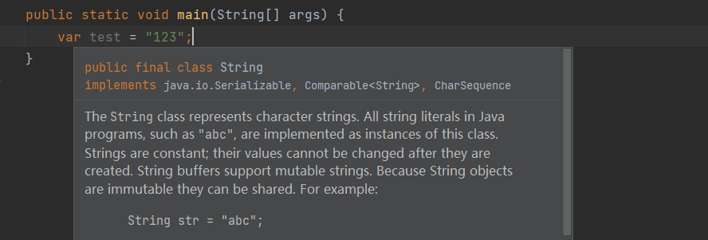

# 局部变量类型推断

```java
var test = "123";
String test = "123";
```

**两个语句是等价的**




用于简化编程，例如插件自动生成代码，无需判断类型更省事

> 只能作为**局部变量**,不能作用与类属性以及全局变量

## 用作lambda表达式

为lambda表达式的参数加上注解做限制,比如这里的`@NotNull`是限制参数不能为空的

```java
        Consumer<String> consumer = (@NotNull var s) -> {
            System.out.println(s);
        };
```

那么在调用`consumer.accept(null)`的时候就应该报错

# 集合API

```java
    List.of(...)
    Map.of(...)
    Set.of(...)
```

快速创建**不可修改**的集合,进行添加等操作会抛出`java.lang.UnsupportedOperationException`异常

-

# 字符串方法

- `isBlank()` 判断字符串是否全为空白
- `strip`()  去掉字符串首尾两边的空白字符，比`trim()`更加稳妥，汉字空格等也能去掉
- `stripTrailing()` 去除尾部空白
- `stripLeading()` 去除首部空白
- `repeat()`复制字符串
- `lines().count()`转为流后统计行数


# HttpClient

**同步发送请求**

```java
        var request = HttpRequest.newBuilder()
                .uri(URI.create("https://baidu.com"))
                .GET()
                .build();
        var client = HttpClient.newHttpClient();
        try {
            final HttpResponse<String> response = client.send(request, HttpResponse.BodyHandlers.ofString());
            System.out.println(response.body());
        } catch (Exception e) {
            throw new RuntimeException(e);
        }
```

**异步请求**

```java
        var request = HttpRequest.newBuilder()
                .uri(URI.create("https://baidu.com"))
                .GET()
                .build();
        var client = HttpClient.newHttpClient();
        try {
            client.sendAsync(request, HttpResponse.BodyHandlers.ofString())
                    .thenApply(HttpResponse::body)
                    .thenAccept(System.out::println)
        } catch (Exception e) {
            throw new RuntimeException(e);
        }
```

# File

```java
//        Path path = Files.writeString(Files.createTempFile("test", ".txt"), "https://www.wdbyte.com");
        final Path path = Files.createFile(Paths.get("F:\\Data\\Program\\studyRecord\\Java\\Grammar\\jdk11\\JDK11\\t.txt"));
        Files.writeString(path, "test");
        System.out.println(path);
        String s = Files.readString(path);
        System.out.println(s);
```

