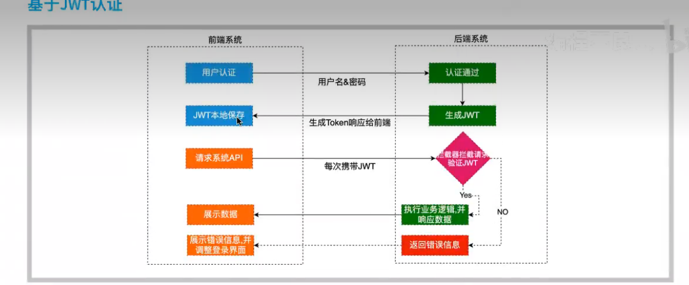

# 认证流程



- 首先，前端通过Web表单将自己的用户名和密码发送到后端的接口。这一过程一般是一个HTTP POST请求。**建议的方式是通过SSL加密的2传输 (https协议)** ，从而避免敏感信息被嗅探。
- 后端核对用户名和密码成功后，**将用户的id等其他信息作为JWT Payload(负载)，将其与头部分别进行ase64编码拼接后签名，形成一个JWT(Token)**。形成的JWT就是一个形同111.zzz.xxx的字符串。

- 后端将JWT字符串作为登录成功的返回结果返回给前端。前端可以将返回的结果保存在`localStorage`或`sessionStorage`上，**退出登录时前端删除保存的JWT即可**
- 前端在每次请求时将JWT放入`HTTP Header`中的`Authorization`位。**(解决XSS和XSRF问题) HEADER**
- 后端检查是否存在，如存在验证JWT的有效性。例如，**检查签名是否正确;检查Token是否过期;检查Token的接收方是否是自己(可选)。**
- 验证通过后后端**使用JWT中包含的用户信息进行其他逻辑操作**，返回相应结果。

# 优势

- **简洁(Compact)**: 可以通过URL，POST参数或者在HTTP header发送，因为数据量小，传输速度也很快
- **自包含(Self-contained)**: 负载中包含了所有用户所需要的信息，**避免了多次查询数据库**
- 因为Token是以JSON加密的形式保存在客户端的，所以JWT是**跨语言**的，原则上任何web形式都支持
- **不需要在服务端保存会话信息，特别适用于分布式微服务。**

# 结构

`Header.Payload.Signature` 

- **标头(Header)**

  由令牌类型和所使用的签名算法组成，例如HMACSHA256或RSA等等，它会使用Base64编码组成标头

  ```json
  {
      "alg": "HS256",
      "typ": "JWT"
  }
  ```

  

- **有效载荷(Payload)**

  有效载荷中包含用户数据等等，是我们所需要的数据，也会使用base64编码

  ```json
  {
      "username": "ZJamss",
      "number": "219367"
  }
  ```

  

- **签名(Signature)**

通过编码后的标头和有效载荷，再加上我们提供的key,通过标头中声明的算法进行签名，作用是为了保证JWT的有效性

> HMACSHA256(base64Ur1Encode(header) +"."+base64UrlEncode(payload), secret);

对标头和负载内容签名，可以通过解密对比防止内容被篡改

# 依赖

```xml
 		<dependency>
            <groupId>com.auth0</groupId>
            <artifactId>java-jwt</artifactId>
            <version>4.0.0</version>
        </dependency>
```

# 基本使用

```java
//生成token
final Calendar instance = Calendar.getInstance();
instance.add(Calendar.SECOND,20);
String token = JWT.create()
        .withClaim("userId","127833")  //负载内容
        .withClaim("username","ZJamss")
        .withExpiresAt(instance.getTime())  //过期时间
        .sign(Algorithm.HMAC256("secret"));  //签名算法和密匙

System.out.println(token);

//验证token
final JWTVerifier jwtVerifier = JWT.require(Algorithm.HMAC256("secret")).build();
final DecodedJWT verify = jwtVerifier.verify(token); //验证token
final String payload = verify.getPayload();
System.out.println(payload);
final byte[] bytes = new BASE64Decoder().decodeBuffer(payload);
System.out.println(new String(bytes));
```


**常见错误**

`JWTVerificationException` 父类

- `SignatureVerificationException` 签名不一致
- `TokenExpiredException` 令牌过期
- `AlgorithmMismatchException`  签名算法不匹配
- `InvalidClaimException` 非法的payload

 

# 工具类

```java

public class JWTUtils {
    private static final String SECRET = "token!Q@W#E$R";
    
    private static final int EXPIRE_TIME = 90;

    /**
     * 生产token
     */
    public static String getToken(Map<String, String> map) {
        JWTCreator.Builder builder = JWT.create();

        //payload
        map.forEach(builder::withClaim);

        Calendar instance = Calendar.getInstance();
        instance.add(Calendar.MINUTE, EXPIRE_TIME); 

        builder.withExpiresAt(instance.getTime());//指定令牌的过期时间
        return builder.sign(Algorithm.HMAC256(SECRET));
    }

    /**
     * 验证token
     */
    public static DecodedJWT verify(String token) {
        //如果有任何验证异常，此处都会抛出异常
        return JWT.require(Algorithm.HMAC256(SECRET)).build().verify(token);
    }

}
```

