# 主要功能

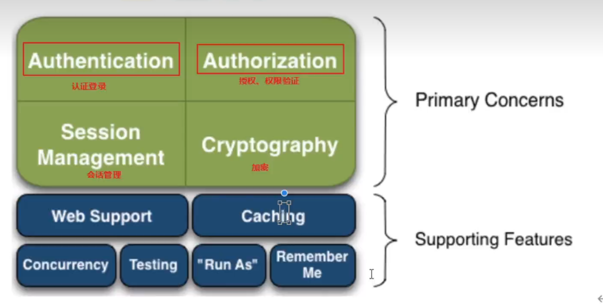

# 执行原理

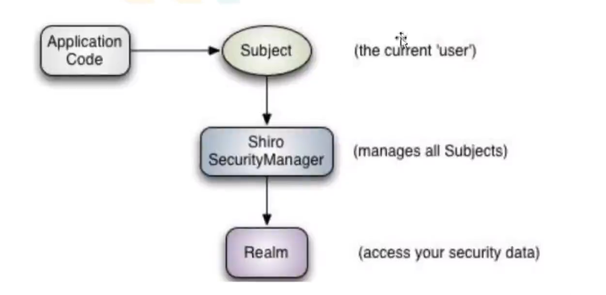

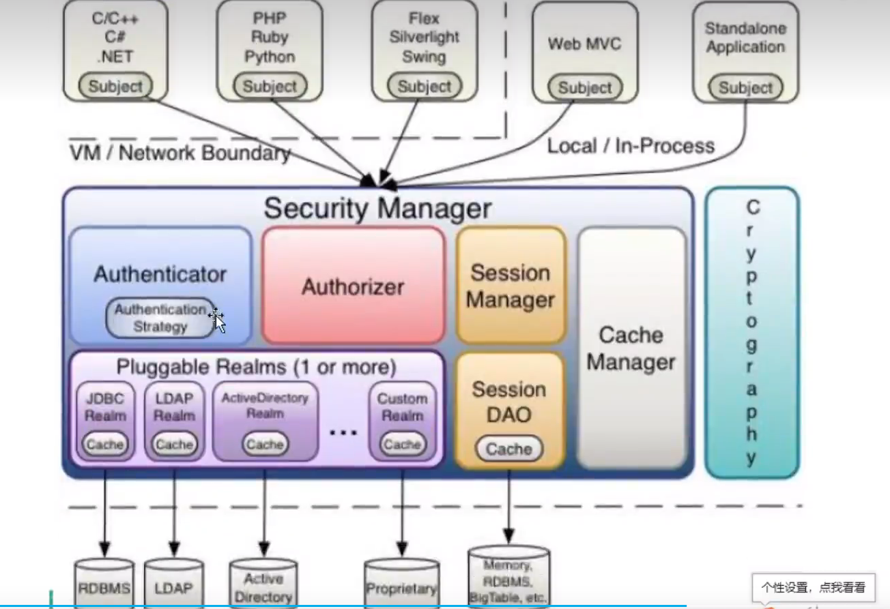

- `subject` 身份校验的对象
- `SecurityManager` 认证管理
- `Realm` 认证安全信息（数据源）


# 依赖

**核心**

```xml
<dependency>
    <groupId>org.apache.shiro</groupId>
    <artifactId>shiro-core</artifactId>
    <version>1.9.0</version>
</dependency>
<dependency>
            <groupId>commons-logging</groupId>
            <artifactId>commons-logging</artifactId>
            <version>1.2</version>
</dependency>
```

**整合包，web,spring等等**

```xml
<dependency>
    <groupId>org.apache.shiro</groupId>
    <artifactId>shiro-all</artifactId>
    <version>1.9.0</version>
</dependency>

```

**spring-boot-starter** ,有了这个就不需要再引入`starter-web`了，已经包含了

```xml
 <dependency>
            <groupId>org.apache.shiro</groupId>
            <artifactId>shiro-spring-boot-web-starter</artifactId>
            <version>1.9.0</version>
        </dependency>
```


# 配置文件shiro.ini

`resource/shiro.ini`

```ini
[users]
zjamss=1232,role1,role2
lisi=122
[roles]
role1=user:insert,user:select
```

配置用户信息

`principal`=`credential, ...roles`

`role`=`...detail`  detail: xxx:xxx（权限）

# 登录认证

用户需要提供`principals`和`credentials`（**身份和凭证**）比如账号和密码

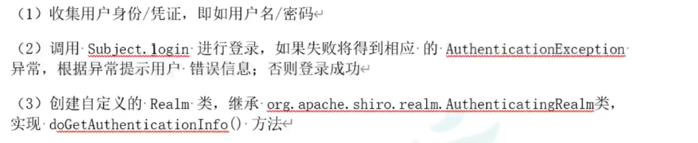

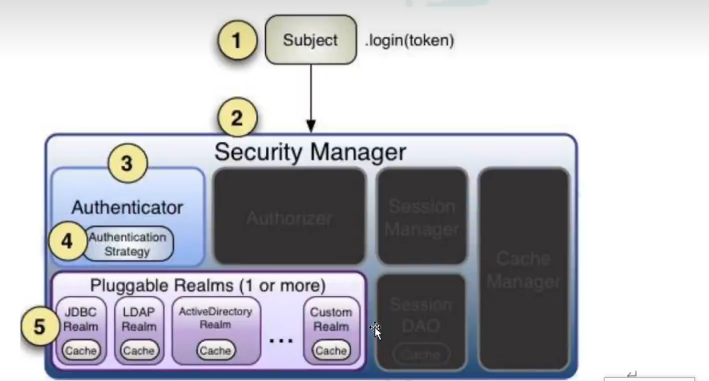

```java
 //初始化SecurityManagement
        IniSecurityManagerFactory factory = new IniSecurityManagerFactory("classpath:shiro.ini");
        final SecurityManager securityManager = factory.getInstance();
        SecurityUtils.setSecurityManager(securityManager);
        //获取Subject对象
        final Subject subject = SecurityUtils.getSubject();
        //创建token对象
        AuthenticationToken token = new UsernamePasswordToken("zjamss","123");
        //完成登录
        try {
            subject.login(token);
            System.out.println("登陆成功");
        }catch (UnknownAccountException e){
            e.printStackTrace();
            System.out.println("用户不存在");
        }catch (IncorrectCredentialsException e){
            e.printStackTrace();
            System.out.println("密码错误");
        }catch (AuthenticationException e){
            e.printStackTrace();
        }
    }
```

# 角色授权

- **授权**

**访问控制**，控制谁能访问哪些资源

- **主体（Subject）**

访问应用的用户，用户只有授权之后才能访问相应资源

- **资源（Resource）**

应用中用户可以访问的URL

- **权限（Permission）**

安全策略中的原子授权单位，表示在应用中，用户能不能访问某个资源

- **角色（Role)**

## 授权方向

- 编程式

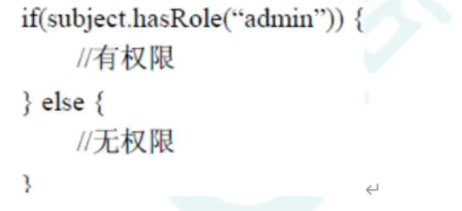

- 注解式

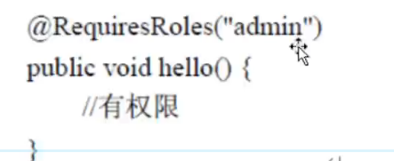

## 授权流程

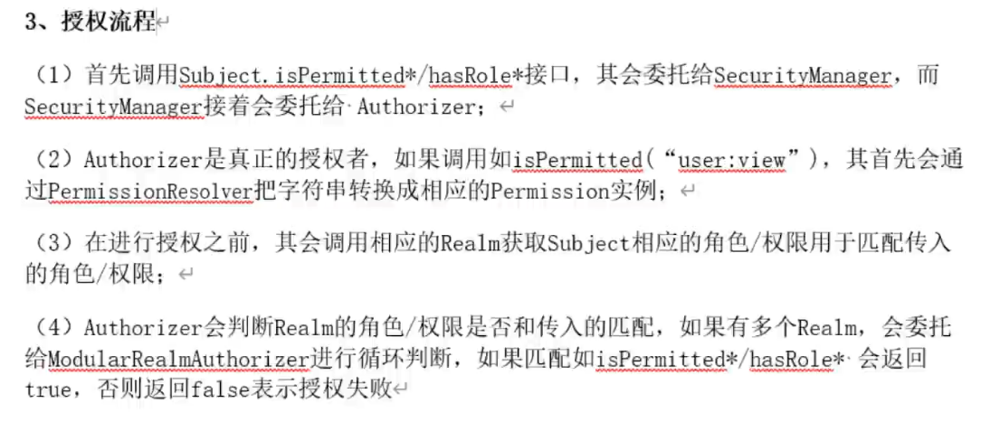

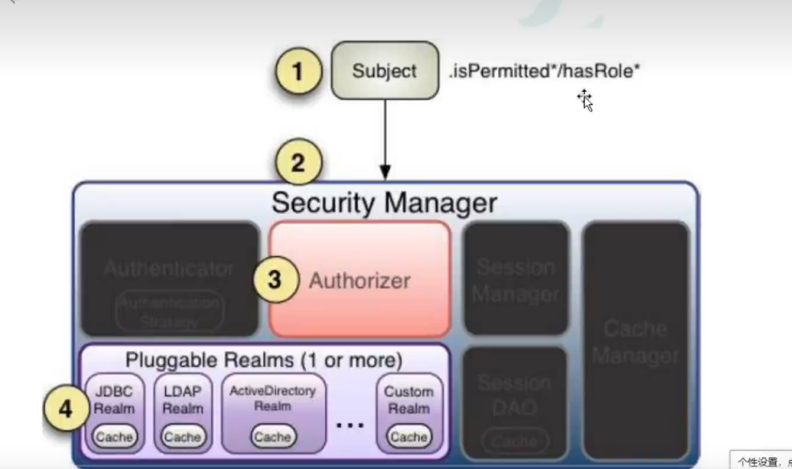

```java
 //完成登录
        try {
            subject.login(token);
            System.out.println("登陆成功");
            //判断角色
            boolean hasRole = subject.hasRole("role1");
            System.out.println("role1: "+hasRole);
            //判断权限
            boolean permitted = subject.isPermitted("user:insert");
            System.out.println("user:insert: "+permitted);
```

# 加密

- MD5

```java
        Md5Hash md5Hash = new Md5Hash(password);
        String cipher = md5Hash.toHex();
        //带盐
        Md5Hash md5Hash = new Md5Hash(password,salt);
        String cipher = md5Hash.toHex();
        //迭代加密
        Md5Hash md5Hash = new Md5Hash(password,salt,3);
        String cipher = md5Hash.toHex();
```

# 自定义登录认证

新建`MyRealm`类并继承`AuthenticatingRealm`,重写`doGetAuthenticationInfo()`

> shiro的login方法最终会调用此方法

**这里只是获取信息返回，对比操作依旧在shiro底层进行**

配置`shiro.ini`

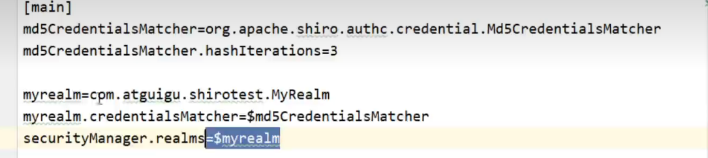

```ini
[main]
myrealm=com.shiro.MyRealm
securityManager.realms=$myrealm

[users]
zjamss=123,role1,role2
lisi=122
[roles]
role1=user:insert,user:select
```

```java
package com.shiro;

import org.apache.shiro.authc.AuthenticationException;
import org.apache.shiro.authc.AuthenticationInfo;
import org.apache.shiro.authc.AuthenticationToken;
import org.apache.shiro.authc.SimpleAuthenticationInfo;
import org.apache.shiro.realm.AuthenticatingRealm;

/**
 * @Program: shiro
 * @Description:
 * @Author: ZJamss
 * @Create: 2022-11-12 12:41
 **/
public class MyRealm extends AuthenticatingRealm {

    //自定义登录验证方法
    //配置自定义realm生效，可以在ini,也可以是springboot配置文件
    //这里只是获取信息返回，对比操作依旧在shiro底层进行
    @Override
    protected AuthenticationInfo doGetAuthenticationInfo(AuthenticationToken authenticationToken) throws AuthenticationException {
        final String principal = authenticationToken.getPrincipal().toString(); //账号
//        final String credentials = authenticationToken.getCredentials().toString(); //密码

        //获取数据库信息
        if(principal.equals("zjamss")){
            String credentials = "123"; //数据库存储的密码，可以是md5等等
            AuthenticationInfo info = new SimpleAuthenticationInfo(
                    principal,
                    credentials,
                    principal
            );
            return info;
        }
        return null;
    }
}

```

# 和SpringBoot整合

**依赖**

```xml
<?xml version="1.0" encoding="UTF-8"?>
<project xmlns="http://maven.apache.org/POM/4.0.0" xmlns:xsi="http://www.w3.org/2001/XMLSchema-instance"
         xsi:schemaLocation="http://maven.apache.org/POM/4.0.0 https://maven.apache.org/xsd/maven-4.0.0.xsd">
    <modelVersion>4.0.0</modelVersion>
    <parent>
        <groupId>org.springframework.boot</groupId>
        <artifactId>spring-boot-starter-parent</artifactId>
        <version>2.7.5</version>
        <relativePath/> <!-- lookup parent from repository -->
    </parent>
    <groupId>com.example</groupId>
    <artifactId>demo</artifactId>
    <version>0.0.1-SNAPSHOT</version>
    <name>demo</name>
    <description>demo</description>
    <properties>
        <java.version>1.8</java.version>
    </properties>
    <dependencies>
        <dependency>
            <groupId>org.springframework.boot</groupId>
            <artifactId>spring-boot-starter-thymeleaf</artifactId>
        </dependency>
        <dependency>
            <groupId>org.apache.shiro</groupId>
            <artifactId>shiro-spring-boot-web-starter</artifactId>
            <version>1.9.0</version>
        </dependency>

        <dependency>
            <groupId>com.baomidou</groupId>
            <artifactId>mybatis-plus-boot-starter</artifactId>
            <version>3.0.5</version>
        </dependency>

        <dependency>
            <groupId>mysql</groupId>
            <artifactId>mysql-connector-java</artifactId>
            <scope>runtime</scope>
            <version>5.1.46</version>
        </dependency>
        <dependency>
            <groupId>org.projectlombok</groupId>
            <artifactId>lombok</artifactId>
            <optional>true</optional>
        </dependency>
    </dependencies>

    <build>
        <plugins>
            <plugin>
                <groupId>org.springframework.boot</groupId>
                <artifactId>spring-boot-maven-plugin</artifactId>
                <configuration>
                    <excludes>
                        <exclude>
                            <groupId>org.projectlombok</groupId>
                            <artifactId>lombok</artifactId>
                        </exclude>
                    </excludes>
                </configuration>
            </plugin>
        </plugins>
    </build>

</project>

```

`application.yml`

```yml
spring:
  datasource:
    url: jdbc:mysql://localhost:3306/test?useUnicode=true&useSSL=false&characterEncoding=utf8
    username: root
    password: 123456
    driver-class-name: com.mysql.jdbc.Driver
    type: com.zaxxer.hikari.HikariDataSource
  jackson:
    date-format: yyyy-MM-dd HH:mm:ss
    time-zone: GMT+8

mybatis-plus:
  configuration:
    log-impl: org.apache.ibatis.logging.stdout.StdOutImpl
  mapper-locations: classpath:mapper/*.xml

shiro:
  loginUrl: /login

```

**自定义Realm**

```java
@Component
public class MyRealm extends AuthorizingRealm {

    @Autowired
    UserService userService;

    //自定义授权方法
    @Override
    protected AuthorizationInfo doGetAuthorizationInfo(PrincipalCollection principalCollection) {
        return null;
    }

    //自定义登录认证方法
    @Override
    protected AuthenticationInfo doGetAuthenticationInfo(AuthenticationToken authenticationToken) throws AuthenticationException {
        final String principal = authenticationToken.getPrincipal().toString();
        final User user = userService.getUserByName(principal);
        if(user != null) {
            return new SimpleAuthenticationInfo(
                    authenticationToken.getPrincipal(),
                    user.getPwd(),
                    ByteSource.Util.bytes("sail"),
                    authenticationToken.getPrincipal().toString()
            );
        }
        return null;
    }
}
```

**配置**

```java
@Configuration
public class ShiroConfig {
    @Autowired
    private MyRealm myRealm;

    @Bean
    public DefaultWebSecurityManager defaultWebSecurityManager() {
        DefaultWebSecurityManager defaultWebSecurityManager = new DefaultWebSecurityManager();
        //设置加密对象
        HashedCredentialsMatcher matcher = new HashedCredentialsMatcher();
        matcher.setHashAlgorithmName("md5");
        myRealm.setCredentialsMatcher(matcher);
        defaultWebSecurityManager.setRealm(myRealm);
        return defaultWebSecurityManager;
    }

    @Bean
    public DefaultShiroFilterChainDefinition shiroFilterChainDefinition() {
        DefaultShiroFilterChainDefinition definition = new DefaultShiroFilterChainDefinition();
        //设置不认证可以访问的资源
        definition.addPathDefinition("/user/login","anon");
        definition.addPathDefinition("/login","anon");
        //设置需要登录认证的
        definition.addPathDefinition("/**","authc");
        return definition;
    }
}
```

- `anon` 不需要认证
- `authc` 需要认证访问

**登录**

```java
  @GetMapping("/userlogin")
    public String userLogin(String name, String pwd, HttpSession session){
        //获取subject
        Subject subject = SecurityUtils.getSubject();
        //封装数据到token
        AuthenticationToken token = new UsernamePasswordToken(name,pwd);
        //登录
        try {
            subject.login(token);
            session.setAttribute("user",token.getPrincipal().toString());
            return "main";
        }catch (Exception e){
            e.printStackTrace();
            return "failed";
        }
    }
```


## 多Realm认证

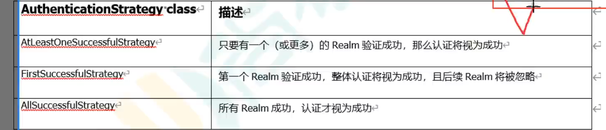

```java
        DefaultWebSecurityManager defaultWebSecurityManager = new DefaultWebSecurityManager();
        //创建认证对象并设置认证策略
        ModularRealmAuthenticator modularRealmAuthenticator = new ModularRealmAuthenticator();
        modularRealmAuthenticator.setAuthenticationStrategy(new AllSuccessfulStrategy());
        defaultWebSecurityManager.setAuthenticator(modularRealmAuthenticator);
		//设置Realms
      	List<Realm> list = Arrays.asList(myRealm,myRealm2);
        defaultWebSecurityManager.setRealms(list);
```

默认是`AtLeastOneSuccessfulStrategy`,至少一次认证成功

## Remember me

`ShiroConfig`  `defaultWebSecurityManager()`中设置

```java
defaultWebSecurityManager.setRememberMeManager(rememberMeManager());
```

`ShiroConfig`中设置

```java
 public SimpleCookie rememberMeCookie() {
        SimpleCookie cookie = new SimpleCookie("rememberMe");
        cookie.setPath("/");
        cookie.setHttpOnly(true);
        cookie.setMaxAge(30 * 24 * 60 * 60);
        return cookie;
    }

    public CookieRememberMeManager rememberMeManager(){
        CookieRememberMeManager cookieRememberMeManager = new CookieRememberMeManager();
        cookieRememberMeManager.setCookie(rememberMeCookie());
        cookieRememberMeManager.setCipherKey("zjamss".getBytes());
        return cookieRememberMeManager;
    }
```

登录时设置`rememberMe`为`true`

```java
        //获取subject
        Subject subject = SecurityUtils.getSubject();
        //封装数据到token
        AuthenticationToken token = new UsernamePasswordToken(name,pwd,true);
```


## 登出

添加过滤器

```java
        //登出过滤器
        definition.addPathDefinition("/logout", "logout");
```

**必须靠前，不然失效**

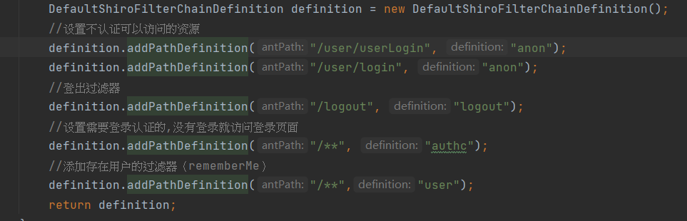

## 授权角色认证

判断角色权限通过Realm的`doGetAuthorizationInfo`判断，接口服务中使用注解`@Requiresxxx`触发

- **@RequiresAuthentication**

  验证用户是否登录

- **@RequiresUser**

  验证用户是否被记录(RememberMe)

- **@RequiresGuest**

  验证是否是游客请求

- **@RequiresRoles**

  验证是否有对应角色，没有会抛出异常`AuthorizationException`

  eg: `@RequiresRoles("roleName")`

- **@RequiresPermissions**

  判断是否具有权限，没有会抛出异常`AuthorizationException`

  eg: `@RequiresPermissions("file:read","guest:xxx")`


**Realm中重写**`doGetAuthorizationInfo`

```java
        String principal = principalCollection.getPrimaryPrincipal().toString();
        //创建对象,封装当前用户的角色权限信息
        SimpleAuthorizationInfo authorizationInfo = new SimpleAuthorizationInfo();
        //存储角色
        final List<String> userRoles = userService.getUserRoles(principal);
        authorizationInfo.addRoles(userRoles);
        return authorizationInfo;
```

```java
    @Select("select name from role where id in (select rid from user where name = #{principal} )")
    List<String> getUserRoles(@Param("principal") String principal);
```

# 坑

## 加了@RequireRoles等注解，一直重定向或者接口404

如果是使用了多Realm模式，配置加入这个bean

```java
    @Bean
    public static DefaultAdvisorAutoProxyCreator getDefaultAdvisorAutoProxyCreator(){

        DefaultAdvisorAutoProxyCreator defaultAdvisorAutoProxyCreator=new DefaultAdvisorAutoProxyCreator();
        defaultAdvisorAutoProxyCreator.setUsePrefix(true);

        return defaultAdvisorAutoProxyCreator;
    }
```

**若只有一个Realm,则不需要加**

# 自定义过滤器流程

`PassThruAuthenticationFilter` 所有请求都转发给`/login`

```java
public class JwtFilter extends PassThruAuthenticationFilter {

    @Override
    protected boolean isAccessAllowed(ServletRequest request, ServletResponse response, Object mappedValue) {
        Subject subject = getSubject(request, response);
        return subject.isAuthenticated() && subject.getPrincipal() != null;
    }

    @Override
    protected boolean onAccessDenied(ServletRequest request, ServletResponse response) throws Exception {
        if (isLoginRequest(request, response)) {
            return true;
        } else {
            saveRequestAndRedirectToLogin(request, response);
            return false;
        }
    }
}

```


请求流程，被拦截的页面(`/**`)

- 进入`isAccessAllowed()`，判断`Subject`是否为空且是否完成认证，返回`True/False`
- 若返回`False`，则进入`OnAccessDenied()`, 判断是否是登陆请求，不是则转发到登陆请求，登陆设置对应`token`然后执行`login`方法,进入`Realm`认证
- 若为`True`，则转发到对应请求
- 若请求需要角色，则去`Realm`查询角色
