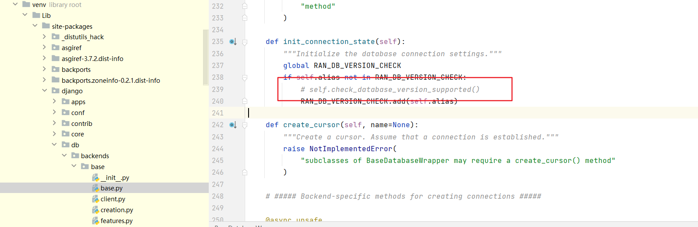

## 创建项目

```bash
django-admin startproject projectName
cd projectName
```

创建之后的目录结构

```bash
locallibrary/
    manage.py
    locallibrary/
        __init__.py
        settings.py
        urls.py
        wsgi.py
        asgi.py
```

`locallibrary`*项目*子文件夹是网站的入口点：

- **__init__.py**是一个空文件，指示 Python 将此目录视为 Python 包。
- **settings.py** 所有的配置，比如数据，网站静态资源，所创建的应用程序配置等
- **urls.py**定义站点 URL 到视图的映射，Controller
- **wsgi.py**
- **asgi.py**

**Manage.py** 脚本用于创建应用程序、使用数据库以及启动开发 Web 服务器。

### 创建应用程序

```bash
py manage.py startapp appName
```

创建了一个应用程序,目录结构如下

```bash
locallibrary/
    manage.py
    locallibrary/
    catalog/
        admin.py
        apps.py
        models.py
        tests.py
        views.py
        __init__.py
        migrations/
```

`migrations`自动迁移，允许在修改模型的同时自动更新数据库

### 注册应用程序

打开项目的`settings.py`d的`INSTALLED_APPS`选项,新增内容

```python
INSTALLED_APPS = [
    'django.contrib.admin',
    'django.contrib.auth',
    'django.contrib.contenttypes',
    'django.contrib.sessions',
    'django.contrib.messages',
    'django.contrib.staticfiles',
    >>'catalog.apps.CatalogConfig'<<
]
```

作用是在创建应用程序时在`/catalog/apps.py`中生成应用程序配置对象

### 配置数据库

在`settings.py`中修改`DATABASES`配置，以下是`MYSQL`

> 需要下载好`mysqlclient`依赖
>
> 若使用的数据库为5.7及以下，需要注释一行代码避免检查报错
>
> 

```python
DATABASES = {
    'default': {
        'ENGINE': 'django.db.backends.mysql',
        'HOST':'127.0.0.1',
        'PORT':'3306',
        'USER':'root',
        'PASSWORD':'123456',
        'NAME': 'library ', #数据库名 要连接的数据库，连接前需要创建好
        'OPTIONS': {
           'init_command': "SET sql_mode='STRICT_TRANS_TABLES'",
        },
    }
} 
```


### 设置时区

```python
TIME_ZONE = 'Asia/Shanghai'
```

### 数据迁移

```bash
py manage.py makemigrations (app_name)
```

将models转为迁移文件

```bash
py manage.py migrate (app_name)
```

将迁移文件更新到数据库

