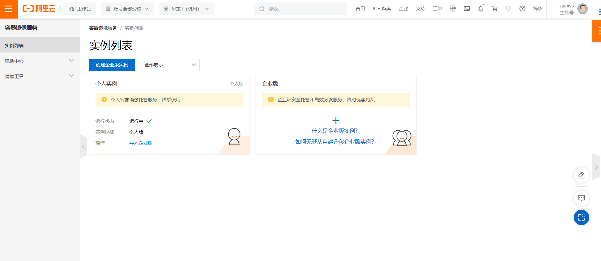
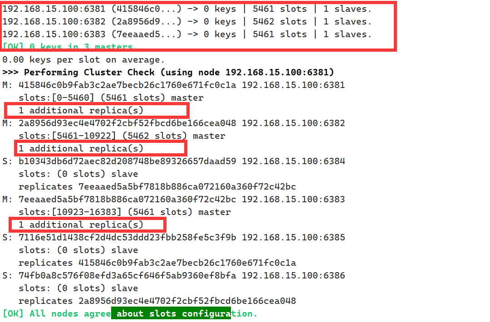

# 

# 镜像, 容器, 仓库

镜像（Image）是一个**只读**的模板，可以用来**创建多个容器**


仓库即为**存放镜像模板**的地方 ([httpdocker build -t zjamss/sepems-backend:1.2 .s://hub.docker.com](https://hub.docker.com))

# 运行流程


# 安装Docker

卸载旧版本

```bash
 sudo yum remove docker \
                  docker-client \
                  docker-client-latest \
                  docker-common \
                  docker-latest \
                  docker-latest-logrotate \
                  docker-logrotate \
                  docker-engine
```

GCC环境

```bash
yum -y install gcc` `yum -y install gcc-c++
```


安装软件包并设置阿里云stable镜像仓库

```bash
 sudo yum install -y yum-utils

 sudo yum-config-manager \
    --add-repo \
    http://mirrors.aliyun.com/docker-ce/linux/centos/docker-ce.repo

```

安装最新版的的docker引擎

```bash
sudo yum -y install docker-ce docker-ce-cli containerd.io docker-compose-plugin
```


阿里云镜像加速

```bash
sudo mkdir -p /etc/docker
sudo tee /etc/docker/daemon.json <<-'EOF'
{
  "registry-mirrors": ["https://bo933c74.mirror.aliyuncs.com"]
}
EOF
sudo systemctl daemon-reload
sudo systemctl restart docker
```

# run之后的执行原理


# 常用命令

## 帮助启动命令

### 启动

`systemctl start/stop... docker`

### 帮助

`docker --help` `docker 命令 --help`


## 镜像命令

`docker images` 列出所有镜像 `-a` 列出所有 `-q` 只列出id

`docker search xxx` 在仓库搜索镜像 `--limit num` 限制数量


`docker pull xxx[:TAG]` 拉取镜像[指定版本],否则默认`xxx:latest` 最新d版本

`docker system df` 查看镜像容器所占空间

`docker rmi id/name` 删除某个镜像

`docker rmi id/name,id/name` 删除多个镜像

`docker rmi $(docker images -qa)` 删除全部镜像

> 虚悬镜像，仓库名和标签名都为<none>的镜像


## 容器命令

`docker run [OPTIONS] IMAGE [COMMAND] [ARG...]` 启动容器

OPTIONS:

- `--name` 为容器指定新名称
- `-d` 后台运行容器并返回容器ID，启动守护式容器
- `-i` 以交互模式运行
- `-t` 为容器分配一个伪输入终端,`-it`
- `-P` 随机端口映射
- `-p` 指定端口映射 主机:容器

> `ctrl+p+q` 退出容器，容器不会停止,`exit`会停止容器

`docker start/stop...` 启动已经停止的容器/停止...

`docker ps [OPTIONS]`  查看正在运行等等的容器


`docker rm xxx` 删除容器

`docker exec [OPTIONS] CONTAINER COMMAND [ARG...]` 进入容器

> 通过 exec进入容器后使用exit退出，不会导致容器停止


` docker cp [OPTIONS] CONTAINER:SRC_PATH DEST_PATH` 将容器内的文件复制到主机


`docker export 容器ID > 文件名.tar` 导出容器内的内容作为一个tar归档文件

`cat 文件名.tar | docker import -镜像用户/镜像名:版本号` 导入容器

# 容器分层


只有容器层是可写的，所有操作都发生在容器层

# 创建镜像

`docker commit [OPTIONS] 容器ID 镜像名/镜像版本`  提交容器副本使之成为新的镜像

> docker commit -m"add vim cmd" -a="zjamss" 1b56474ef69f zjamss/ubuntu:1.0

`-m=` 描述信息 `-a=` 作者 


# 上传到阿里云个人镜像仓库




1. 登录阿里云Docker Registry
   `$ docker login --username=zjamss registry.cn-hangzhou.aliyuncs.com`
   用于登录的用户名为阿里云账号全名，密码为开通服务时设置的密码。

2. 从Registry中拉取镜像
   `$ docker pull registry.cn-hangzhou.aliyuncs.com/mian_01/main:[镜像版本号]`

3. 将镜像推送到Registry

   ```bash
   $ docker login --username=zjamss registry.cn-hangzhou.aliyuncs.com
   $ docker tag [ImageId] registry.cn-hangzhou.aliyuncs.com/mian_01/main:[镜像版本号]
   $ docker push registry.cn-hangzhou.aliyuncs.com/mian_01/main:[镜像版本号]
   请根据实际镜像信息替换示例中的[ImageId]和[镜像版本号]参数。
   ```

# 本地私有库

启动本地私有库

`docker run -d -p 5000:5000 -v /home/myregistry:/tmp/registry --privileged=true registry`

查询本地私有库

`curl -XGET http://192.168.15.100:5000/v2/_catalog`

格式化镜像

`docker tag 镜像:Tag Host:Port/Repository:Tag`

> `docker tag zjamss/ubuntu02:1.1 192.168.15.100:5000/zjamss/ubuntu02:1.1`

添加HTTP支持

`vim /etc/docker/deamon.json` (配置之间用逗号隔开)

```json
  "insecure-registries": ["192.168.15.100:5000"]
```

推送镜像至私服库

`docker push 192.168.15.100:5000/zjamss/ubuntu02:1.1`


# 容器数据卷

`docker run -it --privileged=true -v /宿主机绝对路径目录:/容器内目录 镜像名`  (默认支持读写`镜像名:rw`)

> 限制容器只读文件不可写`docker run -it --privileged=true -v /宿主机绝对路径目录:/容器内目录 镜像名:ro`

- 数据卷可以在容器之间共享数据
- 卷中更改可以直接生效
- 数据卷中的更改不会包含在镜像的更新中
- 数据卷的生命周期一直持续到没有容器使用它为止

`docker inspect id/name` 检查容器

```json
 "Mounts": [
            {
                "Type": "bind",
                "Source": "/tmp/host_data",
                "Destination": "/tmp/docker_data",
                "Mode": "",
                "RW": true,
                "Propagation": "rprivate"
            }
        ],

```

继承卷规则

`docker run -it --privileged=true --volumes-form 父类(name/id) d/name`

## 挂载问题


# 安装

## 安装mysql

`docker pull mysql:5.7`

`docker run -d -p 3306:3306 --privileged=true -v /volume/mysql/log -v /volume/mysql/data:/var/lib/mysql -v /volume/mysql/conf:/etc/mysql/conf.d --name mysql -e MYSQL_ROOT_PASSWORD=123456 mysql:5.7`

进入`/volume/mysql/conf`

`vim my.cnf` 修改字符编码

```toml
[client]
default_character_set=utf8
[mysqld]
collation_server=utf8_general_ci
character_set_server=utf8
```

`docker restart mysql`

### 输入中文报错


字符编码为拉丁，需要修改为utf8

### 数据挂载避免意外

`docker run -d -p 3306:3306 --privileged=true -v /zjamss/mysql/log -v /zjamss/mysql/data:/var/lib/mysql -v /zjamss/mysql/conf:/etc/mysql/conf.d --name mysql mysql:5.7`

## 安装redis

`docker pull redis:6.0.8`

在`volume/redis/redis.conf`创建配置文件

`docker run -p 6379:6379 --name redis --privileged=true -v /volume/redis/redis.conf:/etc/redis/redis.conf -v/volume/redis/data:/data -d redis:6.0.8 redis-server /etc/redis/redis.conf`  


## 安装nginx

`docker pull nginx`

在`/volume/nginx/conf/nginx.conf`设置

```conf

user  nginx;
worker_processes  auto;

error_log  /var/log/nginx/error.log notice;
pid        /var/run/nginx.pid;


events {
    worker_connections  1024;
}


http {
    include       /etc/nginx/mime.types;
    default_type  application/octet-stream;

    log_format  main  '$remote_addr - $remote_user [$time_local] "$request" '
                      '$status $body_bytes_sent "$http_referer" '
                      '"$http_user_agent" "$http_x_forwarded_for"';

    access_log  /var/log/nginx/access.log  main;

    sendfile        on;
    #tcp_nopush     on;

    keepalive_timeout  65;

    #gzip  on;

    include /etc/nginx/conf.d/*.conf;
}
```


```bash
docker run -d --name nginx --privileged=true --net host -v /volume/nginx/logs:/var/log/nginx -v /volume/nginx/conf/nginx.conf:/etc/nginx/nginx.conf:ro -v /volume/nginx/html:/usr/share/nginx/html -v /volume/nginx/conf/defaault.d:/etc/nginx/conf.d/default.d nginx
```


## 安装mysql主从复制

### 主表

启动主库容器3307

`docker run -p 3307:3306 --name mysql-master -v /zjamss/mysql-master/log:/var/log/mysql -v/zjamss/mysql-master/data:/var/lib/mysql -v/zjamss/mysql-master/conf:/etc/mysql -e MYSQL_ROOT_PASSWORD=root -d mysql:\5.7`

配置主库

`vim /zjamss/mysql-master/conf my.cnf`

```toml
[mysqld]
## 设置server_id，同一局域网中需要唯一
server_id=101 
## 指定不需要同步的数据库名称
binlog-ignore-db=mysql  
## 开启二进制日志功能
log-bin=mall-mysql-bin  
## 设置二进制日志使用内存大小（事务）
binlog_cache_size=1M  
## 设置使用的二进制日志格式（mixed,statement,row）
binlog_format=mixed  
## 二进制日志过期清理时间。默认值为0，表示不自动清理。
expire_logs_days=7  
## 跳过主从复制中遇到的所有错误或指定类型的错误，避免slave端复制中断。
## 如：1062错误是指一些主键重复，1032错误是因为主从数据库数据不一致
slave_skip_errors=1062

```

`docker restart mysql-master` 重启容器

创建数据同步用户

`CREATE USER 'slave'@'%' IDENTIFIED BY '123456';`

授权

`GRANT REPLICATION SLAVE, REPLICATION CLIENT ON *.* TO 'slave'@'%';`


### 从表

启动从库3308

`docker run -p 3308:3306 --name mysql-slave -v /zjamss/mysql-slave/log:/var/log/mysql -v /zjamss/mysql-slave/data:/var/lib/mysql -v /zjamss/mysql-slave/conf:/etc/mysql -e MYSQL_ROOT_PASSWORD=root -d mysql:5.7`

配置`/zjamss/mysql-slave/conf/my.cnf`

```toml
[mysqld]
## 设置server_id，同一局域网中需要唯一
server_id=102
## 指定不需要同步的数据库名称
binlog-ignore-db=mysql  
## 开启二进制日志功能，以备Slave作为其它数据库实例的Master时使用
log-bin=mall-mysql-slave1-bin  
## 设置二进制日志使用内存大小（事务）
binlog_cache_size=1M  
## 设置使用的二进制日志格式（mixed,statement,row）
binlog_format=mixed  
## 二进制日志过期清理时间。默认值为0，表示不自动清理。
expire_logs_days=7  
## 跳过主从复制中遇到的所有错误或指定类型的错误，避免slave端复制中断。
## 如：1062错误是指一些主键重复，1032错误是因为主从数据库数据不一致
slave_skip_errors=1062  
## relay_log配置中继日志
relay_log=mall-mysql-relay-bin  
## log_slave_updates表示slave将复制事件写进自己的二进制日志
log_slave_updates=1  
## slave设置为只读（具有super权限的用户除外）
read_only=1

```


`docker restart mysql-slave` 重启


### 配置

在**主库**中查看主从同步状态`show master status`


在**从库**中执行`change master to master_host='宿主机ip', master_user='slave', master_password='123456', master_port=3307, master_log_file='mall-mysql-bin.000001', master_log_pos=617, master_connect_retry=30;` 配置主从复制


`show slave status \G;` 显示从库主从同步状态


还没开启同步

在**从库**中开启主从同步 `start slave;`


## 分布式存储方案

### 哈希取余算法


| 2亿条记录就是2亿个k,v，我们单机不行必须要分布式多机，假设有3台机器构成一个集群，用户每次读写操作都是根据公式：  hash(key) % N个机器台数，计算出哈希值，用来决定数据映射到哪一个节点上。 |
| :----------------------------------------------------------: |
| 优点：   简单粗暴，直接有效，只需要预估好数据规划好节点，例如3台、8台、10台，就能保证一段时间的数据支撑。使用Hash算法让固定的一部分请求落到同一台服务器上，这样每台服务器固定处理一部分请求（并维护这些请求的信息），起到负载均衡+分而治之的作用。 |
| 缺点：    原来规划好的节点，进行扩容或者缩容就比较麻烦了额，不管扩缩，每次数据变动导致节点有变动，映射关系需要重新进行计算，在服务器个数固定不变时没有问题，如果需要弹性扩容或故障停机的情况下，原来的取模公式就会发生变化：Hash(key)/3会变成Hash(key) /?。此时地址经过取余运算的结果将发生很大变化，根据公式获取的服务器也会变得不可控。  某个redis机器宕机了，由于台数数量变化，会导致hash取余全部数据重新洗牌。 |

### 一致性哈希算法


### 哈希槽算法


## 主3从3redis集群

启动六台redis

```bash
docker run -d --name redis-node-1 --net host --privileged=true -v /data/redis/share/redis-node-1:/data redis:6.0.8 --cluster-enabled yes --appendonly yes --port 6381
 
docker run -d --name redis-node-2 --net host --privileged=true -v /data/redis/share/redis-node-2:/data redis:6.0.8 --cluster-enabled yes --appendonly yes --port 6382
 
docker run -d --name redis-node-3 --net host --privileged=true -v /data/redis/share/redis-node-3:/data redis:6.0.8 --cluster-enabled yes --appendonly yes --port 6383
 
docker run -d --name redis-node-4 --net host --privileged=true -v /data/redis/share/redis-node-4:/data redis:6.0.8 --cluster-enabled yes --appendonly yes --port 6384
 
docker run -d --name redis-node-5 --net host --privileged=true -v /data/redis/share/redis-node-5:/data redis:6.0.8 --cluster-enabled yes --appendonly yes --port 6385
 
docker run -d --name redis-node-6 --net host --privileged=true -v /data/redis/share/redis-node-6:/data redis:6.0.8 --cluster-enabled yes --appendonly yes --port 6386

```


`docker exec -it redis-node-1 bash` 进入容器

构建主从关系

`redis-cli --cluster create 192.168.15.100:6381 192.168.15.100:6382 192.168.15.100:6383 192.168.15.100:6384 192.168.15.100:6385 192.168.15.100:6386 --cluster-replicas 1`

> --cluster-replicas 1 表示集群关联是1:1,一主一丛


哈希槽划分，主从分布

输入`yes`

进入redis1

`redis-cli -p 6381`

查看集群信息

`cluster info`


查看所有节点

`cluster nodes` 


### 数据存储失败


所需要的哈希槽不在该服务器，应该连接集群存储而不是单个服务器

连接redis改为`redis-cli -p 6381 -c` 优化路由

重定向去对应哈希槽的服务器


### 检查集群信息

  `redis-cli --cluster check  192.168.15.100:6381`



### 主从容错切换迁移


**主机宕机后从机会自动变为主机，且主机恢复正常后会变为从机**


### 主从扩容


新增两个节点

```bash
docker run -d --name redis-node-7 --net host --privileged=true -v /data/redis/share/redis-node-7:/data redis:6.0.8 --cluster-enabled yes --appendonly yes --port 6387

docker run -d --name redis-node-8 --net host --privileged=true -v /data/redis/share/redis-node-8:/data redis:6.0.8 --cluster-enabled yes --appendonly yes --port 6388
```

进入redis-node-7,**添加节点到集群**

`redis-cli --cluster add-node 192.168.15.100:6387 192.168.15.100:6381`


重新分配槽号

`redis-cli --cluster reshard IP地址:端口号`

>  `redis-cli --cluster reshard 192.168.15.100:6381`

**分配出4096个槽位**（16384/4≈4096）给redis-node-7


检查一下已经分配成功 `redis-cli --cluster check 192.168.15.100:6381`


> 前三个主机每个匀出4096/3个槽给redis-note-7，并不是从0开始分配，不是连续的,这样所带的数据也跟着到了redis-node-7


设置7-8主从关系

`redis-cli --cluster add-node 192.168.15.100:6388 192.168.15.100:6387 --cluster-slave --cluster-master-id 537d5e09b555505ebf34d2f5bef141662ab19330`

### 主从缩容


删除节点6388

`redis-cli --cluster del-node 192.168.15.100:6388 5d149074b7e57b802287d1797a874ed7a1a284a8`


重新分配哈希槽

`redis-cli --cluster reshard 192.168.15.100:6381`

将6387的槽分配给6381


删除6387

`redis-cli --cluster del-node 192.168.15.100:6387 537d5e09b555505ebf34d2f5bef141662ab19330`

# DockerFile


## 关键字

`FROM` 说明基础镜像，指定一个已存在的模板，第一行必须是`FROM`

`MAINTAINER` 镜像作者

`RUN` 容器构建时需要运行的命令，`shell/exec` ,在`docker-build`时运行

> RUN yum -y install xxx

`EXPOSE` 当前容器对外暴露的端口

`WORKDIR` 容器创建后进入的默认文件夹

`USER` 指定该镜像以什么用户执行，默认`ROOT`

`ENV` 设置环境变量 `ENV K V`

`VOLUME` 容器数据卷，用于数据保存和持久化

`ADD`  将宿主机目录下的文件拷贝进镜像且会自动处理URL和解压tar压缩包

`COPY `将宿主机文件或目录拷贝进镜像内 `COPY src dest` 

`CMD` 指定容器启动后需要做的事情，格式和`RUN`相似

> 可以有多个CMD指令，但是只能有一个生效，最后会被`docker run`中的参数替代

`ENTRYPOINT` 和`CMD`类似，但是不会被`docker run`后面的命令覆盖，而且这些命令行参数会被当作参数传送给`ENTRYPOINT`指定的程序


## centos:jdk8+vim+ifconfig案例

`mkdir /myfile` 将jdk8-linux-x86放进去，再`vim Dockerfile`

```dockerfile
FROM centos
MAINTAINER zzyy<zzyybs@126.com>
 
ENV MYPATH /usr/local
WORKDIR $MYPATH
 
#配置镜像列表
RUN cd /etc/yum.repos.d/
RUN sed -i 's/mirrorlist/#mirrorlist/g' /etc/yum.repos.d/CentOS-*
RUN sed -i 's|#baseurl=http://mirror.centos.org|baseurl=http://vault.centos.org|g' /etc/yum.repos.d/CentOS-*
#安装vim编辑器
RUN yum -y install vim
#安装ifconfig命令查看网络IP
RUN yum -y install net-tools
#安装java8及lib库
RUN yum -y install glibc.i686
RUN mkdir /usr/local/java
#ADD 是相对路径jar,把jdk-8u351-linux-x64.tar.gz添加到容器中,安装包必须要和Dockerfile文件在同一位置
ADD jdk-8u351-linux-x64.tar.gz /usr/local/java/
#配置java环境变量
ENV JAVA_HOME /usr/local/java/jdk1.8.0_351
ENV JRE_HOME $JAVA_HOME/jre
ENV CLASSPATH $JAVA_HOME/lib/dt.jar:$JAVA_HOME/lib/tools.jar:$JRE_HOME/lib:$CLASSPATH
ENV PATH $JAVA_HOME/bin:$PATH
 
EXPOSE 80
 
CMD echo $MYPATH
CMD echo "success--------------ok"
CMD /bin/bash

```

## 构建镜像

`docker build -t 新镜像名字:TAG.`

```dockerfile
docker build -t zjamss/sepems-backend:1.2 .
```


> docker build -t custom_centos:1.0 .


# 虚悬镜像

名字和标签都为`<none>`的镜像


构建或删除时失败的镜像，也可能单纯为命名

`docker image ls -f dangling=true` 查找虚悬镜像

`docker image prune` 删除所有虚悬镜像


# Docker微服务

```dockerfile
FROM java:8
MAINTAINER zjamss
VOLUME /tmp
ADD docker_boot.jar test.jar
RUN bash -c 'touch /test.jar'
ENTRYPOINT ["java","-jar","test.jar"]
EXPOSE 6001
```

`docker build -t ms_docker:1.0 .`

# Docker Network

`docker network ls` 显示所有网络

`docker network create xx` 创建

`docker network rm xx` 删除


## Bridge

**容器的IP是会变动的**


每个容器都会携带一个`eth0`网卡，与`docker0`网桥上的`veth`进行一一配对，docker会为每个容器分配一个容器IP，容器直接可以ip互相通信

eth15


veth14


## Host

直接使用宿主机的IP和端口，不再使用网桥进行转换


```bash
docker run -d -p 8083:8080 --network host --name tomcat billygoo/tomcat8-jdk8

WARNING: Published ports are discarded when using host network mode
```


Host模式使用主机的端口和ip,端口映射将不起作用,不写端口映射即可
`docker run -d --network host --name tomcat billygoo/tomcat8-jdk8`

## None

`docker run -d -p 8084:8080 --network none --name tomcat xx`

禁用网络功能


只有本地**回环**地址,

## Container


`docker run -d -p 8085:8080 --network container:tomcat81 --name tomcat81 xx`

```bash
docker: Error response from daemon: conflicting options: port publishing and the container type network mode
```

两台tomcat同时使用8080端口，冲突

若主机停掉了，那从机也将失去ip地址，**只剩下本地回环地址**

## 自定义网络模式

```bash
docker run -d -p 8081:8080 --name tomcat81 billygoo/tomcat8-jdk8

docker run -d -p 8082:8080 --name tomcat82 billygoo/tomcat8-jdk8
```

两台tomcat直接可以使用**IP**互相ping通

但不能使用**名字 **Ping通，就算ping通也只是本地回环(127.0.0.2)

### 自定义网络集

`docker network create main` 新建一个网络集

新建容器加入网络

```bash
docker run -d -p 8081:8080 --network main --name tomcat81 billygoo/tomcat8-jdk8

docker run -d -p 8082:8080 --network main --name tomcat82 billygoo/tomcat8-jdk8
```

再进入容器Ping主机，就能通过**名字**Ping通了


# Docker Compose

通过一个`docker-compose.yml`文件，同时管理由多个容器组成的应用，来组成一个项目

## 安装Compose

```bash
curl -L "https://github.com/docker/compose/releases/download/1.29.2/docker-compose-$(uname -s)-$(uname -m)" -o /usr/local/bin/docker-compose
`太慢换下面的`
curl -L "https://get.daocloud.io/docker/compose/releases/download/1.29.2/docker-compose-$(uname -s)-$(uname -m)" -o /usr/local/bin/docker-compose
	
chmod +x /usr/local/bin/docker-compose

docker-compose --version

```

## 使用步骤

- 编写`Dockerfile`创建各个镜像
- 使用`docker-compose.yml`定义完整的项目
- 执行`docker-compose up`一键启动

## 常用命令

`docker-compose -h    `          # 查看帮助

`docker-compose up    `          # 启动所有docker-compose服务

`docker-compose up -d  `          # 启动所有docker-compose服务并后台运行

`docker-compose down `            # 停止并删除容器、网络、卷、镜像。

`docker-compose exec  yml里面的服务id `        # 进入容器实例内部 `docker-compose exec docker-compose.yml文件中写的服务id /bin/bash`

`docker-compose ps   `        # 展示当前docker-compose编排过的运行的所有容器

`docker-compose top     `      # 展示当前docker-compose编排过的容器进程

 

`docker-compose logs  yml里面的服务id `  # 查看容器输出日志

`docker-compose config `  # 检查配置

`docker-compose config -q `# 检查配置，有问题才有输出

`docker-compose restart ` # 重启服务

`docker-compose start`   # 启动服务

`docker-compose stop`    # 停止服务

## 微服务+redis+mysql编排案例

```yml
version: "3"

services:
  microService:
    image: dms
    container_name: dms01
    ports:
      - "6001:6001"
    volumes:
      - /zjamss/app/microService:/data
    networks:
      - dms_net
    depends_on:
      - redis
      - mysql

  redis:
    image: redis:6.0.8
    ports:
      - "6379:6379"
    volumes:
      - /zjamss/app/redis/redis.conf:/etc/redis/redis.conf
      - /zjamss/app/redis/data:/data
    networks:
      - dms_net
    command: redis-server /etc/redis/redis.conf

  mysql:
    image: mysql:5.7
    environment:
      MYSQL_ROOT_PASSWORD: '123456'
      MYSQL_ALLOW_EMPTY_PASSWORD: 'no'
      MYSQL_DATABASE: 'db2021'
      MYSQL_USER: 'zjamss'
      MYSQL_PASSWORD: '123456'
    ports:
       - "3306:3306"
    volumes:
       - /zjamss/app/mysql/db:/var/lib/mysql
       - /zjamss/app/mysql/conf/my.cnf:/etc/my.cnf
       - /zjamss/app/mysql/init:/docker-entrypoint-initdb.d
    networks:
      - dms_net
    command: --default-authentication-plugin=mysql_native_password #解决外部无法访问

networks:
   dms_net:
```

`docker-compose config -q` 查看`docker-compose.yml`文件是否编写正确

`docker-compose up -d` 后台启动


# 问题

## 连接mysql报错Path does not chain with any of the trust anchors

删除数据库连接URL中的`useSSL=true`

## mysql增删改查个别失败

查看是否有中文，需要设置配置文件`my.cnf`设置客户端服务端编码`utf-8`,最好先挂载
