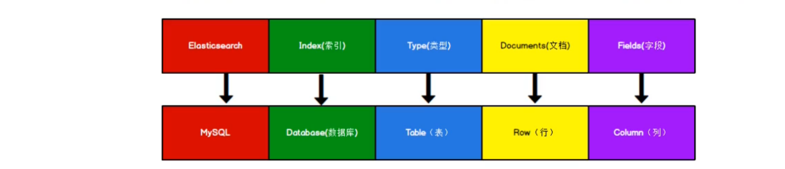

# 倒排索引



弱化表的作用

[倒排索引](https://www.elastic.co/guide/cn/elasticsearch/guide/current/inverted-index.html)

### 安装启动

`docker pull elasticsearch:7.8.0`

`docker run -d -p 9300:9300 -p 9200:9200 -e "discovery.type=single-node" --name elasticsearch elasticsearch:7.8.0`

- `discovery.type=single-node` 单机模式启动

# 索引操作

## **创建索引**

使用`PUT`发送`halo:9200/class`,创建一个名为`class`的索引

```json
{
    "acknowledged": true,
    "shards_acknowledged": true,
    "index": "class"
}
```

## **获取单个索引信息**

`GET`  `halo:9200/索引名`

```json
{
    "class": {
        "aliases": {},
        "mappings": {},
        "settings": {
            "index": {
                "creation_date": "1666789006784",
                "number_of_shards": "1",
                "number_of_replicas": "1",
                "uuid": "mrbzFS6_Rn--ckEvujQmlA",
                "version": {
                    "created": "7080099"
                },
                "provided_name": "class"
            }
        }
    }
}
```

## **获取所有索引**

`GET` `halo:9200/_cat/indices?v`

```
health status index uuid                   pri rep docs.count docs.deleted store.size pri.store.size
yellow open   class mrbzFS6_Rn--ckEvujQmlA   1   1          0            0       208b           208b

```

## **删除索引**

`DELETE` `halo:9200/索引名`

```json
{
    "acknowledged": true
}
```

# 文档操作

## **添加数据**

`POST` `halo:9200/索引名/_doc` + `body`

body.e.g: 

```json
{
    "name": "ZJamss",
    "age": 20,
    "hobby": "睡觉,bro"
}
```

```json
{
    "_index": "student",
    "_type": "_doc",
    "_id": "Uo1mFIQBBGb5ctnRul1q",
    "_version": 1,
    "result": "created",
    "_shards": {
        "total": 2,
        "successful": 1,
        "failed": 0
    },
    "_seq_no": 0,
    "_primary_term": 1
}
```

## **添加数据附带id**

`POST` `halo:9200/索引名/_doc/id` + `body`

 ```json
 `halo:9200/student/_doc/1001`
 
 {
     "_index": "student",
     "_type": "_doc",
     "_id": "1001",
     "_version": 1,
     "result": "created",
     "_shards": {
         "total": 2,
         "successful": 1,
         "failed": 0
     },
     "_seq_no": 1,
     "_primary_term": 1
 }
 ```

## **获取单个数据**

`GET` `halo:9200/索引/_doc/id`

```json
`halo:9200/student/_doc/1001`
{
    "_index": "student",
    "_type": "_doc",
    "_id": "1001",
    "_version": 2,
    "_seq_no": 2,
    "_primary_term": 1,
    "found": true,
    "_source": {
        "name": "ZJamss",
        "age": 20,
        "hobby": "睡觉,bro"
    }
}
```

## **获取所有数据**

`GET` `halo:9200/索引/_search`

```json
`halo:9200/student/_search`

{
    "took": 76,
    "timed_out": false,
    "_shards": {
        "total": 1,
        "successful": 1,
        "skipped": 0,
        "failed": 0
    },
    "hits": {
        "total": {
            "value": 2,
            "relation": "eq"
        },
        "max_score": 1.0,
        "hits": [
            {
                "_index": "student",
                "_type": "_doc",
                "_id": "Uo1mFIQBBGb5ctnRul1q",
                "_score": 1.0,
                "_source": {
                    "name": "ZJamss",
                    "age": 20,
                    "hobby": "睡觉,bro"
                }
            },
            {
                "_index": "student",
                "_type": "_doc",
                "_id": "1001",
                "_score": 1.0,
                "_source": {
                    "name": "ZJamss",
                    "age": 20,
                    "hobby": "睡觉,bro"
                }
            }
        ]
    }
}
```

## **修改数据**

`PUT/POST` `halo:9200/索引/_doc/id`   **全量更新，直接覆盖**

```json
`halo:9200/student/_doc/1001`

{
    "_index": "student",
    "_type": "_doc",
    "_id": "1001",
    "_version": 15,
    "result": "updated",
    "_shards": {
        "total": 2,
        "successful": 1,
        "failed": 0
    },
    "_seq_no": 15,
    "_primary_term": 1
}
```

- _version 会更新，不是幂等性操作

`POST` `halo:9200/索引/_update/id`  **局部更新**

```json
`halo:9200/student/_update/1001`

{
    "_index": "student",
    "_type": "_doc",
    "_id": "1001",
    "_version": 15,
    "result": "noop",
    "_shards": {
        "total": 0,
        "successful": 0,
        "failed": 0
    },
    "_seq_no": 15,
    "_primary_term": 1
}
```

幂等性操作，若值相同则不修改

## 删除数据

`DELETE` `halo:9000/索引/_doc/id`

```json
`halo:9200/student/_doc/1001`

{
    "_index": "student",
    "_type": "_doc",
    "_id": "1001",
    "_version": 26,
    "result": "deleted",
    "_shards": {
        "total": 2,
        "successful": 1,
        "failed": 0
    },
    "_seq_no": 26,
    "_primary_term": 1
}
```

