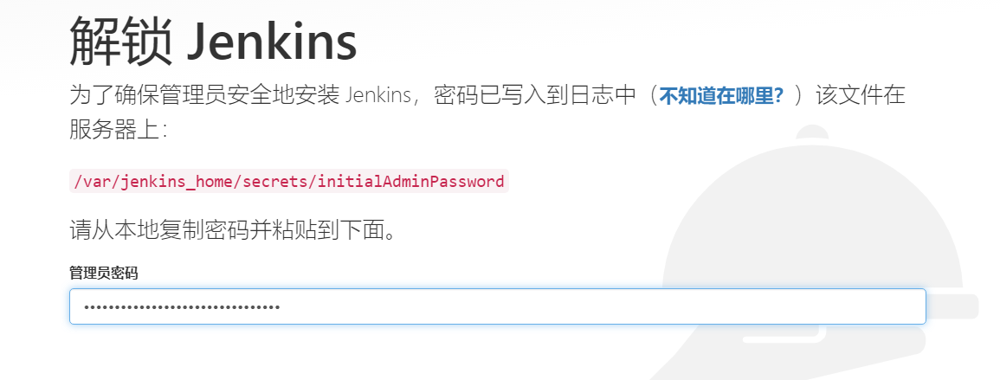

# 安装---Docker

```bash
docker run -u root -d -p 8080:8080 -p 50000:50000 -v /volume/jenkins/data:/var/jenkins_home --name jenkins  jenkinsci/blueocean 
```

> 记得根据情况修改挂载目录的路径


**进入挂载目录**

```bash
vim hudson.model.UpdateCenter.xml 
```

修改镜像URL为`https://mirrors.tuna.tsinghua.edu.cn/jenkins/updates/update-center.json`


**获取管理员密码**

```bash
vim /volume/jenkins/data/secrets/initialAdminPassword
```

进入`IP:8080`



 **选择安装推荐的插件**

**完成**


