### 下载Linux发行版

[https://www.centos.org/download/](https://)

选择x86架构，选择近距离的镜像源下载即可

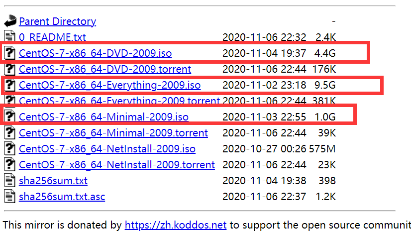

* 标准版
* 完全版
* 迷你版

### 在Vmware上安装

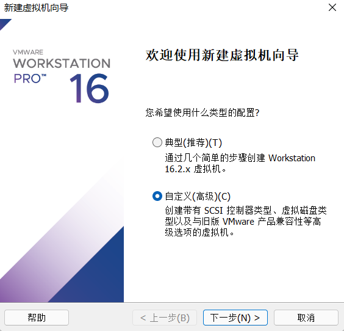

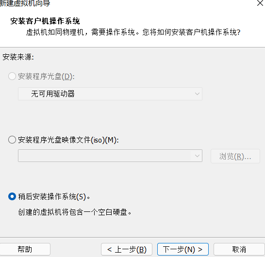
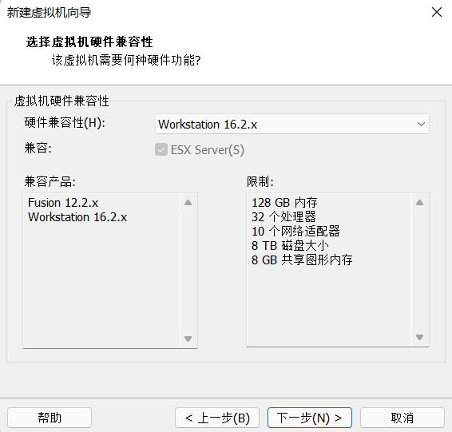

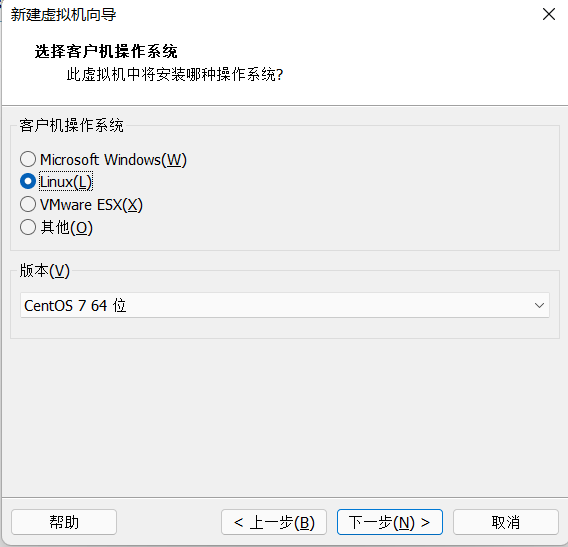

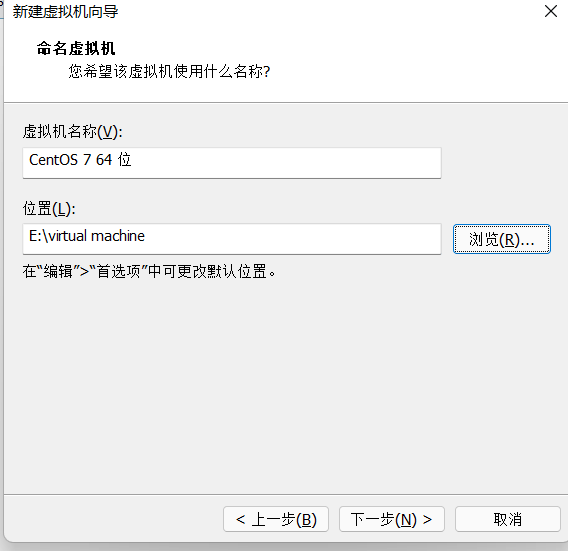

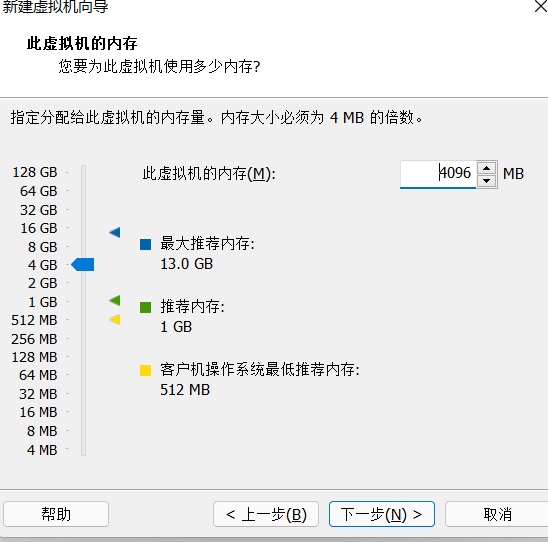

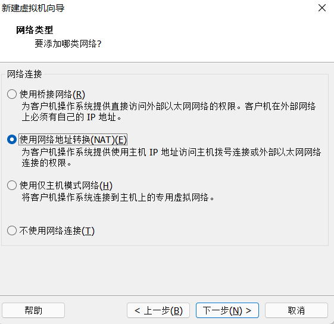

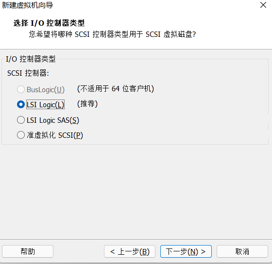

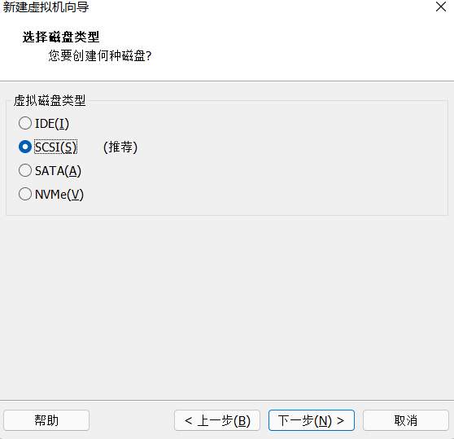

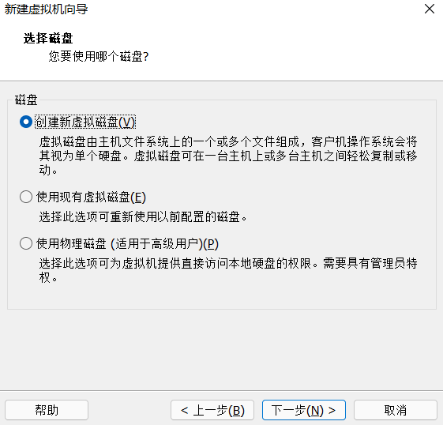

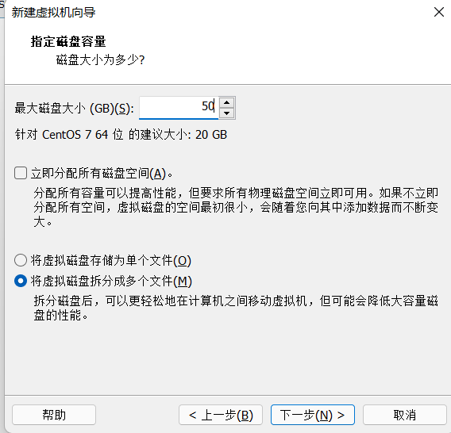

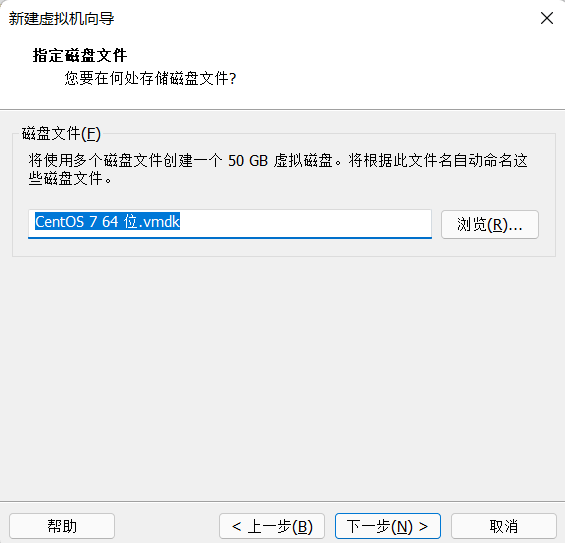

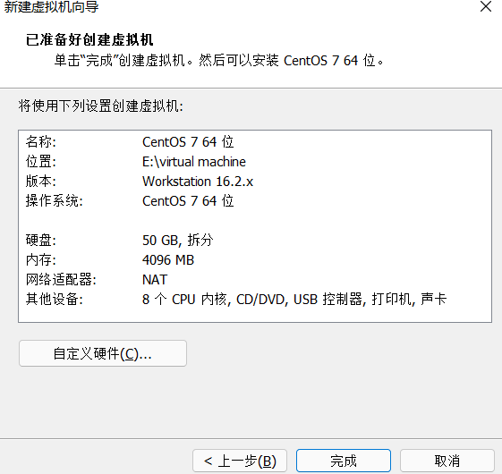

勾选连接时启动

### 安装配置Linux

#### 安装Gone桌面

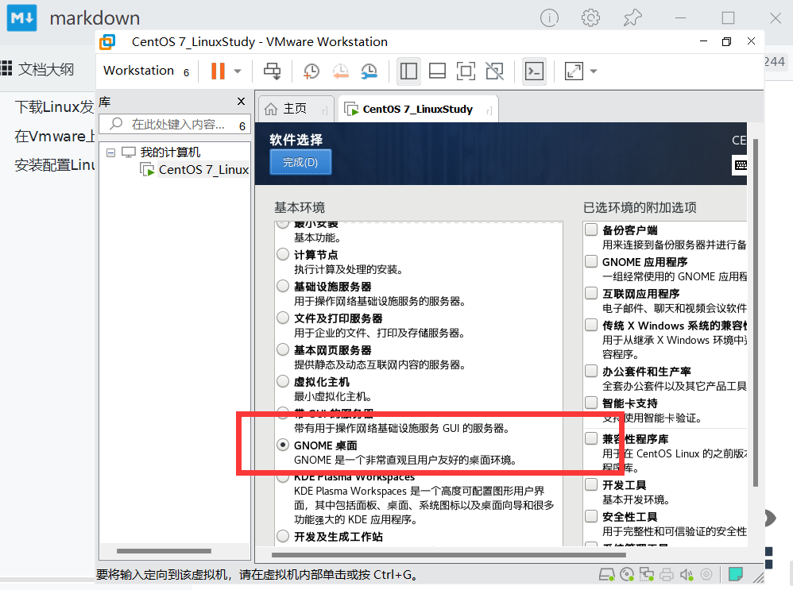

#### 创建引导分区

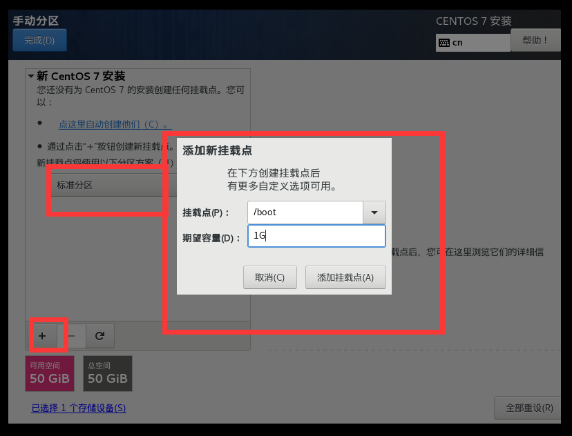

#### 添加交换分区

将内存中未使用的部分移入此分区，需要时再移至内存

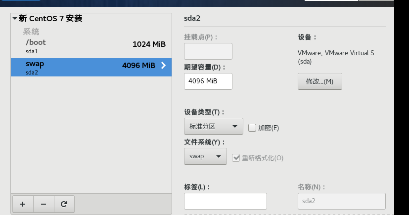

#### 创建根分区

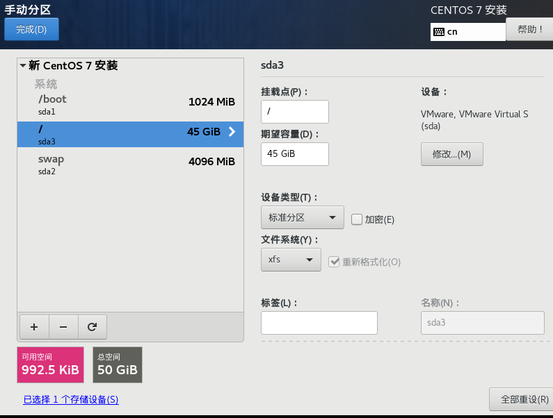

#### KDUMP

节省资源，可取消

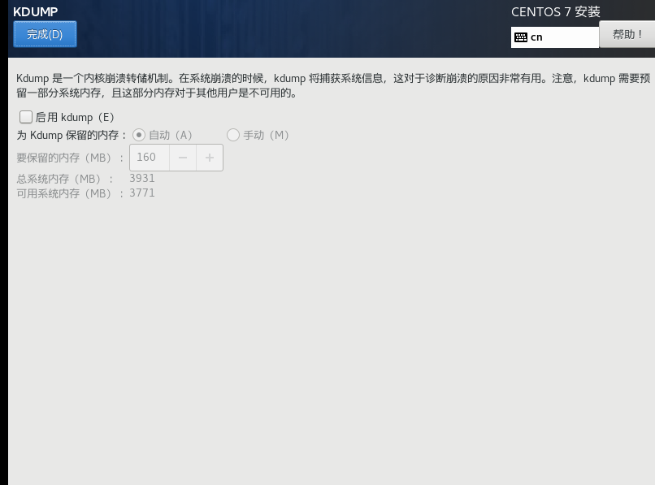

#### 修改主机名并打开以太网

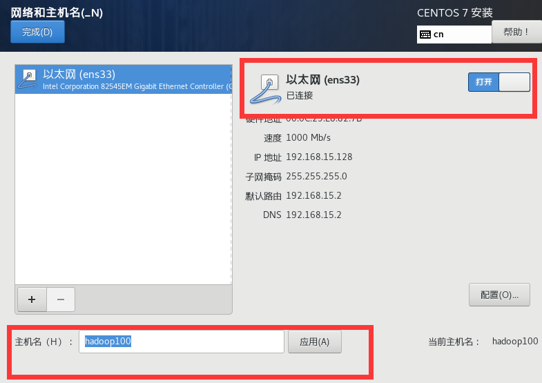
