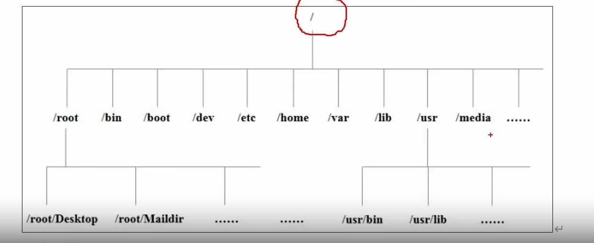

### Linux文件

Linux系统中一切皆文件

### Linux目录结构

> /为根目录

### 挂载

将硬盘空间挂载到文件目录（挂载点）下，向目录写入文件即向对应的硬盘空间内写入

### 目录意义

* `/bin` 可执行二进制（binary）命令的目录
* `/sbin` 管理员级别的可执行二进制命令的目录
* `/lib,/lib64` 系统或应用程序需要的库文件的目录
* `/usr` 用户和应用程序需要的所有数据
* `/boot` 引导启动所需要的文件的目录
* `/dev` 硬件设备目录
* `/etc` 系统管理所需要的配置文件等等
* `/home` 每一个用户的主目录
* `/root` root用户的主目录
* `/opt` 第三方软件包安装的目录
* `/media` 识别可移动媒体设备的数据挂载点
* `/mnt` 另一个media
* `/proc` 进程信息目录
* `/run` 系统运行的实时信息的临时目录
* `/srv` 系统服务相关的目录
* `/sys` 系统硬件相关信息
* `/tmp` 临时目录
* `/var` 可变目录，存放经常修改的东西（比如日志）
