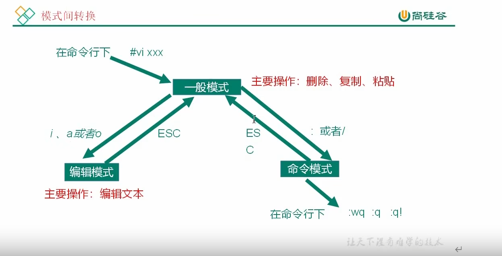
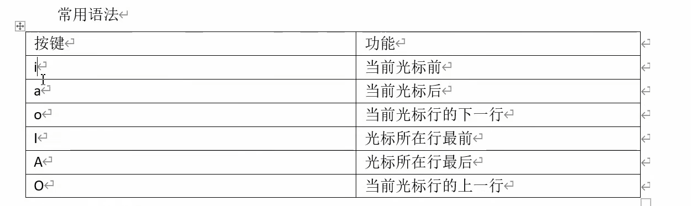
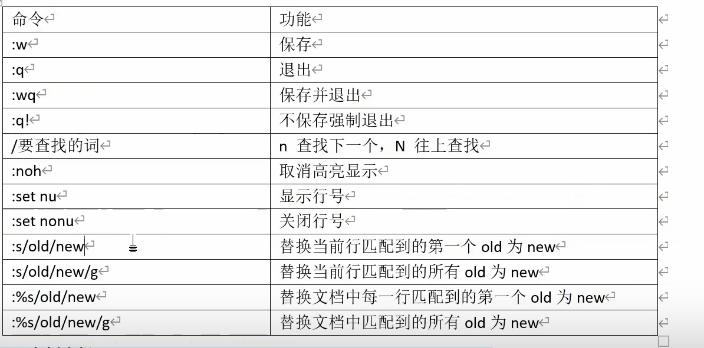
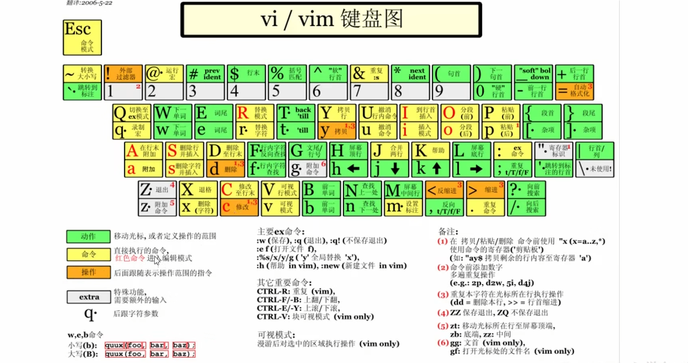

`vim` + `文本名称` 使用vim编辑器打开文本

### 模式转换



* 插入模式：**修改删除文本**
* 一般模式：**阅读，进入插入/命令模式**
* 命令模式：**对文件的操作，保存等等**

#### 一般模式

* 按 `i,a`或者`o`进入**插入模式**
* 输入`：`或者`/`进入**命令模式**
* 按`U`回退操作
* `$`当前光标位置至行末的内容
* `^`行头至光标位置的内容
* `w` 一个单词单词
* `r`替换当前光标的内容
* `shift+r` 替换所有内容
* `shift+^/$`移动光标至行头/行尾
* `shift+h/l` 跳转至文档头/尾
* `数字+shift+g` 跳转对应行数
* `dd` 删除当前行,数字且删除多行
* `yy` 复制当前行，先输入一个数字再`yy`：复制多行
* `p` 粘贴，先输入一个数字再`p`：粘贴多行
* `o` 插入一个空行

#### 插入模式

按`ESC`返回一般模式



#### 命令模式

按`ESC`返回一般模式

```

```

**命令：**

> 命令后加 ！ ，强制执行

* `:w` 写入文本
* `:q` 推出编辑
* `:wq` 保存并退出
* `:set nu` 显示行号
* `:set nonu` 取消行号
* `/+单词` 查找单词，`n`查找下一个,`shift+n` 查找上一个
* `:noh` 取消高亮显示

  


