### Vmware网络连接模式

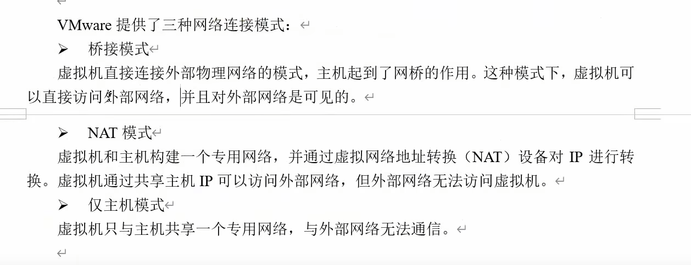

### 更改虚拟机静态ip

`vim /etc/sysconfig/network-scripts/ifcfg-ens33`

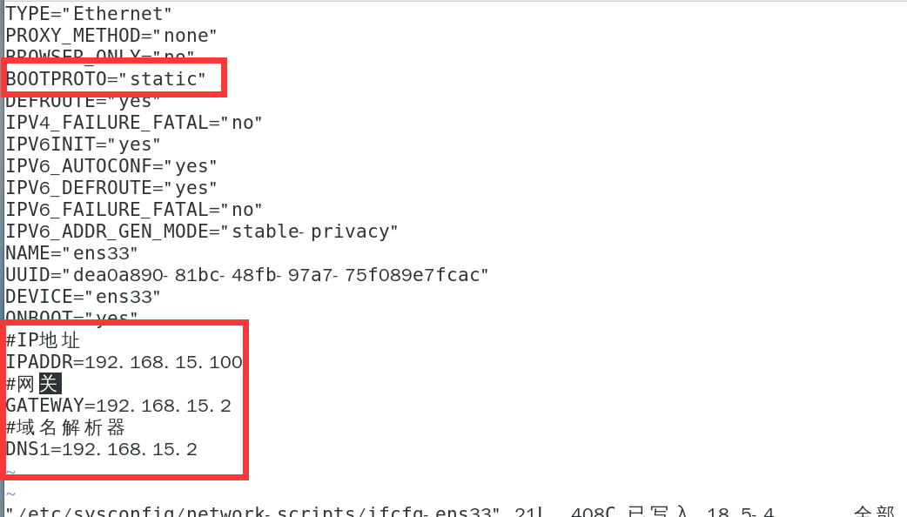

将**启动协议**从`DHCP`更换为`static`

再加入**ip地址和网关和dns配置**

重启网络 `service network restart`

#### 可能会遇见的问题

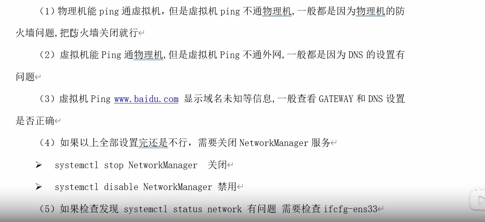

### 修改主机名

`hostnamectl set-hostname 名称`

`hostnamectl` 查看主机信息

`hostname` 查看主机名

### 修改host文件

`vim /etc/hosts`

添加对应的主机

同时也修改Windows主机的hosts文件（`c:\windows\system32\drivers\etc\hosts`）

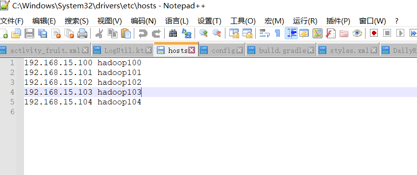

之后就可以通过主机名与vm通信了

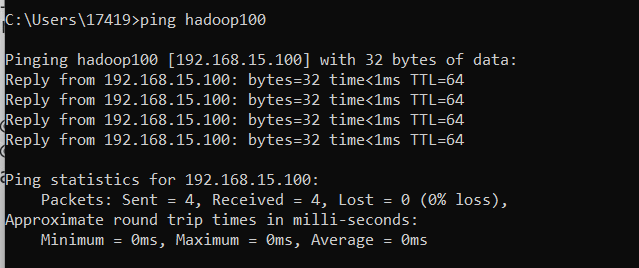

### 远程登陆

#### ssh登录

cmd输入`ssh root@hadoop100`,回车（**登录hadoop100的主机使用root身份**）

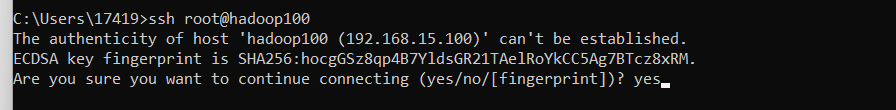

**是否连接，输入yes**

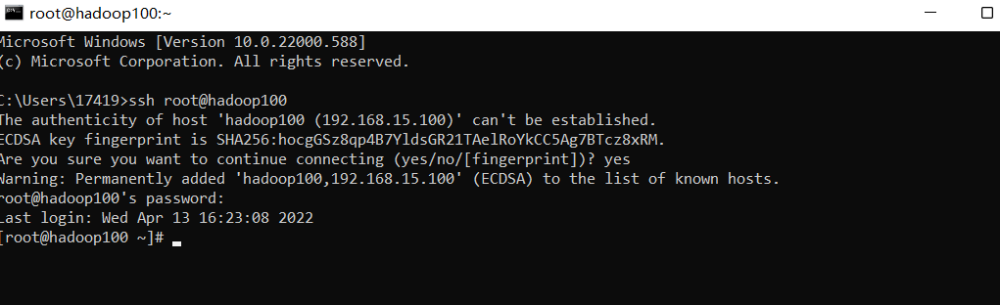

登录成功

#### 使用软件比如xshell等

填写主机名

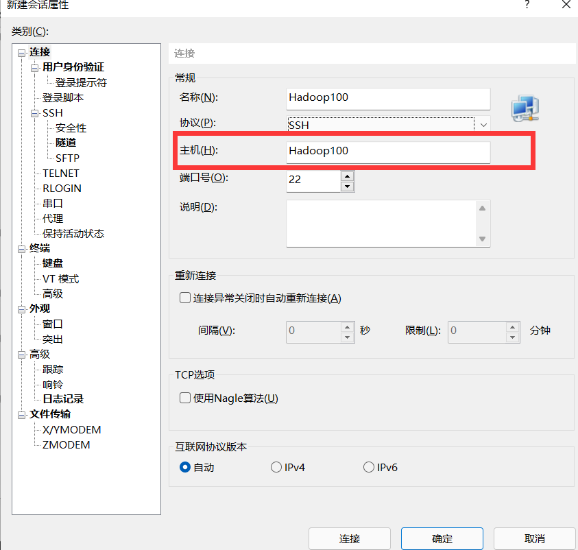

填写登录用户

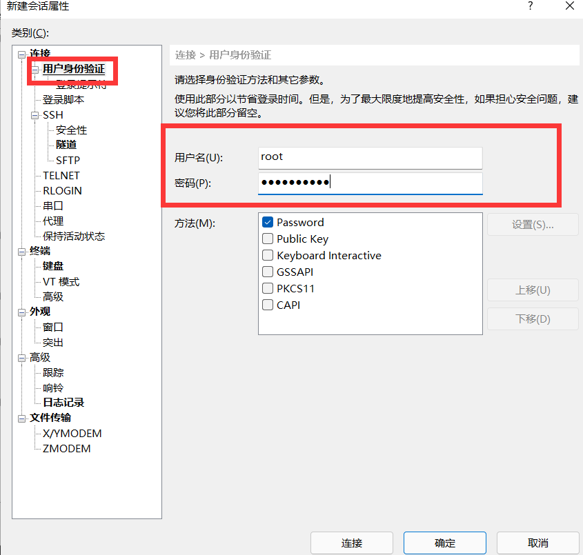

接受并保存，以后免密登录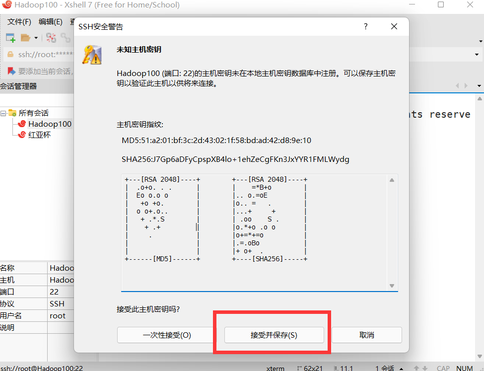

然后连接即可

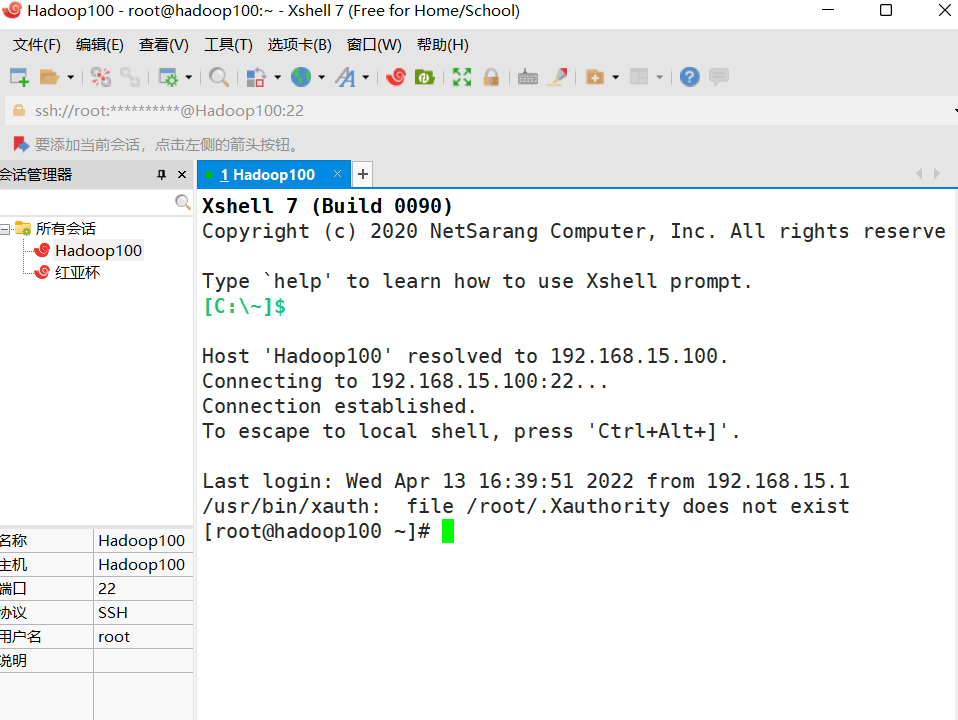
