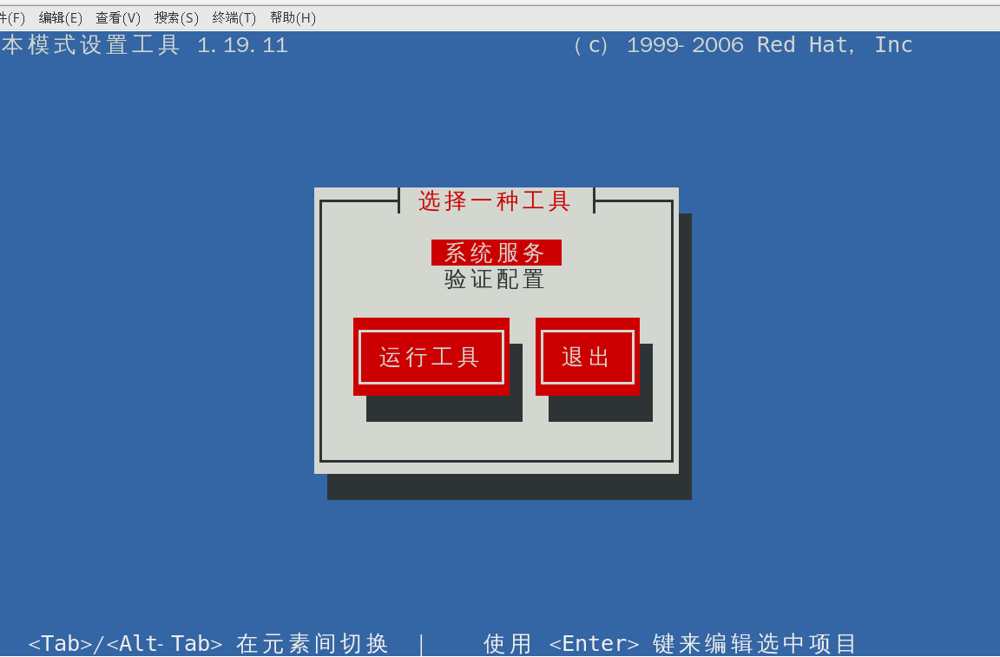
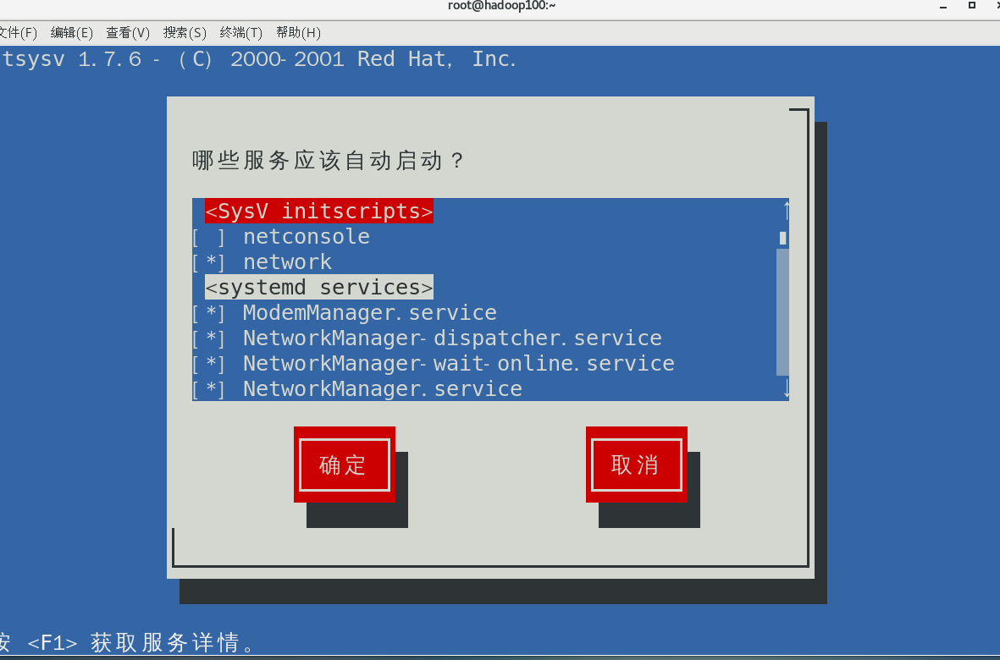
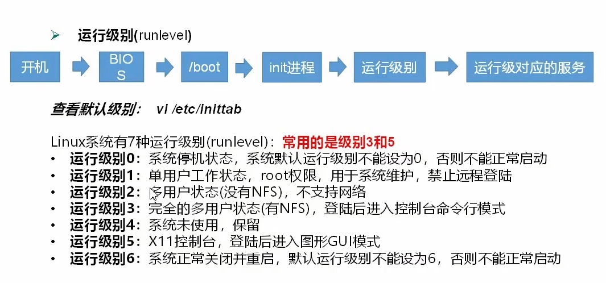

### service服务管理

###### 基本语法

`systemctl start | stop | restart | status` 服务名

###### 查看所有服务

`ls /usr/lib/systemd/system`

`setup`进入设置，选择 `系统服务`

### 运行级别

（CentOS6）

CentOS7的运行级别简化为：

`multi-user.target` 等价于**原运行级别3** （多用户有网，命令行界面)

`graphical.target` 等价于**原运行级别5** (多用户有网，图形界面)

#### 查看当前运行级别

`systemctl get-default`

#### 修改当前运行级别

`systemctl set-default TARGET.target` 这里TARGET取 `multi-user` 或者 `graphical`

`init 3 | 5` 切换界面

#### 修改服务开机启动

`systemctl enabled | disabled 服务名` 开启/关闭服务开机启动

#### 查看所有服务的开机启动配置

`systemctl list-unit-files`

* enabled 开机启动
* disabled 开机不启动
* static 不确定，跟随系统

### 关机重启命令

#### 基本语法

* sync                   （功能描述：将数据由内存同步到硬盘中）
* halt                    （功能描述：停机，关闭系统，但不断电）
* poweroff             （功能描述：关机，断电）
* reboot                 （功能描述：就是重启，等同于shutdown -rnow）
* shutdown [选项] 时间

表 6-1

| 选项 | 功能               |
| ------ | -------------------- |
| -H   | 相当于--halt，停机 |
| -r   | -r=reboot重启      |

表6-2

| 参数 | 功能                               |
| ------ | ------------------------------------ |
| now  | 立刻关机                           |
| 时间 | 等待多久后关机（时间单位是分钟）。 |

#### 经验技巧

Linux系统中为了提高磁盘的读写效率，对磁盘采取了“**预读迟写**”操作方式。**当用户保存文件时，Linux     核心并不一定立即将保存数据写入物理磁盘中，**而是将数据保存在**缓冲区**中，**等缓冲区满时再写入磁盘**，这种方式可以极大的提高磁盘写入数据的效率。但是， 也带来了安全隐患，如果数据还未写入磁盘时，系统掉电或者其他严重问题出现，则将导致数据丢失。**使用 sync指令可以立即将缓冲区的数据写入磁盘**。

#### 案例实操

* 将数据由内存同步到硬盘中

`[root@hadoop100桌面]#sync`

* 重启

`[root@hadoop100桌面]# reboot`

* 停机（不断电）

`[root@hadoop100桌面]#halt`

* 计算机将在 1分钟后关机，并且会显示在登录用户的当前屏幕中

`[root@hadoop100桌面]# shutdown -rnow`

* 立马关机（等同于 poweroff）

`[root@hadoop100桌面]# shutdown -hnow`

* 系统立马重启（等同于 reboot）

`[root@hadoop100桌面]# shutdown -rnow`
