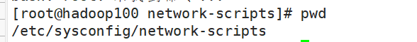

### `pwd`

print working directory 打印工作目录的绝对路径

### `cd`

cd:ChangeDirectory切换路径

##### 基本语法

cd [参数]

| 参数       | 功能                                 |
| ------------ | -------------------------------------- |
| cd绝对路径 | 切换路径                             |
| cd相对路径 | 切换路径                             |
| cd~或者cd  | 回到自己的家目录                     |
| cd -       | 回到上一次所在目录                   |
| cd ..      | 回到当前目录的上一级目录             |
| cd -P      | 跳转到实际物理路径，而非快捷方式路径 |

### `ls`

list 列出目录内容

##### 基本语法

ls [选项] [目录或是文件]

| 选项 | 功能                                                           |
| ------ | ---------------------------------------------------------------- |
| -a   | 全部的文件，连同隐藏档(开头为.的文件)一起列出来(常用)          |
| -l   | 长数据串列出，包含文件的属性与权限等等数据；(常用)等价于“ll” |

### `mkdir`

Makedirectory 建立目录

##### 基本语法

mkdir [选项] 要创建的目录名称

| 选项 | 功能         |
| ------ | -------------- |
| -p   | 创建多层目录 |

##### 实例

创建一个目录

`mkdir first`

`mkdir first/second/third`

创建多个目录

`mkdir -p first/second`

### `rmdir`

Removedirectory 移除目录

##### 基本语法

rmdir [选项] 要删除的目录

| 选项 | 功能         |
| ------ | -------------- |
| -p   | 删除多层目录 |

### `touch`

touch 创建空文件

##### 基本语法

touch 文件名称

(使用`vim`也能创建文件，不过需要保存)

### `cp`

##### 基本语法

cp [选项] source target  (将source复制到target)

| 选项 | 功能               |
| ------ | -------------------- |
| -r   | 递归复制整个文件夹 |

> 强制覆盖不提示的方法：\cp

### `rm`

##### 基本语法

rm [选项] deleteFile

| 选项 | 功能                                     |
| ------ | ------------------------------------------ |
| -r   | 递归删除目录中所有内容                   |
| -f   | 强制执行删除操作，而不提示用于进行确认。 |
| -v   | 显示指令的详细执行过程                   |

##### 实例

删除目录中的内容

`rm -f a/b/test.txt`

删除目录所有内容

rm -rf zjamss/

### `mv`

##### 基本语法

`mv old new ` (重命名)

`mv /temp/sourceFile /targetFolder` (移动文件)

##### 实例

重命名

`mv a/b/c.txt a/b/d.txt`

移动文件

`mv a/b/c.txt /d`

### `cat`

catch 查看文件内容

##### 基本语法

cat [选项] file

| 选项 | 功能描述                     |
| ------ | ------------------------------ |
| -n   | 显示所有行的行号，包括空行。 |

### `more`

more指令是一个基于VI编辑器的文本过滤器，**它以全屏幕的方式按页显示文本文件的内容**。more指令中内置了若干快捷键，详见操作说明。

##### 基本语法

`more file`

##### 操作说明

| 操作          | 功能说明                               |
| --------------- | ---------------------------------------- |
| 空白键(space) | 代表向下翻一页；                       |
| Enter         | 代表向下翻『一行』；                   |
| q             | 代表立刻离开more，不再显示该文件内容。 |
| Ctrl+F        | 向下滚动一屏                           |

| Ctrl+B | 返回上一屏               |
| -------- | -------------------------- |
| =      | 输出当前行的行号         |
| :f     | 输出文件名和当前行的行号 |

### `less`

less指令用来分屏查看文件内容，它的功能与 more指令类似，但是比
more指令更加强大，支持各种显示终端。less    指令在显示文件内容时，并不是一次将整个文件加载之后才显示，而是根据显示需要加载内容，对于显示大型文件具有较高的效率。

##### 基本语法

less file

| 操作       | 功能说明                                           |
| ------------ | ---------------------------------------------------- |
| 空白键     | 向下翻动一页；                                     |
| [pagedown] | 向下翻动一页                                       |
| [pageup]   | 向上翻动一页；                                     |
| /字串      | 向下搜寻『字串』的功能；n：向下查找；N：向上查找； |
| ?字串      | 向上搜寻『字串』的功能；n：向上查找；N：向下查找； |
| q          | 离开less这个程序；                                 |

> 用SecureCRT时[pagedown]和[pageup]可能会出现无法识别的问题。

### `echo`

echo输出内容到控制台

##### 基本语法

echo [选项] [输出内容]

echo $xxx （输出环境变量内容）

**选项：**

-e： 支持反斜线控制的字符转换

### > 输出重定向和 >>

##### 基本语法

* `ls -l > 文件` 列表的内容写入文件a.txt中（覆盖写)
* `ls -al >> 文件` 列表的内容追加到文件aa.txt的末尾
* `cat f1 > f2` 列表的内容追加到文件aa.txt的末尾
* `echo "内容" >> 文件 ` 输入内容追加到文件末尾

### `head`

显示文件头部内容

##### 基本语法

`head file` 查看头10行

`head -n [行数] file` 查看头n行

### `tail`

tail用于输出文件中尾部的内容，默认情况下 tail指令显示文件的后 10行内容。

##### 基本语法

`tail file`

`tail -n 5 file`

`tail -f file` **实时追踪该文档所有更新** `ctrl + s` 暂停 `ctrl + q`继续 `ctrl+c`退出

| 选项     | 功能                                 |
| ---------- | -------------------------------------- |
| -n<行数> | 输出文件尾部n行内容                  |
| -f       | 显示文件最新追加的内容，监视文件变化 |

### `ln`

软链接也称为符号链接，类似于windows里的快捷方式，有自己的数据块，主要存放了链接其他文件的路径。

##### 基本语法

ln -s [原文件或目录] [软链接名]        （功能描述：给原文件创建一个软链接）

> 删除软链接：
> rm -rf软链接名，而不是 rm -rf软链接名/
>
> 如果使用 rm -rf软链接名/删除，会把软链接对应的真实目录下内容删掉查询：通过 ll就可以查看，列表属性第 1位是 l，尾部会有位置指向。
