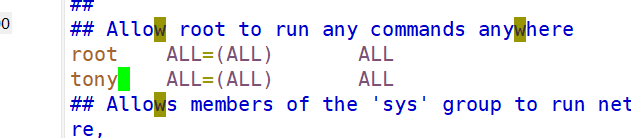

## 用户管理命令

### `useradd`

添加新用户

##### 基本语法

`useradd 用户名` 添加新用户

`useradd -g 组名 用户名 ` 添加新用户到某个组

### `usermod`

修改用户组别

`usermod -g 用户组 用户名` 

### `passwd`

`passwd 用户名`   （功能描述：设置用户密码）

### `id`

`id 用户名 （查看用户是否存在）

### `cat /etc/passwd`

查看创建了那些用户

### `su`

su:switch user 切换用户

`su 用户名称 `（功能描述：切换用户，只能获得用户的执行权限，不能获得环境变量）

`su - 用户名称` （功能描述：切换到用户并获得该用户的环境变量及执行权限）

### `userdel`

`userdel 用户名` (删除用户但保存用户主目录)

`userdel -r 用户名` (用户和用户主目录，都删除）

### `who`

`whoami` 显示用户名称

`who am i` 显示用户名称以及登录时间

### `sudo`

`sudo 其他命令` 使用管理员权限执行其他命令

### 给普通用户设置管理员权限

`vim /etc/sudoers`

添加即可

## 用户组管理

### `groupadd` 添加组

`groupadd 名字`

### `groupdel 删除组`

`groupdel 名字`

### `groupmod` 修改组

`groupmod -n 新组名 旧组名`

### `cat /etc/group` 查看创建了哪些组
