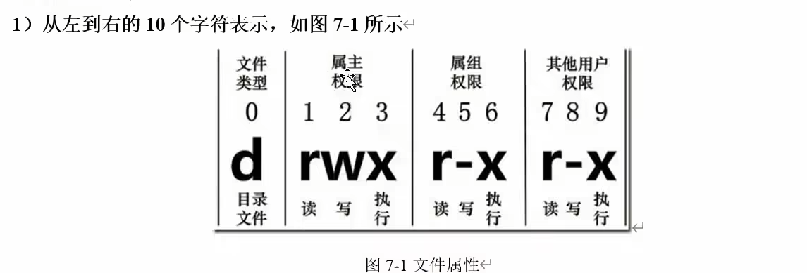
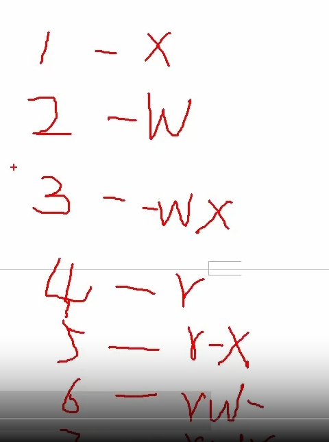

### 权限类别

如果没有权限，就会出现`-`

从左至右用0-9这些数字来表示:

（1）**0首位表示类型**

在Linux中第一个字符代表这个文件是目录、文件或链接文件等等

* `-`代表文件
* `d`代表目录

* `l`链接文档(linkfile)；

（1）**第1-3位确定属主（该文件的所有者）拥有该文件的权限。---User**

（2）**第4-6位确定属组（所有者的同组用户）拥有该文件的权限，---Group**

（3）**第7-9位确定其他用户拥有该文件的权限 ---Other**

**1）** **rwx**作用文件和目录的不同解释

（1）作用到文件：

**[ r ]代表可读(read): 可以读取，查看**

**[ w ]代表可写(write):可以修改，但是不代表可以删除该文件，删除一个文件的前提条件是对该文件所在的目录有写权限，才能删除该文件.**

**[ x ]代表可执行(execute):可以被系统执行**

（2）作用到目录：

**[ r ]代表可读(read): 可以读取，ls查看目录内容**

**[ w ]代表可写(write):可以修改，目录内创建+删除+重命名目录**

**[ x ]代表可执行(execute):可以进入该目录**

### chmod 改变权限

`chmod [{ugoa}{+-=}{rwx}] 文件或目录`

`chmod [mode=421 ] [文件或目录]`

> u:所有者 g:所有组 o:其他人 a:所有人(u、g、o的总和)

> r=4w=2x=1       rwx=4+2+1=7

### `chown` 改变属主

`chown[选项][最终用户][文件或目录]`

| 选项 | 功能     |
| ------ | ---------- |
| -R   | 递归操作 |

### `chgrp` 改变属组

`chgrp[最终用户组][文件或目录]`
