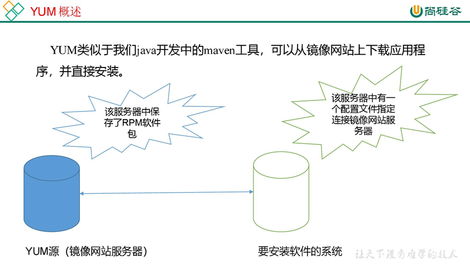
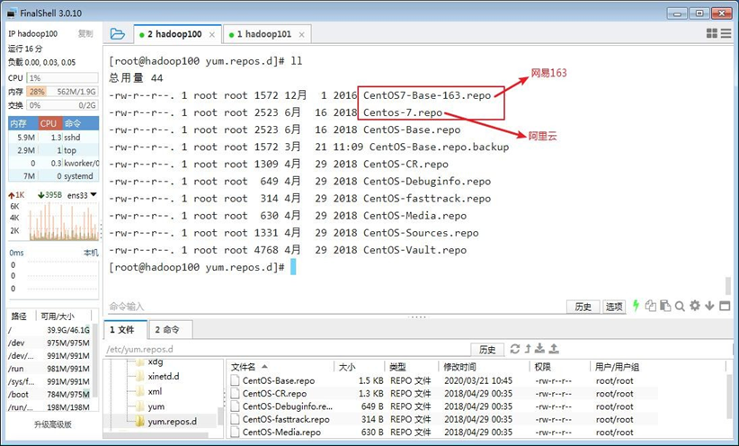

## `RPM`

RPM（RedHatPackage Manager），RedHat软件包管理工具，类似windows里面的setup.exe

是Linux这系列操作系统里面的打包安装工具，它虽然是RedHat的标志，但理念是通用的。

RPM包的名称格式Apache-1.3.23-11.i386.rpm

- “apache”**软件名称**
- “1.3.23-11”**软件的版本号，主版本和此版本**

* “i386”是软件所**运行的硬件平台**，Intel32位处理器的统称

- “rpm”**文件扩展名**，代表RPM包

### `rpm -qa` 查询命令

`rpm -qa` 查询所有已安装的rpm软件包

> rpm -qa | grep xxx

### `rpm -e` 卸载命令

`rpm-e RPM软件包`

`rpm-e --nodeps软件包`

| 选项     | 功能                                                                                   |
| ---------- | ---------------------------------------------------------------------------------------- |
| -e       | 卸载软件包                                                                             |
| --nodeps | 卸载软件时，不检查依赖。这样的话，那些使用该软件包的软件在此之后可能就不能正常工作了。 |

### `rpm -ivh ` 安装

`rpm -ivh rpm软件包全名`

| 选项     | 功能                    |
| ---------- | ------------------------- |
| -i       | install，安装           |
| -v       | --verbose，显示详细信息 |
| -h       | --hash，进度条          |
| --nodeps | 安装前不检查依赖        |

## YUM

YUM（全称为 YellowdogUpdater,Modified）是一个在 Fedora和 RedHat以及
CentOS中的 Shell前端软件包管理器。基于 RPM包管理，能够从指定的服务器自动下载 RPM包并且安装，**可以自动处理依赖性关系**，**并且一次安装所有依赖的软件包，无须繁琐地一次次下载**、安装，如图

### `yum`

`yum [选项] [参数]`

| 选项 | 功能                    |
| ------ | ------------------------- |
| -y   | 对所有提问都回答“yes” |

| 参数         | 功能                          |
| -------------- | ------------------------------- |
| install      | 安装rpm软件包                 |
| update       | 更新rpm软件包                 |
| check-update | 检查是否有可用的更新rpm软件包 |
| remove       | 删除指定的rpm软件包           |
| list         | 显示软件包信息                |
| clean        | 清理yum过期的缓存             |
| deplist      | 显示yum软件包的所有依赖关系   |

### 修改yum源

默认的系统YUM源，需要连接国外apache网站，网速比较慢，可以修改关联的网络

YUM源为国内镜像的网站，比如网易 163,aliyun等

1. **安装 wget, wget用来从指定的 URL下载文件**
   `yum -y install wget`
2. **在 /etc/yum.repos.d/目录下，备份默认的 repos文件**
   `cp CentOs-Base.repo CentOS-Base.repo.backup`
   3.
4. **下载网易163或者是aliyun的 repos文件,任选其一**
   `wget http://mirrors.aliyun.com/repo/Centos-7.repo  //阿里云`

   `wget http://mirrors.163.com/.help/CentOS7-Base-163.repo  //网易 163`

   
5. 使用下载好的 repos文件替换默认的 repos文件

例如:用 CentOS7-Base-163.repo替换 CentOS-Base.repo

`mv CentOS7-Base-163.repo   CentOS-Base.repo`

6. 清理缓存，缓存新数据

   `yum clean all` `yum makecache`
