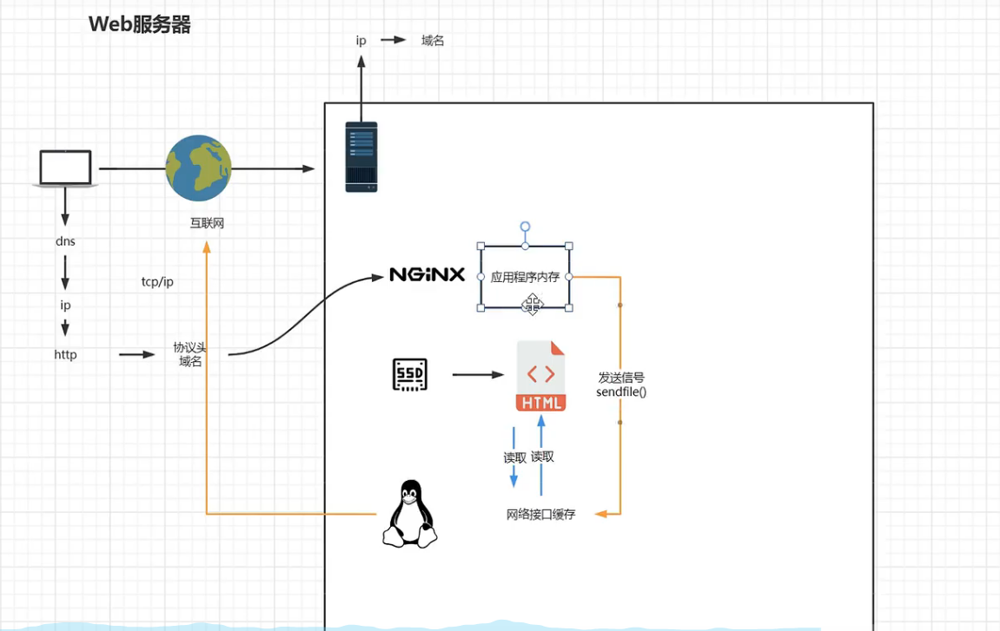

# 四大版本

- Nginx 开源版
- Nginx Plus
- Openresty
- Tengine

# Docker 安装

## 安装nginx

`docker pull nginx`

在`/volume/nginx/conf/nginx.conf`设置

```conf
user  nginx;
worker_processes  auto;

error_log  /var/log/nginx/error.log notice;
pid        /var/run/nginx.pid;


events {
    worker_connections  1024;
}


http {
    include       /etc/nginx/mime.types;
    default_type  application/octet-stream;

    log_format  main  '$remote_addr - $remote_user [$time_local] "$request" '
                      '$status $body_bytes_sent "$http_referer" '
                      '"$http_user_agent" "$http_x_forwarded_for"';

    access_log  /var/log/nginx/access.log  main;

    sendfile        on;
    #tcp_nopush     on;

    keepalive_timeout  65;

    #gzip  on;

    include /etc/nginx/conf.d/*.conf;
}
```

在`/volume/nginx/conf/default.d`设置

```conf
server {
    listen       80;
    listen  [::]:80;
server {
    listen       80;
    listen  [::]:80;
    server_name  localhost;

    #charset koi8-r;
    #access_log  /var/log/nginx/host.access.log  main;
server {
    listen       80;
    listen  [::]:80;
    server_name  localhost;

    #charset koi8-r;
    #access_log  /var/log/nginx/host.access.log  main;

    location / {
        root   /usr/share/nginx/html;
        index  index.html index.htm;
    }

    #error_page  404              /404.html;

    # redirect server error pages to the static page /50x.html
    #
    error_page   500 502 503 504  /50x.html;
    location = /50x.html {
        root   /usr/share/nginx/html;
    }

    # proxy the PHP scripts to Apache listening on 127.0.0.1:80
    #
    #location ~ \.php$ {
    #    proxy_pass   http://127.0.0.1;
    #}

    # pass the PHP scripts to FastCGI server listening on 127.0.0.1:9000
    #
    #location ~ \.php$ {
    #    root           html;
    #    fastcgi_pass   127.0.0.1:9000;
    #    fastcgi_index  index.php;
    #    fastcgi_param  SCRIPT_FILENAME  /scripts$fastcgi_script_name;
    #    include        fastcgi_params;
    #}

    # deny access to .htaccess files, if Apache's document root
    # concurs with nginx's one
    #
    #location ~ /\.ht {
    #    deny  all;
    #}
}
```


`docker run -d -p 80:80 --name nginx --privileged=true --net host -v /volume/nginx/logs:/var/log/nginx -v /volume/nginx/conf/nginx.conf:/etc/nginx/nginx.conf:ro -v /volume/nginx/html:/usr/share/nginx/html -v /volume/nginx/conf/default.d:/etc/nginx/conf.d/default.d nginx`

- --net：host 和宿主机同一IP,否则代理的是容器的端口，而不是主机的
- default.d 默认启动文件需挂载


## Docker容器内常用目录位置

`conf` : `/etc/nginx`

`logs`: `/var/log/nginx`

`sbin` `/usr/sbin`

`html` `/usr/share/nginx/html`n 

通过`ln -s source  destination` 在`/nginx`下创建软连接，快捷访问

```bash
ln -s /etc/nginx conf
```

# 运行原理


# Nginx基础配置

```conf
user  nginx;
worker_processes  auto;

error_log  /var/log/nginx/error.log notice;
pid        /var/run/nginx.pid;


events {
    worker_connections  1024;
}


http {
    include       /etc/nginx/mime.types;
    default_type  application/octet-stream;

    log_format  main  '$remote_addr - $remote_user [$time_local] "$request" '
                      '$status $body_bytes_sent "$http_referer" '
                      '"$http_user_agent" "$http_x_forwarded_for"';

    access_log  /var/log/nginx/access.log  main;

    sendfile        on;
    #tcp_nopush     on;

    keepalive_timeout  65;

    #gzip  on;

    include /etc/nginx/conf.d/*.conf;
    
    server {
		listen 80;
		server_name localhost;
		location / {
			root /usr/share/nginx/html;
			index index.html index.htm;
		}
    }
}
```

- `work_processes`  设置work的线程数

- `include` 引入其他配置文件
- `mime.types` 包含server响应头的文件类型,`text/html`等等
- `default_type` 若遇见`mime.types`中未定义的文件类型，默认以`application/octet-stream`返回
- `sendfile`  不使用内存读取文件再发送，而是直接通知网络接口自动读取并发送文件，减少拷贝消耗



- `keepalive-timeout` 保持长连接
- `location` uri
- `root` 目录路径
- `index` 主页
