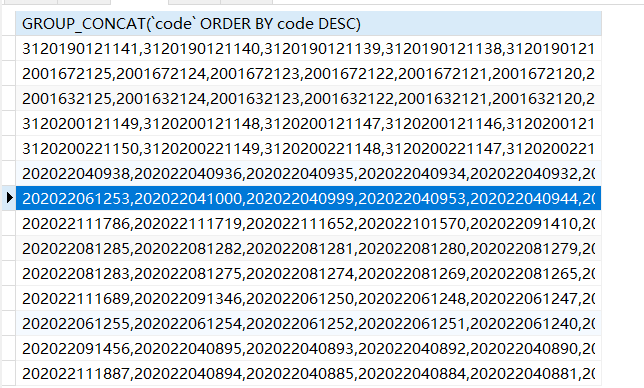
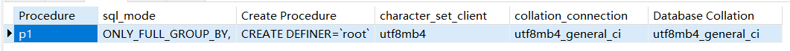

DQL

### 起别名

```sql
select name as CNAME from user
```

```sql
select name '名字 name' from user
```

> as可以省略

### 条件查询


**格式**

`select ... from ... where [conditions...]`

#### between...and...

---

`between...and...`等同于 `>= and <=`
做区间判断的，包含左右两个边界值。
它支持数字、日期、字符串等数据类型。
between...and...在使用时一定是**左小右大**。左大右小时无法查询到数据。

```mysql
select 
  ename,sal
from
  emp
where
  sal between 1600 and 3000;
```

#### is null | is not null

判断是否为null**只能用`is`或者安全等于`<=>`来判断而不是等号`=`**

#### in ,not in

`in`的执行原理为`=`和`or`的组合 

```mysql
select * from user where age in (10,20); 
```

查找10岁或者20岁的人，同理可以看作

```mysql
select * from user where age  = 10 or age = 20;
```

`not in`的原理为`!=`和`and`的组合

```mysql
select * from user where age not in (10,20); 
```

查询年龄不为10岁或者20岁的人，可以翻译为

```mysql
select * from user where age != 10 and age != 20;
```

##### 关于NULL的情况

`in`: 

```mysql
select * from user where age in (NULL,20); 
```

因为`=`无法判断`NULL`，所以`NULL`会被**自动忽略**，因为分隔为`and`, 所以只会查询出年龄为20岁的人

`not in`:

```mysql
select * from user where age not in (NULL,20); 
```

同理，因为`!=`也无法判断`NULL`和分隔为`or`，所以第一段`NULL`就为`false`，所以无法查出任何东西，查询前需要过滤`NULL`的数据

### 模糊查询

`% `: 通配符,匹配任意个字符

`_`: 占位符 ,匹配一个字符

`\_`: 转译为普通的`_`

```mysql
select * from user where name like '_z%'
```

### 排序

#### 单个字段排序

```mysql
select * from user order by 字段名 (asc/desc);
```

`asc` 升序 `desc`降序 ,默认为**升序**

#### 多个字段排序

```mysql
select * from user where money > 20000 order by id asc,name desc;
```

在`id`**相同**的情况下采用**名字降序排序**

### 去重

```mysql
select distinct * from user;
```

> 关键字出现在所有字段的最前方，去除查询结果中的重复数据

### 数据处理函数

---

关于select语句，我们之前都是这样写：select 字段名 from 表名; 其实，这里的字段名可以看做“变量”，select后面既然可以跟变量，那么可以跟常量吗，尝试一下：

通过以上sql的测试得知，select后面既可以跟变量，又可以跟常量。
以上三条SQL中前两条中100和'abc'都是常量，最后一条SQL的abc没有添加单引号，它会被当做某个表的字段名，因为没有这个字段所以报错。 


#### 字符串相关

##### 转大写upper和ucase

```sql
# 查询所有员工名字，以大写形式展现
select upper(ename) as ename from emp;
```


还有一个和upper函数功能相同的函数ucase，也可以转大写，了解一下即可：

```sql
# 查询所有员工姓名，以大写形式展现
select ucase(ename) as ename from emp;
```


```sql
# 查询员工smith的岗位、薪资（假如你不知道数据库表中的人名是大写、小写还是大小写混合）
select ename, job, sal from emp where upper(ename) = 'SMITH';
```


##### 转小写lower和lcase

**很简单，不再赘述，直接上代码：**

```sql
# 查询员工姓名，以小写形式展现
select lower(ename) as ename from emp;
select lcase(ename) as ename from emp;
```


##### 截取字符串substr

语法：substr('被截取的字符串', 起始下标, 截取长度)
有两种写法：
第一种：substr('被截取的字符串', 起始下标, 截取长度)
第二种：substr('被截取的字符串', 起始下标)，当第三个参数“截取长度”缺失时，截取到字符串末尾
注意：起始下标从1开始，不是从0开始。（1表示从左侧开始的第一个位置，-1表示从右侧开始的第一个位置。）


练习：找出员工名字中第二个字母是A的

```sql
select ename from emp where substr(ename, 2, 1) = 'A';
```


##### 获取字符串长度length


注意：一个汉字是2个长度。

##### 获取字符的个数char_length


##### 字符串拼接

语法：concat('字符串1', '字符串2', '字符串3'....)
拼接的字符串数量没有限制。

注意：在mysql8之前，双竖线||也是可以完成字符串拼接的。但在mysql8之后，||只作为逻辑运算符，不能再进行字符串拼接了。

```sql
select 'abc' || 'def' || 'xyz';
```

mysql8之后，|| 只作为“或者”运算符，例如：找出工资高于3000或者低于900的员工姓名和薪资：

```sql
select ename, sal from emp where sal > 3000 || sal < 900;
```


mysql中可以使用+进行字符串的拼接吗？不可以，在mysql中+只作加法运算，在进行加法运算时，会将加号两边的数据尽最大的努力转换成数字再求和，如果无法转换成数字，最终运算结果通通是0


##### 去除字符串前后空白trim

```sql
select concat(trim('    abc    '), 'def');
```


默认是去除前后空白，也可以去除指定的前缀后缀，例如：
去除前置0

```sql
select trim(leading '0' from '000111000');
```


去除后置0

```sql
select trim(trailing '0' from '000111000');
```


前置0和后置0全部去除

```sql
select trim(both '0' from '000111000');
```


#### 数字相关

##### rand()和rand(x)

rand()生成0到1的随机浮点数。

rand(x)生成0到1的随机浮点数，通过指定整数x来确定每次获取到相同的浮点值。


##### round(x)和round(x,y)四舍五入

round(x) 四舍五入，保留整数位，舍去所有小数

round(x,y) 四舍五入，保留y位小数


##### truncate(x, y)舍去


以上SQL表示保留两位小数，剩下的全部舍去。

##### ceil与floor

数字处理函数除了以上的之外，还有ceil和floor函数：

- ceil函数：返回大于或等于数值x的最小整数
- floor函数：返回小于或等于数值x的最大整数


#### 空处理

ifnull(x, y)，空处理函数，当x为NULL时，将x当做y处理。
ifnull(comm, 0)，表示如果员工的津贴是NULL时当做0处理。
在SQL语句中，凡是有NULL参与的数学运算，最终的计算结果都是NULL：

看这样一个需求：查询每个员工的年薪。（年薪 = (月薪 + 津贴) * 12个月。注意：有的员工津贴comm是NULL。）


以上查询结果中显示SMITH等人的年薪是NULL，这是为什么，这是因为SMITH等人的津贴comm是NULL，有NULL参与的数学运算，最终结果都是NULL，显然这个需要空处理，此时就用到了ifnull函数：


#### 日期和时间相关函数

##### 获取当前日期和时间


now()和sysdate()的区别：

- now()：获取的是执行select语句的时刻。
- sysdate()：获取的是执行sysdate()函数的时刻。


##### 获取当前日期


获取当前日期有三种写法，掌握任意一种即可：

- curdate()
- current_date()
- current_date

##### 获取当前时间


获取档期时间有三种写法，掌握其中一种即可：

- curtime()
- current_time()
- current_time


##### 获取单独的年、月、日、时、分、秒


注意：这些函数在使用的时候，需要传递一个日期参数给它，它可以获取到你给定的这个日期相关的年、月、日、时、分、秒的信息。
一次性提取一个给定日期的“年月日”部分，可以使用date()函数，例如：

一次性提取一个给定日期的“时分秒”部分，可以使用time()函数，例如：


##### date_add函数

date_add函数的作用：给指定的日期添加间隔的时间，从而得到一个新的日期。
date_add函数的语法格式：date_add(日期, interval expr 单位)，例如：

以'2023-01-03'为基准，间隔3天之后的日期：'2023-01-06'


以'2023-01-03'为基准，间隔3个月之后的日期：'2023-04-03'
详细解释一下这个函数的相关参数：

- 日期：一个日期类型的数据
- interval：关键字，翻译为“间隔”，固定写法
- expr：指定具体的间隔量，一般是一个数字。**也可以为负数，如果为负数，效果和date_sub函数相同**。
- 单位：
  - year：年
  - month：月
  - day：日
  - hour：时
  - minute：分
  - second：秒
  - microsecond：微秒（1秒等于1000毫秒，1毫秒等于1000微秒）
  - week：周
  - quarter：季度

请分析下面这条SQL语句所表达的含义：

以上SQL表示：以2022-10-01 10:10:10为基准，在这个时间基础上添加-1微秒，也就是减去1微秒。
以上SQL也可以采用date_sub函数完成，例如：

另外，单位也可以采用复合型单位，例如：

- SECOND_MICROSECOND
- MINUTE_MICROSECOND
- MINUTE_SECOND：几分几秒之后
- HOUR_MICROSECOND
- HOUR_SECOND
- HOUR_MINUTE：几小时几分之后
- DAY_MICROSECOND
- DAY_SECOND
- DAY_MINUTE
- DAY_HOUR：几天几小时之后
- YEAR_MONTH：几年几个月之后

如果单位采用复合型的话，expr该怎么写呢？例如单位采用：day_hour，假设我要表示3天2小时之后，怎么写？

'3,2'这个应该很好理解，表示3天2个小时之后。'3,2'和day_hour是对应的。


##### date_format日期格式化函数

将日期转换成具有某种格式的日期字符串，通常用在查询操作当中。（date类型转换成char类型）
语法格式：date_format(日期, '日期格式')
该函数有两个参数：

- 第一个参数：日期。这个参数就是即将要被格式化的日期。类型是date类型。
- 第二个参数：指定要格式化的格式字符串。
  - %Y：四位年份
  - %y：两位年份
  - %m：月份（1..12）
  - %d：日（1..30）
  - %H：小时（0..23）
  - %i：分（0..59）
  - %s：秒（0..59）

例如：获取当前系统时间，让其以这个格式展示：2000-10-11 20:15:30

注意：在mysql当中，默认的日期格式就是：%Y-%m-%d %H:%i:%s，所以当你直接输出日期数据的时候，会自动转换成该格式的字符串：


##### str_to_date函数

该函数的作用是将char类型的日期字符串转换成日期类型date，通常使用在插入和修改操作当中。（char类型转换成date类型）
假设有一个学生表t_student，学生有一个生日的字段，类型是date类型：

```sql
drop table if exists t_student;
create table t_student(
  name varchar(255),
  birth date
);
desc t_student;
```

我们要给这个表插入一条数据：姓名zhangsan，生日85年10月1日，执行以下insert语句：

错误原因：日期值不正确。意思是：birth字段需要一个日期，你给的这个字符串'10/01/1985'我识别不了。这种情况下，我们就可以使用str_to_date函数进行类型转换：


当然，如果你提供的日期字符串格式能够被mysql解析，str_to_date函数是可以省略的，底层会自动调用该函数进行类型转换：

如果日期格式符合以上的几种格式，mysql都会自动进行类型转换的。


##### dayofweek、dayofmonth、dayofyear函数


dayofweek：一周中的第几天（1~7），周日是1，周六是7。
dayofmonth：一个月中的第几天（1~31）
dayofyear：一年中的第几天（1~366）


##### last_day函数

获取给定日期所在月的最后一天的日期：


##### datediff函数

计算两个日期之间所差天数：

时分秒不算，只计算日期部分相差的天数。


##### timediff函数

计算两个日期所差时间，例如日期1和日期2所差10:20:30，表示差10小时20分钟30秒。


##### if函数

如果条件为TRUE则返回“YES”，如果条件为FALSE则返回“NO”：

```sql
SELECT IF(500<1000, "YES", "NO");
```

例如：如果工资高于3000，则输出1，反之则输出0

再例如：如果名字是SMITH的，工资上调10%，其他员工工资正常显示。

再例如：工作岗位是MANAGER的工资上调10%，是SALESMAN的工资上调20%，其他岗位工资正常。

**上面这个需求也可以使用：case.. when.. then.. when.. then.. else.. end来完成：**


##### cast函数

cast函数用于将值从一种数据类型转换为表达式中指定的另一种数据类型
语法：cast(值 as 数据类型)
例如：cast('2020-10-11' as date)，表示将字符串'2020-10-11'转换成日期date类型。
在使用cast函数时，可用的数据类型包括：

- date：日期类型
- time：时间类型
- datetime：日期时间类型
- signed：有符号的int类型（有符号指的是正数负数）
- char：定长字符串类型
- decimal：浮点型


##### 加密函数

md5函数，可以将给定的字符串经过md5算法进行加密处理，字符串经过加密之后会生成一个固定长度32位的字符串，md5加密之后的密文通常是不能解密的：


### 分组函数

**分组函数的执行原则：先分组，然后对每一组数据执行分组函数。如果没有分组语句group by的话，整张表的数据自成一组。**
分组函数包括五个：

- max：最大值
- min：最小值
- avg：平均值
- sum：求和
- count：计数

> 分组函数自动忽略NULL

### 分组查询

```mysql
select ... from ... group by 字段1,字段2...
```

通过字段将数据分组

> 当select语句中有group by的话，select后面只能跟分组函数或参加分组的字段

#### having

having写在group by的后面，当你对分组之后的数据不满意，可以继续通过having对分组之后的数据进行过滤。
where的过滤是在分组前进行过滤。
使用原则：尽量在where中过滤，实在不行，再使用having。越早过滤效率越高。

**找出除20部分之外，其它部门的平均薪资。**

```sql
select deptno,avg(sal) from emp where deptno != 20 group by deptno; // 建议
select deptno,avg(sal) from emp group by deptno having deptno != 20; // 不建议
```

**查询每个部门平均薪资，找出平均薪资高于2000的。**

```sql
select deptno,avg(sal) from emp group by deptno having avg(sal) > 2000;
```

#### 组内排序

将每个分组内的数据按字段排序

```mysql
SELECT GROUP_CONCAT(`code` ORDER BY `code` DESC) FROM student_overview GROUP BY class_name; 
```

查询按班级名字分组的学生的学号信息，降序排序




### 连接查询

#### 笛卡尔积

1. 当两张表进行连接查询时，如果没有任何条件进行过滤，最终的查询结果条数是两张表条数的乘积。为了避免笛卡尔积现象的发生，需要添加条件进行筛选过滤。
2. 需要注意：添加条件之后，虽然避免了笛卡尔积现象，但是匹配的次数没有减少。
3. 为了SQL语句的可读性，为了执行效率，建议给表起别名，避免重多次字段匹配。

#### 内连接

匹配满足条件的记录，是两张表的交集


##### 等值连接 

```mysql
SELECT i.`name`,i.phone,i.home_addr FROM student_overview o (INNER) JOIN student_info i ON o.`code` = i.`code`
```

等值连接写法，与下面的`where`写法功能相同，但是更**推荐内连接写法**，更规范

```mysql
SELECT i.`name`,i.phone,i.home_addr FROM student_overview o,student_info i WHERE o.`code` = i.`code`
```

##### 非等值连接

没用等号且连接其他表就是非等值连接，比如用`between .. and ..`等

```mysql
SELECT i.`name`,i.phone,i.home_addr FROM student_overview o (INNER) JOIN student_info i ON o.`age` BETWEEN i.min_age and i.max_age
```

##### 自连接

与自己连接就是自连接

```mysql
select
	e.ename 员工名, l.ename 领导名
from
	emp e
join
	emp l
on
	e.mgr = l.empno;
```

#### 外连接

外连接是除了满足条件的记录查询出来，再将**其中一张表的记录全部查询出来**，另一张表如果没有与之匹配的记录，**自动模拟出NULL与其匹配**。

​	


##### 左外连接，右外连接

```mysql
select
  d.*,e.ename
from
  dept d
left/right (outer) join
  emp e
on
  d.deptno = e.deptno;
```

左外连接意味着左边表全部数据，在此为`dept`表

右外连接意味着右边表的全部数据，在此为`emp`表

#### 多表连接

```mysql
select 
 e.ename,d.dname,s.grade 
from 
 emp e 
join 
 dept d 
on 
 e.deptno = d.deptno 
join 
 salgrade s 
on 
 e.sal between s.losal and s.hisal;
```

有一张表就`join`一次

### 子查询

1. select语句中嵌套select语句就叫做子查询。

```sql
select ..(select)..
from ..(select)..
where ..(select)..
```

#### where后面使用子查询

```mysql
select ename,sal from emp where sal > (select avg(sal) from emp);
```

查找工资高于平均工资的员工

#### from后面使用子查询

```mysql
select t.*,s.grade 
from (
    select deptno, avg(sal) avgsal 
    from emp 
    group by deptno
) t 
join salgrade s 
on t.avgsal between s.losal and s.hisal;
```

查找每个部分的平均工资所处的阶级

#### select后面使用子查询

```mysql
select e.ename,(select d.dname from dept d where e.deptno = d.deptno) as dname from emp e;
```

查找员工的所属部门

### exists, not exists

可以替代`in`来判断条件

```mysql
select * from t_customer c where exists(select * from t_order o where o.customer_id=c.customer_id);
```

查询下过订单的用户,使用`not exists`就是查询未下过订单的用户

### union, union all

```mysql
SELECT `name` FROM student_overview WHERE name like '王%' 
UNION (ALL) 
SELECT `name` FROM student_overview WHERE name like '张%' 
```

`union`用于连接两个查询的结构，默认去重，而`union all`不去重

> 两个查询列数必须相等，字段不需要相同


> 以上案例采用or也可以完成，那or和union all有什么区别？考虑走索引优化之类的选择union all，其它选择or。

### limit

```mysql
select * from user limit 0,3
```

`limit x,y` : `x`为起始位置,`y`为数量 

> limit下标从0开始

意义为查询前三条数据

## DDL

### 创建表

语法格式：

```sql
create table 表名(
  字段名1 数据类型,
  字段名2 数据类型,
  字段名3 数据类型,
  ......
);
```

例如：创建学生表

```sql
create table t_student(
  no int,
  name varchar,
  gender char(1) default '男'
);
```

### 删除表

语法格式：

```sql
drop table 表名;
```

或者

```sql
drop table if exists 表名;
```

判断是否存在这个表，如果存在则删除。避免不存在时的报错。

### 查看建表语句

```sql
show create table 表名;
```

#### 修改表名

```sql
alter table 表名 rename 新表名;
```

#### 新增字段

```sql
alter table 表名 add 字段名 数据类型;
```

#### 修改字段名

```sql
alter table 表名 change 旧字段名 新字段名 数据类型;
```

#### 修改字段数据类型

```sql
alter table 表名 modify column 字段名 数据类型;
```

#### 删除字段

```sql
alter table 表名 drop 字段名;
```


### MySQL数据类型

数据类型（data_type）是指系统中所允许的数据的类型。数据库中的每个列都应该有适当的数据类型，用于限制或允许该列中存储的数据。例如，列中存储的为数字，则相应的数据类型应该为数值类型。
如果使用错误的数据类型可能会严重影响应用程序的功能和性能，所以在设计表时，应该特别重视数据列所用的数据类型。更改包含数据的列不是一件小事，这样做可能会导致数据丢失。因此，在创建表时必须为每个列设置正确的数据类型和长度。
MySQL 的数据类型可以分为整数类型、浮点数类型、定点数类型、日期和时间类型、字符串类型、二进制类型等。

#### 整数类型

`tinyint`：1个字节 

> -128 - 127

`smallint`：2个字节

> (-32768~32767)

`mediumint`：3个字节

> (-8388608~8388607)

`int（integer）`：4个字节

> (-2147483648~2147483647)

`bigint`：8个字节

> (+-9.22*10的18次方)

都存在`unsigned`无符号类型，正数范围翻倍

#### 浮点数类型

`float`：4个字节，单精度（最多5位小数）
`double`：8个字节，双精度（最多16位小数)

#### 定点数类型

`decimal`：定点数类型。底层实际上采用字符串的形式存储数字。
语法：decimal(m, d)
例如：decimal(3, 2) 表示3个有效数字，2个小数。（有效数字最多65个，小数位最多30个）

#### 日期和时间类型

`year`：1个字节，只存储年，格式YYYY
`time`：3个字节，只存储时间，格式HH:MM:SS / HHMMSS
`date`：3个字节，只存储年月日，格式：YYYY-MM-DD
`datetime`：8个字节，存储年月日+时分秒，格式：YYYY-MM-DD HH:MM:SS（从公元1000年~公元9999年）
`timestamp`：4个字节，存储年月日+时分秒，格式：YYYY-MM-DD HH:MM:SS（从公元1980年~公元2040年）或者格式为 YYYYMMDDHHMMSS（采用这种格式不需要使用单引号，当然你使用单引号也可以）

> 满足格式的日期字符串可以直接插入，会自动识别


#### 字符串类型

##### char

**char(m)：**m长度是0~255个字符。
固定长度字符串，**在定义时指定字符串列长。当保存时，在右侧填充空格以达到指定的长度**。m表示列的长度，范围是 0～255 个字符。
例如，CHAR(4) 定义了一个固定长度的字符串列，包含的字符个数最大为 4。当插入的字符长度大于4，则报错（除非超过4个长度之后都是空格字符，则空格字符会自动被删除用来保证插入的成功）。

##### varchar

**varchar(m)：**m长度是0~65535个字符
长度可变的字符串。**varchar 的最大实际长度由最长的行的大小和使用的字符集确定，而实际占用的空间为字符串的实际长度加 1**。
例如，varchar(50) 定义了一个最大长度为 50 的字符串，如果插入的字符串只有 10 个字符，则实际存储的字符串为 10 个字符和一个字符串结束字符。varchar在值保存和检索时尾部的空格仍保留。


##### text

- `tinytext` 表示长度为 255字符的 TEXT 列。
- `text` 表示长度为 65535字符的 TEXT 列。
- `mediumtext` 表示长度为 16777215字符的 TEXT 列。
- `longtext`表示长度为 4294967295 或 4GB 字符的 TEXT 列。

> 都是可变长度

##### enum

- 语法：`<字段名> enum ('值1','值2',...)`
- 该字段插入值时，只能是指定的枚举值。

##### set

- 语法：<字段名> set('值1','值2','值3',...)   注意：值不可重复。
- 该字段插入值时，只能是指定的值。


#### 二进制类型

**BLOB**类型：二进制大对象，可以存储图片、声音、视频等文件。

- blob：小的，最大长度65535个字节
- mediumblob：中等的，最大长度16777215个字节
- longblob：大的，最大长度4GB的字节

### 约束

#### 非空约束

语法格式：

```sql
create table t_stu(
  no int,
  name varchar(255) not null,
  age int
);
```

name字段不能为空。插入数据时如果没有给name指定值，则报错。

#### 检查约束

```sql
create table t_stu(
  no int,
  name varchar(255),
  age int,
  check(age > 18)
);
```

#### 唯一性约束

语法格式：

```sql
create table t_stu(
  no int,
  name varchar(255),
  email varchar(255) unique
);
```

email字段设置为唯一性，唯一性的字段值是可以为NULL的。但不能重复。以上在字段后面添加的约束，叫做列级约束。
当然，添加约束还有另一种方式：表级约束：

```sql
create table t_stu(
  no int,
  name varchar(255),
  email varchar(255),
  unique(email)
);
```

使用表级约束可以为多个字段添加联合唯一。

```sql
create table t_stu(
  no int,
  name varchar(255),
  email varchar(255),
  unique(name,email)
);
```

创建约束时也可以给约束起名字，将来可以通过约束的名字来删除约束：

```sql
create table t_stu(
  no int,
  name varchar(255),
  email varchar(255),
  constraint t_stu_name_email_unique unique(name,email)
);
```

所有的约束都存储在一个系统表当中：table_constraints。这个系统表在这个数据库当中：information_schema

#### 主键约束

1. 主键：primary key，简称PK
2. 主键约束的字段不能为NULL，并且不能重复。
3. 任何一张表都应该有主键，没有主键的表可以视为无效表。
4. 主键值是这行记录的身份证号，是唯一标识。在数据库表中即使两条数据一模一样，但由于主键值不同，我们也会认为是两条完全的不同的数据。
5. 主键分类：
   1. 根据字段数量分类：
      1. 单一主键（1个字段作为主键）==>建议的
      2. 复合主键（2个或2个以上的字段作为主键）
   2. 根据业务分类：
      1. 自然主键（主键和任何业务都无关，只是一个单纯的自然数据）===>建议的
      2. 业务主键（主键和业务挂钩，例如：银行卡账号作为主键）
6. 单一主键（建议使用这种方式）

```sql
create table t_student(
  id bigint primary key,
  sno varchar(255) unique,
  sname varchar(255) not null
)
```

7. 复合主键（很少用，了解）

```sql
create table t_user(
  no int,
  name varchar(255),
  age int,
  primary key(no,name)
);
```

8. 主键自增：既然主键值是一个自然的数字，mysql为主键值提供了一种自增机制，不需要我们程序员维护，mysql自动维护该字段

```sql
create table t_vip(
  no int primary key auto_increment,
  name varchar(255)
);
```

#### 外键约束

如何添加外键：

```sql
create table t_school( 
  sno int primary key, 
  sname varchar(255) 
); 
create table t_student( 
  no int primary key, 
  name varchar(255), 
  age int, 
  sno int, 
  constraint t_school_sno_fk foreign key(sno) references t_school(sno) 
);
```

**级联删除**

创建子表时，外键可以添加：on delete cascade，这样在删除父表数据时，子表会级联删除。谨慎使用。

```sql
create table t_student( 
  no int primary key, 
  name varchar(255), 
  age int, 
  sno int, 
  constraint t_school_sno_fk foreign key(sno) references t_school(sno) on delete cascade 
);
```

```sql
###删除约束
alert table t_student drop foreign key t_student_sno_fk;
###添加约束
alert table t_student add constraint t_student_sno_fk foreign key(sno) references t_school(sno) on delete cascade;
```

**级联更新** 

主键更新，外键的数据也更新

```sql
create table t_student( 
  no int primary key, 
  name varchar(255), 
  age int, 
  sno int, 
  constraint t_school_sno_fk foreign key(sno) references t_school(sno) on update cascade 
);
```

**级联置空**

主键删除，外键的数据设置为`NULL`

```sql
create table t_student( 
  no int primary key, 
  name varchar(255), 
  age int, 
  sno int, 
  constraint t_school_sno_fk foreign key(sno) references t_school(sno) on delete set null 
);
```

>同时设置级联删除和更新

```mysql
CREATE TABLE Orders (
    OrderID INT PRIMARY KEY,
    CustomerID INT,
    OrderDate DATE,
    FOREIGN KEY (CustomerID) REFERENCES Customers(CustomerID)
        ON DELETE CASCADE
        ON UPDATE CASCADE
);
```


## DML

### 插入数据

语法格式：

```sql
insert into 表名(字段名1, 字段名2, 字段名3,......) values (值1,值2,值3,......),(值1,值2,值3,......);
```

字段名和值要一一对应。类型要一一对应，数量要一一对应。
字段名也可以省略，如果字段名省略就表示把所有字段名都写上去了，并且顺序和建表时的顺序相同。

### 删除数据

语法格式：

```sql
# 将所有记录全部删除
delete from 表名;

# 删除符合条件的记录
delete from 表名 where 条件;
```

以上的删除属于DML的方式删除，这种删除的数据是可以通过事务回滚的方式重新恢复的，效率不如`truncate`。
另外还有一种删除表中数据的方式，但是这种方式不支持事务，不可以回滚。这种删除叫做：表被截断。

```sql
truncate table 表名;
```

### 更新数据

语法格式：

```sql
update 表名 set 字段名1=值1, 字段名2=值2, 字段名3=值3 where 条件;
```

如果没有更新条件的话，所有记录全部更新。

## 视图

1. 只能将**select语句**创建为视图。
2. 创建视图

```sql
create or replace view v_emp as select .....
```

3. 视图作用
   1. 如果开发中有一条非常复杂的SQL，而这个SQL在多处使用，会给开发和维护带来成本。使用视图可以降低开发和维护的成本。
   2. 视图可以隐藏表的字段名。
4. 修改视图

```sql
alter view v_emp as select ...
```

5. 删除视图

   `drop view if exists v_emp;`

6. 对视图增删改（`DML：insert delete update`）**可以影响到原表数据**。

## 事务

事务只针对DML语句有效：因为**只有增删改语句**才会改变表中数据

### 事务四大特性：ACID

1. 原子性（Atomicity）：是指事务包含的所有操作要么全部成功，要么同时失败。
2. 一致性（Consistency）：是指事务开始前，和事务完成后，数据应该是一致的。例如张三和李四的钱加起来是5000，中间不管进行过多少次的转账操作(update)，总量5000是不会变的。这就是事务的一致性。
3. 隔离性（Isolation）：隔离性是当多个⽤户并发访问数据库时，⽐如操作同⼀张表时，数据库为每⼀个⽤户开启的事务，不能被其他事务的操作所⼲扰，多个并发事务之间要相互隔离
4. 持久性（Durability）：持久性是指⼀个事务⼀旦被提交了，那么对数据库中的数据的改变就是永久性的，即便是在数据库系统遇到故障的情况下也不会丢失提交事务的操作。

### 演示MySQL事务

语法格式：

```mysql
start transaction;
dml....;
rollback/commit; (回滚/提交)
```

只要执行以上的`rollback`或者`commit`，事务都会结束

> **MySQL默认情况下采用的事务机制是：自动提交。所谓自动提交就是只要执行一条DML语句则提交一次**。

### 隔离级别


**隔离级别从低到高排序：读未提交 < 读提交 < 可重复读 < 串行化**

**不同隔离级别会存在不同的现象，现象按照严重性从高到低排序：脏读 > 不可重复读 > 幻读**

#### 查看隔离级别

`mysql`默认的隔离级别：**可重复读**（REPEATABLE READ）。

- 查看当前会话的隔离级别：`select @@transaction_isolation;`
- 查看全局的隔离级别：`select @@gobal.transaction_isolation;`

#### 设置隔离级别

- 会话级：`set session transaction isolation level read committed;`
- 全局级：`set global transaction isolation level read committed;`

### 错误现象 / 对应解决的隔离级别

#### 脏读 / 读提交

如果事务A读取了事务B没有提交的数据，若事务B回滚了或者修改了这些数据，那事务A读取的数据是不准确的

> 读提交：A事务只能读取到B事务提交后发数据，避免脏读

#### 不可重复读 / 可重复读

在一个事务内多次读取一行数据，若其他事务对其进行了修改，则不能保证数据的一致性

> 可重复读：A事务读取了一条数据，B事务对这条数据进行了修改并提交，但是A事务读取的数据还是修改之前的，不会变化，类似于快照
>
> 可重复读可以在大部分情况解决幻读 (连续使用快照读或者当前读，而不交叉使用)

#### 幻读 / 串行化

比如A事务读取某张表的前三条数据，B事务删除了第一条数据，所以A事务再次读取，最后可能读取的数据集和第一次的不同

> 串行化：将并行的事务变成串行，取消并发，解决了所有问题，但是性能降低


### 快照读和当前读

##### 快照读

快照读是普通的`select`语句，每次执行相同的`select`语句，读取到的结果都是相同的

> 底层由 MVCC（多版本并发控制）实现，实现的方式是开始事务后，在执行第一个查询语句后，会创建一个 Read View，后续的查询语句利用这个 Read View，通过这个 Read View 就可以在 undo log 版本链找到事务开始时的数据，所以事务过程中每次查询的数据都是一样的，即使中途有其他事务插入了新纪录，是查询不出来这条数据的，所以就很好的避免了幻读问题。

##### 当前读

每次都读取最新的数据，`DML`以及`select ... for update`都会触发当前读

> 而select...for update原理是：对查询范围内的数据进行加锁，不允许其它事务对这个范围内的数据进行增删改。也就是说这个select语句范围内的数据是不允许并发的，只能排队执行，从而避免幻读问题。
> select...for update加的锁叫做：next-key lock。我们可以称其为：间隙锁 + 记录锁。**间隙锁用来保证在锁定的范围内不允许insert操作。记录锁用来保证在锁定的范围内不允许delete和update操作**。

### 产生幻读的两种情况

#### 快照读和当前读交替使用

如题，在默认`可重复读`的隔离级别下，事务A第一次使用快照读读取了数据，然后如果有其他事务修改了当前的数据，而事务A使用当前读继续读取数据，就会造成幻读

**解决方法是要么一直使用当前读，要么一直使用快照读**

#### 更新数据造成幻读

若在事务A读取的过程中一直使用的是快照读，此时其他事务修改了数据并提交，之后事务A也更新了这条数据(`update`)，就会默认触发当前读获取最新数据，从而引发幻读

### 避免幻读的总结

MySQL 可重复读隔离级别并没有彻底解决幻读，只是很大程度上避免了幻读现象的发生。
要避免这类特殊场景下发生幻读的现象的话，**就是尽量在开启事务之后，马上执行 select ... for update 这类当前读的语句，因为它会对记录加 next-key lock，从而避免其他事务插入一条新记录。**


## DBA

### 新建用户

创建一个用户名为java1，密码设置为123的本地用户：

```sql
create user 'java1'@'localhost' identified by '123';
```

创建一个用户名为java2，密码设置为123的外网用户：

```sql
create user 'java2'@'%' identified by '123';
```

采用以上方式新建的用户没有任何权限，除了个别表其余的无法查看

使用root用户查看系统中当前用户有哪些

```mysql
select user,host from mysql.user;
```

### 用户授权

授权语法：`grant [权限1，权限2...] on 库名.表名 to '用户名'@'主机名/IP地址';`
给本地用户授权：`grant [权限1，权限2...] on 库名.表名 to '用户名'@'localhost';`
给外网用户授权：`grant [权限1，权限2...] on 库名.表名 to '用户名'@'%';`
所有权限：`all privileges`
细粒度权限：`select、insert、delete、update、alter、create、drop、index(索引)、usage(登录权限)......`
库名可以使用 * ，它代表所有数据库
表名可以采用 * ，它代表所有表
也可以提供具体的数据库和表，例如：powernode.emp （powernode数据库的emp表）

```sql
# 将所有库所有表的查询权限赋予本地用户java1
grant select,insert,delete,update,create on *.* to 'java1'@'localhost';

# 将powernode库中所有表的所有权限赋予本地用户java1
grant all privileges on powernode.* to 'java1'@'localhost';
```

**授权后必须刷新权限，才能生效**：`flush privileges`
查看某个用户拥有哪些权限？

```mysql
show grants for 'java1'@'localhost'
show grants for 'java2'@'%'
```

`with grant option`：

```mysql
# with grant option的作用是：java2用户也可以给其他用户授权了。
grant select,insert,delete,update on *.* to 'java2'@'%' with grant option;
```

### 撤销权限

`revoke 权限 on 数据库名.表名 from '用户'@'IP地址';`

```sql
# 撤销本地用户java1的insert、update、delete权限
revoke insert, update, delete on powernode.* from 'java1'@'localhost'

# 撤销外网用户java2的insert权限
revoke insert on powernode.* from 'java2'@'%'
```

撤销权限后也需要刷新权限：`flush privileges`

>  注意：撤销权限时 “数据库名.表名” 不能随便写，要求和授权语句时的 “数据库名.表名” 一致。

### 修改用户密码

具有管理用户权限的用户才能修改密码，例如root账户可以修改其他账户的密码：

```sql
# 本地用户修改密码
alter user 'java1'@'localhost' identified by '456';

# 外网用户修改密码
alter user 'java2'@'%' identified by '456';
```

修改密码后，也需要刷新权限才能生效：`flush privileges`
以上是MySQL8版本以后修改用户密码的方式。

### 修改用户名

```mysql
rename user '原始用户名'@'localhost' to '新用户名'@'localhost';
rename user '原始用户名'@'localhost' to '新用户名'@'%';

rename user 'java1'@'localhost' to 'java11'@'localhost';
rename user 'java11'@'localhost' to 'java123'@'%';
```

`flush privileges`

### 删除用户

```mysql
drop user 'java123'@'localhost';
drop user 'java2'@'%';
```

`flush privileges`

### 数据备份

- 导出数据（请在登录mysql数据库之前进行）

```sql
# 导出powernode这个数据库中所有的表
mysqldump powernode > e:/powernode.sql -uroot -p1234 --default-character-set=utf8

# 导出powernode中emp表的数据
mysqldump powernode emp > e:/powernode.sql -uroot -p1234 --default-character-set=utf8
```

- 导入数据第一种方式：（请在登录mysql之前进行）

```sql
# 现在登录mysql状态下新建一个数据库
create database powernode;
# 在登录mysql之前执行以下命令
mysql powernode < e:/powernode.sql -uroot -p1234 --default-character-set=utf8
```

- 导入数据第二种方式：（请在登录mysql之后操作）

```sql
create  database powernode;
use powernode;
source d:/powernode.sql
```

## 存储过程

**过程化SQL**，是在普通SQL语句的基础上增加了编程语言的特点，执行这个存储过程就是将这些SQL语句按照一定的逻辑去执行，所以一个存储过程也可以看做是一组为了完成特定功能的**SQL 语句集**，每一个存储过程都是一个数据库对象，就像table和view一样，存储在数据库当中，**一次编译永久有效**。并且每一个存储过程都有自己的名字。客户端程序通过存储过程的名字来调用存储过程。
在**数据量特别庞大**的情况下利用存储过程能达到**倍速的效率提升**。 

#### 优缺点

优点：速度快

缺点：数据库的编程方言，不易于通用和维护，编写难度大

> 在实际开发中，存储过程还是很少使用的。只有在系统遇到了性能瓶颈，在进行优化的时候，对于**数据量大**的应用来说，可以考虑使用一些。

#### 创建存储过程

```mysql
create procedure p1()
begin
	select empno,ename from emp;
end;
```

> end后面记得加;

#### 调用存储过程

```mysql
call p1()
```

#### 查看存储过程信息

```mysql
show create procedure p1;
```




通过系统表`information_schema.ROUTINES`查看存储过程的详细信息：
`information_schema.ROUTINES` 是 MySQL 数据库中一个系统表，存储了所有**存储过程、函数、触发器的详细信息**，包括名称、返回值类型、参数、创建时间、修改时间等。

```mysql
select * from information_schema.routines where routine_name = 'p1';
```


`information_schema.ROUTINES` 表中的一些重要的列包括：

- **SPECIFIC_NAME**：存储过程的具体名称，包括该存储过程的名字，参数列表。
- **ROUTINE_SCHEMA**：存储过程所在的数据库名称。
- **ROUTINE_NAME**：存储过程的名称。
- **ROUTINE_TYPE：PROCEDURE**表示是一个存储过程，FUNCTION表示是一个函数。
- **ROUTINE_DEFINITION**：存储过程的定义语句。
- **CREATED**：存储过程的创建时间。
- **LAST_ALTERED**：存储过程的最后修改时间。
- **DATA_TYPE**：存储过程的返回值类型、参数类型等。

#### 删除存储过程

```mysql
drop procedure if exists p1;
```

#### delimiter

改变语句的定界符，`MYSQL`默认是`;`，使用以下语句修改

```mysql
delimiter /
```

如此语句`select ..../`才算是一条完整的语句

### 变量

#### 系统变量

MySQL 系统变量是指在 MySQL 服务器运行时控制其行为的参数

默认分为`global`全局变量和`session`会话变量两种

全局：对所有连接和所有数据库都适用

会话：仅对当前连接和当前数据库

> 当数据库重启之后系统变量会恢复默认值,使用my.ini配置文件可以永久保存

```ini
[mysqld]
autocommit=0
```

> 注意：没有指定session或global时，默认是session。

**查看、设置系统变量**

```mysql
show (global|session) variables;

show (global|session) variables like '%a%'; # 模糊查询

select @@(global|session.)系统变量名;
```

```mysql
set (global|session) 系统变量名 = 值;

set 系统变量名 = 值; #不写默认session

set @@(global|session .)系统变量名 = 值;
```

#### 用户变量

用户自定义的变量。**只在当前会话有效**。所有的用户变量'@'开始。

给用户变量赋值

```sql
set @name = 'jackson'; # = 或者 := 赋值没有区别，只是:=更明显
set @age := 30;
set @gender := '男', @addr := '北京大兴区';
select @email := 'jackson@123.com';
select sal into @sal from emp where ename ='SMITH';
```

读取用户变量的值

```sql
select @name, @age, @gender, @addr, @email, @sal;
```

> 注意：**mysql中变量不需要声明**。直接赋值就行。如果没有声明变量，直接读取该变量，返回null

#### 局部变量

使用`declare`声明，**在`begin`和`end`之间有效**

```mysql
declare 变量名 数据类型 default 默认值;
```

数据类型就是`MYSQL`的数据类型，比如之前的`varchar(20)`，`datetime`等等

变量的赋值

```sql
set 变量名 = 值;
set 变量名 := 值;
select 字段名 into 变量名 from 表名 ...;
```

例如：以下程序演示局部变量的声明、赋值、读取：

```mysql
create PROCEDURE p2()
begin 
	/*声明变量*/
	declare emp_count int default 0;
	/*声明变量*/
	declare sal double(10,2) default 0.0;
	/*给变量赋值*/
	select count(*) into emp_count from emp;
	/*给变量赋值*/
	set sal := 5000.0;
	/*读取变量的值*/
	select emp_count;
	/*读取变量的值*/
	select sal;
end;
```

```mysql
call p2();
```

获取所有学生的年龄总和

```mysql
CREATE PROCEDURE p1()
BEGIN
	DECLARE age_sum int DEFAULT 0;
	SELECT SUM(CAST(datediff(now(),STR_TO_DATE(birth_date,'%y%m%d'))/365 AS SIGNED)) INTO age_sum FROM student_info;
	SELECT age_sum;
END;
	
CALL p1;
```

### 参数

存储过程的参数包括三种形式：

- in：入参（未指定时，默认是in）
- out：出参
- inout：既是入参，又是出参

案例：员工月薪sal，超过10000的属于“高收入”，6000到10000的属于“中收入”，少于6000的属于“低收入”。

```sql
create procedure p4(in sal int, out grade varchar(20))
begin
	if sal > 10000 then
  	set grade := '高收入';
	elseif sal >= 6000 then
  	set grade := '中收入';
	else
  	set grade := '低收入';
	end if;
end;
```

```sql
call p4(5000, @grade);
select @grade;
```

案例：将传入的工资sal上调10%

```sql
create procedure p5(inout sal int)
begin
	set sal := sal * 1.1;
end;
```

```sql
set @sal := 10000;
call p5(@sal);
select @sal;
```

### 循环控制语句

#### if

语法格式：

```sql
if 条件 then
......
elseif 条件 then
......
elseif 条件 then
......
else
......
end if;
```

案例：员工月薪sal，超过10000的属于“高收入”，6000到10000的属于“中收入”，少于6000的属于“低收入”。

```sql
create procedure p3(               )
begin
	declare sal int default 5000;
	declare grade varchar(20);
	if sal > 10000 then
  	set grade := '高收入';
	elseif sal >= 6000 then
  	set grade := '中收入';
	else
  	set grade := '低收入';
	end if;
	select grade;
end;
```

#### case语句

语法格式：

```sql
case 值
	when 值1 then
	......
	when 值2 then
	......
	when 值3 then
	......
	else
	......
end case;
```

```sql
case
	when 条件1 then
	......
	when 条件2 then
	......
	when 条件3 then
	......
	else
	......
end case;
```

案例：根据不同月份，输出不同的季节。3 4 5月份春季。6 7 8月份夏季。9 10 11月份秋季。12 1 2 冬季。其他非法。

```sql
create procedure mypro(in month int, out result varchar(100))
begin 
	case month
		when 3 then set result := '春季';
		when 4 then set result := '春季';
		when 5 then set result := '春季';
		when 6 then set result := '夏季';
		when 7 then set result := '夏季';
		when 8 then set result := '夏季';
		when 9 then set result := '秋季';
		when 10 then set result := '秋季';
		when 11 then set result := '秋季';
		when 12 then set result := '冬季';
		when 1 then set result := '冬季';
		when 2 then set result := '冬季';
		else set result := '非法月份';
	end case;
end;
```

```sql
create procedure mypro(in month int, out result varchar(100))
begin 
	case 
		when month = 3 or month = 4 or month = 5 then 
			set result := '春季';
		when  month = 6 or month = 7 or month = 8  then 
			set result := '夏季';
		when  month = 9 or month = 10 or month = 11  then 
			set result := '秋季';
		when  month = 12 or month = 1 or month = 2  then 
			set result := '冬季';
		else 
			set result := '非法月份';
	end case;
end;
```

```sql
call mypro(9, @season);
select @season;
```

#### while循环

语法格式：

```sql
while 条件 do
	循环体;
end while;
```

案例：传入一个数字n，计算1~n中所有偶数的和。

```sql
create procedure mypro(in n int)
begin
	declare sum int default 0;
	while n > 0 do
  		if n % 2 = 0 then
    		set sum := sum + n;
  		end if;
  		set n := n - 1;
	end while;
	select sum;
end;
```

```sql
call mypro(10);
```

#### repeat循环

语法格式：

```sql
repeat
	循环体;
	until 条件
end repeat;
```

注意：条件成立时结束循环。

案例：传入一个数字n，计算1~n中所有偶数的和。

```sql
create procedure mypro(in n int, out sum int)
begin 
	set sum := 0;
	repeat 
		if n % 2 = 0 then 
		  set sum := sum + n;
		end if;
		set n := n - 1;
		until n <= 0
	end repeat;
end;
```

```sql
call mypro(10, @sum);
select @sum;
```

#### loop循环

语法格式：

```sql
create procedure mypro()
begin 
	declare i int default 0;
  mylp:loop 
		set i := i + 1;
		if i = 5 then 
			leave mylp;
		end if;
		select i;
	end loop;
end;
```

```sql
create procedure mypro()
begin 
	declare i int default 0;
  mylp:loop 
		set i := i + 1;
		if i = 5 then 
			iterate mylp;
		end if;
		if i = 10 then 
		  leave mylp;
		end if;
		select i;
	end loop;
end;
```

### 游标Cursor

类似于一个指针，逐行访问一个查询结果集中的每条记录

声明游标的语法：

```sql
declare 游标名称 cursor for 查询语句;
```

打开游标的语法：

```sql
open 游标名称;
```

通过游标取数据的语法：

```sql
fetch 游标名称 into 变量(,变量,变量......)
```

关闭游标的语法：

```sql
close 游标名称;
```

案例：查询前20个学生的姓名放入新的`test`表

```plsql
drop PROCEDURE if EXISTS p1;
CREATE PROCEDURE p1()
BEGIN	
	DECLARE var_name varchar(20);
	DECLARE count INT DEFAULT 0;
	DECLARE info_cursor CURSOR for SELECT `name` FROM student_info;

	
	DROP TABLE IF EXISTS test;
	CREATE TABLE test(
	id int PRIMARY KEY AUTO_INCREMENT,
	`name` VARCHAR(20)
	);
	
	OPEN info_cursor;
	
	WHILE count < 20 DO
		FETCH info_cursor INTO var_name;
		INSERT INTO test(`name`) VALUES (var_name);
		set count := count + 1;
END WHILE;

	CLOSE info_cursor;
	END;
	
	call p1();
```

> 若不计数，while true下去，最后会读取到空值报错，可以引出一下的异常处理

### 异常捕捉与处理

语法格式：

```plsql
DECLARE handler_name HANDLER FOR condition_value action_statement
```

1. `handler_name` 表示异常处理程序的名称，重要取值包括：
   1. CONTINUE：发生异常后，程序不会终止，会正常执行后续的过程。(捕捉)
   2. EXIT：发生异常后，终止存储过程的执行。（上抛）
2. `condition_value` 是指捕获的异常，重要取值包括：
   1. SQLSTATE sqlstate_value，例如：SQLSTATE '02000'
   2. SQLWARNING，代表所有01开头的SQLSTATE
   3. NOT FOUND，代表所有02开头的SQLSTATE
   4. SQLEXCEPTION，代表除了01和02开头的所有SQLSTATE
3. `action_statement` 是指异常发生时执行的语句，例如：CLOSE cursor_name


捕捉游标例子中如果使用`while true`的空值错误

```mysql
	drop PROCEDURE if EXISTS p1;
	CREATE PROCEDURE p1()
	BEGIN	
		DECLARE var_name varchar(20);
		DECLARE info_cursor CURSOR for SELECT `name` FROM student_info;
		DECLARE EXIT HANDLER FOR NOT FOUND CLOSE info_cursor;

		
		DROP TABLE IF EXISTS test;
		CREATE TABLE test(
		id int PRIMARY KEY AUTO_INCREMENT,
		`name` VARCHAR(20)
		);
		
		OPEN info_cursor;
		
		WHILE TRUE DO
			FETCH info_cursor INTO var_name;
			INSERT INTO test(`name`) VALUES (var_name);
		END WHILE;

		CLOSE info_cursor;
		END;
		
		call p1();
```

## 函数

带返回值的存储过程，参数必须是`in`，无须显式写`in`

```mysql
CREATE FUNCTION 存储函数名称(参数列表) RETURNS 数据类型 特征
BEGIN
	--函数体
	RETURN ...;
END;
```

特征取值如下：

- `deterministic`：**用该特征标记该函数为确定性函数**（什么是确定性函数？**每次调用函数时传同一个参数的时候，返回值都是固定的**）。这是一种优化策略，这种情况下整个函数体的执行就会省略了，直接返回之前缓存的结果，来提高函数的执行效率。
- `no sql`：**用该特征标记该函数执行过程中不会查询数据库**，如果确实没有查询语句建议使用。告诉 MySQL 优化器不需要考虑使用查询缓存和优化器缓存来优化这个函数，这样就可以避免不必要的查询消耗产生，从而提高性能。
- `reads sql data`：**用该特征标记该函数会进行查询操作**，告诉 MySQL 优化器这个函数需要查询数据库的数据，可以使用查询缓存来缓存结果，从而提高查询性能；同时 MySQL 还会针对该函数的查询进行优化器缓存处理。

获取`1-n`的总和

```mysql
	DROP FUNCTION if EXISTS f1;
	CREATE FUNCTION f1(n INT) RETURNS int DETERMINISTIC NO SQL
	BEGIN
		DECLARE sum INT DEFAULT 0;
		WHILE n > 0 DO
				IF n % 2 = 0 THEN
					SET sum := n + sum;
				END IF;
				SET n := n - 1;
		END WHILE;
		RETURN sum;
	END;
SELECT f1(10)
```

> end后记得加;

## 触发器

MySQL 触发器是一种数据库对象，它是与表相关联的特殊程序。

MySQL 触发器分为两种类型: `BEFORE`和 `AFTER`。**BEFORE **触发器在执行 `INSERT、UPDATE、DELETE` 语句之前执行，而 **AFTER** 触发器在执行 `INSERT、UPDATE、DELETE `语句之后执行	

```mysql
CREATE TRIGGER trigger_name
BEFORE/AFTER INSERT/UPDATE/DELETE ON table_name FOR EACH ROW
BEGIN
-- 触发器执行的 SQL 语句
END;
```

- `trigger_name`：触发器的名称
- `BEFORE/AFTER`：触发器的类型，可以是 BEFORE 或者 AFTER
- `INSERT/UPDATE/DELETE`：触发器所监控的 DML 调用类型
- `table_name`：触发器所绑定的表名
- `FOR EACH ROW`：表示触发器在每行受到 DML 的影响之后都会执行
- 触发器执行的 SQL 语句：该语句会在触发器被触发时执行

**new和old关键字**

- NEW：在触发 INSERT 或 UPDATE 操作期间，NEW 用于引用**将要插入或更新到表中的新行的值**。
- OLD：在触发 UPDATE 或 DELETE 操作期间，OLD 用于引用**更新或删除之前在表中的旧行的值**。

使用 `OLD.column_name` 从旧行中引用列值，也可以使用 `NEW.column_name` 从新行中引用列值

查看触发器：

```plsql
show triggers;
```

删除触发器：

```sql
drop trigger if exists dept_trigger_insert;
```

## 存储引擎

### 指定存储引擎

在MySQL中，你可以在创建表时指定使用的存储引擎。通过在CREATE TABLE语句中使用ENGINE关键字，你可以指定要使用的存储引擎。

```sql
CREATE TABLE my_table (column1 INT, column2 VARCHAR(50)) ENGINE = InnoDB;
```

### 修改存储引擎

```sql
ALTER TABLE my_table ENGINE = MyISAM;
```

在这个例子中，我们使用ALTER TABLE语句将my_table表的存储引擎修改为MyISAM。

请注意，在修改存储引擎之前，你需要考虑以下几点：

1.  修改存储引擎可能需要执行复制表的操作，因此可能会造成数据的丢失或不可用。确保在执行修改之前备份你的数据。 
2.  不是所有的存储引擎都支持相同的功能。要确保你选择的新存储引擎支持你应用程序所需的功能。 
3.  修改表的存储引擎可能会影响到现有的应用程序和查询。确保在修改之前评估和测试所有的影响。 
4.  ALTER TABLE语句可能需要适当的权限才能执行。确保你拥有足够的权限来执行修改存储引擎的操作。 

总而言之，修改存储引擎需要谨慎进行，且需要考虑到可能的影响和风险。建议在进行修改之前进行适当的测试和备份。

### 常用的存储引擎及适用场景

在实际开发中，以下存储引擎是比较常用的：

1.  InnoDB：
    1. MySQL默认的事务型存储引擎
    2. 支持ACID事务
    3. 具有较好的并发性能和数据完整性
    4. 支持行级锁定。
    5. 适用于大多数应用场景，尤其是需要事务支持的应用。 
2.  MyISAM：
    1. 是MySQL早期版本中常用的存储引擎
    2. 支持全文索引和表级锁定
    3. 不支持事务
    4. 由于其简单性和高性能，在某些特定的应用场景中会得到广泛应用，如**读密集**的应用。 
3.  MEMORY：
    1. 称为HEAP，是将表存储在内存中的存储引擎
    2. 具有非常高的读写性能，但数据会在服务器重启时丢失。
    3. 适用于需要快速读写的临时数据集、缓存和临时表等场景。 
4.  CSV：
    1. 将数据以纯文本格式存储的存储引擎
    2. 适用于需要处理和导入/导出CSV格式数据的场景。 
5.  ARCHIVE：
    1. 将数据高效地进行压缩和存储的存储引擎
    2. 适用于需要长期存储大量历史数据且不经常查询的场景。 

## 索引

### 索引的创建和删除

#### 主键会自动添加索引

主键字段会自动添加索引，不需要程序员干涉，主键字段上的索引被称为`主键索引`

#### unique约束的字段自动添加索引

unique约束的字段也会自动添加索引，不需要程序员干涉，这种字段上添加的索引称为`唯一索引`

#### 给指定的字段添加索引

建表时添加索引：

```sql
CREATE TABLE emp (
    ...
    name varchar(255),
    ...
    INDEX idx_name (name)
);

```

如果表已经创建好了，后期给字段添加索引

```sql
ALTER TABLE emp ADD INDEX idx_name (name);
```

也可以这样添加索引：

```sql
create index idx_name on emp(name);
```


#### 删除指定字段上的索引

```sql
ALTER TABLE emp DROP INDEX idx_name;
```

#### 查看某张表上添加了哪些索引

```sql
show index from 表名;
```


### 索引的分类

不同的`存储引擎`有不同的索引类型和实现：

- 按照数据结构分类：
  - B+树 索引（mysql的InnoDB存储引擎采用的就是这种索引）采用 B+树  的数据结构
  - Hash 索引（仅 `memory` 存储引擎支持）：采用  哈希表  的数据结构
- 按照物理存储分类：
  - 聚集索引：索引和表中数据在一起，数据存储的时候就是按照索引顺序存储的。一张表只能有一个聚集索引。(如`int`型的`id`主键)
  - 非聚集索引：索引和表中数据是分开的，索引是独立于表空间的，一张表可以有多个非聚集索引。
- 按照字段特性分类：
  - 主键索引（primary key）
  - 唯一索引（unique）
  - 普通索引（index）
  - 全文索引（fulltext：仅 `InnoDB和MyISAM` 存储引擎支持）：要求字段的类型都是文本内容采可以使用全文索引。
- 按照字段个数分类：
  - 单列索引、联合索引（也叫复合索引、组合索引）

#### Hash索引

支持Hash索引的存储引擎有：

- InnoDB（不支持手动创建Hash索引，系统会自动维护一个`自适应的Hash索引`）
  - 对于InnoDB来说，即使手动指定了某字段采用Hash索引，最终`show index from 表名`的时候，还是`BTREE`。
- Memory（支持Hash索引）

Hash索引底层的数据结构就是哈希表。一个数组，数组中每个元素是链表。和java中HashMap一样。哈希表中每个元素都是key value结构。key存储`索引值`，value存储`行指针`。

原理如下：

如果name字段上添加了Hash索引idx_name

Hash索引长这个样子：


检索原理：假设 name='孙行者'。通过哈希算法将'孙行者'转换为数组下标，通过下标找链表，在链表上遍历找到孙行者的行指针。

注意：不同的字符串，经过哈希算法得到的数组下标可能相同，这叫做哈希碰撞/哈希冲突。【不过，好的哈希算法应该具有很低的碰撞概率。常用的哈希算法如MD5、SHA-1、SHA-256等都被设计为尽可能减少碰撞的发生。】

Hash索引优缺点：

- 优点：只能用在等值比较中，效率很高。例如：name='孙悟空'
- 缺点：不支持排序，不支持范围查找。

#### 聚集索引和非聚集索引

按照数据的物理存储方式不同，可以将索引分为聚集索引（聚簇索引）和非聚集索引（非聚簇索引）。

存储引擎是InnoDB的，主键上的索引属于聚集索引。
存储引擎是MyISAM的，任意字段上的索引都是非聚集索引。

InnoDB的物理存储方式：当创建一张表t_user，并使用InnoDB存储引擎时，会在硬盘上生成这样一个文件：

- t_user.ibd （InnoDB data表索引 + 数据）
- t_user.frm （存储表结构信息）

MyISAM的物理存储方式：当创建一张表t_user，并使用MyISAM存储引擎时，会在硬盘上生成这样一个文件：

- t_user.MYD （表数据）
- t_user.MYI （表索引）
- t_user.frm （表结构）

**注意：从MySQL8.0开始，不再生成frm文件了，引入了数据字典，用数据字典来统一存储表结构信息，例如：**

- **information_schema.TABLES （表包含了数据库中所有表的信息，例如表名、数据库名、引擎类型等）**
- **information_schema.COLUMNS（表包含了数据库中所有表的列信息，例如列名、数据类型、默认值等）**

聚集索引的原理图：（B+树，叶子节点上存储了索引值 + 数据）


非聚集索引的原理图：（B+树，叶子节点上存储了索引值 + 行指针）


聚集索引的优点和缺点：

1. 优点：聚集索引将数据存储在索引树的叶子节点上。可以减少一次查询，因为查询索引树的同时可以获取数据。
2. 缺点：对数据进行修改或删除时需要更新索引树，会增加系统的开销。

#### 二级索引

二级索引也属于非聚集索引。也有人把二级索引称为辅助索引。
有表t_user，id是主键。age是非主键。在age字段上添加的索引称为二级索引。（所有非主键索引都是二级索引）


二级索引的数据结构：


二级索引的查询原理：
假设查询语句为：

```sql
select * from t_user where age = 30;
```


为什么会“回表”？因为使用了`select *`
避免“回表【回到原数据表】”是提高SQL执行效率的手段。例如：select id from t_user where age = 30; 这样的SQL语句是不需要回表的

#### 覆盖索引

覆盖索引是指一个该索引包含了查询所需的所有列，不需要再去回表查询数据。当使用覆盖索引时，MySQL可以直接通过索引，也就是索引上的数据来获取所需的结果，而不必再去查找表中的数据。这样可以显著提高查询性能。

假设有一个用户表（user）包含以下列：id, username, email, age。

常见的查询是根据用户名查询用户的邮箱。如果为了提高这个查询的性能，可以创建一个覆盖索引，包含（username, email）这两列。

创建覆盖索引的SQL语句可以如下：

```sql
CREATE INDEX idx_user_username_email ON user (username, email);
```

当执行以下查询时：

```sql
SELECT email FROM user WHERE username = 'lucy';
```

MySQL可以直接使用覆盖索引（idx_user_username_email）来获取查询结果，而不必再去查找用户表中的数据。这样可以减少磁盘I/O并提高查询效率。而如果没有覆盖索引，MySQL会先使用索引（username）来找到匹配的行，然后再回表查询获取邮箱，这个过程会增加更多的磁盘I/O和查询时间。

值得注意的是，覆盖索引的创建需要考虑查询的字段选择。如果查询需要的字段较多，可能需要创建包含更多列的覆盖索引，以满足完全覆盖查询的需要。

使用覆盖索引有以下几个优点：

1. 提高查询性能：减少IO操作，加快查询速度。
2. 减少存储空间：覆盖索引只包含需要的列，可以减小索引的大小。
3. 减少锁的竞争：由于不需要回表操作，减少了对表的访问，减少了锁的竞争。

但是覆盖索引也有一些限制：

1. 创建覆盖索引会增加索引的大小，可能会占用更多的存储空间。
2. 更新数据时，需要同时更新索引，可能会增加写操作的成本。

因此，在设计数据库索引时，需要权衡覆盖索引所带来的性能提升和存储成本，并根据具体的查询需求进行选择。

#### 索引下推

索引下推是MySQL查询优化器的一种优化技术，它的目标是减少不必要的IO操作和减少查询的数据量，提高查询性能。

在MySQL中，当使用多列索引时，如果查询条件只涉及到了索引的一部分列，传统的查询优化器会将所有符合索引的记录都读入内存，然后再进行筛选。而索引下推则可以在索引的扫描过程中，对查询条件进行判断，只将符合条件的记录加载到内存中，减少不必要的IO和数据传输。

索引下推的过程分为两个阶段：

1. 索引范围扫描：首先，根据查询条件的前缀，定位到索引上的一个起始位置，然后按照索引的顺序逐个查找符合条件的记录，直到找到一个不满足条件的记录为止。
2. 回表操作：在索引扫描的过程中，对于满足条件的记录，需要回到原数据表中找到完整的行数据，以返回给查询结果。

索引下推的好处是可以减少不必要的IO和数据传输，提高查询性能。但它并不是适用于所有情况，对于某些查询条件较为复杂的情况，使用索引下推可能会导致性能下降。因此，在实际使用中，需要根据具体情况进行评估和测试，选择合适的优化方式。


假设有以下表结构：

表名：users

| id   | name    | age  | city     |
| ---- | ------- | ---- | -------- |
| 1    | John    | 25   | New York |
| 2    | Alice   | 30   | London   |
| 3    | Bob     | 40   | Paris    |
| 4    | Olivia  | 35   | Berlin   |
| 5    | Michael | 28   | Sydney   |


现在我们创建了一个多列索引：

```
ALTER TABLE users ADD INDEX idx_name_city_age (name, city, age);
```

假设我们要查询年龄大于30岁，并且所在城市是"London"的用户，传统的查询优化器会将所有满足年龄大于30岁的记录读入内存，然后再根据城市进行筛选。

使用索引下推优化后，在索引范围扫描的过程中，优化器会判断只有在城市列为"London"的情况下，才会将满足年龄大于30岁的记录加载到内存中。这样就可以避免不必要的IO和数据传输，提高查询性能。

具体的查询语句可以是：

```
SELECT * FROM users WHERE age > 30 AND city = 'London';
```

在执行这个查询时，优化器会使用索引下推技术，先根据索引范围扫描找到所有满足条件的记录，然后再回到原数据表中获取完整的行数据，最终返回结果。


通过使用索引下推优化技术，可以减少不必要的数据加载和IO操作，提高查询性能。

在一般情况下，索引下推是MySQL优化器自动处理的，并不需要程序员进行干预。

MySQL优化器会根据查询条件和索引的定义，自动决定是否使用索引下推优化技术。当条件满足索引下推的使用场景时，优化器会自动选择使用索引下推。这个决策是根据优化器的统计信息和查询的成本估算来进行的。

然而，对于某些特殊情况，MySQL优化器可能无法正确判断是否使用索引下推，或者错误地选择了不适合的优化策略。在这种情况下，程序员可以通过使用查询提示语句（Query Hints）来干预优化器的决策，强制使用或者禁用索引下推。

例如，使用查询提示语句来强制使用索引下推：

```
SELECT /*+ INDEX_MERGE(users idx_name_city_age) */ * FROM users WHERE age > 30 AND city = 'London';
```

或者使用查询提示语句来禁用索引下推：

```
SELECT /*+ NO_INDEX_MERGE(users) */ * FROM users WHERE age > 30 AND city = 'London';
```

这样，程序员可以在特定情况下，根据实际需求对索引下推的使用进行干预。但需要注意的是，不正确的干预可能会导致性能下降，因此在使用查询提示语句时，需要进行充分的测试和评估。


#### 单列索引（单一索引）

单列索引是指对数据库表中的某一列或属性进行索引创建，对该列进行快速查找和排序操作。单列索引可以加快查询速度，提高数据库的性能。

举个例子，假设我们有一个学生表（student），其中有以下几个列：学生编号（student_id）、姓名（name）、年龄（age）和性别（gender）。

如果我们针对学生表的学生编号（student_id）列创建了单列索引，那么可以快速地根据学生编号进行查询或排序操作。例如，我们可以使用以下SQL语句查询学生编号为123456的学生信息：

```sql
SELECT * FROM student WHERE student_id = 123456;
```

由于我们对学生编号列建立了单列索引，所以数据库可以直接通过索引快速定位到具有学生编号123456的那一行记录，从而加快查询速度。


#### 复合索引（组合索引）

复合索引（Compound Index）也称为多列索引（Multi-Column Index），是指对数据库表中多个列进行索引创建。

与单列索引不同，复合索引可以包含多个列。这样可以将多个列的值组合起来作为索引的键，以提高多列条件查询的效率。

举个例子，假设我们有一个订单表（Order），其中包含以下几个列：订单编号（OrderID）、客户编号（CustomerID）、订单日期（OrderDate）和订单金额（OrderAmount）。

如果我们为订单表的客户编号和订单日期这两列创建复合索引（CustomerID, OrderDate），那么可以在查询时同时根据客户编号和订单日期来快速定位到匹配的记录。

例如，我们可以使用以下SQL语句查询客户编号为123456且订单日期为2021-01-01的订单信息：

```sql
SELECT * FROM Order WHERE CustomerID = 123456 AND OrderDate = '2021-01-01';
```

由于我们为客户编号和订单日期创建了复合索引，数据库可以使用这个索引来快速定位到符合条件的记录，从而加快查询速度。复合索引的使用能够提高多列条件查询的效率，但需要注意的是，复合索引的创建和维护可能会增加索引的存储空间和对于写操作的影响。


**重点：最左前缀原则**
最左前缀原则（Leftmost Prefix Rule）是指在复合索引中，索引的最左边的列会被优先使用。

在一个复合索引中，每一个索引键都包含了多个列的值。当查询中使用了复合索引的一部分列作为条件时，最左前缀原则会发挥作用。

简单来说，如果复合索引是按照列A、列B和列C的顺序创建的，那么当查询中使用了列A和列B作为条件时，这个复合索引会被使用。但是如果只使用了列B和列C作为条件，而没有使用列A，那么这个复合索引将无法被使用。

举个例子，假设我们有一个商品表（Product），其中包含以下几个列：商品名称（ProductName）、商品分类（Category）、商品价格（Price）和库存量（Stock）。

如果我们为商品表的商品分类和商品价格这两列创建复合索引（Category, Price），那么可以在查询时同时根据商品分类和商品价格来快速定位到匹配的记录。

例如，我们可以使用以下SQL语句查询商品分类为"电子产品"且价格大于1000的商品信息：

```sql
SELECT * FROM Product WHERE Category = '电子产品' AND Price > 1000;
```

由于我们为商品分类和商品价格创建了复合索引，数据库可以使用这个索引来快速定位到符合条件的记录。

然而，如果我们只是使用了商品价格作为条件，而没有使用商品分类，例如：

```sql
SELECT * FROM Product WHERE Price > 1000;
```

虽然我们创建了（Category, Price）的复合索引，但由于没有使用最左边的列（Category），这个复合索引不能被使用，查询的效率可能会降低。

因此，在设计复合索引时，需要根据查询的实际情况和需求考虑最左前缀原则，确保复合索引能够被查询所使用，从而提高查询性能。


**注意：**
最左边列在编写 SQL 查询语句时的位置是有要求的。

根据最左前缀原则，在 SQL 查询语句的 WHERE 子句中，最左边的条件列必须按顺序出现在其他条件列之前。

举个例子，假设我们有一个复合索引（Column1, Column2, Column3），其中 Column1 是最左边的列。

当我们编写查询语句时，如果要使用复合索引，必须在 WHERE 子句中将使用到的条件列按照索引的顺序写出来，并且最左边的条件列必须写在其他条件列之前。

例如，以下是一个符合最左前缀原则的查询语句：

```sql
SELECT * FROM TableName WHERE Column1 = 'Value1' AND Column2 = 'Value2' AND Column3 = 'Value3';
```

在这个查询语句中，我们按照复合索引的顺序，首先使用了最左边的条件列 Column1，然后是 Column2，最后是 Column3。这样，数据库系统可以根据复合索引快速定位到符合条件的记录。

然而，如果我们改变了条件列的顺序，使最左边的条件列不在最前面，例如：

```sql
SELECT * FROM TableName WHERE Column3 = 'Value3' AND Column2 = 'Value2' AND Column1 = 'Value1';
```

在这个查询语句中，虽然我们还是使用了复合索引的所有条件列，但最左边的条件列 Column1 现在在其他条件列之后。根据最左前缀原则，这个复合索引将无法被使用，查询的性能可能会受到影响。

因此，在编写 SQL 查询语句时，需要注意保持最左边的条件列按照复合索引的顺序，并且放在其他条件列之前，以利用最左前缀原则提高查询性能。


**相对于单列索引，复合索引有以下几个优势：**

1. 减少索引的数量：复合索引可以包含多个列，因此可以减少索引的数量，减少索引的存储空间和维护成本。
2. 提高查询性能：当查询条件中涉及到复合索引的多个列时，数据库可以使用复合索引进行快速定位和过滤，从而提高查询性能。
3. 覆盖查询：如果复合索引包含了所有查询需要的列，那么数据库可以直接使用索引中的数据，而不需要再进行表的读取，从而提高查询性能。
4. 排序和分组：由于复合索引包含多个列，因此可以用于排序和分组操作，从而提高排序和分组的性能。

### 索引的优缺点

索引是数据库中一种重要的数据结构，用于加速数据的检索和查询操作。它的优点和缺点如下：

优点：

1. 提高查询性能：通过创建索引，可以大大减少数据库查询的数据量，从而提升查询的速度。
2. 加速排序：当查询需要按照某个字段进行排序时，索引可以加速排序的过程，提高排序的效率。
3. 减少磁盘IO：索引可以减少磁盘IO的次数，这对于磁盘读写速度较低的场景，尤其重要。
4. 提供唯一性约束：可以通过创建唯一索引来确保某个字段的值是唯一的，避免数据重复插入。

缺点：

1. 占据额外的存储空间：索引需要占据额外的存储空间，特别是在大型数据库系统中，索引可能占据较大的空间。
2. 增删改操作的性能损耗：每次对数据表进行插入、更新、删除等操作时，需要更新索引，会导致操作的性能降低。
3. 资源消耗较大：索引需要占用内存和CPU资源，特别是在大规模并发访问的情况下，可能对系统的性能产生影响。
4. 索引可能会过期：当表中的数据发生变化时，索引可能会过期，需要额外的处理来保持索引的一致性。


### 何时用索引

在以下情况下建议使用索引：

1.  频繁执行查询操作的字段：如果这些字段经常被查询，使用索引可以提高查询的性能，减少查询的时间。 
2.  大表：当表的数据量较大时，使用索引可以快速定位到所需的数据，提高查询效率。 
3.  需要排序或者分组的字段：在对字段进行排序或者分组操作时，索引可以减少排序或者分组的时间。 
4.  外键关联的字段：在进行表之间的关联查询时，使用索引可以加快关联查询的速度。 

在以下情况下不建议使用索引：

1.  频繁执行更新操作的表：如果表经常被更新数据，使用索引可能会降低更新操作的性能，因为每次更新都需要维护索引。 
2.  小表：对于数据量较小的表，使用索引可能并不会带来明显的性能提升，反而会占用额外的存储空间。 
3.  对于唯一性很差的字段，一般不建议添加索引。当一个字段的唯一性很差时，查询操作基本上需要扫描整个表的大部分数据。如果为这样的字段创建索引，索引的大小可能会比数据本身还大，导致索引的存储空间占用过高，同时也会导致查询操作的性能下降。 

总之，索引需要根据具体情况进行使用和权衡，需要考虑到表的大小、查询频率、更新频率以及业务需求等因素。

## 优化

### 性能分析工具

```mysql
show global status like 'Com_select';
show global status like 'Com_insert';
show global status like 'Com_delete';
show global status like 'Com_update';

show global status like 'Com_______';
```

这些结果反映了从 MySQL 服务器启动到当前时刻，所有的DQL或者DML语句执行的总数。对于 MySQL 性能优化来说，通过查看 `Com_select` 的值可以了解 SELECT 查询在整个 MySQL 服务期间所占比例的情况：


### 慢查询日志

将查询超过某个时间的DQL语句记录下来，方便优化

**查询日志开启状态**

```mysql
show variables like 'slow_query_log'
```


默认关闭，修改`my.ini`文件开启即可

```ini
[mysqld]
slot_query_log=1
long_query_time=3
```

表示：只要SELECT语句的执行耗时超过3秒则将其记录到慢查询日志中。
重启mysql服务。再次查看是否开启慢查询日志功能：

尝试执行一条时长超过3秒的select语句：

```sql
select empno,ename,sleep(4) from emp where ename='smith';
```

慢查询日志文件默认存储在：C:\dev\mysql-8.0.36-winx64\data 目录下，默认的名字是：计算机名-slow.log
通过该文件可以清晰的看到哪些DQL语句属于慢查询：


### show profiles

通过show profiles可以查看一个SQL语句在执行过程中具体的耗时情况。帮助我们更好的定位问题所在。

查看当前数据库是否支持 profile操作：

```sql
select @@have_profiling;
```


查看 profiling 开关是否打开：

```sql
select @@profiling;
```


将 profiling 开关打开：

```sql
set profiling = 1;
```


可以执行多条DQL语句，然后使用 show profiles; 来查看当前数据库中执行过的每个SELECT语句的耗时情况。

```sql
select empno,ename from emp;
select empno,ename from emp where empno=7369;
select count(*) from emp;
show profiles;
```


查看某个SQL语句语句在执行过程中，每个阶段的耗时情况：

```sql
show profile for query 4;
```


想查看执行过程中cpu的情况，可以执行以下命令：

```sql
show profile cpu for query 4;
```


### explain

explain命令可以查看一个DQL语句的执行计划，根据执行计划可以做出相应的优化措施。提高执行效率。

```sql
explain select * from emp where empno=7369;
```


**id**

id反映出一条select语句执行顺序，id越大优先级越高。id相同则按照自上而下的顺序执行。

```sql
explain select e.ename,d.dname from emp e join dept d on e.deptno=d.deptno join salgrade s on e.sal between s.losal and s.hisal;
```


由于id相同，反映出三张表在执行顺序上属于平等关系，执行时采用，先d，再e，最后s。

```sql
explain select e.ename,d.dname from emp e join dept d on e.deptno=d.deptno where e.sal=(select sal from emp where ename='ford');
```


反映出，先执行子查询，然后让e和d做表连接。


**select_type**

反映了mysql查询语句的类型。常用值包括：

- SIMPLE：表示查询中不包含子查询或UNION操作。这种查询通常包括一个表或是最多一个联接（JOIN）
- PRIMARY：表示当前查询是一个主查询。（主要的查询）
- UNION：表示查询中包含UNION操作
- SUBQUERY：子查询
- DERIVED：派生表（表示查询语句出现在from后面）

**table**

反映了这个查询操作的是哪个表。

**type**

反映了查询表中数据时的访问类型，常见的值：

1. NULL：效率最高，一般不可能优化到这个级别，只有查询时没有查询表的时候，访问类型是NULL。例如：select 1;
2. system：通常访问系统表的时候，访问类型是system。一般也很难优化到这个程序。
3. const：根据主键或者唯一性索引查询，索引值是常量值时。explain select * from emp where empno=7369;
4. eq_ref：根据主键或者唯一性索引查询。索引值不是常量值。
5. ref：使用了非唯一的索引进行查询。
6. range：使用了索引，扫描了索引树的一部分。
7. index：表示用了索引，但是也需要遍历整个索引树。
8. all：全表扫描

效率最高的是NULL，效率最低的是all，从上到下，从高到低。


**possible_keys**

这个查询可能会用到的索引

**key**

实际用到的索引

**key_len**

反映索引中在查询中使用的列所占的总字节数。

**rows**

查询扫描的预估计行数。

**Extra**

给出了与查询相关的额外信息和说明。这些额外信息可以帮助我们更好地理解查询执行的过程。

### 索引优化

#### 加索引 vs 不加索引

将这个sql脚本初始化到数据库中（初始化100W条记录）：t_vip.sql
根据id查询（id是主键，有索引）：

```sql
select * from t_vip where id = 900000;
```

根据name查询（name上没有索引）：

```sql
select * from t_vip where name='4c6494cb';
```

给name字段添加索引：

```sql
create index idx_t_user_name on t_vip(name);
```

再次根据name查询（此时name上已经有索引了） ：

```sql
select * from t_vip where name='4c6494cb';
```


### 最左前缀原则

假设有这样一张表：

```sql
create table t_customer(
	id int primary key auto_increment,
	name varchar(255),
	age int,
	gender char(1),
	email varchar(255)
);
```

添加了这些数据：

```sql
insert into t_customer values(null, 'zhangsan', 20, 'M', 'zhangsan@123.com');
insert into t_customer values(null, 'lisi', 22, 'M', 'lisi@123.com');
insert into t_customer values(null, 'wangwu', 18, 'F', 'wangwu@123.com');
insert into t_customer values(null, 'zhaoliu', 22, 'F', 'zhaoliu@123.com');
insert into t_customer values(null, 'jack', 30, 'M', 'jack@123.com');
```

添加了这样的复合索引：

```sql
create index idx_name_age_gender on t_customer(name,age,gender);
```

**最左前缀原则：当查询语句条件中包含了这个复合索引最左边的列 name 时，此时索引才会起作用。**

验证1：

```sql
explain select * from t_customer where name='zhangsan' and age=20 and gender='M';
```

验证结果：完全使用了索引


验证2：

```sql
explain select * from t_customer where name='zhangsan' and age=20;
```

验证结果：使用了部分索引


验证3：

```sql
explain select * from t_customer where name='zhangsan';
```

验证结果：使用了部分索引


验证4：

```sql
explain select * from t_customer where age=20 and gender='M' and name='zhangsan';
```

验证结果：完全使用了索引


验证5：

```sql
explain select * from t_customer where gender='M' and age=20;
```

验证结果：没有使用任何索引


验证6：

```sql
explain select * from t_customer where name='zhangsan' and gender='M';
```

验证结果：使用了部分索引


验证7：

```sql
explain select * from t_customer where name='zhangsan' and gender='M' and age=20;
```

验证结果：完全使用了索引


**范围查询时，在“范围条件”右侧的列索引会失效：**
验证：

```sql
explain select * from t_customer where name='zhangsan' and age>20 and gender='M';
```

验证结果：name和age列索引生效。gender列索引无效。

怎么解决？建议范围查找时带上“=”

```sql
explain select * from t_customer where name='zhangsan' and age>=20 and gender='M';
```


### 索引失效情况

有这样一张表：

```sql
create table t_emp(
  id int primary key auto_increment,
  name varchar(255),
  sal int,
  age char(2)
);
```

有这样一些数据：

```sql
insert into t_emp values(null, '张三', 5000,'20');
insert into t_emp values(null, '张飞', 4000,'30');
insert into t_emp values(null, '李飞', 6000,'40');
```

有这样一些索引：

```sql
create index idx_t_emp_name on t_emp(name);
create index idx_t_emp_sal on t_emp(sal);
create index idx_t_emp_age on t_emp(age);
```


#### 索引列参加了运算，索引失效

```sql
explain select * from t_emp where sal > 5000;
```

验证结果：使用了索引


```sql
explain select * from t_emp where sal*10 > 50000;
```

验证结果：索引失效


#### 索引列进行模糊查询时以 % 开始的，索引失效

```sql
explain select * from t_emp where name like '张%';
```

验证结果：索引有效


```sql
explain select * from t_emp where name like '%飞';
```

验证结果：索引失效


#### 索引列是字符串类型，但查询时省略了单引号，索引失效

```sql
explain select * from t_emp where age='20';
```

验证结果：索引有效


```sql
explain select * from t_emp where age=20;
```

验证结果：索引失效


#### 查询条件中有or，只要有未添加索引的字段，索引失效

```sql
explain select * from t_emp where name='张三' or sal=5000;
```

验证结果：使用了索引


将t_emp表sal字段上的索引删除：

```sql
alter table t_emp drop index idx_t_emp_sal;
```

再次验证：

```sql
explain select * from t_emp where name='张三' or sal=5000;
```

验证结果：索引失效


#### 当查询的符合条件的记录在表中占比较大，索引失效

复制一张新表：emp2

```sql
create table emp2 as select * from emp;
```

给sal添加索引：

```sql
alter table emp2 add index idx_emp2_sal(sal);
```

验证1：

```sql
explain select * from emp2 where sal > 800;
```

不走索引：


验证2：

```sql
explain select * from emp2 where sal > 1000;
```

不走索引：


验证3：

```sql
explain select * from emp2 where sal > 2000;
```

走索引：


#### 关于is null和is not null的索引失效问题

给emp2的comm字段添加一个索引：

```sql
create index idx_emp2_comm on emp2(comm);
```

将emp2表的comm字段值全部更新为NULL：

```sql
update emp2 set comm=null;
```

验证此时条件使用is null是否走索引：

```sql
explain select * from emp2 where comm is null;
```

验证结果：不走索引。

验证此时条件使用is not null是否走索引：


将emp2表的comm字段全部更新为非NULL：

```sql
update emp2 set comm=100;
```

验证此时条件使用is null是否走索引：

```sql
explain select * from emp2 where comm is null;
```

验证结果：走索引

验证此时条件使用is not null是否走索引：

```sql
explain select * from emp2 where comm is not null;
```

验证结果：不走索引


结论：走索引还是不走索引，根数据分布有很大关系，如果符合条件的记录占比较大，会考虑使用全表扫描，而放弃走索引。


### 指定索引

当一个字段上既有单列索引，又有复合索引时，我们可以通过以下的SQL提示来要求该SQL语句执行时采用哪个索引：

- use index(索引名称)：建议使用该索引，只是建议，底层mysql会根据实际效率来考虑是否使用你推荐的索引。
- ignore index(索引名称)：忽略该索引
- force index(索引名称)：强行使用该索引

查看 t_customer 表上的索引：

```sql
show index from t_customer;
```


可以看到name age gender三列添加了一个复合索引。
现在给name字段添加一个单列索引：

```sql
create index idx_name on t_customer(name);
```

看看以下的语句默认使用了哪个索引：

```sql
explain select * from t_customer where name='zhangsan';
```


通过测试得知，默认使用了联合索引。

如何建议使用单列索引idx_name：

```sql
explain select * from t_customer use index(idx_name) where name='zhangsan';
```


如何忽略使用符合索引 idx_name_age_gender：

```sql
explain select * from t_customer ignore index(idx_name_age_gender) where name='zhangsan';
```


如何强行使用单列索引idx_name：

```sql
explain select * from t_customer force index(idx_name) where name='zhangsan';
```


### 覆盖索引

覆盖索引我们在讲解索引的时候已经提到过了，覆盖索引强调的是：在select后面写字段的时候，这些字段尽可能是索引所覆盖的字段，这样可以避免回表查询。尽可能避免使用 select *，因为select * 很容易导致回表查询。（本质就是：能在索引上检索的，就不要再次回表查询了。）

例如：有一张表 emp3，其中 ename,job添加了联合索引：idx_emp3_ename_job，以下这个select语句就不会回表：

```sql
drop table if exists emp3;
create table emp3 as select * from emp;
alter table emp3 add constraint emp3_pk primary key(empno);
create index idx_emp3_ename_job on emp3(ename,job);
explain select empno,ename,job from emp3 where ename='KING';
```


如果查询语句要查找的列没有在索引中，则会回表查询，例如：

```sql
explain select empno,ename,job,sal from emp3 where ename='KING';
```


面试题：t_user表字段如下：id,name,password,realname,birth,email。表中数据量500万条，请针对以下SQL语句给出优化方案：

```sql
select id,name,realname from t_user where name='鲁智深';
```

如果只给name添加索引，底层会进行大量的回表查询，效率较低，建议给name和realname两个字段添加联合索引，这样大大减少回表操作，提高查询效率。

### 前缀索引

如果一个字段类型是varchar或text字段，字段中存储的是文本或者大文本，直接对这种长文本创建索引，会让索引体积很大，怎么优化呢？可以将字符串的前几个字符截取下来当做索引来创建。这种索引被称为前缀索引，例如：

```sql
drop table if exists emp4;
create table emp4 as select * from emp;
create index idx_emp4_ename_2 on emp4(ename(2));
```

以上SQL表示将emp4表中ename字段的前2个字符创建到索引当中。

使用前缀索引时，需要通过以下公式来确定使用前几个字符作为索引：

```sql
select count(distinct substring(ename,1,前几个字符)) / count(*) from emp4;
```

以上查询结果越接近1，表示索引的效果越好。（原理：做索引值的话，索引值越具有唯一性效率越高）

假设我们使用前1个字符作为索引值：

```sql
select count(distinct substring(ename,1,1)) / count(*) from emp4;
```


假设我们使用前2个字符作为索引值：

```sql
select count(distinct substring(ename,1,2)) / count(*) from emp4;
```


可见使用前2个字符作为索引值，能够让索引值更具有唯一性，效率越好，因此我们选择前2个字符作为前缀索引。

```sql
create index idx_emp4_ename_2 on emp4(ename(2));
```

执行以下的查询语句则会走这个前缀索引：

```sql
explain select * from emp4 where ename='KING';
```


### 单列索引和复合索引怎么选择

当查询语句的条件中有多个条件，建议将这几个列创建为复合索引，因为创建单列索引很容易回表查询。
例如分别给emp5表ename，job添加两个单列索引：

```sql
create table emp5 as select * from emp;
alter table emp5 add constraint emp5_pk primary key(empno);

create index idx_emp5_ename on emp5(ename);
create index idx_emp5_job on emp5(job);
```

执行以下查询语句：

```sql
explain select empno,ename,job from emp5 where ename='SMITH' and job='CLERK';
```


ename和job都出现在查询条件中，可以给emp6表的ename和job创建一个复合索引：

```sql
create table emp6 as select * from emp;
alter table emp6 add constraint emp6_pk primary key(empno);

create index idx_emp6_ename_job on emp6(ename,job);
explain select empno,ename,job from emp6 where ename='SMITH' and job='CLERK';
```


对于以上查询语句，使用复合索引避免了回表，因此这种情况下还是建议使用复合索引。

注意：创建索引时应考虑最左前缀原则，主字段并且具有很强唯一性的字段建议排在第一位，例如：

```sql
create index idx_emp_ename_job on emp(ename,job);
```

和以下方式对比：

```sql
create index idx_emp_job_ename on emp(job,ename);
```

由于ename是主字段，并且ename具有很好的唯一性，建议将ename列放在最左边。因此这两种创建复合索引的方式，建议采用第一种。

复合索引底层原理：


  

### 索引创建原则

1. 表数据量庞大，通常超过百万条数据。
2. 经常出现在where，order by，group by后面的字段建议添加索引。
3. 创建索引的字段尽量具有很强的唯一性。
4. 如果字段存储文本，内容较大，一定要创建前缀索引。
5. 尽量使用复合索引，使用单列索引容易回表查询。
6. 如果一个字段中的数据不会为NULL，建议建表时添加not null约束，这样优化器就知道使用哪个索引列更加有效。
7. 不要创建太多索引，当对数据进行增删改的时候，索引需要重新重新排序。
8. 如果很少的查询，经常的增删改不建议加索引。 

### SQL优化

#### order by的优化

准备数据：

```sql
drop table if exists workers;

create table workers(
  id int primary key auto_increment,
  name varchar(255),
  age int,
  sal int
);

insert into workers values(null, '孙悟空', 500, 50000);
insert into workers values(null, '猪八戒', 300, 40000);
insert into workers values(null, '沙和尚', 600, 40000);
insert into workers values(null, '白骨精', 600, 10000);
```

explain查看一个带有order by的语句时，Extra列会显示：using index 或者 using filesort，区别是什么？

- using index:  表示使用索引，因为索引是提前排好序的。效率很高。
- using filesort：表示使用文件排序，这就表示没有走索引，对表中数据进行排序，排序时将硬盘的数据读取到内存当中，在内存当中排好序。这个效率是低的，应避免。

此时name没有添加索引，如果根据name进行排序的话：

```sql
explain select id,name from workers order by name;
```


显然这种方式效率较低。
给name添加索引：

```sql
create index idx_workers_name on workers(name);
```

再根据name排序：

```sql
explain select id,name from workers order by name;
```


这样效率则提升了。

如果要通过age和sal两个字段进行排序，最好给age和sal两个字段添加复合索引，不添加复合索引时：
按照age升序排，如果age相同则按照sal升序

```sql
explain select id,age,sal from workers order by age,sal;
```


这样效率是低的。
给age和sal添加复合索引：

```sql
create index idx_workers_age_sal on workers(age, sal);
```

再按照age升序排，如果age相同则按照sal升序：

```sql
explain select id,age,sal from workers order by age,sal;
```


这样效率提升了。

在B+树上叶子结点上的所有数据默认是按照升序排列的，如果按照age降序，如果age相同则按照sal降序，会走索引吗？

```sql
explain select id,age,sal from workers order by age desc,sal desc;
```


可以看到备注信息是：反向索引扫描，使用了索引。
这样效率也是很高的，因为B+树叶子结点之间采用的是双向指针。可以从左向右（升序），也可以从右向左（降序）。

如果一个升序，一个降序会怎样呢？

```sql
explain select id,age,sal from workers order by age asc, sal desc;
```


可见age使用了索引，但是sal没有使用索引。怎么办呢？可以针对这种排序情况创建对应的索引来解决：

```sql
create index idx_workers_ageasc_saldesc on workers(age asc, sal desc);
```

创建的索引如下：A表示升序，D表示降序。

再次执行：

```sql
explain select id,age,sal from workers order by age asc, sal desc;
```


我们再来看看，对于排序来说是否支持最左前缀法则：

```sql
explain select id,age,sal from workers order by sal;
```


通过测试得知，order by也遵循最左前缀法则。

我们再来看一下未使用覆盖索引会怎样？

```sql
explain select * from workers order by age,sal;
```


通过测试得知，排序也要尽量使用覆盖索引。

order by 优化原则总结：

1. 排序也要遵循最左前缀法则。
2. 使用覆盖索引。
3. 针对不同的排序规则，创建不同索引。（如果所有字段都是升序，或者所有字段都是降序，则不需要创建新的索引）
4. 如果无法避免filesort，要注意排序缓存的大小，默认缓存大小256KB，可以修改系统变量 sort_buffer_size ：

```sql
show variables like 'sort_buffer_size';
```


  

#### group by优化

创建empx表：

```sql
create table empx as select * from emp;
```

job字段上没有索引，根据job进行分组，查看每个工作岗位有多少人：

```sql
select job,count(*) from empx group by job;
```


看看是否走索引了：

```sql
explain select job,count(*) from empx group by job;
```


使用了临时表，效率较低。

给job添加索引：

```sql
create index idx_empx_job on empx(job);
```

再次执行：

```sql
explain select job,count(*) from empx group by job;
```


效率提升了。

我们再来看看group by是否需要遵守最左前缀法则：给deptno和sal添加复合索引

```sql
create index idx_empx_deptno_sal on empx(deptno, sal);
```

根据部门编号分组，查看每个部门人数：

```sql
explain select deptno,count(*) from empx group by deptno;
```


效率很高，因为deptno是复合索引中最左边的字段。
根据sal分组，查看每个工资有多少人：

```sql
explain select sal, count(*) from empx group by sal;
```


使用了临时表，效率较低。
通过测试得知，group by也同样遵循最左前缀法则。

我们再来测试一下，如果将部门编号deptno（复合索引的最左列）添加到where条件中，效率会不会提升：

```sql
explain select sal, count(*) from empx where deptno=10 group by sal;
```


效率有提升的，这说明了，group by确实也遵循最左前缀法则。（where中使用了最左列）

#### limit优化

数据量特别庞大时，取数据时，越往后效率越低，怎么提升？mysql官方给出的解决方案是：使用覆盖索引+子查询的形式来提升效率。


怎么解决？使用覆盖索引，加子查询
使用覆盖索引：速度有所提升

使用子查询形式取其他列的数据：

通过测试，这种方式整体效率有所提升。

#### 主键优化

主键设计原则：

1. 主键值不要太长，二级索引叶子结点上存储的是主键值，主键值太长，容易导致索引占用空间较大。
2. 尽量使用auto_increment生成主键。尽量不要使用uuid做主键，因为uuid不是顺序插入。
3. 最好不要使用业务主键，因为业务的变化会导致主键值的频繁修改，主键值不建议修改，因为主键值修改，聚集索引一定会重新排序。
4. 在插入数据时，主键值最好是顺序插入，不要乱序插入，因为乱序插入可能会导致B+树叶子结点频繁的进行页分裂与页合并操作，效率较低。
   1. 主键值对应聚集索引，插入主键值如果是乱序的，B+树叶子结点需要不断的重新排序，重排过程中还会频繁涉及到**页分裂和页合并**的操作，效率较低。
   2. B+树上的每个节点都存储在页（page）中。一个页面中存储一个节点。
   3. MySQL的InnoDB存储引擎一个页可以存储16KB的数据。
   4. 如果主键值不是顺序插入的话，会导致频繁的页分裂和页合并。在一个B+树中，页分裂和页合并是树的自动调整机制的一部分。当一个页已经满了，再插入一个新的关键字时就会触发页分裂操作，将页中的关键字分配到两个新的页中，同时调整树的结构。相反，当一个页中的关键字数量下降到一个阈值以下时，就会触发页合并操作，将两个相邻的页合并成一个新的页。如果主键值是随机的、不是顺序插入的，那么页的利用率会降低，页分裂和页合并的次数就会增加。由于页的分裂和合并是比较耗时的操作，频繁的分裂和合并会降低数据库系统的性能。因此，为了优化B+树的性能，可以将主键值设计成顺序插入的，这样可以减少页的分裂和合并的次数，提高B+树的性能。在实际应用中，如果对主键值的顺序性能要求不是特别高，也可以采用一些技术手段来减少页分裂和合并，例如B+树分裂时采用“延迟分裂”技术，或者通过调整页的大小和节点的大小等方式来优化B+树的性能。


#### insert优化

insert优化原则：

- 批量插入：数据量较大时，不要一条一条插入，可以批量插入，当然，建议一次插入数据不超过1000条

```sql
insert into t_user(id,name,age) values (1,'jack',20),(2,'lucy',30),(3,'timi',22);
```

- mysql默认是自动提交事务，只要执行一条DML语句就自动提交一次，因此，当插入大量数据时，建议手动开启事务和手动提交事务。不建议使用数据库事务自动提交机制。
- 主键值建议采用顺序插入，顺序插入比乱序插入效率高。
- 超大数据量插入可以考虑使用mysql提供的load指令，load指令可以将csv文件中的数据批量导入到数据库表当中，并且效率很高，过程如下：
  - 第一步：登录mysql时指定参数

```sql
mysql --local-infile -uroot -p1234
```

   - 第二步：开启local_infile功能

```sql
set global local_infile = 1;
```

   - 第三步：执行load指令

```sql
use powernode;

create table t_temp(
  id int primary key,
  name varchar(255),
  password varchar(255),
  birth char(10),
  email varchar(255)
);

load data local infile 'E:\\powernode\\05-MySQL高级\\resources\\t_temp-100W.csv' into table t_temp fields terminated by ',' lines terminated by '\n';
```

文件中的数据如下：


导入表中之后，数据如下：


#### count(*)优化

分组函数count的使用方式：

- count(主键)
  - 原理：将每个主键值取出，累加
- count(常量值)
  - 原理：获取到每个常量值，累加
- count(字段)
  - 原理：取出字段的每个值，判断是否为NULL，不为NULL则累加。
- count(*)
  - 原理：不用取值，底层mysql做了优化，直接统计总行数，效率最高。

结论：如果你要统计一张表中数据的总行数，建议使用 count(*)

注意：

- 对于InnoDB存储引擎来说，count计数的实现原理就是将表中每一条记录取出，然后累加。如果你想真正提高效率，可以自己使用额外的其他程序来实现，例如每向表中插入一条记录时，在redis数据库中维护一个总行数，这样获取总行数的时候，直接从redis中获取即可，这样效率是最高的。
- 对于MyISAM存储引擎来说，当一个select语句没有where条件时，获取总行数效率是极高的，不需要统计，因为MyISAM存储引擎维护了一个单独的总行数。


#### update优化

当存储引擎是InnoDB时，表的行级锁是针对索引添加的锁，如果索引失效了，或者不是索引列时，会提升为表级锁。
什么是行级锁？A事务和B事务，开启A事务后，通过A事务修改表中某条记录，修改后，在A事务未提交的前提下，B事务去修改同一条记录时，无法继续，直到A事务提交，B事务才可以继续。

有一张表：t_fruit

```sql
create table t_fruit(
  id int primary key auto_increment,
  name varchar(255)
);

insert into t_fruit values(null, '苹果');
insert into t_fruit values(null, '香蕉');
insert into t_fruit values(null, '橘子');
```

开启A事务和B事务，演示行级锁：
事务A没有结束之前，事务B卡住：

事务A结束之后，事务B继续执行：

当然，如果更新的不是同一行数据，事务A和事务B可以并发：


行级锁是对索引列加锁，以上更新语句的where条件是id，id是主键，当然有索引，所以使用了行级锁，如果索引失效，或者字段上没有索引，则会升级为表级锁：


因此，为了更新的效率，建议update语句中where条件中的字段是添加索引的。
