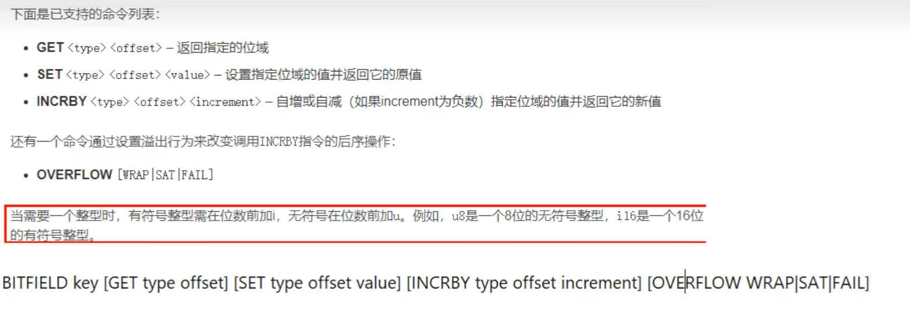
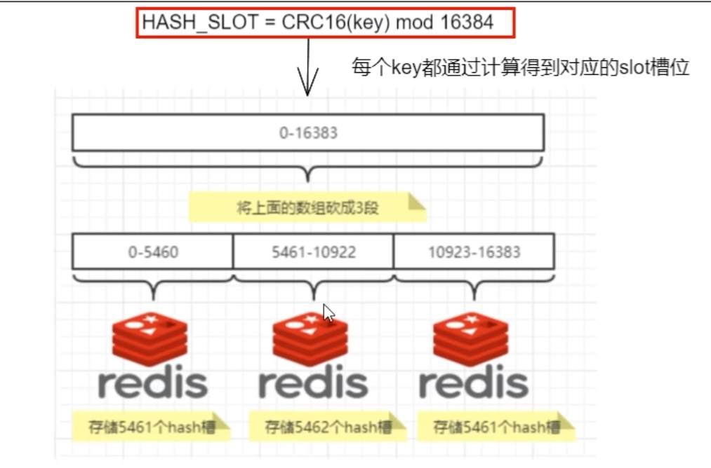
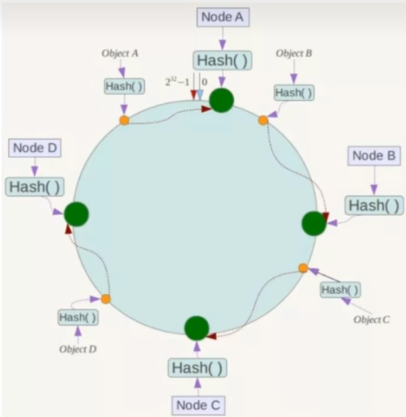

# 安装

使用`Docker-Desktop`安装镜像即可

# 介绍

安装之后，在镜像内部`/user/local`路径可以查看redis的所有可执行文件

- redis-benchmark

性能测试工具，服务启动后运行该命令，看看自己本子性能如何

- redis-check-rdb

修复有问题的RDB文件

- redis-sentinel

redis集群使用

- redis-check-aof

修复有问题的AOF文件

- redis-cli

redis客户端操作入口

- redis-server

redis服务启动

# 配置

```bash
docker run -p 6379:6379 --name redis -v C:\Users\Administrator\Code\docker\redis\redis.conf:/etc/redis/redis.conf -v C:\Users\Administrator\Code\docker\redis\data:/data -d redis:alpine3.20 redis-server /etc/redis/redis.conf
```


**挂载redis.conf**

从https://github.com/redis/redis下载`redis.conf`文件，保存在主机上某个位置

在创建容器的时候，建立挂载目录，将`redis.conf`挂载到容器目录中的

`/usr/local/etc/redis/redis.conf`

**修改redis.conf**

- 默认`daemonize no`改为`daemonize yes`

让redis后台启动，如果是docker容器启动则没必要修改，会冲突

- 默认`protected-mode yes`改为`protected-mode no`

只允许本机回环连接，不允许其他机器连接

- 默认`bind 127.0.0.1`改为直接注释掉

（默认`bind 127.0.0.1`只能本机访问）或改成本机IP地址，否则影响远程IP连接

- 添加redis密码改为 `requirepass` 你自己设置的密码

**启动命令**

`redis-cli -p 6379 -a pwd`  启动6379端口的redis,密码是pwd

或者不使用`-a`确认密码，在cli内部使用`auth pwd`确认密码

# 十大数据类型

命令查询手册：https://redis.io/docs/latest/commands/

> 命令不区分大小写，key区分大小写

## 常用命令

- `keys *` 查看当前库所有key
- `exists key` 查看key是否存在
- `type key` 查看key的类型
- `del key` 删除kv
- `unlink key` 非阻塞删除key，只是把key从keyspace元数据中删除，真正的删除会在后续异步进行
- `ttl key` 查看key过期时间
- `expire key` 为key设置过期时间
- `move key dbindex (0-15)` 将当前key移动到其他db中
- `select dbindex` 切换当前库
- `dbsize`查看当前库key数量
- `flushdb` 清空当前库
- `flushall` 清空全部库
- `help @类型` 查看帮助手册

## String

最大长度为512M

```bash
SET key value [NX | XX] [GET] [EX seconds | PX milliseconds |
  EXAT unix-time-seconds | PXAT unix-time-milliseconds | KEEPTTL]
```

- NX 仅当键不存在时才设置
- XX 仅当键存在时才设置
- GET 返回存储在 key 处的旧字符串，如果 key 不存在则返回 nil。如果存储在 key 处的值不是字符串，则返回错误并中止
- EX 设置秒级过期时间
- PX 设置毫秒级过期时间
- EXAT 设置秒级unix时间戳过期时间
- PXAT 设置毫秒级unix时间戳过期时间
- KEEPTTL 保留键相关的过期时间

**同时获取/设置多个键值对**
`MSET k1 v1 k2 v2 ...` 同时设置多个kv

`MGET k1 k2... 同时获取多个v`

> MSET只能设置基本的键值对，以上SET的参数无法使用

`MSETNX k1 v1 k2 v2` **仅当k1,k2不存在时设置键值对**，**任意key存在操作失败**，**具有原子性**

`GETSET k v` = `SET K V GET` 设置新值获取旧值

**获取和设置指定范围的值**

`GETRANGE k offset1 offset2` 闭区间获取o1-o2之间的字符串

`SETRANGE k offset value` 从offset的位置开始，将value值依次替换进字符串 ，长度超过则增加长度

```bash
127.0.0.1:6379> set k 1234567
OK
127.0.0.1:6379> getrange k 0 4
"12345"
127.0.0.1:6379> setrange k 1 000
(integer) 7
127.0.0.1:6379> get k
"1000567"
127.0.0.1:6379> setrange k 4 00000
(integer) 9
127.0.0.1:6379> get k
"100000000"
```

**数值增减**

> 必须是数字才能加减

`INCR key`  加一

`INCRBY key increment` 增加指定整数

`DECR key` 减一

`DECRBY key decrement` 减少指定的整数

**获取字符串长度和内容追加**

`STRLEN k` 获取k的长度

`APPEND k v` 将v追加到k对应内容的尾部

**分布式锁**

`SET lock_name res_value NX EX 30` 

获取锁

`DEL lock_name`

释放锁

## List

底层为双端链表结构

**创建和查询**

`LPUSH k v1 v2 v3...` 在list左侧插入数据

`RPUSH k v1 v2 v3...` 在list右侧插入数据

`LRANGE k offset1 offset2`  从左侧开始根据下标查询区间数据

**弹出数据**

`LPOP k` 左侧弹出元素

`RPOP k` 右侧弹出元素

**其余**

`LINDEX k index` 根据下标获得元素

`LLEN k` 获取列表元素个数

`LREM k n v` 删除list中的n个值为v的元素  

`LTRIM k start end` 截取区间内的元素再赋值给本身

`RPOPLPUSH source destination` 从source中rpop元素，将该元素lpush到dest中

`LSET k index v ` 在对于下标上设置值 （不能超下标）

`LINSERT k before/after ev v` 在ev已有值的前面或者后面插入新值v

无论存在几个ev，默认选取第一个

## Hash

> 类似于`Map<String, Map<Object, Object>`

`HSET k field v field  v` 设置hash，等同于`HMSET`

`HGET k field` 获取k中field的v

`HMEGT k field1 field2...` 获取k中多个field的v

`HGETALL k`  获取k的所有field

`HDEL k field...` 删除k的多个field 

`HLEN k` 获取k中的键值对数量

`HEXIST k field` 查看k中是否存在filed键值对

`HKEYS k` 获取k中的所有filed

`HVALS k` 获取k中的所有value  

`HINCRBY k filed increment`  为k中的整数添加指定的值

`HINCRBYFLOAT k filed increment`  为k中的整数添加指定的浮点数值

## Set

单值多value且无重复

`SADD k m1 m2 m3 ...` 添加元素

`SMEMBERS k` 查询集合所有元素

`SISMEMBER K m` 判断元素是否在集合中

`SREM k m m2 ...` 删除元素（如果存在）

`SCARD k` 获取集合元素个数

`SRANDMEMBER k count` 从集合中随机展示count个元素

`SPOP k count` 从集合中随机弹出count个元素

`SMOVE k1 k2` 在k1中存在的某个元素将k1中元素移动到k2

`SDIFF k1 k2...`  差集 属于k1但不属于k2..的元素集合

`SUNION k1 k2 ...` 并集 合并k1,k2..的元素集合

`SINTER k1 k2 ...` 交集 存在于k1,k2..中的元素集合

`SINTERCARD numkeys key [key ...] [LIMIT limit]`返回多个集合的交集的基数，不返回集合

- numberkeys 需要交的集合的个数
- limit 限制基数上限，若达到限制则算法退出

```
sintercard 2 k2 k3 limit 1
```

## ZSet

有序集合 （sorted set）在set基础上每个val前加一个score分值，用于排序

`ZADD key [NX | XX] [GT | LT] [CH] [INCR] score member [score member  ...]`  添加集合元素

`ZRANGE k start end [WITHSCORES]` 获取区间集合元素 [是否显示分数]

`ZREVRANGE start end [WITHSCORES]` 先倒转集合，再显示区间元素 

`ZRANGEBYSCORE k min max [WITHSCORES] [LIMIT offset count]`

获取指定分数范围的元素 

> `[LIMIT offset count]` 限制范围为从offset开始到第count个元素

`)`加载min/max前表示开区间，不包含

> ZRANGEBYSCORE z )1 )4 withscores limit 0 2

`ZSCORE k member` 获取元素的分数

`ZCARD k` 获取集合的元素个数

`ZREM k memebr` 删除元素

`ZINCRBY k increment member` 增加某个元素的分数

`ZCOUNT k min max` 查询区间元素个数

`ZMPOP numkeys key [key ...] <MIN | MAX> [COUNT count]` 

从多个zset中选取第一个非空zset，弹出min/max排序的count个元素

`ZRANK k member`获取下标值

`ZREVRANK k member`获取倒装后的下标值 

> ...其他和Set类似的合并区间如`ZDIFF` `ZINTER` `ZUNION`

## BitMap

01表示的二进制位的bit数组，底层采用String实现，所以可以使用`GET`获取字符串内容，`STRLEN`获取字符串长度

> 因为字符串限制最大512M，所以单个bitmap的位数最多就是2^32位

`SETBIT k offset val` 设置BITMAP

`GETBIT k offset ` 获取对应位置的值

`BITCOUNT k start end`  获取区间内的值为1的数量

`BITOP [AND|OR|NOT|XOR] dest k..` 对多个k做不同操作，把结果保存到dest中

## Hyperloglog

统计海量数据的基数， 但并不存储数据

`PFADD k v....` 添加hyperloglog

`PFCOUNT k....` 统计k的基数，若是多个k，则将其合并到一个临时表中统计其基数

`PFMERGE dest k....` 将多个k合并到dest

## GEO

存储地理位置信息并搜索，类型是zset，故zset相关的命令GEO也能使用

`GEOADD k [NX|XX] lon lat member lon lat member ...`

> `GEOADD scenary 123 32.2 成都 98.2 67.1 长沙`

添加地理位置信息

`GEOPOS k member...  `返回对应member的经纬度

`GEOHASH k member...` 返回member经纬度的hash表示

`GEODIST k m1 m2 [m|km|ft|mi]` 返回k中的两个member之间的距离 [米|千米|英尺|英里]

`GEOSEARCH key <FROMMEMBER member | FROMLONLAT longitude latitude> <BYRADIUS radius <M | KM | FT | MI> | BYBOX width height <M | KM | FT | MI>> [ASC | DESC] [COUNT count [ANY]] [WITHCOORD] [WITHDIST] [WITHHASH]` 

搜索地理位置

- `<FROMMEMBER member | FROMLONLAT longitude latitude>` **强制选项** 

  `FROMMEMBER member`代表从key中选取一个member作为当前位置，`FROMLONLAT longitude latitude`代表使用自定义经纬度作为当前位置

- `<BYRADIUS radius <M | KM | FT | MI> | BYBOX width height <M | KM | FT | MI>>`**强制选项**

  `BYRADIUS radius <M | KM | FT | MI>`代表从当前位置的圆形范围的多少距离内搜索

  `BYBOX width height <M | KM | FT | MI>` 代表从当前位置的矩形范围内搜索

- ASC：最近到最远排序 DESC：最远到最近排序 COUNT: 数量
- [WITHCOORD]: 显示结果经维度 [WITHDIST]：显示和当前位置的距离 [WITHHASH]：采用hash显示

```bash
redis> GEOADD Sicily 13.361389 38.115556 "Palermo" 15.087269 37.502669 "Catania"
(integer) 2
redis> GEOADD Sicily 12.758489 38.788135 "edge1"   17.241510 38.788135 "edge2"
(integer) 2
redis> GEOSEARCH Sicily FROMLONLAT 15 37 BYRADIUS 200 km ASC
1) "Catania"
2) "Palermo"
redis> GEOSEARCH Sicily FROMLONLAT 15 37 BYBOX 400 400 km ASC COUNT 4 WITHCOORD WITHDIST
1) 1) "Catania"
   2) "56.4413"
   3) 1) "15.08726745843887329"
      2) "37.50266842333162032"
2) 1) "Palermo"
   2) "190.4424"
   3) 1) "13.36138933897018433"
      2) "38.11555639549629859"
3) 1) "edge2"
   2) "279.7403"
   3) 1) "17.24151045083999634"
      2) "38.78813451624225195"
4) 1) "edge1"
   2) "279.7405"
   3) 1) "12.7584877610206604"
      2) "38.78813451624225195"
redis> 

```

`GEOSEARCHSTORE destination source <FROMMEMBER member |
  FROMLONLAT longitude latitude> <BYRADIUS radius <M | KM |FT | MI> | BYBOX width height <M | KM | FT | MI>> [ASC | DESC] [COUNT count [ANY]] [STOREDIST]`

搜索地理位置结果并存储到destination中，语法和`GEOSEARCH`相似

STOREDIST：将距离也保存下来

## Stream

消息队列，不想学，欠着

## BitField

将字符串看成位数组，读取和操作它



- offset 操作位域的范围
- value 起始位

# 持久化机制

## RDB

Redis Database 以指定的时间间隔为数据集创建时间点快照 

快照名为`dump.rdb`

### **配置说明**

#### **配置RDB间隔**

**redis.conf:** `save <seconds> <changes> [<seconds> <changes> ...]`  

配置RDB保存快照间隔，可以配置多种，意为**每过seconds秒，如果有changes次写操作，则更新快照**


#### **配置dump.rdb文件保存路径和文件名称**

 `dir ./` 在此配置rdb和aof持久化文件保存地址

> 在`redis-cli`中可以通过`CONFIG GET dir`查看

 `dbfilename dump.rdb` 在此修改rdb文件名


### **手动触发**

- `SAVE`  同步操作，**阻塞主线程**建立数据快照 （生产环境不会使用）
- `BGSAVE` 后台操作，**fork子进程**进行建立数据快照操作


### **修复RDB文件**

使用`redis-check-rdb dump.rdb`修复破损的rdb文件


### **RDB执行时机**

- 依据配置文件配置时机
- 手动执行
- 执行`flushdb`/`flushall`时会产生一个空的`dump.rdb`
- `shutdown`时且没有开启`AOF`持久化时自动执行
- 主从复制时，主节点自动触发


### **禁用RDB**

命令：`redis-cli config set save ""`

或者配置文件:  `save ""`


### **优化配置项**

`stop-writes-on-bgsave-error` 

- **yes** 若后台保存失败的时候，为了让用户了解到出错了，redis将停止写入，当有新的后台保存进程执行的时候，redis将自动允许写入
- **no** 出错也继续写入

`rdbcompression` 保存快照时是否压缩字符串对象，开启可以节省空间，关闭可以节省一些CPU

`rdbcheksum` 是否开启CRC64校验和，开启可以让RDB更加抗损坏，关闭可以提升一些性能

`rdb-del-sync-files` 控制在某些情况下是否删除同步（sync）过程中生成的临时RDB文件，默认不删除，可以用于备份	


### **优缺点**

**优点**

- RDB 是 Redis 数据的一个非常紧凑的单文件快照。RDB 文件非常适合备份且可以传输到远程数据中心
- RDB 可最大程度地提高 Redis 的性能，执行RDB时由父进程fork子进程执行，父进程不会进行任何IO操作，其余都由子进程执行
- 与 AOF 相比，RDB 允许使用大数据集更快地重启。
- 在副本上，RDB 支持重启和故障转移后的部分重新同步

**缺点**

- 在RDB间隔内的断电宕机的操作，有丢失在此间隔内新增的数据的可能
- RDB需要fork子进程来执行持久化操作，如果数据集很大且CPU性能不佳，即使有COW加持，但是复制页表等初始化设置可能会耗费一定时间，使主线程停止服务几毫秒甚至是一秒钟

## AOF

Append Only File 以日志形式记录redis每一个写操作，只允许追加文件但不能改写文件

保存的是`appendonly.aof`文件

> 大概格式为
>
> ```
> SET
> $1
> k
> $1
> 1
> $4
> PXAT
> $13
> 1719822012264
> ```
>
> 启动redis时将读取执行，过期时间采用毫秒级时间戳表示，若键过期会追加DEL命令

### **配置项**

#### **开启AOF**

 `appendonly yes`

#### **配置写回策略**

AOF接收写操作并存入AOF缓冲区，根据不同的缓冲策略来决定回刷到磁盘的时机

`appendfsync [always|everysec|no]`

- always 每收到一条写操作就同步到磁盘aof文件中 (最安全，性能略低)
- everysec 每秒同步一次缓冲区中的写操作到aof文件中 （默认折中策略）
- no 根据操作系统决定什么时候同步写操作 （性能很高，但是不安全）

> 数据由主线程写入到缓冲区，再由后台线程调用fsync刷入磁盘

#### **配置文件保存目录**

文件的父文件夹由RDB的`dir`配置控制，但是可以通过以下配置项来更改最终保存aof的文件夹名称

> /dir/appenddirname/appendfilename

 `appenddirname "appendonlydir"`

 `appendfilename "appendonly.aof"`

> redis7 新特性 Multi-Part AOF
>
> - appendonly.aof.1.base.rdb 作为基础文件
> - appendonly.aof.1.incr.aof, appendonly.aof.2.incr.aof 作为增量文件
> - appendonly.aof.manifest 作为清单文件

#### no-appendfsync-on-rewrite

当后台保存或重写日志时是否执行fsync调用，注释中声明执行前两种操作时，执行fsync可能会被阻塞很长时间，一般为no

### **修复incr.aof文件**

若写入aof文件的过程中遇到不可控因素发生错误，可以使用`redis-check-rdb --fix ..incr.aof`修复文件，使之变为可读的正确格式


### **AOF重写机制**

压缩AOF文件内容，只保留可以恢复数据的最小指令集

重写之后文件序号+1 `appendonly.aof.1.base.rdb` -> `appendonly.aof.2.base.rdb` ...

#### **重写过程**

**Redis >= 7.0**

- Redis fork，因此现在我们有一个子进程和一个父进程。
- 子进程开始在临时文件中写入新的基础 AOF。
- 父级会打开一个新的增量 AOF 文件来继续写入更新。如果重写失败，那么旧的基础和增量文件（如果有的话）加上这个新打开的增量文件就代表了完整的更新数据集，所以我们是安全的。
- 当子进程完成对基础文件的重写后，父进程会收到信号，并使用新打开的增量文件和子进程生成的基础文件来构建临时清单并将其持久化。
- Redis 再对清单文件进行原子交换，以便此 AOF 重写的结果生效。Redis 还会清理旧的基础文件和任何未使用的增量文件。

**Redis < 7.0**

- Redis fork，因此现在我们有一个子进程和一个父进程。
- 子进程开始在临时文件中写入新的 AOF。
- 父级将所有新的更改累积在内存缓冲区中（但同时它将新的更改写入旧的仅追加文件中，因此如果重写失败，我们是安全的）。
- 当子进程完成文件重写后，父进程会收到信号，并将内存缓冲区附加到子进程生成的文件末尾。
- 现在 Redis 会原子地将新文件重命名为旧文件，并开始将新数据附加到新文件中。

#### **自动触发**

 `auto-aof-rewrite-percentage 100`
 `auto-aof-rewrite-min-size 64mb`

redis会记录重启之后上次重写的文件大小（如果没有重写过，那就是启动时的文件大小，如果当前文件大小比记录大小大了100%倍，则触发重写

触发重写最低的大小为64MB

#### 手动触发

调用`bgrewriteaof`指令

### **优缺点**

**优点**

- 持久性更强，如果选择的每秒一次的写回策略，发生宕机也最多丢失一秒的数据
- AOF 日志是仅附加日志，因此不同RDB文件是复制文件，不会损坏文件，最多因为宕机而只写入了半条命令，可以通过check-aof工具修复
- 当 AOF 太大时，Redis 能够在后台自动重写。重写是完全安全的，因为 Redis 在继续向旧文件追加内容的同时，会使用创建当前数据集所需的最少操作集生成一个全新的文件，一旦第二个文件准备就绪，Redis 就会切换这两个文件并开始向新文件追加内容。
- AOF 以易于理解和解析的格式逐一记录所有操作的日志。您甚至可以轻松导出 AOF 文件。例如，即使您不小心使用该[`FLUSHALL`](https://redis.io/commands/flushall)命令刷新了所有内容，只要在此期间没有执行日志重写，您仍然可以通过停止服务器、删除最新命令并重新启动 Redis 来保存数据集。

**缺点**

- 对于同一数据集，AOF 文件通常比等效的 RDB 文件更大。
- 根据确切的 fsync 策略，AOF 可能比 RDB 慢。不使用fsync情况下可以和RDB差不多

## RDB+AOF混合模式

> RDB模式默认开启，若没有配置RDB触发间隔，当且仅当执行`SHUTDOWN`和`FLUSHDB/ALL`时执行

**若开启了AOF模式，则重启redis，只会读取AOF的日志来重建数据**

当同时开启了AOF+RDB，并且配置RDB间隔时，就等于拥有了定期rdb全量备份和aof增量备份

`aof-use-rdb-preamble yes`  开启后，当触发AOF重写时，**redis会将数据存储为RDB格式，存储在base.aof的头部，即为base.rdb**，新增的指令以AOF格式追加

这样的目的是可以更快的读取数据来重建

## 纯缓存模式

`save ""` 关闭RDB自动触发 `appendonly no`关闭AOF自动触发 即为纯缓存模式

> 依旧可以通过`save/bgsave`手动触发RDB，`bgrewriteaof`手动触发AOF

# 事务

redis事务是一系列线性的指令集合，有以下特点

- 因为是单线程，所以在执行事务的过程中不会有其他指令干扰
- 不保证原子性，通过线性队列执行每一个指令，单个指令成功与否不影响其他指令
- 不支持回滚

语法格式：

```bash
127.0.0.1:6379> multi //开启事务
OK
127.0.0.1:6379(TX)> set k 1
QUEUED
127.0.0.1:6379(TX)> zrange k 0 1
QUEUED
127.0.0.1:6379(TX)> exec //提交事务
1) OK
2) (error) WRONGTYPE Operation against a key holding the wrong kind of value
127.0.0.1:6379> get l
(nil)
127.0.0.1:6379> get k
"1"
```

可以通过`discard`放弃事务

**Watch**

类似于CAS，当值的版本与所有的版本不匹配时，无法执行

可以通过`watch k...`来监听多个key，和`unwatch`放弃监听所有的key，当客户端断连和事务EXEC时自动放弃监听所有key

**当监听key之后再执行事务，若监听的key值发生了改变，则事务全体失败**

```bash
127.0.0.1:6379> watch k
OK
127.0.0.1:6379> multi
OK
127.0.0.1:6379(TX)> set k 2
QUEUED
127.0.0.1:6379(TX)> set k2 3
QUEUED

此时其他连接执行了 set k 9 -> OK

127.0.0.1:6379(TX)> exec
(nil)
127.0.0.1:6379> get k
"9"
127.0.0.1:6379> get k2
"2"
```

# 管道

Redis pipelining 通过批处理多条命令来优化请求/响应往返时间RTT（Request/Response protocols and round-trip time (RTT)）

> redis接收到管道命令后，通过队列在内存中保存结果并返回，所以一次批处理的命令数量需要是一个合理的值

通过管道执行批处理，除了可以减少RTT之外，还可以减少redis频繁的`read,write`系统调用**使其在用户态和内核态之中的频繁转换**，节省性能

**执行管道批处理时不会阻塞其他命令的执行，同时管道中的任意命令失败也不会停止执行其他命令**

```bash
ins:
set k 100
set k2 100
set k3 100
mget k k2 k3

/data # cat ins | redis-cli --pipe  // 执行批处理
All data transferred. Waiting for the last reply...
Last reply received from server.
errors: 0, replies: 4
/data # cat ins | nc localhost 6379 // 通过netcat执行批处理
+OK
+OK
+OK
*3
$3
100
$3
100
$3
100
```

# Pub/Sub

不想学，跳过了

# 主从复制 Replication

https://redis.io/docs/latest/operate/oss_and_stack/management/replication/

主机和从机的同步过程都是异步的，不会影响各自的读写操作

当一台redis被标识为slave后，默认是只读的，不能执行写操作

当master宕机了，slaves不会选举出新的master，而是继续运行等待master重启

## **配置**

从机需特殊配置如主机ip和port等，主机无需特殊配置

**从机配置：配置Master**

 `replicaof 主机ip主机port`

**从机配置：强制声明从机的ip和port（避免容器环境下的错误）**

`replica-announce-ip 从机可被访问的ip`
`replica-announce-port 从机可被访问的port`

**密码权限**

若主机设置了访问密码 `requirepass xx`

则从机也必须设置 `masterpass xx`才能同步

## 命令

`slaveof [ip port | NO ONE]` 动态选择master，变为其从机或者自身变为主机

> 通过命令设置的从属关系，重启后失效

`info replication` 查看主从复制状态

## 错误记录

**使用docker配置多个实例总是丢失连接，从机无法从硬盘加载DB**

> slave: Failed trying to load the MASTER synchronization DB from disk
>
> master: Connection with replica 172.17.0.3:6380 lost.

刚开始以为是网络问题，但是主从容器一直能互相ping通且nc访问，切换了很多网卡，和容器网络模式依旧无效

**解决方法（二选一）**：  

- 从机配置：`repl-diskless-load on-empty-db`

- 从机的dir目录换成未挂载的目录

## 建议

如果主从架构为一主多从，且主机为了最大性能关闭持久化的情况下，建议将主机配置为避免错误自动重启

因为如果主机出错重启，将会以空数据集状态重启，届时所有从机都会同步此空状态，造成数据丢失

## 缺点

master如果挂掉可能就真挂掉了，因为无法推举出新的master实例，所以现在接近战场场的是，**哨兵模式**

# 哨兵模式 Redis Sentinel

- **监控**。Sentinel 不断检查主实例和副本实例是否按预期工作。
- **通知**。Sentinel 可以通过 API 通知系统管理员或其他计算机程序，所监控的 Redis 实例之一出现了问题。
- **自动故障转移**。如果主服务器未按预期工作，Sentinel 可以启动故障转移过程，将副本提升为主服务器，其他附加副本将重新配置为使用新的主服务器，并且使用 Redis 服务器的应用程序会收到有关连接时要使用的新地址的通知。
- **配置提供程序**。Sentinel 充当客户端服务发现的权威来源：客户端连接到 Sentinels 以询问负责给定服务的当前 Redis 主服务器的地址。如果发生故障转移，Sentinel 将报告新地址。

为了实现哨兵模式的高可用性，至少需要三个哨兵实例

## 配置

`sentinel.conf`

```conf
port 5000
daemonize yes
bind 0.0.0.0
logfile "/data/sentinel.log"
dir "/tmp/sentinel"
sentinel monitor mymaster 172.17.0.3 6381 2
sentinel down-after-milliseconds mymaster 60000
```


**配置master密码**

`sentinel auth-pass 主机名 密码`

**哨兵端口**

`port 23679`

**配置哨兵监控的主机**

`sentinel monitor 主机名 主机ip 主机端口 quorum`

> quorum是最小下线数量，具有三台哨兵实例时，此值至少为2，意为当有至少两台哨兵实例无法访问主机时，将会执行故障转移

**配置判断实例不可访问的最长时间**

超过此时间实例未响应哨兵的Ping或者错误回复，即认为实例不可访问

`sentinel down-after-milliseconds mymaster 60000`

**故障转移超时时间**

`sentinel failover-timeout mymaster 180000`

**并行同步的从机个数**

当Master挂了后，哨兵会选出新的Master，此时，剩余的slave会向新的master发起同步数据，设置为1即故障转移只会影响一个从机，但时间最长

`sentinel parallel-syncs mymaster 1`

## 命令

**启动redis sentinel**

`re	nel`

## 行为

启动sentinel后，sentinel会自动连接到主机并识别其他sentinel，且动态修改自身配置文件，持久化配置信息

```conf
port 5000
daemonize yes
bind 0.0.0.0
logfile "/data/sentinel.log"
dir "/tmp/sentinel"
sentinel monitor mymaster 172.17.0.3 6381 2
sentinel down-after-milliseconds mymaster 60000

# Generated by CONFIG REWRITE
latency-tracking-info-percentiles 50 99 99.9
pidfile "/var/run/redis.pid"
user default on nopass sanitize-payload ~* &* +@all
sentinel myid d9e86901b92a86e2893b1a3ef90a4265440b1f3b
sentinel config-epoch mymaster 1
sentinel leader-epoch mymaster 1
sentinel current-epoch 1

sentinel known-replica mymaster 172.17.0.4 6380

sentinel known-replica mymaster 172.17.0.2 6379

sentinel known-sentinel mymaster 172.17.0.4 5002 1f9257d24177c7b378dbbeebc37aa460897b2999

sentinel known-sentinel mymaster 172.17.0.4 5001 2ad225394eb139429fc2ce9fc6a4a9e4946fc9f1

```

## 故障转移

**主观下线**

当某台哨兵无法和某台实例进行心跳连接时，当前哨兵则主观认为此实例无法使用

可以在`sentinel.conf`中配置超时时间 `sentienl down-after-milliseconds master time`

**客观下线**

当所有哨兵中，有`quorum`台哨兵都认为某个实例无法访问，则认为其客观下线，开始故障转移

**故障转移**

在开始故障转移之前，哨兵之间需要选举出一个领导者来执行此操作，**通过在主观下线的哨兵中选择**，这些哨兵需要获得其余哨兵`(哨兵数量-quorum)`的授权（`RAFT算法，先到先得`），获得授权数量最多的即为领导者

**master选举流程**

1. 首先比较priority优先级，优先级最高的当选

> `replica-priority num` 数字越小，优先级越高 ，10最小

1. 其次比较主从复制的偏移量，偏移量最大（同步程度最高）的当选
2. 最终比较Run ID最小的当选

**当进行故障转移后，redis.conf也会被动态改写，主从机配置将会被改写**

> 主机宕机且其他从机上位之后，主机会被降级为从机
>
> 若主机没有配置其他从机的密码 `<masterpass pass>`，必须配置一个以防降级无法连接

> 但是我故障转移后并没有改写文件，可能是因为docker挂载的原因吧 TODO

# 集群模式 Cluster

Redis集群是一个提供在多个Reids节点之间共享数据的程序集

> 集群支持多个Master，由于集群自带故障转移机制，所以无需使用Sentinel模式
>
> 集群**不保证强一致性**，在特定情况下，集群可能会丢弃一些系统收到的写入命令

## 槽位/分片



**槽位**

槽位和数据互相映射，每个槽位都可以存储key，Redis集群中共有`16384(2^14)`个槽位，key通过以下计算存入对应槽位

```
HASH_SLOT = CRC16(key) mod 16384
```

**分片**

在集群中，每个redis实例都是一个分片，他们将16384个槽位分成多片，key通过确定性哈希函数，可以将同一个key多次映射到同一个分片上

优势：**利于扩容缩容，只需要调整每个分片所拥有的哈希槽数量即完成扩缩容**

## 槽位映射算法

### **哈希取余**

```
hash(key) % 实例数量
```

**优点**：简单的方式完成集群配置

**缺点**：不利于扩缩容，根据固定实例数量计算的映射关系，实例数量改变后结果也会变化

### 一致性哈希算法

将整个hash值空间即全量集构成一个哈希环，即首尾相连，每个节点可以存入一个key

再将实例的ip或者其他唯一标识进行哈希计算映射到节点上

最终将key进行hash计算并映射到节点上，再沿哈希环顺时针寻找第一个实例节点，由此作为存储节点，将数据存储到此实例上



**优点：** 

**容错性**: 某台实例出错，只会影响一部分数据，且新的数据会顺移到下一台实例进行存储

**扩展性**: 扩缩容不会使所有哈希映射失效，仅需要将部分数据重新映射到对应的新实例即可

**缺点**：若实例过少，且哈希节点分布不均，容易造成数据分布不均匀，即一个过多一个过少

### 哈希槽分区	

即Redis集群槽位分片模式


#### 为什么槽位是16384而不是65535

因为CRC16算法可以生成16位哈希，所以支持2^16位哈希空间，而不只是2^14

- **如果槽位为65536，发送心跳信息的消息头达8k，发送的心跳包过于庞大。**

  在消息头中最占空间的是`myslots[CLUSTER_SLOTS/8]`。当槽位为65536时，这块的大小是：`65536÷8÷1024=8kb`在消息头中最占空间的是`myslots[CLUSTER_SLOTS/8]`。当槽位为16384时，这块的大小是：`16384÷8÷1024=2kb`

  因为每秒钟，redis节点需要发送一定数量的ping消息作为心跳包，如果槽位为65536，这个ping消息的消息头太大了，浪费带宽。

- **redis的集群主节点数量基本不可能超过1000个**

  集群节点越多，心跳包的消息体内携带的数据越多。如果节点过1000个，也会导致网络拥堵。因此redis作者不建议redis cluster节点数量超过1000个。那么，对于节点数在1000以内的redis cluster集群，16384个槽位够用了。没有必要拓展到65536个。

- **槽位越小，节点少的情况下，压缩比高，容易传输**

  Redis主节点的配置信息中它所负责的哈希槽是通过一张bitmap的形式来保存的，在传输过程中会对bitmap进行压缩，但是如果bitmap的填充率slots／N很高的话(N表示节点数)，bitmap的压缩率就很低。如果节点数很少，而哈希槽数量很多的话，bitmap的压缩率就很低。


## 配置

> 集群模式至少需要三个Master和三个Slave

可以通过配置单个redis实例的`redis.conf`启动，如下：

> 不需要显示配置主从关系

```bash
bind 0.0.0.0
daemonize yes
protected-mode no
port 6381
1ogfile "/myredis/cluster/cluster6381.log"
pidfile /myredis/cluster6381.pid
dir /myredis/cluste.rdb
filename dump6381.rdb
appendonlyyes
appendfilename "appendonly6381.aof"
requirepass 111111
masterauth 111111

cluster-enabled yes
cluster-config-file nodes-6381.conf
cluster-node-timeout 5000
cluster-require-full-coverage yes #集群必须全部可用才能对外提供服务
```

也可以选择docker容器直接配置启动

```sh
docker run -p 6385:6385 --name redis-cluster-m5 -v C:\Users\Administrator\Code\docker\redis\cluster\m5:/data -d redis:alpine3.20 --cluster-enabled yes --appendonly yes --port 6385 --repl-diskless-load on-empty-db
...
```

> 集群启动之后会创建node.conf文件配置节点关系

## 命令

**创建集群**

`redis-cli --cluster create mhost:mport shost:sport... mhost:mport shost:sport....... 	--cluster replicas num `

创建n主n从集群模式

- `--cluster replicas` 说明单个主节点的从节点个数

```bash
/data # redis-cli --cluster create 172.17.0.2:6379 172.17.0.3:6380 172.17.0.4:6381 172.17.0.5:6382 172.17.0.6:6383 172.17.0.7:6384 --cluster-replicas 1
>>> Performing hash slots allocation on 6 nodes...
Master[0] -> Slots 0 - 5460
Master[1] -> Slots 5461 - 10922
Master[2] -> Slots 10923 - 16383
Adding replica 172.17.0.4:6381 to 172.17.0.2:6379
Adding replica 172.17.0.7:6384 to 172.17.0.5:6382
Adding replica 172.17.0.6:6383 to 172.17.0.3:6380
M: e5bda51c19a50cd61da8d0894604abfca7dc337b 172.17.0.2:6379
   slots:[0-5460] (5461 slots) master
M: 74ef608004d22c6c9a216aa249233b0741a1ac08 172.17.0.5:6382
   slots:[5461-10922] (5462 slots) master
M: c67a98c63412693da837ac49a93c7404b6a890e3 172.17.0.3:6380
   slots:[10923-16383] (5461 slots) master
S: a04c1d9a33775ce8eba82218fafe86f114b6c32b 172.17.0.6:6383
   replicates c67a98c63412693da837ac49a93c7404b6a890e3
S: c7ecd31a6ba9b597fde4bbf37485aaa1cf691ace 172.17.0.4:6381
   replicates e5bda51c19a50cd61da8d0894604abfca7dc337b
S: 3de92a0e9925a209325595ae5edc7356ee5fafc7 172.17.0.7:6384
   replicates 74ef608004d22c6c9a216aa249233b0741a1ac08
Can I set the above configuration? (type 'yes' to accept): yes
>>> Nodes configuration updated
>>> Assign a different config epoch to each node
>>> Sending CLUSTER MEET messages to join the cluster
Waiting for the cluster to join
.
>>> Performing Cluster Check (using node 172.17.0.2:6379)
M: e5bda51c19a50cd61da8d0894604abfca7dc337b 172.17.0.2:6379
   slots:[0-5460] (5461 slots) master
   1 additional replica(s)
M: c67a98c63412693da837ac49a93c7404b6a890e3 172.17.0.3:6380
   slots:[10923-16383] (5461 slots) master
   1 additional replica(s)
S: c7ecd31a6ba9b597fde4bbf37485aaa1cf691ace 172.17.0.4:6381
   slots: (0 slots) slave
   replicates e5bda51c19a50cd61da8d0894604abfca7dc337b
S: 3de92a0e9925a209325595ae5edc7356ee5fafc7 172.17.0.7:6384
   slots: (0 slots) slave
   replicates 74ef608004d22c6c9a216aa249233b0741a1ac08
M: 74ef608004d22c6c9a216aa249233b0741a1ac08 172.17.0.5:6382
   slots:[5461-10922] (5462 slots) master
   1 additional replica(s)
S: a04c1d9a33775ce8eba82218fafe86f114b6c32b 172.17.0.6:6383
   slots: (0 slots) slave
   replicates c67a98c63412693da837ac49a93c7404b6a890e3
[OK] All nodes agree about slots configuration.
>>> Check for open slots...
>>> Check slots coverage...
[OK] All 16384 slots covered.
```

**查看集群节点**

`cluster nodes`

**客户端开启集群模式读写**

`redis-cli .. -c`

因为不同key被映射到不同的槽位，而每个实例分片拥有不同的槽，普通连接进行写操作不一样是正确的槽故而无法存储，所以需要开启集群模式路由到对应的槽

```bash
127.0.0.1:6383> keys *
1) "k2"
127.0.0.1:6383> get k2
(error) MOVED 449 172.17.0.2:6379
127.0.0.1:6383> quit
/data # redis-cli -p 6383 -c
127.0.0.1:6383> get k2
-> Redirected to slot [449] located at 172.17.0.2:6379
"2"
172.17.0.2:6379> set k1 1
-> Redirected to slot [12706] located at 172.17.0.4:6381
OK
172.17.0.4:6381> get k1
"1"
172.17.0.4:6381> 
```

**查看key对应槽位**

`cluster keyslot key`		

**调整主从关系**

`cluster failover` 当故障迁移之后可以使用此命令恢复原本的主从关系

**判断槽位是否被占用**

`cluster countkeyinslot slot_num` 

## 故障迁移

> 集群无法保证强一致性，即主机无法将新的写入异步传播到副本且停止服务时间足够长，然后进行从机上位这段时间内，写入将永久丢失

当主机停止服务后，从机自动上位成为主机，而后主机重启变为从机

当主机及所有从机都停止服务后，对应槽位将不可读写

## **扩容**

`redis-cli --cluster add-node new_host:new_port existing_host:existing_port`

**通过已存在的节点，将新节点作为主节点添加进集群**

`redis-cli --cluster reshard <host:port> or <host> <port>`

```bash
/data # redis-cli --cluster add-node 172.17.0.8:6385 172.17.0.6:6379
>>> Adding node 172.17.0.8:6385 to cluster 172.17.0.6:6379
>>> Performing Cluster Check (using node 172.17.0.6:6379)
M: 5ed998eb989895588d3d66cc3afb73ea75b26c95 172.17.0.6:6379
   slots:[0-5460] (5461 slots) master
   1 additional replica(s)
S: b848777a28e9c0132b34002fbc5a8332282a7584 172.17.0.5:6382
   slots: (0 slots) slave
   replicates 4661ba9d75008c8f0433e3542436bebf8054aeb6
S: ab263260311af56819098c7dffa09af0cad4f03a 172.17.0.2:6383
   slots: (0 slots) slave
   replicates 5ed998eb989895588d3d66cc3afb73ea75b26c95
M: a996348f1bee268e3150f1e30f191d77f400aa3b 172.17.0.3:6380
   slots:[5461-10922] (5462 slots) master
   1 additional replica(s)
M: 4661ba9d75008c8f0433e3542436bebf8054aeb6 172.17.0.4:6381
   slots:[10923-16383] (5461 slots) master
   1 additional replica(s)
S: b72d3d1ef068667399dc1ef18197787df6bf1ee3 172.17.0.7:6384
   slots: (0 slots) slave
   replicates a996348f1bee268e3150f1e30f191d77f400aa3b
[OK] All nodes agree about slots configuration.
>>> Check for open slots...
>>> Check slots coverage...
[OK] All 16384 slots covered.
>>> Getting functions from cluster
>>> Send FUNCTION LIST to 172.17.0.8:6385 to verify there is no functions in it
>>> Send FUNCTION RESTORE to 172.17.0.8:6385
>>> Send CLUSTER MEET to node 172.17.0.8:6385 to make it join the cluster.
[OK] New node added correctly.
/data # redis-cli -p 6385
127.0.0.1:6385> cluster nodes
ab263260311af56819098c7dffa09af0cad4f03a 172.17.0.2:6383@16383 slave 5ed998eb989895588d3d66cc3afb73ea75b26c95 0 1720584518099 8 connected
b848777a28e9c0132b34002fbc5a8332282a7584 172.17.0.5:6382@16382 slave 4661ba9d75008c8f0433e3542436bebf8054aeb6 0 1720584517000 3 connected
5ed998eb989895588d3d66cc3afb73ea75b26c95 172.17.0.6:6379@16379 master - 0 1720584516000 8 connected 0-5460
4661ba9d75008c8f0433e3542436bebf8054aeb6 172.17.0.4:6381@16381 master - 0 1720584517095 3 connected 10923-16383
b72d3d1ef068667399dc1ef18197787df6bf1ee3 172.17.0.7:6384@16384 slave a996348f1bee268e3150f1e30f191d77f400aa3b 0 1720584519104 2 connected
c72946a7b09891c77283655a68c24acd41ae0dbe 172.17.0.8:6385@16385 myself,master - 0 1720584516000 0 connected
a996348f1bee268e3150f1e30f191d77f400aa3b 172.17.0.3:6380@16380 master - 0 1720584517000 2 connected 5461-10922
```


**重新分配槽位给新的主节点**

`redis-cli --cluster reshard host node`

输入想要分配的槽位数 - 接收槽位数的主节点id - 选择分配规则(all 每个节点都分配一些出来) - yes 移动槽位

```bash
/data # redis-cli --cluster reshard 172.17.0.8 6385
>>> Performing Cluster Check (using node 172.17.0.8:6385)
M: c72946a7b09891c77283655a68c24acd41ae0dbe 172.17.0.8:6385
   slots: (0 slots) master
S: ab263260311af56819098c7dffa09af0cad4f03a 172.17.0.2:6383
   slots: (0 slots) slave
   replicates 5ed998eb989895588d3d66cc3afb73ea75b26c95
S: b848777a28e9c0132b34002fbc5a8332282a7584 172.17.0.5:6382
   slots: (0 slots) slave
   replicates 4661ba9d75008c8f0433e3542436bebf8054aeb6
M: 5ed998eb989895588d3d66cc3afb73ea75b26c95 172.17.0.6:6379
   slots:[0-5460] (5461 slots) master
   1 additional replica(s)
M: 4661ba9d75008c8f0433e3542436bebf8054aeb6 172.17.0.4:6381
   slots:[10923-16383] (5461 slots) master
   1 additional replica(s)
S: b72d3d1ef068667399dc1ef18197787df6bf1ee3 172.17.0.7:6384
   slots: (0 slots) slave
   replicates a996348f1bee268e3150f1e30f191d77f400aa3b
M: a996348f1bee268e3150f1e30f191d77f400aa3b 172.17.0.3:6380
   slots:[5461-10922] (5462 slots) master
   1 additional replica(s)
[OK] All nodes agree about slots configuration.
>>> Check for open slots...
>>> Check slots coverage...
[OK] All 16384 slots covered.
How many slots do you want to move (from 1 to 16384)? 4096 # 分配槽位数
What is the receiving node ID? c72946a7b09891c77283655a68c24acd41ae0dbe
Please enter all the source node IDs.
  Type 'all' to use all the nodes as source nodes for the hash slots.
  Type 'done' once you entered all the source nodes IDs.
Source node #1: all # 分配规则

Ready to move 4096 slots.
  Source nodes:
    M: 5ed998eb989895588d3d66cc3afb73ea75b26c95 172.17.0.6:6379
       slots:[0-5460] (5461 slots) master
       1 additional replica(s)
    M: 4661ba9d75008c8f0433e3542436bebf8054aeb6 172.17.0.4:6381
       slots:[10923-16383] (5461 slots) master
       1 additional replica(s)
    M: a996348f1bee268e3150f1e30f191d77f400aa3b 172.17.0.3:6380
       slots:[5461-10922] (5462 slots) master
       1 additional replica(s)
  Destination node:
    M: c72946a7b09891c77283655a68c24acd41ae0dbe 172.17.0.8:6385
       slots: (0 slots) master
  Resharding plan:
    Moving slot 5461 from a996348f1bee268e3150f1e30f191d77f400aa3b
    Moving slot 5462 from a996348f1bee268e3150f1e30f191d77f400aa3b
    Moving slot 5463 from a996348f1bee268e3150f1e30f191d77f400aa3b
    Moving slot 5464 from a996348f1bee268e3150f1e30f191d77f400aa3b
    ... # 移动槽位
    
    # 结果
127.0.0.1:6385> cluster nodes
ab263260311af56819098c7dffa09af0cad4f03a 172.17.0.2:6383@16383 slave 5ed998eb989895588d3d66cc3afb73ea75b26c95 0 1720584904000 8 connected
b848777a28e9c0132b34002fbc5a8332282a7584 172.17.0.5:6382@16382 slave 4661ba9d75008c8f0433e3542436bebf8054aeb6 0 1720584903124 3 connected
5ed998eb989895588d3d66cc3afb73ea75b26c95 172.17.0.6:6379@16379 master - 0 1720584903000 8 connected 1365-5460
4661ba9d75008c8f0433e3542436bebf8054aeb6 172.17.0.4:6381@16381 master - 0 1720584905132 3 connected 12288-16383
b72d3d1ef068667399dc1ef18197787df6bf1ee3 172.17.0.7:6384@16384 slave a996348f1bee268e3150f1e30f191d77f400aa3b 0 1720584902000 2 connected
c72946a7b09891c77283655a68c24acd41ae0dbe 172.17.0.8:6385@16385 myself,master - 0 1720584903000 9 connected 0-1364 5461-6826 10923-12287
a996348f1bee268e3150f1e30f191d77f400aa3b 172.17.0.3:6380@16380 master - 0 1720584904128 2 connected 6827-10922
```

**添加新的从节点到主节点**

`redis-cli --cluster add-node 从节点ip:port 主节点ip:port --cluster-slave --cluster-master-id 主节点id`

```bash
/data # redis-cli --cluster add-node 172.17.0.9:6386 172.17.0.8:6385 --cluster-slave --cluster-master-id c72946a7b09891c77283655a68c24
acd41ae0dbe
>>> Adding node 172.17.0.9:6386 to cluster 172.17.0.8:6385
>>> Performing Cluster Check (using node 172.17.0.8:6385)
M: c72946a7b09891c77283655a68c24acd41ae0dbe 172.17.0.8:6385
   slots:[0-1364],[5461-6826],[10923-12287] (4096 slots) master
S: ab263260311af56819098c7dffa09af0cad4f03a 172.17.0.2:6383
   slots: (0 slots) slave
   replicates 5ed998eb989895588d3d66cc3afb73ea75b26c95
S: b848777a28e9c0132b34002fbc5a8332282a7584 172.17.0.5:6382
   slots: (0 slots) slave
   replicates 4661ba9d75008c8f0433e3542436bebf8054aeb6
M: 5ed998eb989895588d3d66cc3afb73ea75b26c95 172.17.0.6:6379
   slots:[1365-5460] (4096 slots) master
   1 additional replica(s)
M: 4661ba9d75008c8f0433e3542436bebf8054aeb6 172.17.0.4:6381
   slots:[12288-16383] (4096 slots) master
   1 additional replica(s)
S: b72d3d1ef068667399dc1ef18197787df6bf1ee3 172.17.0.7:6384
   slots: (0 slots) slave
   replicates a996348f1bee268e3150f1e30f191d77f400aa3b
M: a996348f1bee268e3150f1e30f191d77f400aa3b 172.17.0.3:6380
   slots:[6827-10922] (4096 slots) master
   1 additional replica(s)
[OK] All nodes agree about slots configuration.
>>> Check for open slots...
>>> Check slots coverage...
[OK] All 16384 slots covered.
>>> Send CLUSTER MEET to node 172.17.0.9:6386 to make it join the cluster.
Waiting for the cluster to join

>>> Configure node as replica of 172.17.0.8:6385.
[OK] New node added correctly.

127.0.0.1:6385> cluster nodes
ab263260311af56819098c7dffa09af0cad4f03a 172.17.0.2:6383@16383 slave 5ed998eb989895588d3d66cc3afb73ea75b26c95 0 1720585174000 8 connected
b848777a28e9c0132b34002fbc5a8332282a7584 172.17.0.5:6382@16382 slave 4661ba9d75008c8f0433e3542436bebf8054aeb6 0 1720585176395 3 connected
e122fce39f0474fa20470234b16159596b7fdafe 172.17.0.9:6386@16386 slave c72946a7b09891c77283655a68c24acd41ae0dbe 0 1720585173000 9 connected
5ed998eb989895588d3d66cc3afb73ea75b26c95 172.17.0.6:6379@16379 master - 0 1720585175000 8 connected 1365-5460
4661ba9d75008c8f0433e3542436bebf8054aeb6 172.17.0.4:6381@16381 master - 0 1720585176000 3 connected 12288-16383
b72d3d1ef068667399dc1ef18197787df6bf1ee3 172.17.0.7:6384@16384 slave a996348f1bee268e3150f1e30f191d77f400aa3b 0 1720585172000 2 connected
c72946a7b09891c77283655a68c24acd41ae0dbe 172.17.0.8:6385@16385 myself,master - 0 1720585174000 9 connected 0-1364 5461-6826 10923-12287
a996348f1bee268e3150f1e30f191d77f400aa3b 172.17.0.3:6380@16380 master - 0 1720585174382 2 connected 6827-10922
```

## **缩容**

`redis-cli --cluster del-node 节点ip:port 节点id` 删除节点

删除从节点 - 重新分配槽位 - 删除主节点

```bash
/data # redis-cli --cluster del-node 172.17.0.9:6386 e122fce39f0474fa20470234b16159596b7fdafe #删除从节点
>>> Removing node e122fce39f0474fa20470234b16159596b7fdafe from cluster 172.17.0.9:6386
>>> Sending CLUSTER FORGET messages to the cluster...
>>> Sending CLUSTER RESET SOFT to the deleted node.
/data # redis-cli -p 6385 cluster nodes #查看剩余节点
ab263260311af56819098c7dffa09af0cad4f03a 172.17.0.2:6383@16383 slave 5ed998eb989895588d3d66cc3afb73ea75b26c95 0 1720585335000 8 connected
b848777a28e9c0132b34002fbc5a8332282a7584 172.17.0.5:6382@16382 slave 4661ba9d75008c8f0433e3542436bebf8054aeb6 0 1720585334000 3 connected
5ed998eb989895588d3d66cc3afb73ea75b26c95 172.17.0.6:6379@16379 master - 0 1720585336195 8 connected 1365-5460
4661ba9d75008c8f0433e3542436bebf8054aeb6 172.17.0.4:6381@16381 master - 0 1720585335000 3 connected 12288-16383
b72d3d1ef068667399dc1ef18197787df6bf1ee3 172.17.0.7:6384@16384 slave a996348f1bee268e3150f1e30f191d77f400aa3b 0 1720585333000 2 connected
c72946a7b09891c77283655a68c24acd41ae0dbe 172.17.0.8:6385@16385 myself,master - 0 1720585334000 9 connected 0-1364 5461-6826 10923-12287
a996348f1bee268e3150f1e30f191d77f400aa3b 172.17.0.3:6380@16380 master - 0 1720585335189 2 connected 6827-10922
/data # redis-cli --cluster reshard 172.17.0.8 6385 #重新分配槽位
>>> Performing Cluster Check (using node 172.17.0.8:6385)
M: c72946a7b09891c77283655a68c24acd41ae0dbe 172.17.0.8:6385
   slots:[0-1364],[5461-6826],[10923-12287] (4096 slots) master
S: ab263260311af56819098c7dffa09af0cad4f03a 172.17.0.2:6383
   slots: (0 slots) slave
   replicates 5ed998eb989895588d3d66cc3afb73ea75b26c95
S: b848777a28e9c0132b34002fbc5a8332282a7584 172.17.0.5:6382
   slots: (0 slots) slave
   replicates 4661ba9d75008c8f0433e3542436bebf8054aeb6
M: 5ed998eb989895588d3d66cc3afb73ea75b26c95 172.17.0.6:6379
   slots:[1365-5460] (4096 slots) master
   1 additional replica(s)
M: 4661ba9d75008c8f0433e3542436bebf8054aeb6 172.17.0.4:6381
   slots:[12288-16383] (4096 slots) master
   1 additional replica(s)
S: b72d3d1ef068667399dc1ef18197787df6bf1ee3 172.17.0.7:6384
   slots: (0 slots) slave
   replicates a996348f1bee268e3150f1e30f191d77f400aa3b
M: a996348f1bee268e3150f1e30f191d77f400aa3b 172.17.0.3:6380
   slots:[6827-10922] (4096 slots) master
   1 additional replica(s)
[OK] All nodes agree about slots configuration.
>>> Check for open slots...
>>> Check slots coverage...
[OK] All 16384 slots covered.
How many slots do you want to move (from 1 to 16384)? 4096
What is the receiving node ID? 5ed998eb989895588d3d66cc3afb73ea75b26c95  #选择6379接收槽位
Please enter all the source node IDs.
  Type 'all' to use all the nodes as source nodes for the hash slots.
  Type 'done' once you entered all the source nodes IDs.
Source node #1: c72946a7b09891c77283655a68c24acd41ae0dbe  # 从6385分出槽位
Source node #2: done # done

Ready to move 4096 slots.
  Source nodes:
    M: c72946a7b09891c77283655a68c24acd41ae0dbe 172.17.0.8:6385
       slots:[0-1364],[5461-6826],[10923-12287] (4096 slots) master
  Destination node:
    M: 5ed998eb989895588d3d66cc3afb73ea75b26c95 172.17.0.6:6379
       slots:[1365-5460] (4096 slots) master
       1 additional replica(s)
  Resharding plan:
    Moving slot 0 from c72946a7b09891c77283655a68c24acd41ae0dbe
	...
	
/data # redis-cli --cluster del-node 172.17.0.8:6385 c72946a7b09891c77283655a68c24acd41ae0dbe #删除主节点
>>> Removing node c72946a7b09891c77283655a68c24acd41ae0dbe from cluster 172.17.0.8:6385
>>> Sending CLUSTER FORGET messages to the cluster...
>>> Sending CLUSTER RESET SOFT to the deleted node.

/data # redis-cli -p 6385 --cluster check 172.17.0.3 6380
172.17.0.3:6380 (a996348f...) -> 0 keys | 4096 slots | 1 slaves.
172.17.0.4:6381 (4661ba9d...) -> 1 keys | 4096 slots | 1 slaves.
172.17.0.6:6379 (5ed998eb...) -> 1 keys | 8192 slots | 1 slaves.
[OK] 2 keys in 3 masters.
```

