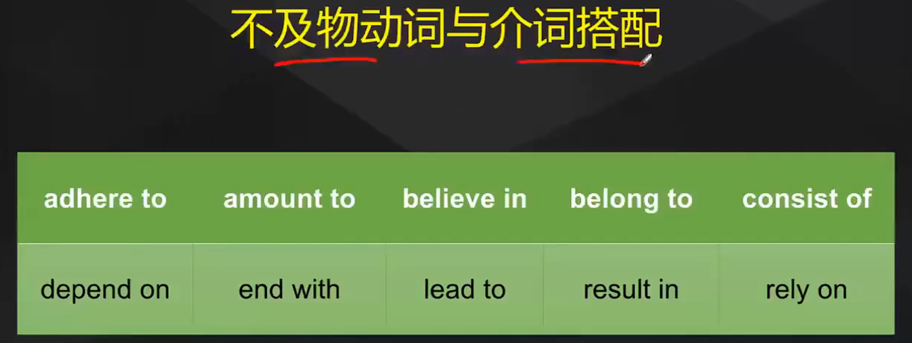
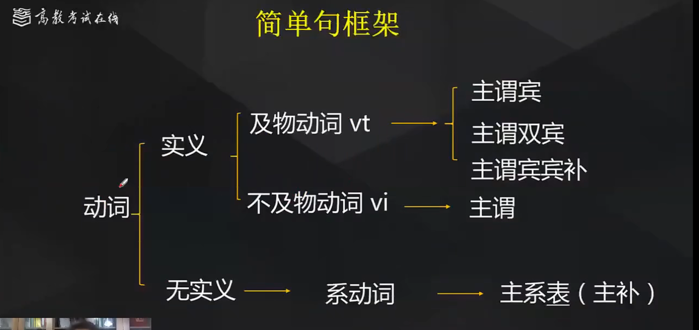
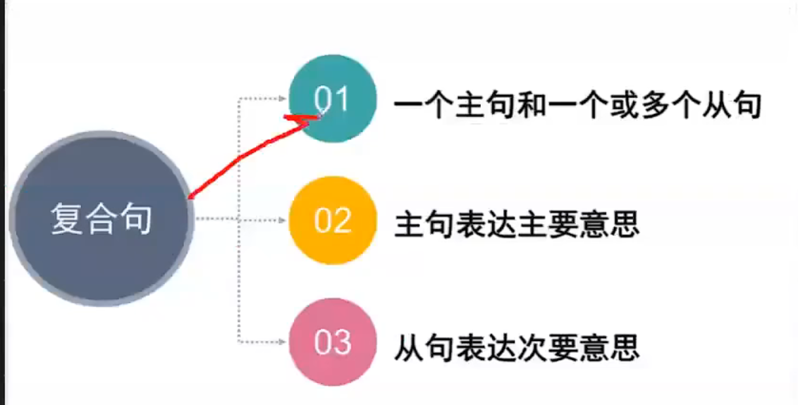

# 英语句子分类

## **简单句**

<u>Black lives</u> **matter**  黑人的命也是命

###### 主+谓

<u>Peer pressure</u> **has** **<u>a positive side</u> ** 同辈压力也有积极的影响

###### 主+谓+宾

> 主谓结构和主谓宾结构的**区别**就在于**动词是及物动词还是不及物动词**
>
> ### 及物动词和不及物动词
>
> > vt:及物动词  vi:不及物动词
>
> #### 及物动词
>
> 及物动词后面必须加**<u>宾语</u> **
>
> She loves/kills ????
>
> #### 不及物动词
>
> 不及物动词后**<u>不加宾语</u> **或者**<u>必须接介词后加宾语</u> **
>
> He laughs
>
> He laughs **<u>at</u>** you
>
> 
>
> 

<u>A visit to elderly people</u> **brings**  **<u>them</u> ** **<u>the great laughter and joy</u> **  一次对老年人的拜访给他们带去欢声笑语

###### 主+谓+双宾

(直接宾语/间接宾语）

主+谓+间宾+直宾

人=间宾 物=直宾

<u>I</u> **bring**  **<u>you</u> ** **<u>a wife</u> **  我给你带了个老婆

主+谓+间宾+直宾

**跟动词有直接关系**的叫<u>直接宾语</u>

**跟动词有间接关系**的叫<u>间接宾语</u>

<u>The unchecked growth of the tourism</u> **may render** **<u>the environment</u> ** (<u>seriously polluted</u>) 盲目发展的旅游业可能会对环境造成严重污染

###### 主+谓+宾+宾补 

(宾补是对宾语的补充修饰)

> 判断是双宾结构还是宾补:
>
> ​	在宾语后面+**be动词**，查看是否通顺

​	

Mutual trust **<u>is</u> **  not a luxury,but it  **<u>is</u> ** a necessity

###### 主+系+表

系动词（无实义） 表语（**主语补足语**）

 

> **系动词**/谓语动词
>
> 动词：
>
> **实义动词** =  <u>及物/不及物动词</u> （I love you）
>
> **无实义动词** = <u>系动词</u> (you are beautiful) 
>
> 
>
> | 系动词   |                                 |
> | -------- | ------------------------------- |
> | be动词   | am, is, are                     |
> | 感官动词 | feel, look, smell, sound, taste |
> | 变化     | turn, become, go, get, grow     |
> | 保持     | remain, keep, stay              |
> | 似乎     | seem, appear                    |
> | 证明     | prove                           |

### 框架

## 并列句

两个或以上独立分句，通过并列连词连接，各分句主谓完整

各分句意思同等重要，互相独立，主要连词：and, or, but, yet

Yet occurrences of shortages and drought are causing famine and distress in some areas, **<u>and</u> ** 

industrial and agricultural by-products are polluting water supplies. 然而粮食短缺和干旱的发生正在导致一些地区遭受饥荒和痛苦，而且工农业副产品正在污染水源

<u>主谓宾+ and +主谓宾</u>

**occurrences** n.发生，出现

**famine** n. 饥荒，饥饿

**water supoplies** n. 水源

## **复合句**

### 三大从句

#### 名词性从句

##### 主语从句

<u>**That** the little boy get the first prize</u> **made** <u>his family relatives</u> **so proud** 那个小男孩获得一等奖让他的家庭亲戚很骄傲

主(主从)+谓+宾+宾补

That无意义，不做成分，但不能省，可作为主语从句的标志

<u>**That** people often experience trouble sleeping in a different bed in unfamiliar surroundings</u> **is** **a phenomenon** <u>known as the "first night" effect</u>  人们经常在陌生环境的不同的床上失眠是一种初夜效应

主(主从)+系+表(后置定语)

Whether such taxes work is a matter of debate 这样收税是否有用还是个有待商榷的问题

**How** <u>students  ultimately handle stress</u> **may depend on** t<u>heir personal test-taking abilities</u> 学生最终如何处理压力取决于他们的考试能力

主(主从)+谓+宾

It`s commonly known **that** <u>certain diseases are linked with occupation like lung disease in coal miners</u> 众所周知，某些疾病是与职业有关联的，比如煤矿工人的肺病

It is true **that** <u>English is becoming an internatinal language</u> ,but it is still neglected by a majority of undergraduates.  英语正在成为国际语言，这是事实，但是很多本科生仍然忽视它

##### 宾语从句

1. 及物动词后的宾语从句
2. 介词后的宾语从句

I have learned that <u>love, not time, heals all wounds.</u> 我已经懂得了爱，不是时间，治愈一切创伤

主+谓+宾(宾从)

Therefore, it is vital **that** <u>educators everywhere take a careful look</u> not only <u>at</u> **what is being done**, but also <u>at</u> **what should be done** in the field of computer education 因此，各地教育者在计算机教育领域不仅要格外注意正在做什么，而且还要格外注意应该做什么，这是重要的 

主从+2宾从

##### 表语从句

只有系动词后才有表语从句

There are two worring features of slowdown. One <u>is</u> **that** <u>it has been particularly sharp</u> in the most populous countries, India and China 粮食增速放缓有两个令人担心的特点，一个是在人口最多的国家，印度和中国，这种情况特别严重

##### 同位语从句

用一句话来解释一个抽象的名词

There is a popular saying **that** family happiness spurs social stability (有一句受欢迎的名言说) 俗话说家庭幸福刺激社会稳定\

a saying = family happiness spurs social stability

The data will certainly fuel the ongoing debate over **whether** <u>physical education classes shuold be cut</u>, as schools struggle to survive on smaller budgets, The arguments against physical education have included <u>concerns</u> **that** <u>gym time may be taking away from study time</u>

这些数据无疑会加剧关于是否取消体育课的争论，因为学校努力在更小的预算下生存，这些反对体育课的担忧即：体育时间应该从学习时间中分离

主+谓+宾从，主+谓+同位从

**What** <u>refrigeration did promote was marketing</u> -- marketing hardware and electricity, marketing soft drinks, dead bodies of animals around the globe in search of a good price  制冷技术推广是一种营销，在全球营销硬件，软饮，动物肉质以寻找一种好价格

主从+系+表

Whether the eyes are "the windows of the soul" is debatable;that they are intensely important in interpersonal communication is a fact 眼睛是否是灵魂的窗户是有争议的，但他们在人际交往中非常重要是一个事实

#### 形容词性从句

##### 定语从句

I don`t like **lazy** people 我不喜欢懒人

adj = 定语，<u>表达限定的意思</u>

I don`t like people **who** <u>do not like their country</u>

用一个形容词作定语修饰名词或代词。若要表达更复杂的意思，需借助一个句子来修饰名词。

**<u>先行词+关系词+定语从句</u>**

先行词 : 被修饰的名词/代词，总在定语从句前面

关系词：**连接**主句和从句，**指代**先行词，在定语从句中充当一定成分的词

定语从句：不完整的句子

<u>Another trend</u> **that** looks significant in 2015 is that America`s largest population group,Millennials,will continue to put off buying a house

在2015年另一个趋势看起来也很重要，美国最大的人口群体，千禧一代，将持续推迟买房

Living in an urban area with greener spaces has a long-lasting impact on people`s mental well-being, UK researchers found moving to a green space had a sustained positive effect, unlike <u>pay rises or promotion</u>, **which** on provided a short-term boost. 住在绿色空间的城市区域对人们的心理健康有长久的影响，英国研究人员发现搬去绿色空间有长久积极的影响，不想加薪或者升职只提供短期的促进‘

The trouble is **that** <u>the forecast assumes countinued improvements in yields</u>, **which** may not actually happen. 麻烦的是这个预测假设产量会持续提高不会发生

And exercise releases hormones **that** can improve mood and relieve stress,**which** can also help learning. 一些运动会释放改善情绪缓解压力的荷尔蒙，这也有助于我们学习 

we found **that** for some lottery winners **who** had won more than 500,000 pounds the positive effect was definitely there, but after six months to a year,they were back to the baseline. 我们发现一些赢得超过50w镑彩票的人，积极影响是肯定的，但是在六个月到一年之后，他们又回到基本水平

Our school need both the talent and organization to educate each child **who** arrives at the school door. Some show up ready, but many do not at this critical time **when** <u>young brains are developing rapidly</u>.

我们学校需要有天赋的人和组织来教育每一个刚入学的孩子，有些已经准备好了，有些在年幼大脑飞速发育的关键时候没有准备好

#### 副词性从句

##### 状语从句

